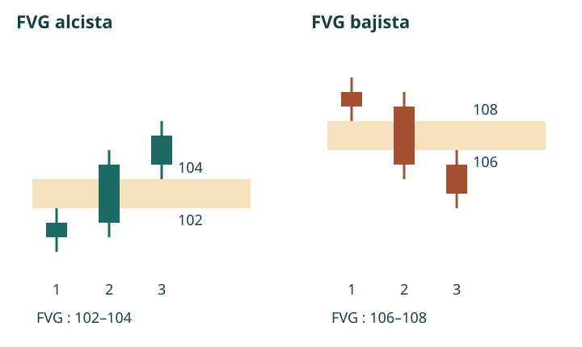

# Manual de estudio ICT · Bloque 1 · Episodios 1 a 5

## Del método de aprendizaje a la lectura de una sesión

**Bloque 1 de 8 · Versión integrada de estudio ilustrada**

Este bloque reúne el capítulo piloto aprobado y el desarrollo de las transcripciones de los episodios 2 a 5. Los cinco capítulos forman la primera unidad del manual. El contenido de la mentoría se atribuye al instructor; los ejercicios, esquemas y criterios de registro añadidos se identifican como elaboración del manual. Las figuras de ATAS son complementos externos: no sustituyen las capturas de los ejemplos de la mentoría.

Los ejemplos pertenecen a grabaciones de 2022. Las referencias a plataformas, márgenes, precios o calendarios no son instrucciones actuales. El objetivo es estudiar y contrastar un modelo, no reproducir operaciones con dinero real. No se han verificado las ejecuciones ni los resultados anunciados por el instructor.

## Mapa de este bloque

| Capítulo | Pregunta central | Aportación |
|---|---|---|
| 1. Expectativas y método | ¿Cómo aprender con autonomía? | Modelo sencillo, simulación y vocabulario inicial |
| 2. Contexto y configuración | ¿Qué secuencia se busca? | Sesgo, liquidez, cambio de estructura y FVG |
| 3. Estructura y liquidez interna | ¿Qué hace significativo un quiebre? | Contexto previo, lectura del rango y estudio de la ejecución |
| 4. Seleccionar y descartar | ¿Cuándo todavía no existe el escenario? | Ejemplos, condiciones ausentes y registro temporal |
| 5. La jornada intradía | ¿Cuándo y dónde buscar? | Contrato, hora de Nueva York, mañana, pausa y tarde |

<figure class="own">
Contexto<b>→</b>Zona de liquidez<b>→</b>Respuesta del precio<b>→</b>FVG y retroceso<b>→</b>Objetivo y revisión
<figcaption>Esquema propio. Resume el modelo estudiado; las flechas no implican que cada fase vaya a producirse necesariamente.</figcaption></figure>

## Capítulo 1 · Aprender a leer el precio: expectativas, método y autonomía

**Capítulo piloto aprobado · Vídeo introductorio publicado por TRAVIS FOREX**

Fuente: [ver la introducción en YouTube](https://www.youtube.com/watch?v=UZHXVjNHTK8). Las referencias temporales proceden de la transcripción facilitada. Este capítulo reconstruye su contenido; no verifica las operaciones ni los resultados que se muestran en pantalla.

### Qué aprenderás en este capítulo

Al terminar deberías poder explicar:

- Por qué la mentoría propone comenzar con un modelo sencillo.
- Qué diferencia existe entre estudiar una explicación y depender de ella para operar.
- Por qué los resultados en simulación no garantizan el mismo comportamiento con dinero real.
- Qué significan *sesgo direccional*, *configuración*, *punto* y *tick*.
- Qué información falta todavía para convertir una idea de mercado en un procedimiento operativo.

### 1.1. Empezar por un modelo que puedas comprender

[Volver al vídeo · 01:58–04:21](https://www.youtube.com/watch?v=UZHXVjNHTK8&t=118s)

El instructor explica que busca reducir sus conceptos a un modelo con pocas decisiones. Utiliza como referencia la enseñanza a su hija: quiere que pueda comprender qué observar, cuándo actuar y cuándo abstenerse sin manejar un conjunto excesivo de herramientas.

La dificultad que señala es la **parálisis por análisis**. Un estudiante puede conocer muchas técnicas y, sin embargo, no saber cuál utilizar ante un gráfico concreto. Si cada concepto introduce una interpretación diferente, acumular información puede aumentar la indecisión.

La propuesta consiste en limitar inicialmente el campo de estudio. Aprender un modelo específico permite relacionar sus componentes y repetir el mismo proceso de observación.

**Idea central:** comprender las condiciones de un modelo es más útil que reconocer muchos términos sin saber cómo se conectan.

Para este manual, eso implica una decisión pedagógica: los conceptos se incorporarán cuando sean necesarios para entender el procedimiento, y no como un catálogo aislado.

### 1.2. La meta inicial es mejorar la lectura del precio

[Volver al vídeo · 05:33–07:24](https://www.youtube.com/watch?v=UZHXVjNHTK8&t=333s)

El instructor presenta como objetivo mejorar la comprensión de la acción del precio y aprender a reconocer configuraciones recurrentes. También afirma que esas configuraciones no serán copias exactas entre sí.

Esta distinción importa. Memorizar la apariencia de una captura no equivale a comprender un patrón. Dos situaciones pueden compartir determinadas relaciones entre niveles y movimientos, aunque cambien la longitud de las velas o la velocidad del recorrido.

El estudio debe orientarse a identificar **qué condiciones son relevantes**, en lugar de buscar una imagen idéntica a la del ejemplo.

El instructor rechaza la expectativa de perfección diaria. Sus afirmaciones sobre repetición y consistencia son propuestas que el alumno debe poner a prueba; este vídeo no aporta por sí solo una evaluación estadística del método.

**Criterio de aprendizaje:** poder explicar por qué un ejemplo encaja en un modelo y por qué otro no encaja.

### 1.3. De la motivación a la autonomía

[Volver al vídeo · 07:24–11:34](https://www.youtube.com/watch?v=UZHXVjNHTK8&t=444s)

La transcripción recoge tres etapas: querer aprender, convertirse en un estudiante estructurado y, eventualmente, obtener ingresos. La última se plantea como aspiración, no como resultado asegurado ni como una progresión con plazo fijo.

El paso más importante para comenzar es transformar el interés en una práctica organizada.

| Etapa | Qué plantea el vídeo | Aplicación al estudio |
|---|---|---|
| Interés inicial | Deseo de comprender y aprender | Identificar qué sabes y qué necesitas aclarar |
| Aprendizaje estructurado | Estudiar los ejemplos y realizar las tareas | Registrar observaciones y revisarlas |
| Posible aplicación económica | Aspiración condicionada al desarrollo individual | No confundirla con una promesa de ingresos |

El instructor también diferencia enseñar de proporcionar señales. Puede señalar zonas que considera relevantes, pero pide que el alumno las estudie sin interpretarlas como una invitación a realizar una operación real.

La dependencia aparece cuando el estudiante necesita que otra persona identifique siempre la oportunidad. En ese caso, puede aprender a seguir indicaciones sin desarrollar una explicación propia.

**Propuesta de trabajo del manual:**

**Observar → formular una hipótesis → registrar lo esperado → revisar lo ocurrido.**

Esta secuencia es una organización didáctica añadida. Su finalidad es que la revisión posterior pueda compararse con lo que pensabas antes de conocer el resultado.

### 1.4. Simulación y dinero real: cambia la experiencia de decidir

[Volver al vídeo · 15:13–18:11](https://www.youtube.com/watch?v=UZHXVjNHTK8&t=913s)

El instructor explica que una persona puede sentirse segura en una cuenta de demostración y reaccionar de otra manera cuando cada movimiento afecta a su dinero.

En su exposición, tanto las pérdidas como las ganancias pueden alterar la conducta. Una pérdida produce una reducción real del capital; una ganancia puede estimular el deseo de repetir inmediatamente la experiencia.

Señala especialmente dos comportamientos:

- **Sobreoperar:** realizar operaciones adicionales por impulso, en lugar de esperar las condiciones del modelo.
- **Asumir una exposición excesiva:** aumentar el tamaño o el apalancamiento de forma desproporcionada.

La enseñanza aprovechable es que reconocer una situación en el gráfico y ejecutar un procedimiento con disciplina son tareas distintas.

Conviene, además, distinguir la responsabilidad personal de una explicación completa del resultado. El instructor atribuye buena parte de las dificultades a la conducta del alumno. Este capítulo conserva esa posición como su opinión: el éxito o fracaso de una estrategia no puede evaluarse únicamente mediante afirmaciones sobre disciplina.

**Pregunta de repaso:** después de una operación ganadora, ¿la siguiente decisión responde a una nueva configuración o al deseo de volver a ganar?

### 1.5. Primeras piezas del lenguaje técnico

[Volver al vídeo · 23:04–27:31](https://www.youtube.com/watch?v=UZHXVjNHTK8&t=1384s)

En el tramo final aparece un ejemplo sobre futuros del S&P 500. Sirve para anticipar conceptos que la mentoría desarrollará después.

#### Sesgo direccional

Es la hipótesis sobre la dirección que podría tomar el precio dentro del contexto estudiado.

El instructor concede más importancia a comprender hacia dónde espera que se dirija el precio que a conseguir una entrada extremadamente precisa. Eso no significa que el precio de entrada deje de importar: expresa la prioridad que concede al contexto en esta introducción.

#### Configuración o *setup*

Es un conjunto de condiciones que permite reconocer una situación de interés según un modelo.

En este vídeo se anuncia que se enseñarán configuraciones, pero todavía no se especifican todas sus reglas. Por eso, el lector aún no dispone de un procedimiento completo y reproducible.

#### Liquidez por encima de un máximo

El instructor señala un máximo previo y habla de órdenes de compra situadas por encima. En su interpretación, esa zona constituye un objetivo potencial del precio.

Para comprender la idea, imagina un nivel superior que algunos participantes utilizan como referencia. El modelo propone estudiar la posible presencia de órdenes en esa zona.

**Límite de la explicación:** un máximo dibujado no demuestra por sí solo qué órdenes existen allí ni garantiza que el precio vaya a alcanzarlo.

#### Punto y *tick*

Un punto expresa una unidad de variación del índice. El *tick* es el incremento mínimo de cotización del contrato.

En los futuros E-mini y Micro E-mini del S&P 500 considerados aquí, un punto equivale a cuatro *ticks*:

| Contrato | Valor de un punto por contrato | Tamaño del *tick* | Valor de un *tick* |
|---|---:|---:|---:|
| E-mini S&P 500 — ES | 50 USD | 0,25 puntos | 12,50 USD |
| Micro E-mini S&P 500 — MES | 5 USD | 0,25 puntos | 1,25 USD |

Estos valores se han contrastado con la documentación de [CME Group](https://www.cmegroup.com/education/courses/micro-e-mini-futures/micro-e-mini-futures-products-overview). No deben trasladarse automáticamente a otros índices o instrumentos.

**Ejemplo didáctico añadido:** una variación de dos puntos equivale a ocho *ticks*. Para un contrato, supone una variación bruta de 100 USD en ES o de 10 USD en MES, favorable o desfavorable según la posición. El cálculo excluye comisiones y otros costes.

El menor multiplicador del micro reduce la exposición por contrato frente al E-mini; no convierte una operación en segura.

### 1.6. Cómo interpretar los resultados y objetivos que menciona el instructor

[Volver al vídeo · 21:51–22:28](https://www.youtube.com/watch?v=UZHXVjNHTK8&t=1311s) · [27:31–29:20](https://www.youtube.com/watch?v=UZHXVjNHTK8&t=1651s)

El instructor muestra una cuenta y utiliza ejemplos de posibles ingresos para motivar al estudiante. Menciona gastos cotidianos, como vivienda o automóvil, y plantea la posibilidad de cubrir parte de ellos mediante la actividad de trading.

Estos pasajes expresan una aspiración. No establecen una rentabilidad esperable para el lector.

También menciona la posibilidad de capturar 25 puntos semanales. Esa cifra no debe convertirse en una cuota de operaciones ni en una obligación de beneficio: el propio vídeo no proporciona una distribución de resultados que permita valorar su frecuencia o dificultad.

Para estudiar el curso, resulta más útil formular objetivos que dependan del trabajo realizado:

- Comprender un concepto y explicarlo con palabras propias.
- Documentar ejemplos y situaciones que no cumplan sus condiciones.
- Separar lo observado de lo supuesto.
- Reconocer qué información falta antes de tomar una decisión.

Estos objetivos son una propuesta del manual, no tareas citadas literalmente del vídeo.

### 1.7. Lo que todavía falta aprender

La introducción permite entender la orientación de la mentoría, pero deja abiertas cuestiones esenciales:

| Cuestión pendiente | Por qué importa |
|---|---|
| ¿Cómo se determina el sesgo? | Para evitar decidir la dirección por intuición |
| ¿Qué condiciones forman la configuración? | Para reconocerla de manera consistente |
| ¿Qué invalida la hipótesis? | Para saber cuándo deja de ser aplicable |
| ¿Cómo se establecen entrada, salida y exposición? | Para completar el procedimiento |
| ¿Cómo se evalúan ejemplos fallidos y costes? | Para no estudiar únicamente los aciertos |

Las referencias a plataformas, intermediarios, márgenes y calendario pertenecen al contexto de la grabación de 2022. No se utilizan aquí como instrucciones actuales de contratación ni como recomendaciones de plataforma.

### 1.8. Taller de aprendizaje

**Actividad original del manual. No requiere abrir una cuenta ni realizar operaciones.**

#### Ejercicio 1. Separar observación, hipótesis y resultado

Escoge uno de los ejemplos del vídeo y completa:

| Campo | Tu anotación |
|---|---|
| Minuto del ejemplo | |
| Qué señala expresamente el instructor | |
| Qué dirección o destino anticipa | |
| Qué puedes observar directamente | |
| Qué no puedes confirmar con la información disponible | |

Si un nivel o una cifra no se distingue, escribe «no identificable». El ejercicio busca precisión, no rellenar todos los huecos.

#### Ejercicio 2. Comprobar las unidades

1. ¿Cuántos *ticks* hay en tres puntos del ES?
2. ¿Qué variación bruta representan tres puntos para un contrato MES?
3. ¿Ese importe equivale necesariamente al resultado neto?

**Respuestas:** 12 *ticks*; 15 USD a favor o en contra; no, porque faltan los costes y las condiciones reales de ejecución.

#### Ejercicio 3. Revisar una decisión impulsiva

Supón que un estudiante obtiene un resultado favorable en simulación y abre otra operación inmediatamente, sin identificar una nueva configuración.

Explica qué comportamiento del vídeo ilustra y qué debería registrar para revisarlo.

**Respuesta orientativa:** ilustra el riesgo de sobreoperar después de ganar. Conviene registrar el motivo de la segunda entrada y comprobar si existían condiciones previamente definidas.

### Comprobación final del capítulo 1

Antes de continuar, deberías poder responder con tus propias palabras:

- ¿Por qué más conceptos pueden producir más indecisión?
- ¿Qué diferencia una hipótesis propia de seguir una señal?
- ¿Por qué una ganancia puede deteriorar la siguiente decisión?
- ¿Cuánto vale un punto en ES y en MES?
- ¿Qué reglas faltan todavía para poder describir una estrategia completa?

**Resultado esperado del capítulo:** comprender cómo estudiar la mentoría y reconocer los límites de esta introducción. El siguiente paso será examinar cómo se construye y se justifica una configuración concreta.

## Capítulo 2 · Construir una configuración desde el contexto

**Fuente:** [episodio 2 · vídeo completo](https://www.youtube.com/watch?v=UmFwKwbQ_yc).

### 2.1. Primero la dirección probable, después la entrada

[Pasaje 12:50–17:30](https://www.youtube.com/watch?v=UmFwKwbQ_yc&t=770s)

El instructor comienza con una pregunta sobre el gráfico semanal: ¿en qué dirección podría expandirse la próxima vela? Explica que no pretende acertar su cierre exacto. Una vela puede subir durante una parte de la semana y terminar de otra manera; el interés está en localizar un recorrido posible dentro de ella.

Después baja al gráfico diario para identificar máximos y mínimos relevantes. Su hipótesis es que determinadas zonas podrían atraer el precio: extremos con posibles órdenes stop e imbalances. El sesgo semanal aporta una orientación; el diario permite situar destinos concretos dentro de ese contexto.

En el ejemplo utiliza argumentos estacionales, tipos de interés y resultados empresariales para justificar una expectativa bajista. Son razones del caso histórico que comenta, no una regla según la cual una época del año deba producir siempre la misma dirección.

La consecuencia práctica para el estudio es evitar comenzar por una vela aislada de un minuto. Primero se formula una hipótesis y se identifica qué nivel la hace interesante. Solo después se examina si existe una configuración coherente con ella.

### 2.2. Dos lados de la liquidez

[Pasaje 19:23–22:47](https://www.youtube.com/watch?v=UmFwKwbQ_yc&t=1163s)

En el vocabulario de la mentoría, por encima de ciertos máximos se buscan posibles buy stops, y por debajo de ciertos mínimos, posibles sell stops. Un stop de compra puede cerrar una posición corta o servir para entrar tras una ruptura; uno de venta puede cerrar una posición larga o activar una entrada bajista. La función depende de la posición y la orden del participante.

El instructor interpreta el paso por esos extremos como una toma de liquidez. En su ejemplo bajista, espera primero una incursión sobre máximos y, después, una respuesta hacia abajo. No propone vender automáticamente cada vez que el precio supera un máximo.

**Observación frente a interpretación:** las velas muestran que un nivel fue superado. No revelan por sí solas cuántos stops había allí, quién los colocó ni si un agente provocó el movimiento. Las explicaciones del instructor sobre un algoritmo que controla todos los ticks se conservan como su interpretación, no como un mecanismo demostrado por estos ejemplos.

### 2.3. La secuencia bajista que presenta el episodio

[Pasaje 26:27–32:47](https://www.youtube.com/watch?v=UmFwKwbQ_yc&t=1587s)

El razonamiento reúne condiciones en un orden específico:

1. Existe una expectativa bajista en el contexto superior.
2. El precio supera un máximo que se había identificado como referencia de liquidez.
3. En una temporalidad inferior, rompe un mínimo de corto plazo.
4. En el movimiento bajista aparece un fair value gap.
5. Un retroceso hacia esa zona ofrece el ejemplo de entrada que estudia el instructor.
6. Se evalúa un destino inferior y una referencia de invalidación.

El episodio menciona gráficos de uno, dos y tres minutos para examinar el patrón. Cambiar de escala debe ayudar a ver la estructura, no convertirse en una búsqueda retrospectiva del gráfico que justifique cualquier entrada. Para comparar ejemplos, conviene registrar qué temporalidad se eligió y mantener visible la referencia superior.

### 2.4. Identificar un FVG sin confundirlo con un hueco sin operaciones

[Pasaje 29:45–32:15](https://www.youtube.com/watch?v=UmFwKwbQ_yc&t=1785s)

Un FVG se delimita mediante tres velas consecutivas. En el caso alcista, el máximo de la primera queda por debajo del mínimo de la tercera. En el bajista, el mínimo de la primera queda por encima del máximo de la tercera. El intervalo entre esos extremos es la zona que se marca. La vela intermedia realiza el desplazamiento.

La comparación usa máximos y mínimos, incluidas las mechas. No basta con encontrar cuerpos separados. Tampoco significa que no se negociara dentro del intervalo: la vela central lo recorrió. Es una relación entre tres velas, diferente de un salto entre el cierre de una sesión y la apertura de la siguiente.

<figure class="own"><figcaption>Figura 1. Esquema propio con precios ficticios. FVG alcista: máximo de vela 1 = 102; mínimo de vela 3 = 104. La zona es 102–104. En el ejemplo bajista, mínimo de vela 1 = 108 y máximo de vela 3 = 106: zona 106–108. No son capturas ni operaciones del instructor.</figcaption></figure>

**Lectura visual en ATAS.** Su figura comparativa permite localizar las velas exteriores y las dos zonas. El instrumento de ese ejemplo es un futuro sobre Bitcoin, distinto de los índices de esta mentoría; aquí se usa únicamente para comparar la geometría del patrón. [Tutorial original de ATAS](https://atas.net/blog/fvg-trading-what-is-fair-value-gap-meaning-strategy/).

<figure class="external"><figcaption>Figura 2. ATAS, «Examples of Fair Value Gaps Bullish and Bearish», figura 1 del artículo de Pavel Horak. Imagen externa sin modificaciones; requiere conexión. Pulsa para abrirla en su tamaño disponible.</figcaption></figure>

### 2.5. Premium, discount y objetivo

[Pasaje 35:18–39:38](https://www.youtube.com/watch?v=UmFwKwbQ_yc&t=2118s)

El instructor selecciona un mínimo y un máximo del rango relevante, y marca su punto medio. La mitad superior se denomina premium y la inferior, discount. Estos términos expresan posición relativa dentro del rango elegido, no una valoración fundamental del activo. Si cambian los extremos seleccionados, cambia la clasificación.

**Ejemplo propio:** con un mínimo de 100 y un máximo de 120, el equilibrio está en 110. El precio 115 está en premium respecto a ese rango. Eso no basta para justificar una venta: aún faltan el contexto y el desarrollo del patrón.

En el ejemplo bajista busca un mínimo o un imbalance por debajo del equilibrio. Al cierre del episodio recomienda estudiar el objetivo accesible más cercano, sin exigir capturar todo el movimiento. El retorno a un FVG y la llegada al destino no están garantizados.

El vídeo menciona referencias distintas para el stop: un máximo anterior o el máximo de una vela del patrón. No las convertimos en una regla única. Elegir una referencia modifica la distancia de invalidación y debe quedar registrado en cada ejemplo.

### 2.6. Ejercicio del capítulo

**Elaboración del manual.** En un gráfico histórico, marca un máximo antes de descubrir las velas siguientes. Registra si se supera, si se rompe después un mínimo de corto plazo y si aparece un FVG. Distingue tres resultados: secuencia completa, secuencia incompleta y secuencia completa que después falla. No descartes el tercero del diario.

**Pregunta:** hay una barrida de máximos y un FVG bajista, pero no se ha roto el mínimo relevante. ¿Está completa la secuencia anterior? **Respuesta:** no. Que aparezcan dos componentes no sustituye al que falta.

## Capítulo 3 · Liquidez interna y cambio de estructura

**Fuente:** [episodio 3 · vídeo completo](https://www.youtube.com/watch?v=6MI47p6a9Zg).

### 3.1. Un shift intradía no promete una tendencia de varios días

[Pasaje 00:54–03:24](https://www.youtube.com/watch?v=6MI47p6a9Zg&t=54s)

El instructor precisa el vocabulario utilizado antes. Llama market structure shift, o MSS, al cambio de estructura que estudia dentro del día. Puede producir un recorrido y después revertir sin iniciar una tendencia de varios días. Reserva en esta explicación el término break para un contexto más amplio.

Esta distinción impide extrapolar un giro de un minuto al gráfico diario. Al anotar un MSS deben quedar registrados su temporalidad y el nivel que se rompió. La palabra «estructura», por sí sola, no indica la duración esperada del movimiento.

### 3.2. Cómo se reconoce un swing

[Pasaje 09:22–13:50](https://www.youtube.com/watch?v=6MI47p6a9Zg&t=562s)

En la construcción sencilla de tres velas, un swing high tiene un máximo central superior a los máximos adyacentes. Un swing low tiene un mínimo central inferior a los mínimos adyacentes. El color de los cuerpos no determina esa condición.

**Aclaración para el registro:** el extremo central no puede etiquetarse con esa confirmación de tres velas antes de que exista la vela de su derecha. En un estudio retrospectivo es fácil atribuirse información que aún no estaba disponible.

En el caso alcista estudiado, la ruptura de un máximo corto adquiere significado después de tomar liquidez bajo un mínimo. El orden contrario no representa automáticamente el mismo escenario. Para el caso bajista se invierte la secuencia.

El instructor aclara en 13:50 que, en ese ejemplo, no exige que la vela cierre por encima del máximo roto. A continuación espera la información necesaria para identificar el FVG. Conviene separar ambos momentos: superar un nivel y confirmar una figura de tres velas no son el mismo evento.

### 3.3. Qué significa «interna» dentro de un rango

[Pasaje 34:32–35:39](https://www.youtube.com/watch?v=6MI47p6a9Zg&t=2072s)

El episodio describe referencias dentro del impulso o rango que se está estudiando: máximos y mínimos cortos con posibles stops e imbalances internos. El rango es la referencia que permite decidir qué queda dentro y qué constituye su extremo.

Una clasificación útil para el diario es separar extremos del rango y referencias interiores. Evita etiquetar cualquier máximo como destino final sin explicar respecto de qué rango se analiza.

**Ejemplo propio:** en un rango 100–120, un mínimo corto en 108 es interior; el mínimo 100 es el extremo inferior. Una operación puede alcanzar 108 sin llegar a 100. El desplazamiento disponible hasta una referencia próxima no equivale a capturar todo el rango.

### 3.4. Order blocks: una precisión, no un requisito añadido a todo FVG

[Pasajes 14:31–15:56 y 23:11–25:50](https://www.youtube.com/watch?v=6MI47p6a9Zg&t=871s)

El instructor discute velas consecutivas, su precio de apertura y un cambio en lo que denomina «estado de entrega». Insiste en que no toda vela bajista es un order block alcista ni toda vela alcista un order block bajista. Su explicación vincula esa lectura con la toma de liquidez, la estructura y el gap del ejemplo.

No añadimos aquí una regla genérica que convierta la última vela de color contrario en señal. La transcripción remite a varias series de velas que requieren ver el gráfico para delimitar el ejemplo. Además, el episodio 5 vuelve a priorizar los gaps para mantener sencillo el modelo. Este apartado conserva la precisión conceptual sin convertirla en condición universal.

### 3.5. Ejecución, deslizamiento y recorrido adverso

[Pasajes 20:56–22:10 y 40:52–50:36](https://www.youtube.com/watch?v=6MI47p6a9Zg&t=1256s)

El vídeo distingue el precio esperado del precio al que finalmente se ejecuta una orden. En la transcripción se mezcla «desplazamiento» con «deslizamiento»: en este pasaje sobre ejecución utilizamos **deslizamiento**. Reservamos **desplazamiento** para el impulso del precio que forma parte del patrón.

En el ejemplo final, el instructor contempla dos FVG, espera una secuencia concreta entre ellos y decide renunciar si el objetivo se alcanza antes de la entrada. La zona más favorable en precio no es necesariamente la que elige ejecutar: importa el orden en que el precio visita las referencias.

También relata fluctuaciones adversas y porcentajes personales de riesgo. Son características de su demostración, no parámetros recomendados para el lector. Sin contrastar la grabación y las órdenes no podemos reconstruir ni certificar su operación a partir de esos importes.

### 3.6. Del ejemplo bonito al registro útil

[Pasaje 35:39–39:48](https://www.youtube.com/watch?v=6MI47p6a9Zg&t=2139s)

La tarea pide recopilar gráficos anotados, medir el tiempo, los puntos recorridos y cuánto habría ido el precio en contra. El aprendizaje se apoya en volver a los ejemplos y entender su desarrollo.

**Ampliación metodológica del manual:** una colección de aciertos enseña a reconocer una forma, pero no estima su fiabilidad. Para evaluarla, fija un periodo de observación y recoge también ausencias, señales descartadas, fallos y costes. Distingue «reconozco el patrón en retrospectiva» de «podía identificarlo con la información disponible».

**Ejercicio:** describe por escrito el momento en que conocías el swing, el momento de su ruptura y el momento en que quedó definido el FVG. Si esos tres instantes se han confundido, revisa la secuencia antes de calcular un resultado hipotético.

## Capítulo 4 · Aprender a descartar y documentar

**Fuente:** [episodio 4 · vídeo completo](https://www.youtube.com/watch?v=TCwti521keI).

### 4.1. El caso del S&P: no basta el primer intento

[Pasaje 00:10–03:49](https://www.youtube.com/watch?v=TCwti521keI&t=10s)

La lección revisa el miércoles 26 de enero de 2022. El instructor delimita un rango, marca el equilibrio y observa una incursión superior. En la narración, un primer intento no produce el FVG que necesita; espera otro desarrollo antes de describir la venta hipotética.

El interés no está en memorizar dónde terminó el precio, sino en reconocer cuándo todavía faltaba una condición. Que más tarde se produzca una caída no convierte retrospectivamente cualquier venta previa en la configuración enseñada.

En 03:49 menciona aproximadamente 4.419 como entrada y 4.382 como cobertura: una diferencia aritmética de 37 puntos. Lo presenta como rango de oportunidad hipotético y aclara que no es obligatorio capturarlo completo. Sin la imagen no se determina qué ejecución real habría sido posible ni el riesgo exacto de esa entrada.

### 4.2. El caso del Nasdaq: una barrida no es la señal completa

[Pasaje 05:52–08:25](https://www.youtube.com/watch?v=TCwti521keI&t=352s)

El segundo ejemplo corresponde al jueves 27 de enero de 2022. Parte de cinco minutos y baja de escala. Identifica máximos y observa intentos en los que falta el quiebre necesario. Continúa esperando hasta que describe la toma de un mínimo corto, el FVG y el retroceso.

La lección funciona como un filtro: no se fuerza la existencia del patrón. Si el nivel no se rompe, si el gap no existe o si no llega el retroceso que se quería estudiar, se registra una condición ausente.

### 4.3. Una ficha que permita comparar casos

[Pasaje 04:35–05:52](https://www.youtube.com/watch?v=TCwti521keI&t=275s)

| Campo | Qué registrar |
|---|---|
| Fuente de datos | Plataforma, instrumento, vencimiento y fecha |
| Contexto | Temporalidad superior, rango y dirección esperada |
| Referencia inicial | Máximo o mínimo identificado antes del movimiento |
| Secuencia | Barrida, ruptura, formación del FVG y retroceso, con sus horas |
| Hipótesis | Entrada, invalidación y objetivo definidos antes del resultado |
| Tiempo | Espera entre eventos y duración hasta objetivo o invalidación |
| Recorrido | Excursión favorable y adversa, medidas en puntos |
| Resultado | Completo, incompleto, descartado o fallido |
| Incertidumbres | Dato ilegible, criterio ambiguo, costes no incluidos |

La ficha amplía la tarea del instructor. No basta con restar el máximo y el mínimo del día: ese rango no es el resultado de una operación. Una entrada puede activarse tarde, no activarse o quedar invalidada antes de que el precio alcance después el objetivo.

### 4.4. Ejercicio de descarte

**Elaboración del manual.** Clasifica estos tres casos con las reglas de la secuencia estudiada:

- **A:** supera máximos, pero la caída posterior no rompe el mínimo corto.
- **B:** supera máximos, rompe el mínimo, pero las velas exteriores se solapan y no hay FVG bajista.
- **C:** completa la secuencia, regresa a la zona y después alcanza la invalidación antes que el objetivo.

**Solución:** A y B están incompletos por razones distintas. C es un ejemplo fallido bajo las referencias que se hubieran fijado. No debe eliminarse del registro ni reclasificarse solo por conocer el desenlace.

## Capítulo 5 · Leer la jornada en hora de Nueva York

**Fuente:** [episodio 5 · vídeo completo](https://www.youtube.com/watch?v=FtQGrHYaZ3Y).

### 5.1. Saber qué contrato se observa

[Pasaje 01:30–05:31](https://www.youtube.com/watch?v=FtQGrHYaZ3Y&t=90s)

El instructor explica la lectura del símbolo y el vencimiento. En sus ejemplos, H representa marzo; M, junio; U, septiembre; y Z, diciembre. La referencia ESH2022 corresponde al E-mini S&P 500 de marzo de 2022, dentro de la nomenclatura usada en el vídeo.

También explica que vigila el interés abierto para decidir cuándo cambiar de vencimiento. Esa es su pauta de selección en la grabación. El interés abierto cuenta contratos pendientes; no es el volumen negociado durante el día ni revela por sí solo la dirección futura.

Para el diario, anota si utilizas un contrato concreto o una serie continua y cómo se construye esta última. No compares niveles exactos de dos gráficos sin comprobar que representan el mismo instrumento y tratamiento de datos. Las cotizaciones y cifras de margen de 2022 no se trasladan al presente.

### 5.2. Un reloj compartido para interpretar los ejemplos

[Pasaje 07:34–11:11](https://www.youtube.com/watch?v=FtQGrHYaZ3Y&t=454s)

La plantilla se organiza según la hora local de Nueva York. El objetivo es que una referencia como 08:30 señale el mismo momento del mercado para todos los alumnos. Conviene usar la zona horaria de Nueva York en el gráfico, sin sustituirla por una diferencia fija respecto a España: las transiciones estacionales pueden cambiar esa diferencia.

| Ventana según el instructor | Función en esta lección |
|---|---|
| Antes de 08:30 | Localizar máximos y mínimos previos en 15 minutos |
| 08:30–11:00 | Ventana matutina preferida para buscar escenarios |
| 11:00–12:00 | Seguimiento o extensión; no es su tramo preferido para iniciar |
| 12:00–13:00 | Pausa del modelo durante el almuerzo |
| Desde 13:30 | Nueva lectura de swings y posibles escenarios de tarde |
| Hasta 16:00 | Estudio del desarrollo hacia el cierre |

Estos son horarios de observación del modelo, no el horario completo de negociación del contrato. En el episodio 3 también menciona referencias de Londres, Asia y Nueva York; no deben confundirse con las ventanas preferidas de entrada. El episodio 5 concreta la plantilla de índices y amplía la tarde que antes había dejado fuera del foco.

<figure class="own">

<strong>Antes de 08:30</strong>
Marcar referencias

<strong>08:30–12:00</strong>
Estudiar la mañana

<strong>12:00–13:00</strong>
Pausa del modelo

<strong>Desde 13:30</strong>
Reevaluar la tarde

<figcaption>Figura 3. Esquema propio de ventanas de estudio. Hora local de Nueva York; los bloques no están dibujados a escala.</figcaption></figure>

### 5.3. Qué máximo y qué mínimo seleccionar

[Pasaje 13:44–17:49](https://www.youtube.com/watch?v=FtQGrHYaZ3Y&t=824s)

En quince minutos busca un swing high y un swing low significativos situados antes de las 08:30. Luego baja a cinco minutos para examinar su desarrollo, conservando las referencias. La palabra «significativo» sigue requiriendo interpretación; las transcripciones no fijan un umbral numérico universal.

El instructor también describe tres impulsos sucesivos hacia un máximo. Los utiliza para explicar cómo interpreta la acumulación de posibles stops. Más adelante aclara que una sola subida también puede preceder al escenario. Por tanto, los tres impulsos no se incorporan aquí como requisito obligatorio.

### 5.4. Desplazamiento claro frente a quiebre dudoso

[Pasaje 17:49–21:40](https://www.youtube.com/watch?v=FtQGrHYaZ3Y&t=1069s)

El instructor utiliza la imagen de un elefante entrando en una piscina pequeña: busca un movimiento evidente, no una incursión débil que se deshace inmediatamente. Después de tomar el máximo, quiere observar una respuesta bajista enérgica y el FVG correspondiente.

No ofrece aquí una fórmula que mida cuán «enérgica» debe ser la vela. Para evitar inventarla, el diario debe describir los rasgos observados —rango de la vela, rapidez, ruptura y hueco entre las velas exteriores— y marcar los casos dudosos. Convertirlo en un filtro cuantitativo sería un trabajo posterior de investigación, no una regla textual de esta lección.

En 19:11 reconoce que los patrones pueden fallar y menciona noticias, lectura incorrecta y gestión de pérdidas. Esta precisión es esencial: una secuencia visual completa no elimina la posibilidad de invalidación.

### 5.5. La tarde no se interpreta aislada de la mañana

[Pasaje 24:12–29:43](https://www.youtube.com/watch?v=FtQGrHYaZ3Y&t=1452s)

La tarea es describir primero si la mañana fue alcista, bajista o lateral; después, observar si la tarde continúa, revierte o expande una consolidación previa. El sesgo diario se refiere a una expansión probable, no al acierto exacto del cierre.

El instructor menciona movimientos medidos como posibilidad: una segunda expansión semejante a la matutina. No se deduce de ello que toda mañana de 200 puntos deba producir otros 200 por la tarde.

[Pasaje 31:52–36:26](https://www.youtube.com/watch?v=FtQGrHYaZ3Y&t=1912s)

Para el ejemplo de tarde alcista busca un swing low a partir de las 13:30, una incursión por debajo y una respuesta hacia referencias superiores. También presenta una alternativa basada en desplazamiento alcista, FVG y retroceso cuando no hay un mínimo que barrer según su lectura. Conservamos ambas variantes separadas: no alteran retrospectivamente los criterios del ejemplo bajista de los capítulos anteriores.

**Dos variantes narradas, no dos órdenes de compra:** A) incursión bajo un swing en contexto alcista; B) desplazamiento y retorno a FVG. La transcripción no aporta una regla completa de riesgo para cada variante y la delimitación precisa de sus velas necesita el gráfico original.

### 5.6. Flujo de órdenes en ICT y herramientas de ATAS

En este episodio, «flujo de órdenes» se desarrolla principalmente mediante velas, swings y la interpretación del instructor sobre la entrega del precio. No se está leyendo aquí una tabla de operaciones ejecutadas a bid y ask ni exigiendo un footprint.

Los recursos de ATAS pueden aportar ejemplos y una lectura adicional del volumen. Esa ampliación debe quedar separada: un FVG entre tres velas no es lo mismo que un desequilibrio bid/ask dentro de una vela. Tampoco se añade un indicador de volumen como condición de esta mentoría si el instructor no lo exige.

### 5.7. Ejercicio de sesión

**Elaboración del manual.** Elige cinco jornadas consecutivas, no cinco jornadas que ya sepas que funcionaron. Para cada una, registra el contrato, la zona horaria, los swings previos a 08:30, el desarrollo matutino y la relación de la tarde con la mañana. Si no aparece una configuración clara, escribe «sin escenario». No necesitas simular una operación para completar la actividad.

**Pregunta:** la mañana sube y antes del almuerzo se alcanza un máximo. ¿Obliga el modelo a comprar a las 13:30? **Respuesta:** no. La hora abre una ventana de observación; hace falta reevaluar el contexto y comprobar el desarrollo que se estudia.

## Taller visual · Comparar sin mezclar fuentes

<figure class="external"><figcaption>Figura 4. Captura de ICT reproducida por ATAS, figura 2 del tutorial sobre FVG. Fuente gráfica original atribuida a ICT por ATAS. No se ha comprobado que corresponda a alguno de los cinco episodios de este bloque. Imagen remota sin modificaciones.</figcaption></figure>

En esta figura, localiza la zona resaltada, el impulso previo y el retorno. Describe lo que se ve sin atribuir al gráfico datos que no muestra. Después compáralo con el esquema propio de tres velas: uno enseña la geometría; el otro sitúa un ejemplo en un gráfico. [Abrir el tutorial y sus figuras](https://atas.net/blog/fvg-trading-what-is-fair-value-gap-meaning-strategy/).

Las imágenes externas se enlazan desde ATAS para esta revisión; no están descargadas dentro del paquete ni se ha establecido una licencia de redistribución. Esta versión no se ha publicado. Sin conexión seguirán disponibles el texto y los esquemas propios, pero no esas dos figuras.

### Capturas de la mentoría que permitirían completar la revisión gráfica

| Episodio y pasaje | Qué interesa conservar | Para qué |
|---|---|---|
| [2 · 29:45](https://www.youtube.com/watch?v=UmFwKwbQ_yc&t=1785s) | Las tres velas y el mínimo roto | Contrastar los límites del FVG con la transcripción |
| [3 · 13:50](https://www.youtube.com/watch?v=6MI47p6a9Zg&t=830s) | Barrida previa, máximo corto y gap alcista | Separar ruptura del nivel y confirmación de la figura |
| [4 · 03:09](https://www.youtube.com/watch?v=TCwti521keI&t=189s) | Rango, quiebre y retroceso del caso S&P | Revisar la secuencia y el objetivo sin inventar niveles |
| [5 · 20:58](https://www.youtube.com/watch?v=FtQGrHYaZ3Y&t=1258s) | Intentos débiles y desplazamiento posterior | Mostrar un descarte junto al ejemplo que sí acepta |
| [5 · 33:08–36:26](https://www.youtube.com/watch?v=FtQGrHYaZ3Y&t=1988s) | Desarrollo de la tarde | Delimitar la variante de barrida y distinguirla del FVG |

Son puntos de partida para localizar la imagen: puede ser necesario avanzar o retroceder unos segundos. No son fotogramas ya examinados.

## Glosario de trabajo

| Término | Uso en este bloque |
|---|---|
| Configuración / setup | Conjunto de condiciones que define una situación de interés según el modelo |
| Punto | Unidad de variación del índice; su valor monetario depende del contrato |
| Tick | Incremento mínimo de cotización del instrumento |
| Sobreoperar | Añadir operaciones por impulso en lugar de esperar las condiciones del modelo |
| Sesgo / bias | Hipótesis direccional condicionada al contexto |
| Swing high / low | Extremo local; aquí se estudia la formación básica de tres velas |
| Buy-side / sell-side liquidity | Posibles referencias de órdenes por encima de máximos o bajo mínimos, según el modelo |
| MSS | Cambio de estructura intradía; no garantiza una tendencia prolongada |
| Desplazamiento | Impulso del precio que se considera significativo en el patrón |
| Deslizamiento | Diferencia entre precio esperado y precio de ejecución |
| FVG | Intervalo entre los extremos no solapados de la primera y tercera vela |
| Premium / discount | Mitades superior e inferior del rango elegido |
| Equilibrio | Punto medio aritmético del rango; no valoración fundamental |
| Draw on liquidity | Zona hacia la que el instructor plantea una posible atracción del precio |
| Excursión adversa | Máximo recorrido contra una posición hipotética durante su observación |
| Interés abierto | Contratos pendientes, distinto del volumen de negociación del día |

## Cierre del bloque 1 · Qué sabemos y qué queda abierto

El recorrido comienza por el método de aprendizaje y termina en una plantilla de observación intradía. Su aportación es unir el contexto, los niveles relevantes, la respuesta del precio y la documentación del resultado. Una figura aislada no sustituye a esa secuencia.

### Lo que ya puedes estudiar con este bloque

- Formular una hipótesis y distinguirla de un resultado conocido a posteriori.
- Identificar swings y delimitar un FVG alcista o bajista.
- Explicar por qué una barrida, por sí sola, no completa la configuración.
- Situar premium y discount respecto a un rango declarado.
- Organizar los ejemplos por contrato, temporalidad y hora de Nueva York.
- Registrar condiciones ausentes, casos fallidos y recorridos adversos, además de aciertos.

### Lo que aún no queda fijado como regla completa

La selección del sesgo diario, el umbral de un desplazamiento suficientemente claro, la invalidación de cada variante y el tamaño de la exposición no quedan convertidos aquí en un sistema mecánico universal. Las próximas entregas permitirán comprobar cómo desarrolla el curso esas cuestiones, sin anticipar reglas que todavía no hemos leído.

La revisión visual de las operaciones concretas requiere las capturas señaladas en el taller visual. Este pendiente no impide estudiar los conceptos y ejercicios disponibles, pero sí limita la reconstrucción exacta de esas entradas.

### Ejercicio de integración

**Elaboración del manual.** Selecciona una jornada y redacta una ficha que conecte los cinco capítulos: qué esperabas, qué datos tenías al formularlo, qué niveles marcaste, qué secuencia apareció, qué condición faltó o invalidó el escenario y qué aprendiste. Una jornada sin configuración también es una ficha válida. Evita calcular un resultado con una entrada elegida después de conocer el final.

## Organización del manual completo

La división por episodios sirve para trabajar y revisar por etapas. Los conceptos podrán remitir a otros bloques cuando continúen desarrollándose. La síntesis temática final se preparará una vez revisado el conjunto.

| Bloque | Episodios | Estado |
|---|---|---|
| 1 | 1–5 | Integrado en esta entrega; pendientes visuales identificados |
| 2 | 6–10 | Pendiente de transcripciones |
| 3 | 11–15 | Pendiente de transcripciones |
| 4 | 16–20 | Pendiente de transcripciones |
| 5 | 21–25 | Pendiente de transcripciones |
| 6 | 26–30 | Pendiente de transcripciones |
| 7 | 31–35 | Pendiente de transcripciones |
| 8 | 36–41 | Pendiente de transcripciones |

El futuro manual único reunirá estos ocho bloques y tendrá una revisión de repeticiones, terminología, referencias y figuras. La numeración de los capítulos conserva por ahora la correspondencia con los episodios. El capítulo piloto pasa a ser el capítulo 1 de esta edición.

## Fuentes y decisiones editoriales

La base de los capítulos son las transcripciones completas de los episodios [1](https://www.youtube.com/watch?v=UZHXVjNHTK8), [2](https://www.youtube.com/watch?v=UmFwKwbQ_yc), [3](https://www.youtube.com/watch?v=6MI47p6a9Zg), [4](https://www.youtube.com/watch?v=TCwti521keI) y [5](https://www.youtube.com/watch?v=FtQGrHYaZ3Y), facilitadas por el usuario. Los tiempos se conservan como referencias de esas transcripciones; no se ha realizado una comprobación audiovisual completa.

Se normalizan errores evidentes: «Ferrari» y variantes pasan a fair value gap cuando el contexto lo identifica; «vallas» a bias o sesgo; «joden» a recorrido adverso únicamente cuando el pasaje describe esa magnitud. No se reconstruyen cifras ambiguas, velas no vistas ni fechas dudosas del reconocimiento automático. Se omiten las digresiones promocionales y polémicas personales para desarrollar la enseñanza técnica.

Complemento gráfico: [ATAS · Fair Value Gap, Pavel Horak](https://atas.net/blog/fvg-trading-what-is-fair-value-gap-meaning-strategy/), figuras 1 y 2, consultado el 29 de septiembre de 2026. La primera muestra geometría comparativa; la segunda reproduce un ejemplo atribuido a ICT. La explicación del curso y la del proveedor no se presentan como una sola fuente ni como una validación independiente de rentabilidad.

**Estado del bloque 1:** los capítulos 1–5 quedan reunidos en una edición de lectura común, con índice, glosario y ejercicios. El contenido aprobado del piloto se conserva; solo se adapta su jerarquía de títulos. Los esquemas propios funcionan sin conexión. Las figuras de ATAS siguen siendo externas y el contraste de los gráficos concretos de la mentoría continúa pendiente de las capturas indicadas. El cierre editorial del bloque no equivale a una verificación audiovisual completa.
