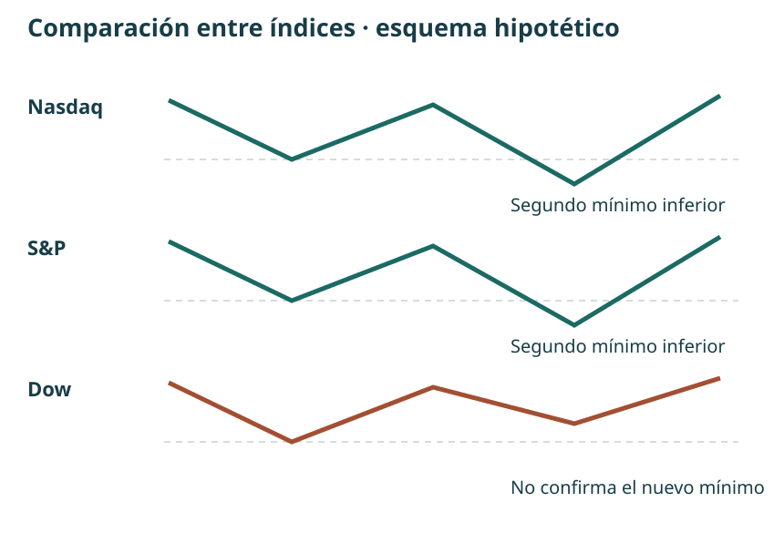
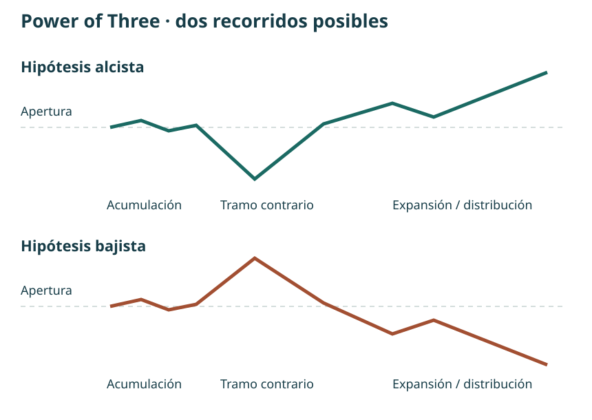

# Manual de estudio ICT · Bloque 2 · Episodios 6 a 10

## Del patrón al contexto de la jornada

**Bloque 2 de 8 · Capítulos 6–10 · Edición de estudio · 30 de septiembre de 2026**

El primer bloque introdujo la secuencia de contexto, liquidez, cambio de estructura y FVG. Este segundo bloque examina sus condiciones, sus variantes y su relación con el recorrido diario. La pregunta deja de ser solamente «¿dónde hay un hueco?» y pasa a ser «¿qué interpretación tenía antes de verlo, qué confirma esa interpretación y qué me haría descartarla?».

La fuente principal son las cinco transcripciones facilitadas por el usuario de la versión en español publicada por TRAVIS FOREX. Se normalizan errores evidentes del reconocimiento de voz: *vayas* se lee como *bias* o sesgo; *Ferrari cap*, como *fair value gap*. Los enlaces temporales proceden de esas transcripciones: no se han contrastado fotograma a fotograma. Las cifras dudosas se señalan en lugar de reconstruirlas como si fueran seguras.

Las explicaciones de ICT se presentan como su modelo interpretativo. Expresiones como «algoritmo», «manipulación» o «flujo institucional» no demuestran por sí mismas quién ejecutó una orden. Los ejemplos son históricos, de 2022; las operaciones y rentabilidades relatadas no se han auditado. Los ejercicios y esquemas propios se identifican como aportaciones del manual y se destinan al estudio y la simulación.

## Mapa de aprendizaje

| Capítulo | Pregunta | Resultado de estudio |
|---|---|---|
| 6. Precisión del modelo | ¿Qué FVG corresponde al desplazamiento relevante? | Identificar límites, entrada planteada y condiciones ausentes |
| 7. Sesgo y comparación | ¿Qué hacer cuando la dirección no está clara? | Separar sesgo, objetivo y variante entre índices |
| 8. Aplicación a Forex | ¿Qué cambia al estudiar EUR/JPY? | Mantener la secuencia y adaptar horarios y referencias |
| 9. Power of Three | ¿Cómo encaja una entrada dentro del día? | Distinguir expansión, pausa y oportunidad tardía |
| 10. Integración | ¿Cómo formular una intención antes del movimiento? | Relacionar apertura, contexto diario y selección intradía |

<figure class="own">
Contexto diario<b>→</b>Objetivo pendiente<b>→</b>Hora y liquidez<b>→</b>Desplazamiento + FVG<b>→</b>Invalidación y revisión
<figcaption>Mapa propio del bloque. Las flechas representan pasos de análisis, no resultados garantizados.</figcaption></figure>

## Capítulo 6 · El FVG dentro de una secuencia

Fuente: [episodio 6 completo](https://www.youtube.com/watch?v=WNfOFRRZkyA).

### 6.1. Tiempo, precio y narrativa

[Vídeo · 00:19](https://www.youtube.com/watch?v=WNfOFRRZkyA&t=19s) · [Tiempo antes que precio · 03:35](https://www.youtube.com/watch?v=WNfOFRRZkyA&t=215s)

El instructor rechaza estudiar figuras aisladas. Un mismo dibujo puede aparecer en lugares distintos del rango y tener una función diferente dentro de su lectura. Propone empezar por cuándo se espera movimiento, dónde podría encontrarse liquidez y hacia qué referencia podría dirigirse el precio.

Su «eficiencia del mercado» describe una idea de distribución y reequilibrio del precio. No debe confundirse con la hipótesis académica de los mercados eficientes. La imagen del rodillo de pintura le sirve para explicar un movimiento rápido y un posible regreso por la misma zona. Es una analogía: no demuestra que allí no se negociara ni obliga al precio a rellenar cada desequilibrio.

**Tesis del capítulo:** el FVG es una zona de trabajo dentro de una historia previa; reconocer tres velas no basta para seleccionar una operación.

### 6.2. Definición geométrica: qué extremos delimitan el hueco

[FVG bajista · 11:34](https://www.youtube.com/watch?v=WNfOFRRZkyA&t=694s) · [FVG alcista · 22:37](https://www.youtube.com/watch?v=WNfOFRRZkyA&t=1357s)

En la formación bajista, el máximo de la tercera vela queda por debajo del mínimo de la primera. El intervalo entre ambos extremos es el FVG. En la alcista, el mínimo de la tercera queda por encima del máximo de la primera. La vela intermedia aporta el desplazamiento que separa los extremos de las velas vecinas.

| Formación | Condición entre velas 1 y 3 | Zona delimitada |
|---|---|---|
| Alcista | Mínimo de 3 mayor que máximo de 1 | Desde el máximo de 1 hasta el mínimo de 3 |
| Bajista | Máximo de 3 menor que mínimo de 1 | Desde el máximo de 3 hasta el mínimo de 1 |

<figure class="own"><figcaption>Figura B2.1 · Esquema propio con precios ficticios, recuperado del bloque 1. Pulsa para ampliar. No reproduce una operación del vídeo.</figcaption></figure>

### 6.3. Barrido, cambio de estructura y desplazamiento

[Contexto del patrón · 15:09](https://www.youtube.com/watch?v=WNfOFRRZkyA&t=909s) · [Calidad del quiebre · 18:29](https://www.youtube.com/watch?v=WNfOFRRZkyA&t=1109s)

Para el escenario bajista, primero describe la superación de un máximo previo o de varios máximos. Después busca una caída enérgica que rompa un mínimo de corto plazo. El FVG que interesa debe pertenecer a ese desplazamiento, no a cualquier tramo anterior del gráfico. La versión alcista invierte las referencias: barrido de mínimos, ruptura de un máximo cercano y desequilibrio alcista.

En esta explicación prefiere un cierre más allá del nivel estructural frente a una mecha que lo atraviesa y vuelve. Esto matiza el ejemplo del capítulo 3, donde el cierre no se formuló como exigencia en todos los casos. Conviene conservar la diferencia entre ejemplos en el registro: no convertir una preferencia posterior en una supuesta regla universal aplicada desde el principio.

**Condición de descarte:** si no aparece el FVG correspondiente al desplazamiento, no hay entrada según este modelo básico. Un movimiento posterior favorable no convierte retrospectivamente un patrón incompleto en una señal válida.

### 6.4. Cambiar de temporalidad sin cambiar de historia

[Referencia de 15 minutos · 25:11](https://www.youtube.com/watch?v=WNfOFRRZkyA&t=1511s) · [Apertura y primer intento · 33:04](https://www.youtube.com/watch?v=WNfOFRRZkyA&t=1984s)

En el ejemplo del 3 de febrero, el gráfico de 15 minutos fija las referencias anteriores a las 8:30 de Nueva York. Después se desciende a temporalidades menores. La finalidad es observar cómo se forma la respuesta dentro de la misma zona, no ir cambiando de referencia hasta encontrar cualquier hueco.

Tras la apertura de contado de las 9:30, el primer intento no reúne lo que busca: falta un desplazamiento suficiente y un FVG adecuado. El siguiente movimiento sí permite estudiar la secuencia. El contraste enseña tanto como la entrada: barrer un extremo no constituye por sí solo una confirmación.

### 6.5. Entrada, invalidación y objetivos

[Entrada y stop · 35:28](https://www.youtube.com/watch?v=WNfOFRRZkyA&t=2128s) · [Objetivos · 37:55](https://www.youtube.com/watch?v=WNfOFRRZkyA&t=2275s)

En el ejemplo bajista plantea una entrada ligeramente por encima del máximo de la tercera vela, al regresar al hueco. Compara ubicaciones del stop por encima de la primera o de la segunda vela. Son alternativas expuestas en esa explicación, con distancias y consecuencias distintas. Si la invalidación exige una distancia que no encaja en el riesgo previsto, su respuesta es renunciar a la entrada.

Distingue una referencia interna —un desequilibrio dentro del rango— de un objetivo externo situado en mínimos previos. La primera puede servir en su ejemplo para una salida parcial; la segunda, para estudiar la extensión restante. No son objetivos automáticamente alcanzables ni equivalentes en recorrido.

En la gestión posterior advierte sobre acercar el stop demasiado pronto. Para el manual, la lección es registrar la regla de gestión antes de observar el resultado. No se deduce que haya que mantener siempre el stop inicial ni que moverlo sea siempre un error.

Ejercicio 6 · Comprobar antes de etiquetar

En un gráfico detenido, marca la referencia barrida y el swing que debería romperse. Después identifica las tres velas y anota sus extremos. Escribe «sin configuración» si falta una condición, aunque el precio se mueva después en la dirección esperada.

<strong>Comprobación:</strong> si el máximo de la vela 1 es 102 y el mínimo de la 3 es 104, el FVG alcista mide 2 puntos. Un hueco geométrico puede existir sin que exista el contexto de entrada estudiado. Ejercicio propio del manual.

## Capítulo 7 · Sesgo diario, incertidumbre y lectura entre índices

Fuente: [episodio 7 completo](https://www.youtube.com/watch?v=1xIiDmjmCtw).

### 7.1. Una dirección probable no es el color de cada vela

[Sesgo y consolidación · 00:18](https://www.youtube.com/watch?v=1xIiDmjmCtw&t=18s) · [Objetivo del sesgo · 03:45](https://www.youtube.com/watch?v=1xIiDmjmCtw&t=225s)

El sesgo es una expectativa de desplazamiento hacia una referencia, no la promesa de que todas las velas cerrarán en la misma dirección. Puede haber retrocesos y jornadas opuestas mientras el objetivo principal siga pendiente. Una vez alcanzado, hace falta revisar la lectura.

El instructor comienza reconociendo una situación incómoda: el precio está consolidando cerca de la zona media y la dirección no le resulta clara. Esperar información adicional después de las 9:30 forma parte de la lectura; no es un fallo que haya que esconder con una predicción forzada.

**Conclusión práctica:** «indeterminado» debe ser una respuesta posible en el diario. La obligación de escoger siempre alcista o bajista favorece explicaciones inventadas a posteriori.

### 7.2. Seleccionar referencias y ajustar la ambición

[Referencias de 15 minutos · 11:18](https://www.youtube.com/watch?v=1xIiDmjmCtw&t=678s) · [Objetivo intermedio · 13:10](https://www.youtube.com/watch?v=1xIiDmjmCtw&t=790s)

La clase diferencia un pequeño máximo dentro del recorrido de un extremo más significativo. No todos los swings tienen el mismo peso. El conjunto de máximos relativamente iguales y la posición del precio dentro del rango sirven para organizar la hipótesis.

En un entorno menos claro, plantea objetivos más próximos y una lectura más precisa en temporalidades inferiores. Alcanzar el punto medio o una zona de desequilibrio no equivale a esperar necesariamente el extremo completo. Para comparar ejemplos, se necesita anotar qué objetivo se había elegido antes de la entrada.

### 7.3. La variante: una señal en S&P y una ejecución en Nasdaq

[Ausencia del patrón en Nasdaq · 15:40](https://www.youtube.com/watch?v=1xIiDmjmCtw&t=940s) · [FVG en S&P · 18:13](https://www.youtube.com/watch?v=1xIiDmjmCtw&t=1093s)

Este episodio introduce una diferencia importante respecto al capítulo 6. El instructor no encuentra el mismo FVG en Nasdaq y observa la configuración en S&P. Utiliza esa información como referencia temporal para una entrada en Nasdaq asociada a otra zona de su lectura, un order block.

Esto es una **variante entre mercados**, con más decisiones y dependencias. No demuestra que el FVG sea prescindible dentro del modelo básico; muestra que el instructor está aplicando una extensión. Mezclar ambos procedimientos bajo la misma etiqueta impediría saber cuál se ha estudiado y con qué resultado.

| Modelo básico | Variante mostrada en el episodio 7 |
|---|---|
| FVG en el instrumento analizado | Configuración de referencia en otro índice |
| Secuencia visible en un mismo mercado | Coordinación de lecturas entre mercados |
| Invalidación del escenario propio | Además, coherencia y límites de la comparación |

### 7.4. La divergencia acompaña al contexto

[Comparación de tres índices · 22:52](https://www.youtube.com/watch?v=1xIiDmjmCtw&t=1372s)

En el ejemplo, Nasdaq y S&P marcan nuevos mínimos mientras Dow no los confirma. El instructor interpreta esa diferencia junto con las referencias anteriores, el momento de la sesión y la respuesta posterior. La divergencia no se presenta aquí como licencia para comprar cada desacuerdo entre índices.

<figure class="own"><figcaption>Figura B2.2 · Esquema propio, sin escala de precios ni cotizaciones reales. Ilustra la diferencia descrita; no reproduce los gráficos del vídeo.</figcaption></figure>

### 7.5. Incertidumbre, pérdidas y conducta personal

[Órdenes exploratorias · 30:45](https://www.youtube.com/watch?v=1xIiDmjmCtw&t=1845s) · [Revisión de la lectura · 56:16](https://www.youtube.com/watch?v=1xIiDmjmCtw&t=3376s)

El instructor relata pequeñas operaciones exploratorias y decisiones personales de exposición. No las convertimos en tareas para el alumno. Observar o simular permite estudiar la reacción del precio sin tomar esas decisiones como requisito de aprendizaje.

También conviene separar una pérdida compatible con las reglas de un error de procedimiento. Que una operación pierda no demuestra por sí solo que el análisis fuera absurdo; que gane tampoco demuestra que estuviera bien definido. Pero llamar «información» a cualquier pérdida después de verla no sustituye una regla de invalidación previa.

Ejercicio 7 · Dos registros, dos modelos

Clasifica diez ejemplos como «modelo básico», «variante entre índices» o «sin configuración». Anota qué mercado aporta la señal y cuál sería el mercado de ejecución. No agrupes los resultados de las dos variantes al evaluarlas.

<strong>Respuesta clave:</strong> si Nasdaq carece del FVG exigido, el modelo básico no está completo. Una señal en S&P pertenece a otra hipótesis, que necesita sus propias reglas. Ejercicio propio.

## Capítulo 8 · Llevar la secuencia a Forex

Fuente: [episodio 8 completo](https://www.youtube.com/watch?v=HSe74P8VFlY).

### 8.1. EUR/JPY: comenzar por el gráfico diario

[Contexto diario · 00:50](https://www.youtube.com/watch?v=HSe74P8VFlY&t=50s) · [Primer impulso sin FVG · 02:25](https://www.youtube.com/watch?v=HSe74P8VFlY&t=145s)

La clase estudia EUR/JPY. Tras la toma de mínimos relativamente iguales, diferencia un primer ascenso que no deja el FVG buscado de otro desplazamiento que sí ofrece ruptura y desequilibrio. Reaparece el filtro del capítulo 6: no basta con que el precio haya subido desde un mínimo.

La hipótesis apunta hacia referencias superiores, pero el instructor admite que el movimiento puede quedarse corto. Un objetivo orienta la lectura; no proporciona certeza sobre la distancia final. El análisis del diario se utiliza para contextualizar el intradía, no para saltarse la formación del escenario menor.

### 8.2. Los horarios también forman parte del modelo

[De diario a 15 minutos · 04:10](https://www.youtube.com/watch?v=HSe74P8VFlY&t=250s) · [Ventanas de estudio · 10:05](https://www.youtube.com/watch?v=HSe74P8VFlY&t=605s)

Marca la medianoche de Nueva York y después examina una ventana de Forex entre las 7:00 y las 10:00. También menciona Londres entre las 2:00 y las 5:00, expresadas en la misma zona horaria. Son ventanas del método presentado, no una descripción completa de los horarios oficiales de negociación.

| Referencia de esta clase | Hora de Nueva York | Uso |
|---|---|---|
| Medianoche | 00:00 | Línea de referencia del día |
| Ventana de Londres | 02:00–05:00 | Observación de configuraciones en Forex |
| Ventana de Nueva York | 07:00–10:00 | Estudio del ejemplo intradía |

El registro debe conservar la zona **America/New_York** y la fecha del ejemplo. No se añade una conversión fija a España, porque el desfase puede cambiar alrededor de las transiciones de horario estacional.

### 8.3. Temporalidades y proyecciones

[Barrido y cambio de estructura · 06:20](https://www.youtube.com/watch?v=HSe74P8VFlY&t=380s) · [Proyecciones · 07:43](https://www.youtube.com/watch?v=HSe74P8VFlY&t=463s)

La lectura baja desde 15 minutos a gráficos menores para precisar el cambio de estructura y el hueco. Se mantiene el mismo escenario: toma de liquidez, respuesta con desplazamiento y una zona de retroceso que permita estudiar la entrada.

Cuando el precio se expande fuera del tramo de referencia, el instructor utiliza proyecciones de Fibonacci. Emplea la expresión «desviación estándar» para ciertos niveles de la herramienta. En esta explicación no se presenta un cálculo estadístico de volatilidad; por tanto, no debemos interpretar automáticamente esos niveles como una sigma calculada sobre una distribución de rendimientos.

**Ejemplo propio:** si un tramo de 100 a 110 mide 10 unidades, prolongarlo otras 10 lleva a 120. Esto explica la idea de una extensión medida, pero no reconstruye los anclajes exactos ni el nivel de salida del vídeo. Para reproducir su configuración de Fibonacci hace falta comprobar los anclajes visibles en pantalla.

### 8.4. Leer las dos monedas del cruce

[Fortaleza relativa · 11:47](https://www.youtube.com/watch?v=HSe74P8VFlY&t=707s)

La explicación final relaciona fortaleza del euro y debilidad del yen con la hipótesis alcista de EUR/JPY. Esa comparación apoya su contexto; no reemplaza la configuración ni garantiza el movimiento del cruce. Antes de reproducirla hay que identificar exactamente qué símbolo y convención de cotización se están comparando.

Ejercicio 8 · Adaptar sin copiar automáticamente

Prepara una ficha de EUR/JPY con fecha, proveedor de datos, zona horaria, referencia diaria y ventana observada. Señala un impulso descartado y otro que sí incluya el FVG. Mantén separadas la proyección matemática y la hipótesis de que el precio llegará a ella.

<strong>Respuesta clave:</strong> las 8:30 usadas en los ejemplos de índices no sustituyen automáticamente la ventana de 7:00–10:00 de esta clase de Forex. Ejercicio propio.

## Capítulo 9 · Power of Three y la oportunidad que llega después

Fuente: [episodio 9 completo](https://www.youtube.com/watch?v=WCxULWOIJd4).

### 9.1. Acumulación, manipulación y distribución

[Presentación del ciclo · 00:05](https://www.youtube.com/watch?v=WCxULWOIJd4&t=5s) · [Jornada alcista · 02:49](https://www.youtube.com/watch?v=WCxULWOIJd4&t=169s)

El Power of Three organiza una lectura de la jornada en tres fases. En el caso alcista, el instructor plantea negociación inicial cerca de la apertura, un movimiento contrario a la expansión prevista y un avance posterior. En el bajista, la figura se invierte. La distribución alude aquí al desarrollo y realización de las posiciones del escenario; no debe reducirse a «distribución siempre significa caída».

La palabra manipulación pertenece a la interpretación de ICT. El movimiento contrario inicial, también llamado Judas swing, es una pauta que se intenta reconocer dentro de un contexto. Su presencia no acredita una intención concreta de los participantes ni permite conocer de antemano el máximo o mínimo del día.

<figure class="own"><figcaption>Figura B2.3 · Dos recorridos hipotéticos del Power of Three. Elaboración propia; la apertura es una referencia, no una señal de entrada.</figcaption></figure>

### 9.2. Qué información estaba disponible en cada instante

[Order block y contexto · 07:14](https://www.youtube.com/watch?v=WCxULWOIJd4&t=434s) · [FVG diario conocido al cierre · 07:59](https://www.youtube.com/watch?v=WCxULWOIJd4&t=479s)

El ejemplo conecta el lunes 14 y el martes 15 de febrero de 2022. El instructor advierte que una referencia diaria solo quedó disponible al cierre de la vela del lunes. Dibujar esa zona sobre horas anteriores y afirmar que entonces ya existía sería introducir información futura.

La explicación del order block incorpora una secuencia de velas bajistas antes del desplazamiento. No conviene reducirla a marcar sin contexto la última vela roja de cualquier subida. Importan el recorrido, la zona superior y el movimiento que justifica su selección dentro del ejemplo.

**Regla editorial de estudio:** junto a cada nivel registra cuándo quedó confirmado. Así se distingue un análisis retrospectivo de una hipótesis que realmente habría podido formularse en ese momento.

### 9.3. No perseguir una expansión nocturna

[Movimiento perdido · 11:01](https://www.youtube.com/watch?v=WCxULWOIJd4&t=661s) · [Esperar a la tarde · 15:16](https://www.youtube.com/watch?v=WCxULWOIJd4&t=916s)

El instructor reconoce que el movimiento nocturno le sorprendió. En lugar de exigir una entrada inmediata por haberlo perdido, explica que una expansión importante puede dar paso a consolidación. En ese escenario de índices propone dejar pasar la mañana y examinar la sesión posterior al almuerzo.

La regla específica se formula para índices y el propio discurso la diferencia de Forex. No debe exportarse sin más a cualquier instrumento. Tampoco afirma que cada impulso nocturno obligue a una pausa idéntica: se estudia una condición particular del ejemplo.

### 9.4. Reconstruir la oportunidad de la tarde

[Desplazamiento y entrada posterior · 20:25](https://www.youtube.com/watch?v=WCxULWOIJd4&t=1225s) · [Mechas y stop · 25:13](https://www.youtube.com/watch?v=WCxULWOIJd4&t=1513s)

Después aparecen referencias de mínimos de la mañana y del almuerzo, un desplazamiento y zonas superiores hacia las que dirigir la lectura. El vídeo distingue la entrada inicial de una incorporación posterior. Son momentos diferentes, con distancias y riesgos distintos; la segunda no hereda automáticamente la relación entre riesgo y recorrido de la primera.

En su ejemplo tolera determinadas mechas que atraviesan una zona mientras los cuerpos conservan la estructura que está observando. Esto no autoriza a ignorar un stop ya alcanzado ni a desplazar la invalidación para salvar una idea. La propia clase reconoce que, si se ejecuta el stop, hay pérdida.

### 9.5. Una discrepancia numérica que hay que conservar visible

[Pasaje de riesgo · 22:15](https://www.youtube.com/watch?v=WCxULWOIJd4&t=1335s)

La transcripción menciona seis micros, 14,25 puntos de riesgo y unos 85 dólares. Esas cifras no encajan **si se trata de seis contratos MNQ**. Según la [ficha del Micro E-mini Nasdaq-100 de CME](https://www.cmegroup.com/markets/equities/nasdaq/micro-e-mini-nasdaq-100.html), cada punto equivale a 2 dólares por contrato y el tick de 0,25 puntos equivale a 0,50 dólares.

| Supuesto de cálculo | Operación | Riesgo nominal, sin costes |
|---|---|---|
| 6 MNQ y 14,25 puntos | 6 × 14,25 × 2 | 171 USD |
| 3 MNQ y 14,25 puntos | 3 × 14,25 × 2 | 85,50 USD |
| 6 MNQ y 9 puntos | 6 × 9 × 2 | 108 USD |
| 3 MNQ y 9 puntos | 3 × 9 × 2 | 54 USD |

No podemos resolver con el texto si el error está en la transcripción, en el número de contratos o en la explicación oral. Por eso el manual no corrige silenciosamente «seis» por «tres». Si se compara un recorrido monetario hipotético de 300 USD con 171 USD de riesgo, la razón es aproximadamente 1,75, no 3,5. Son cálculos nominales: no incorporan comisiones ni diferencias de ejecución.

Ejercicio 9 · Auditar una operación antes de interpretarla

Anota instrumento, número de contratos, valor del punto y distancia al stop. Calcula el riesgo sin mirar la cifra anunciada. Después comprueba si el nivel diario que utilizaste ya existía en el momento de la entrada.

<strong>Respuesta clave:</strong> precio, puntos, ticks y dólares son magnitudes distintas. Un error en la cantidad de contratos cambia el riesgo aunque el gráfico sea el mismo. Ejercicio propio.

## Capítulo 10 · Unir apertura, sesgo y ejecución

Fuente: [episodio 10 completo](https://www.youtube.com/watch?v=JKnOYWQ_mqU).

### 10.1. Calendario y contexto superior

[Calendario · 00:05](https://www.youtube.com/watch?v=JKnOYWQ_mqU&t=5s) · [Sesgo diario · 02:34](https://www.youtube.com/watch?v=JKnOYWQ_mqU&t=154s)

El ejemplo del 17 de febrero de 2022 comienza por el calendario y las publicaciones de las 8:30. Se identifican como eventos capaces de coincidir con cambios importantes en el recorrido. La afirmación del instructor de que las noticias sirven de cobertura a movimientos previamente organizados se conserva como su interpretación, no como un hecho demostrado por el gráfico.

Después vuelve al marco diario: una recuperación hacia un FVG puede ocurrir dentro de una lectura bajista más amplia. Alcanzar la zona superior cambia lo que busca a continuación. La misma subida que antes era coherente con un objetivo pendiente puede dejar de justificar compras cuando ese objetivo ya se ha cumplido.

### 10.2. Apertura, recorrido contrario y expansión

[Jornada bajista · 07:59](https://www.youtube.com/watch?v=JKnOYWQ_mqU&t=479s) · [AMD · 12:51](https://www.youtube.com/watch?v=JKnOYWQ_mqU&t=771s)

Para el escenario bajista, la clase describe apertura, subida inicial y expansión posterior hacia mínimos. La búsqueda de ventas se concentra alrededor de la apertura o por encima de ella, condicionada al resto de la lectura. El objetivo educativo consiste en situar una configuración dentro del recorrido esperado, no en vender mecánicamente cada cruce de la apertura.

El instructor usa también barras OHLC para aislar apertura, máximo, mínimo y cierre. Esos cuatro datos no revelan por sí solos el orden intradía en que se visitaron máximo y mínimo. La secuencia temporal necesita contrastarse en gráficos inferiores o en una reproducción de la sesión.

### 10.3. Tres referencias horarias que no deben mezclarse

[Apertura de medianoche · 30:30](https://www.youtube.com/watch?v=JKnOYWQ_mqU&t=1830s)

| Referencia | Papel en estos episodios |
|---|---|
| 00:00 de Nueva York | Apertura usada en el desarrollo diario del Power of Three del episodio 10 |
| 08:30 de Nueva York | Referencia intradía y publicaciones económicas presentes en varios ejemplos |
| 09:30 de Nueva York | Apertura de contado de los índices estadounidenses mencionada en las clases |

En el episodio 9 se utiliza una referencia de las 8:30 dentro del ejemplo intradía; en el 10 se especifica la medianoche para la apertura del Power of Three diario. El manual mantiene ambas y señala su función. No reemplaza una por otra para fabricar una uniformidad que las clases no tienen.

### 10.4. Un rango de proximidad, no permiso para perseguir

[Medida desde la apertura · 13:09](https://www.youtube.com/watch?v=JKnOYWQ_mqU&t=789s) · [Aplicación al gráfico · 33:19](https://www.youtube.com/watch?v=JKnOYWQ_mqU&t=1999s)

El instructor mide el tramo entre apertura y máximo inicial y lo proyecta por debajo de la apertura para delimitar una zona de búsqueda bajista. Esa construcción no debe confundirse con una regla genérica de ruptura del rango de los primeros 30 minutos.

**Ejemplo propio:** apertura 100 y máximo inicial 104 dan una distancia de 4. Proyectar esa distancia por debajo de la apertura sitúa la referencia inferior en 96. Estar dentro de 96–104 no constituye una señal; solo ilustra la proximidad que propone considerar junto con el contexto y el patrón. Si el movimiento ya se ha alejado de la zona, la clase insiste en no perseguirlo.

### 10.5. Buscar el primer FVG legible

[Descenso de temporalidades · 37:49](https://www.youtube.com/watch?v=JKnOYWQ_mqU&t=2269s)

La explicación concreta el recorrido 5, 4, 3, 2 y 1 minuto. Si aparece un FVG adecuado en cuatro minutos, no hace falta seguir bajando para buscar otro. Si no aparece en ninguna de esas temporalidades, no hay operación según esa secuencia. El marco de 15 minutos sigue aportando la referencia general.

Se introduce además un breaker bajista como motivo de una ubicación particular del stop. El propio instructor remite su desarrollo a otras lecciones. Aquí lo registramos como concepto mencionado y como variante de invalidación, sin convertir un pasaje breve en una enseñanza completa del breaker ni exigirlo al modelo básico.

### 10.6. Margen, pérdida y resultados de demostración

[Riesgo y movimientos rápidos · 43:28](https://www.youtube.com/watch?v=JKnOYWQ_mqU&t=2608s) · [Cuenta de simulación · 50:43](https://www.youtube.com/watch?v=JKnOYWQ_mqU&t=3043s)

El margen que permite abrir una posición no es la pérdida máxima de esa posición. La clase dedica un tramo considerable a movimientos rápidos y a diferencias entre el precio esperado de salida y la ejecución. Las cantidades de capital y márgenes mencionadas corresponden a la grabación y no se presentan como condiciones actuales ni como presupuesto recomendado al lector.

La rentabilidad extraordinaria mostrada en este tramo se identifica expresamente como **paper trading**. Las referencias del instructor a otra cuenta real no convierten esa demostración en un historial real auditado. El contenido útil para el manual es la necesidad de escribir condiciones de entrada, stop, gestión, tamaño y abstención; el porcentaje exhibido no sirve como expectativa de aprendizaje.

### 10.7. Cómo estudiar sin atribuirse previsiones que no se hicieron

[Modelo escrito · 53:26](https://www.youtube.com/watch?v=JKnOYWQ_mqU&t=3206s) · [Estudio retrospectivo · 1:02:02](https://www.youtube.com/watch?v=JKnOYWQ_mqU&t=3722s)

El instructor propone revisar patrones pasados y practicar su reconocimiento. En un pasaje recomienda anotarlos como si se hubieran anticipado. El manual separa ese ensayo narrativo de la evaluación: describir hoy lo que habría podido verse ayer no es prueba de haberlo previsto entonces.

La alternativa de trabajo es conservar dos columnas: «información disponible en ese momento» y «lo que sé después». Para medir una hipótesis, se escribe antes de avanzar la reproducción. También se conservan sesiones sin patrón, pérdidas y situaciones ambiguas. Reconocer retrospectivamente ejemplos seleccionados no permite calcular por sí solo la eficacia del método.

Ejercicio 10 · Redactar una intención comprobable

Antes de reproducir una sesión, escribe el objetivo superior pendiente, la apertura elegida, la referencia de liquidez y las condiciones de descarte. Avanza sin modificar esa ficha. Registra en una segunda columna las revisiones y la hora en que nueva información las justificó.

<strong>Respuesta clave:</strong> una revisión explícita puede ser razonable; borrar la hipótesis inicial para que siempre coincida con el resultado impide aprender. Ejercicio propio.

## Taller de cierre · Un procedimiento, variantes separadas

Esta secuencia es una organización didáctica del manual a partir de las clases. No es un sistema completo de ejecución ni una validación estadística.

1. **Definir contexto.** Anotar instrumento, fecha, zona horaria y referencia diaria pendiente. Admitir un sesgo indeterminado.
2. **Elegir el marco temporal.** Precisar qué apertura y ventana se utilizan, sin mezclar los ejemplos de Forex e índices.
3. **Marcar la liquidez de referencia.** Distinguir extremos del rango de pequeños swings interiores.
4. **Esperar la respuesta.** Registrar barrido, desplazamiento y cambio de estructura; evitar confirmar solo por una mecha aislada.
5. **Clasificar el modelo.** Básico con FVG en el instrumento propio, o variante entre mercados. No intercambiarlos después de ver el resultado.
6. **Definir invalidación y objetivo.** Calcular distancia y unidades antes de calcular dinero. Distinguir objetivo interno, externo y proyección.
7. **Registrar también la abstención.** Sin FVG, demasiado lejos de la zona, incertidumbre no resuelta o riesgo incompatible son resultados de análisis.
8. **Revisar sin información futura.** Separar cumplimiento del procedimiento, desenlace y dudas pendientes.

### Plantilla de diario

| Campo | Qué escribir |
|---|---|
| Fecha, activo, datos y zona horaria | Identificación suficiente para reproducir el gráfico |
| Sesgo y objetivo | Alcista, bajista o indeterminado; nivel y motivo |
| Información disponible | Momento en que se confirmó cada referencia |
| Modelo observado | Básico / variante entre índices / ninguno |
| Secuencia | Barrido, swing, desplazamiento y extremos del FVG |
| Invalidación y objetivo | Niveles previstos y razón de cada uno |
| Magnitudes | Puntos, valor por punto, contratos y cálculo nominal |
| Revisión | Qué cambió, cuándo se supo y por qué |
| Resultado de estudio | Cumplimiento, desenlace y aprendizaje, separados |

Autoevaluación · Siete preguntas y respuestas

<ol>
<li><strong>¿Todo FVG es una entrada?</strong> No. El patrón geométrico no sustituye al contexto y la secuencia.</li>
<li><strong>¿Un sesgo alcista exige todas las velas alcistas?</strong> No. Se relaciona con un objetivo pendiente y admite retrocesos.</li>
<li><strong>¿El episodio 7 elimina la condición de FVG del modelo básico?</strong> No. Introduce una variante entre mercados.</li>
<li><strong>¿La ventana Forex comienza siempre a las 8:30?</strong> La clase 8 estudia 7:00–10:00 de Nueva York.</li>
<li><strong>¿Se puede usar un FVG diario antes de confirmarse su tercera vela?</strong> No como nivel ya confirmado; sería anticipar información.</li>
<li><strong>¿Seis MNQ con 14,25 puntos implican unos 85 USD?</strong> No: el cálculo nominal da 171 USD.</li>
<li><strong>¿Una explicación retrospectiva demuestra capacidad predictiva?</strong> No. Hace falta distinguirla de un registro previo y evaluar ejemplos completos.</li>
</ol>

## Glosario del bloque

| Término | Uso en estas clases |
|---|---|
| Bias / sesgo | Hipótesis direccional vinculada a referencias y objetivos |
| Displacement / desplazamiento | Movimiento enérgico que aporta contexto al cambio de estructura |
| FVG | Intervalo entre extremos no solapados de las velas primera y tercera |
| Liquidez interna / externa | Referencias dentro del rango / más allá de sus extremos |
| Premium / discount | Mitad superior / inferior del rango seleccionado |
| Power of Three / AMD | Lectura de acumulación, movimiento contrario y expansión/distribución |
| Judas swing | Movimiento inicial contrario a la expansión prevista en la interpretación de ICT |
| Order block | Zona de velas seleccionada por su contexto previo a un desplazamiento |
| Breaker | Concepto de cambio de función de una zona; mencionado, no desarrollado íntegramente en este bloque |
| Top-down | Pasar del marco superior al inferior conservando las referencias |
| Paper trading | Simulación; sus resultados no equivalen a ejecuciones reales verificadas |

## Atlas visual y fuentes

Las tres figuras del paquete son locales y se abren sin conexión. Se han creado como apoyo didáctico; no se presentan como capturas de ATAS ni como reconstrucciones exactas de los vídeos. Para conservar el vínculo solicitado con los tutoriales de ATAS, se incluye esta lectura visual complementaria:

**[Abrir el tutorial ilustrado de ATAS sobre SMC e ICT](https://atas.net/blog/what-is-the-smart-money-concept-and-how-does-the-ict-trading-strategy-work/)**. Contiene explicaciones y gráficos sobre estructura, order blocks y desequilibrios, además de un apartado de Power of Three. Es una fuente secundaria independiente de las transcripciones. Sus imágenes se consultan en el sitio original; no se han incluido copias en este ZIP.

### Momentos del vídeo para contrastar los dibujos

| Capítulo | Abrir el pasaje | Qué observar |
|---|---|---|
| 6 | [11:34 · Definición del FVG](https://www.youtube.com/watch?v=WNfOFRRZkyA&t=694s) | Extremos de las velas 1 y 3 |
| 6 | [35:28 · Ejemplo intradía](https://www.youtube.com/watch?v=WNfOFRRZkyA&t=2128s) | Entrada, distancia al stop y referencias inferiores |
| 7 | [22:52 · Tres índices](https://www.youtube.com/watch?v=1xIiDmjmCtw&t=1372s) | Diferencia entre los mínimos de Dow, Nasdaq y S&P |
| 8 | [06:20 · EUR/JPY](https://www.youtube.com/watch?v=HSe74P8VFlY&t=380s) | Contexto horario y descenso de temporalidades |
| 8 | [08:15 · Proyección](https://www.youtube.com/watch?v=HSe74P8VFlY&t=495s) | Anclajes concretos de la herramienta |
| 9 | [20:25 · Sesión de tarde](https://www.youtube.com/watch?v=WCxULWOIJd4&t=1225s) | Diferencia entre primera entrada e incorporación posterior |
| 10 | [33:19 · Apertura y proyección](https://www.youtube.com/watch?v=JKnOYWQ_mqU&t=1999s) | Distancia apertura–máximo y zona reflejada |
| 10 | [39:08 · Gráfico de cuatro minutos](https://www.youtube.com/watch?v=JKnOYWQ_mqU&t=2348s) | FVG encontrado sin seguir bajando de temporalidad |

**Control de calidad de las fuentes.** Las transcripciones contienen referencias visuales como «aquí» que no permiten recuperar todos los niveles exactos. En el episodio 10 aparece una discrepancia entre 14.381 y 14.831; no se utiliza esa cifra como nivel operativo reconstruido. Se mantienen enlaces al pasaje para su contraste. La aritmética del capítulo 9 se comprueba con la especificación contractual de [CME para MNQ](https://www.cmegroup.com/markets/equities/nasdaq/micro-e-mini-nasdaq-100.html). No se ha comprobado la ejecución de operaciones ni la eficacia estadística de las afirmaciones del instructor.

## Continuidad del manual

| Bloque | Episodios | Situación en esta edición |
|---|---|---|
| 1 | 1–5 | Integrado y aprobado previamente |
| 2 | 6–10 | Presente entrega |
| 3 | 11–15 | Pendiente |
| 4 | 16–20 | Pendiente |
| 5 | 21–25 | Pendiente |
| 6 | 26–30 | Pendiente |
| 7 | 31–35 | Pendiente |
| 8 | 36–41 | Pendiente |

El reparto usa la numeración de episodios acordada. Cuando se avance, habrá que contrastarla con el orden real de la lista para detectar posibles números omitidos o títulos especiales. La futura edición conjunta conservará la numeración de capítulos, unificará el glosario y separará las reglas del modelo básico de sus ampliaciones.

Este bloque cierra una etapa de estudio: el alumno dispone de un vocabulario más preciso y de una forma de registrar contexto, condiciones y límites. Todavía no constituye una enseñanza completa de todos los conceptos anunciados por la mentoría.
