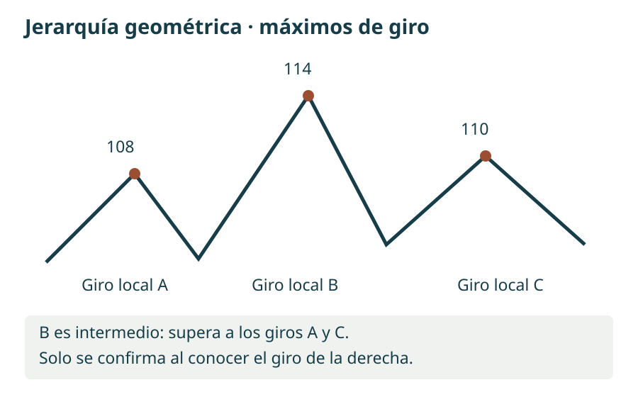
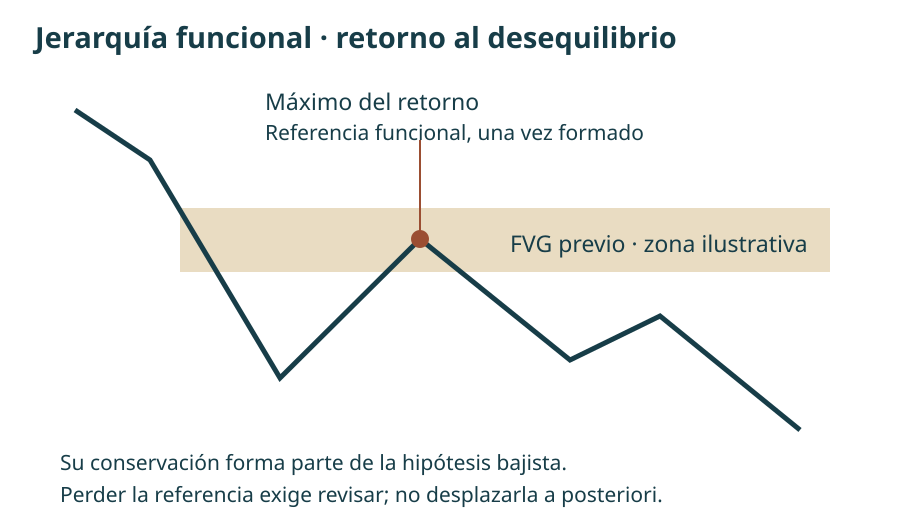
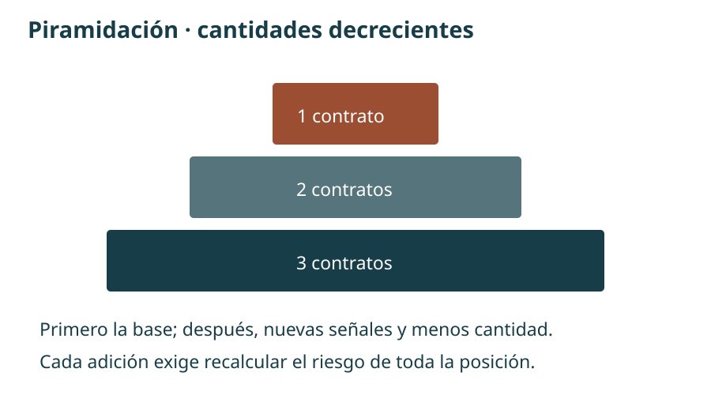
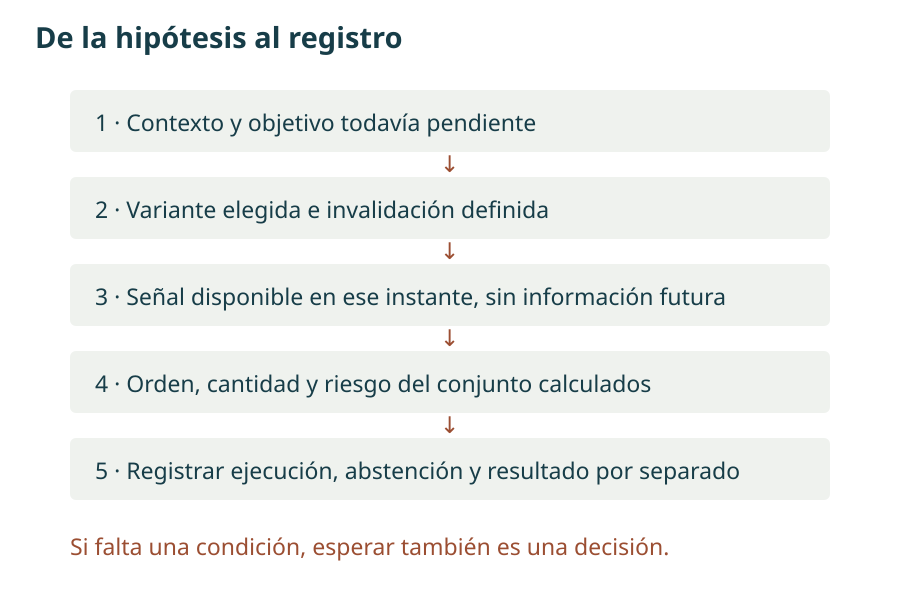

# Manual de estudio ICT · Bloque 3 · Episodios 11 a 15

## De los conceptos a una hipótesis comprobable

**Bloque 3 de 8 · Edición de estudio · 1 de octubre de 2026**

Los bloques anteriores organizaron la secuencia de contexto, liquidez, desplazamiento y hueco de valor razonable. Este bloque profundiza en una pregunta: **¿qué referencias deben mantenerse para que una idea siga siendo válida?** La respuesta conecta la jerarquía de máximos y mínimos con los desequilibrios, la elección de una entrada y la gestión posterior.

El propósito no es memorizar nombres ni reproducir los resultados monetarios de una grabación. Es poder definir una condición, reconocer cuándo está confirmada y escribir qué decisión permite tomar. Se han reducido las digresiones autobiográficas, la autopromoción y las polémicas con otros enfoques. Se conserva la información sobre pérdidas, incertidumbre y simulación cuando cambia la interpretación del ejemplo.

**Cómo leer las atribuciones.** «En la clase» y «el instructor» remiten a las transcripciones aportadas. «Ampliación» introduce una explicación complementaria; cuando procede de una fuente externa se enlaza junto al texto. «Ejemplo propio» y «criterio de estudio» son aportaciones del manual, no reglas literales de ICT. Los gráficos son esquemas propios con datos ficticios. Las marcas temporales proceden de las transcripciones y no se han verificado fotograma a fotograma.

La terminología de «algoritmo», «dinero inteligente» y «flujo institucional» se conserva como parte del modelo interpretativo de ICT. Un gráfico de velas, por sí solo, no identifica a los participantes ni demuestra sus intenciones. Este cuaderno permite formular y contrastar hipótesis; no acredita la eficacia estadística de una estrategia.

## Mapa del bloque y orden de las fuentes

El orden de lectura es **11 → 12 → 13 → 14 → 15**, aunque la lista de reproducción sitúe el 12 antes del 11. La introducción sigue siendo el capítulo piloto del bloque 1; no se renumera ningún episodio.

| Capítulo | Pregunta que resuelve | Producto de estudio |
|---|---|---|
| 11. Contexto y selección del giro | ¿Qué máximo o mínimo importa dentro del recorrido? | Mapa de rango, apertura y objetivo |
| 12. Jerarquía estructural | ¿Cómo clasificar los giros y reconocer una invalidación? | Dos clasificaciones y dos modelos de entrada separados |
| 13. Continuidad y ampliación | ¿Cómo gestionar retrocesos y entradas adicionales? | Registro de estructura y riesgo total |
| 14. Ejecución y salida | ¿Qué diferencia hay entre un plan anunciado y lo ejecutado? | Cronología de decisiones, sin completar datos ausentes |
| 15. Apertura y límites | ¿Qué cambia en una entrada durante la apertura? | Criterios de abstención, protección y cierre |

Conviene volver al bloque 2 para repasar la geometría del FVG y las distintas aperturas. Aquí se amplía su interpretación, sin convertir cada concepto nuevo en una condición obligatoria del modelo básico.

## Diccionario de trabajo · Qué es cada pieza y para qué sirve

### A. Sesgo, narrativa y objetivo

**Sesgo direccional —bias—** es una hipótesis sobre el recorrido que se considera más coherente con las referencias elegidas. «Alcista» no significa que todas las velas deban subir; «bajista» no implica vender cualquier recuperación. **Narrativa** es la explicación condicional que conecta el punto de partida con el objetivo: «tras regresar a una zona diaria, busco desplazamiento hacia un mínimo anterior mientras se conserve el máximo de referencia».

**Objetivo de atracción del precio —draw on liquidity, DOL—** designa, en el lenguaje de estas clases, la referencia hacia la que se espera el movimiento: liquidez sobre máximos, bajo mínimos o un desequilibrio pendiente de revisita. El término no identifica una fuerza observable ni obliga a alcanzar el nivel. Sirve para contestar «¿hacia dónde?» antes de decidir «¿dónde entrar?».

**Criterio de estudio:** escribir también una hipótesis alternativa. Si los argumentos permiten justificar con la misma facilidad ambos sentidos, el resultado puede ser «sin sesgo suficiente». Elegir neutralidad es una decisión, no un vacío que haya que rellenar con una operación.

### B. Liquidez y barrido

**Liquidez compradora —buy-side liquidity, BSL—**: en la lectura de ICT, posible concentración de órdenes de compra por encima de máximos, incluidos stops de posiciones cortas. **Liquidez vendedora —sell-side liquidity, SSL—**: posible concentración de ventas por debajo de mínimos, incluidos stops de posiciones largas. Las compras o ventas de ruptura también pueden participar. Son ubicaciones inferidas: las velas no permiten contar todas esas órdenes.

**Barrido de liquidez —liquidity sweep—** describe un paso más allá de un extremo seguido de una respuesta que se estudia en contexto. Atravesar un máximo no demuestra que vaya a comenzar una caída: puede ser una ruptura que continúe. Para distinguir escenarios se observa qué ocurre después, no se asigna automáticamente la etiqueta «trampa» al primer cruce.

En microestructura, liquidez también alude a la posibilidad de negociar con poco impacto sobre el precio. Ese significado no es idéntico a dibujar una línea de stops supuestos. **Uso estratégico:** localizar posibles destinos y zonas de reacción; la mera presencia de un máximo no constituye una entrada.

### C. Rango, prima, descuento y equilibrio

Un **rango de referencia —dealing range—** es el intervalo entre dos extremos seleccionados por su función en el análisis. Su mitad es el **equilibrio —equilibrium—**. La zona superior es **prima —premium—**; la inferior, **descuento —discount—**. Estos términos expresan posición relativa dentro del intervalo, no valor fundamental ni una valoración estadística del activo.

**Ejemplo propio:** con mínimo 100 y máximo 120, el equilibrio es (100 + 120) / 2 = 110. El precio 114 está en prima respecto de ese rango. Si otro rango válido va de 112 a 124, 114 está en descuento respecto de este segundo intervalo. Por eso «está caro» o «está barato» carece de precisión sin indicar los extremos y la temporalidad.

**Uso estratégico:** delimitar dónde estudiar una venta o compra compatible con la hipótesis, no generar una orden automática al cruzar el 50 %. Cambiar los anclajes después de ver el resultado modifica la hipótesis original y debe registrarse.

### D. Desequilibrio, FVG y hueco de sesión

**Desequilibrio —imbalance—** es un término amplio del instructor para un recorrido que considera poco equilibrado. Un **hueco de valor razonable —fair value gap, FVG—** tiene una geometría concreta de tres velas: en el alcista, el mínimo de la tercera está por encima del máximo de la primera; en el bajista, el máximo de la tercera está por debajo del mínimo de la primera. Se usan los extremos, incluidas las mechas.

La vela central sí puede haber negociado dentro de ese intervalo. Por tanto, el FVG **no demuestra ausencia total de transacciones** ni aporta por sí mismo datos de volumen. **Reequilibrio —rebalance—** es el retorno del precio hacia esa zona en la interpretación de ICT. Una visita al borde, una entrada parcial y un recorrido completo del hueco son eventos distintos; el registro debe decir cuál ocurrió.

Un **hueco entre sesiones —session gap—** separa, por ejemplo, el cierre de una sesión y la apertura posterior. No se define con las velas primera y tercera. El episodio 14 utiliza ambos tipos de referencia: el FVG para estudiar la entrada y un hueco relacionado con el cierre del viernes como destino. Confundirlos borra la lógica del ejemplo.

**Ampliación visual:** [ATAS: explicación y gráficos del FVG](https://atas.net/blog/fvg-trading-what-is-fair-value-gap-meaning-strategy/). Se facilita el tutorial, no una captura incorporada. Sus ejemplos son complementarios y sus propuestas de indicadores no se añaden como requisitos de la mentoría.

### E. Desplazamiento y cambio de estructura

**Desplazamiento —displacement—** es un avance o caída enérgico respecto del comportamiento cercano, que separa el precio de una zona y puede dejar un FVG. No existe en estas transcripciones un umbral universal de puntos, velocidad o tamaño de vela que permita automatizarlo sin decisiones adicionales.

**Cambio de estructura —market structure shift, MSS—** es el quiebre relevante de un giro previo dentro de la secuencia estudiada. Un máximo o mínimo diminuto puede romperse sin que cambie la lectura del marco superior. Para interpretarlo hay que identificar el giro, su función y la respuesta del precio. No se supone que MSS, «ruptura de estructura» —BOS— y «cambio de carácter» —CHoCH— sean etiquetas intercambiables en cualquier autor.

**Uso estratégico:** en la variante con confirmación, el quiebre y el desplazamiento aportan evidencia antes de estudiar el regreso al FVG. El criterio exacto de ruptura —mecha, cierre y marco temporal— debe fijarse para el ejercicio. El manual no impone retroactivamente una regla única donde las clases muestran variantes.

### F. Bloque de órdenes y lectura del flujo

**Bloque de órdenes —order block, OB—** es una zona de una o varias velas contrarias al desplazamiento que el instructor selecciona por su contexto. En el caso alcista estudia velas bajistas antes del avance; en el bajista, velas alcistas antes de la caída. El episodio 12 insiste en que puede tratarse de una **serie de velas**, no necesariamente de la última vela de color contrario.

Un rectángulo dibujado sobre esas velas no prueba que queden órdenes institucionales allí. Lo que sí puede comprobarse es si el precio vuelve, qué parte visita y si después continúa o invalida la hipótesis. La selección del bloque debe relacionarse con un objetivo, la jerarquía estructural y el desplazamiento; no basta el color de la vela.

**Flujo de órdenes —order flow—** en estas clases suele significar una lectura de continuidad: en un recorrido alcista, determinadas velas bajistas deberían sostener retrocesos; en uno bajista, determinadas velas alcistas deberían contener recuperaciones. No equivale a observar transacciones ejecutadas, profundidad del libro o volumen comprador y vendedor. Usaremos «lectura del flujo según ICT» cuando se trate de esa inferencia.

**Ampliación visual:** [ATAS: bloques de órdenes y bloques de ruptura](https://atas.net/blog/what-are-ict-order-blocks-and-breaker-blocks-in-trading/). Un **breaker block**, o bloque de ruptura con cambio de función, se relaciona con una zona previa invalidada; queda como término de consulta, no como un modelo nuevo desarrollado en este bloque. Ante diferencias de definición, prevalece la explicación concreta de los episodios.

## Capítulo 11 · Del contexto al máximo que interesa

Fuente: [ICT Mentorship 2022 En Español Episodio 11 · TRAVIS FOREX](https://www.youtube.com/watch?v=qDaolyZy2_c).

### 11.1. Ubicar el retroceso dentro del rango

[Prima, descuento y objetivo · 01:14](https://www.youtube.com/watch?v=qDaolyZy2_c&t=74s)

El instructor parte de un intervalo mayor y de un desequilibrio. Describe una recuperación hacia la mitad superior del rango seguida de una caída hacia liquidez situada bajo mínimos. La recuperación no cancela por sí misma el sesgo bajista: puede ser el tramo que permite estudiar una venta con un objetivo inferior todavía pendiente.

La pregunta útil no es «¿esta vela está subiendo?», sino «¿qué función cumple esta subida respecto de mi hipótesis?». Si se espera un retorno a una zona superior antes de la caída, el avance puede ser compatible con el plan. Si rompe el extremo que debía contenerlo, deja de ser el mismo escenario. Esa distinción evita llamar retrospectivamente «retroceso normal» a cualquier movimiento adverso.

**Ejemplo propio:** rango 100–120, objetivo inferior 100 y zona de estudio 114–116. Llegar a 115 permite observar la respuesta; no valida una venta. Si la hipótesis requiere que 120 permanezca intacto, superar ese extremo obliga a revisar la lectura, aunque el precio termine cayendo horas después.

### 11.2. Dos aperturas, dos preguntas

[Distinción explícita entre medianoche y 08:30 · 07:08](https://www.youtube.com/watch?v=qDaolyZy2_c&t=428s)

El episodio resuelve una ambigüedad del bloque 2. Para observar el **rango diario completo**, el instructor utiliza la apertura de medianoche de Nueva York. Para estudiar **la sesión de la mañana**, utiliza la referencia de las 08:30. La apertura de contado de las 09:30 constituye un tercer evento y no sustituye a las anteriores.

| Hora de Nueva York | Qué representa en esta lectura | Qué no implica |
|---|---|---|
| 00:00 | Referencia para el recorrido diario | Apertura de negociación de todos los futuros |
| 08:30 | Referencia del análisis matinal del ejemplo | Orden automática de compra o venta |
| 09:30 | Apertura de contado de los índices | Que el primer movimiento deba ser falso |

El **movimiento de Judas —Judas swing—** es el tramo inicial contrario al desplazamiento esperado en la narrativa del instructor. Reconocerlo exige un contexto previo y una respuesta posterior: no se puede saber que cada subida a las 08:30 será un engaño. Se conserva la zona `America/New_York` y la fecha; no se añade una conversión fija a España.

### 11.3. Un giro local y una jerarquía

[Relación entre máximos · 10:22](https://www.youtube.com/watch?v=qDaolyZy2_c&t=622s) · [Definición de máximo de giro · 13:32](https://www.youtube.com/watch?v=qDaolyZy2_c&t=812s)

Un **máximo de giro —swing high—** básico tiene un máximo menor a su izquierda y otro menor a su derecha. El **mínimo de giro —swing low—** invierte la comparación. En el esquema elemental de tres velas, la vela central es el extremo. Su condición no está confirmada mientras la vela derecha todavía pueda superar el máximo o perforar el mínimo central.

El instructor organiza después los giros en corto, medio y largo plazo. Son categorías relativas al gráfico y al contexto: un «máximo de largo plazo» dentro de tres minutos no significa necesariamente un máximo de meses. La utilidad consiste en separar fluctuaciones pequeñas de los puntos cuyo quiebre modificaría la hipótesis.

En el ejemplo de venta, la sucesión de máximos subordinados se interpreta dentro de una expectativa de alcanzar liquidez inferior. La misma figura aislada carece del objetivo y de la zona mayor que justifican la lectura. El capítulo 12 desarrollará la clasificación formal y la excepción basada en reequilibrios.

### 11.4. Anticipación frente a confirmación

[Entrada anticipada y alternativa posterior · 17:05](https://www.youtube.com/watch?v=qDaolyZy2_c&t=1025s)

La entrada que comenta cerca del máximo no espera el mismo quiebre que exige el modelo básico. El instructor anticipa debilidad por la estructura y la zona superior. También describe la alternativa de esperar desplazamiento y estudiar el regreso posterior al desequilibrio.

La primera modalidad intenta entrar antes, pero depende más de la clasificación previa. La segunda exige evidencia adicional y puede entrar a otro precio o quedarse sin ejecución. No se debe clasificar una entrada anticipada ganadora como si hubiera esperado confirmación. En el diario serán **dos variantes**, con muestras separadas.

### 11.5. Lo que enseña el resultado y lo que no

[Precios de entrada y salida · 05:17](https://www.youtube.com/watch?v=qDaolyZy2_c&t=317s) · [Pausa tras el movimiento · 19:13](https://www.youtube.com/watch?v=qDaolyZy2_c&t=1153s)

La transcripción da una venta en 13.858,25 y cierre en 13.612,25. La diferencia es **246 puntos**, no 246 ticks. Para un instrumento cuyo tick sea 0,25 puntos, son 984 ticks. El resultado monetario depende además del contrato y la cantidad; no se deduce el tamaño de la posición solo de la cifra final relatada.

El instructor describe una operación como real y otras demostraciones como simuladas. El manual conserva esas atribuciones, sin verificar el historial. Las referencias a ajustes contables del intermediario no sirven para validar la estrategia. Sí importa la decisión de dejar de perseguir oportunidades cuando el objetivo ya se ha alcanzado.

También aparece una sesión festiva y una reapertura con hueco. Es una circunstancia histórica del ejemplo, no un horario universal para todos los festivos. Mantener una posición durante una interrupción añade una incertidumbre de ejecución que no se refleja mirando únicamente dos precios finales.

**Ideas clave.** Rango, apertura y objetivo deben estar definidos antes de seleccionar una entrada. La jerarquía del giro pesa más que su apariencia aislada. La anticipación y la confirmación se estudian por separado.

**Ejercicio 11 · Identificar la información que falta.** Un alumno escribe: «está en prima, son las 08:30 y ha formado un máximo; vendo». Enumera cuatro datos que faltan para que esa frase se convierta en una hipótesis evaluable.

Mostrar respuesta del ejercicio 11

Faltan los extremos y la temporalidad del rango; el objetivo pendiente que justifica el sesgo; la confirmación o variante de entrada elegida; y la invalidación con su regla de ejecución. También conviene registrar fecha, zona horaria y tamaño de posición. Estar en prima y conocer la hora no bastan. Ejercicio propio.

## Capítulo 12 · Jerarquía estructural, reequilibrio e invalidación

Fuente: [ICT Mentorship 2022 En Español Episodio 12 · TRAVIS FOREX](https://www.youtube.com/watch?v=cXKSxTFz5U8). El archivo recibido repite la lección; se utiliza una sola pasada y las marcas temporales de la primera.

### 12.1. Empezar por el destino, no por todas las oscilaciones

[Liquidez o reequilibrio como objetivo · 05:43](https://www.youtube.com/watch?v=cXKSxTFz5U8&t=343s)

El instructor plantea dos preguntas de partida: si el precio puede dirigirse hacia stops supuestos sobre máximos o bajo mínimos, y si puede regresar a un desequilibrio. El gráfico diario aporta la hipótesis amplia; una hora delimita la estructura del ejemplo y quince minutos ayuda a estudiar entrada y salida. Los marcos inferiores afinan la observación cuando es necesario.

Esta lectura de arriba abajo —**top-down analysis**, análisis desde el marco mayor al menor— no significa que una vela diaria obligue a todas las velas de un minuto a seguir su dirección. Significa que la entrada menor tiene una función definida dentro del escenario mayor. Tampoco existe un volumen separado «dentro» de cada temporalidad: se agrupan transacciones en intervalos distintos. Las afirmaciones de la clase sobre dónde operan todas las instituciones se tratan como interpretación, no como demostración.

### 12.2. Clasificación geométrica de los giros

[Jerarquía y máximo de referencia · 10:26](https://www.youtube.com/watch?v=cXKSxTFz5U8&t=626s) · [Máximo intermedio · 16:35](https://www.youtube.com/watch?v=cXKSxTFz5U8&t=995s)

| Nivel | Máximos | Mínimos | Qué aporta |
|---|---|---|---|
| Corto plazo | Máximo local con máximos menores a sus lados | Mínimo local con mínimos mayores a sus lados | Unidad elemental de comparación |
| Intermedio, por geometría | Máximo de corto plazo entre otros dos máximos de corto plazo menores | Mínimo de corto plazo entre otros dos mínimos de corto plazo mayores | Agrupa varios giros locales |
| Largo plazo, por jerarquía | Máximo de rango superior dentro de la estructura estudiada | Mínimo de rango superior dentro de la estructura estudiada | Extremos que enmarcan el escenario |

La construcción recursiva habitual permite buscar un máximo intermedio mayor que los intermedios vecinos para una jerarquía superior, y viceversa para mínimos. **En esta clase, sin embargo, el instructor también fija un extremo principal por su relación con una zona diaria.** No hay que reducir todo máximo de largo plazo a una etiqueta automática sin contexto.

**Ejemplo propio:** tres máximos locales confirmados de 108, 114 y 110 hacen del central un máximo intermedio por geometría. No lo sabíamos al alcanzar 114: hacía falta confirmar el máximo local derecho de 110. Para los mínimos, 104, 98 y 102 producen la relación inversa. En caso de igualdad exacta, este esquema estricto no decide el empate; se registra como tal, sin inventar una regla atribuida al instructor.

<figure class="own"><figcaption>Figura B3.1 · Esquema propio con valores ficticios. Las etiquetas intermedias necesitan información posterior; no estaban confirmadas en el primer contacto con el máximo.</figcaption></figure>

### 12.3. La segunda clasificación: el giro del reequilibrio

[Reequilibrio como giro intermedio · 13:06](https://www.youtube.com/watch?v=cXKSxTFz5U8&t=786s) · [Dos clasificaciones explícitas · 40:50](https://www.youtube.com/watch?v=cXKSxTFz5U8&t=2450s)

Aquí aparece la aportación particular del episodio. Un máximo que se forma al retornar a un desequilibrio bajista puede recibir la función de **máximo intermedio** aunque no sea el más alto de tres máximos locales. En el caso alcista, el mínimo del retorno a un desequilibrio puede desempeñar la función de mínimo intermedio.

La aparente contradicción desaparece si se distinguen dos criterios: **intermedio por geometría** e **intermedio por función en el reequilibrio según ICT**. El segundo es una etiqueta contextual. No modifica la definición geométrica del primero; añade una forma distinta de seleccionar el nivel cuya conservación se espera.

**Ejemplo propio:** tras caer desde 120, el precio deja una zona de desequilibrio 112–114. Más tarde vuelve hasta 113 y se aleja hacia abajo. Ese máximo del retorno puede convertirse en referencia funcional del escenario, aunque exista un máximo local previo de 117. Se anota «intermedio por reequilibrio», no «máximo más alto que sus dos vecinos».

Es importante separar el contacto de la confirmación: al tocar 113 todavía no sabemos si el retorno terminará allí. Mientras se forma, el extremo es candidato. El manual exige anotar cuándo se reconoció el giro y qué información estaba disponible; no anticipar el máximo final en un ejercicio de reproducción.

<figure class="own"><figcaption>Figura B3.2 · Esquema propio. El máximo funcional del retorno no tiene que ser el mayor máximo vecino. La zona sombreada es ilustrativa, no una reconstrucción de las velas del vídeo.</figcaption></figure>

### 12.4. Invalidación de contexto e invalidación de entrada

[Extremo que debe conservarse · 11:08](https://www.youtube.com/watch?v=cXKSxTFz5U8&t=668s) · [Abandonar una lectura que falla · 41:26](https://www.youtube.com/watch?v=cXKSxTFz5U8&t=2486s)

Una hipótesis bajista puede apoyarse en un máximo vinculado al diario y, para una entrada concreta, en un máximo intermedio mucho más cercano. Si se rompe este último, la operación local puede dejar de ser válida sin que se haya roto todavía todo el escenario diario. No se justifica ampliar entonces la protección hasta el máximo diario: sería cambiar el riesgo de la operación ya abierta.

En un escenario alcista se aplica la lógica inversa con mínimos. El nivel no es «intocable» por ley natural; es el extremo cuya conservación forma parte de esa hipótesis. Si falla, la hipótesis pierde una condición. Volver a entrar inmediatamente sin una configuración nueva convierte la interpretación en una defensa de la opinión inicial.

La clase combina cierta tolerancia a pequeñas incursiones dentro de zonas con afirmaciones de que un giro clave no debe quebrarse. **No son permisos para ignorar un stop.** Para convertirlo en un procedimiento se debe concretar, antes del ejercicio, qué límite pertenece a una zona y qué nivel cancela la entrada, si cuenta el extremo o el cierre y qué margen se admite. Las transcripciones no fijan una tolerancia universal en ticks.

### 12.5. El bloque de órdenes como zona de trabajo

[Serie de velas y bloque horario · 24:14](https://www.youtube.com/watch?v=cXKSxTFz5U8&t=1454s) · [Entrada anticipada y confirmada · 36:34](https://www.youtube.com/watch?v=cXKSxTFz5U8&t=2194s)

La clase muestra dos velas alcistas de una hora como bloque bajista y desciende a quince minutos para buscar un desequilibrio dentro de esa zona. El bloque mayor delimita el lugar; el menor permite estudiar una ejecución. Que las velas tengan distinto aspecto al cambiar de intervalo no altera los precios originales de la referencia.

| Decisión | Variante con confirmación | Variante anticipada de esta clase |
|---|---|---|
| Contexto | Objetivo mayor y zona definida | Los mismos, con mayor dependencia de su lectura |
| Evidencia local | Quiebre relevante, desplazamiento y FVG | FVG y debilidad inferida dentro del bloque; puede preceder al quiebre local |
| Entrada estudiada | Regreso tras la señal | Retorno temprano dentro de la zona |
| Coste de esperar o anticipar | Puede no haber retroceso o empeorar la distancia | Puede fallar la anticipación antes de que exista confirmación |
| Registro | Muestra propia | Muestra distinta, sin mezclar resultados |

No se deduce que la anticipada sea mejor por quedar más cerca de un máximo en un ejemplo ganador. Para comparar ambas hacen falta también los casos en que el precio continúa contra la anticipación y los casos en que la confirmada nunca entra.

### 12.6. Proyectar un recorrido sin fabricar una probabilidad

[Ruptura intermedia y mediciones · 31:08](https://www.youtube.com/watch?v=cXKSxTFz5U8&t=1868s)

El quiebre de un mínimo intermedio permite al instructor estudiar extensiones bajistas. Diferencia el rango de contexto y el tramo que nace en el retroceso fallido: escoger uno u otro cambia la medida. El anclaje debe corresponder a una razón estructural anterior al resultado.

Utiliza la herramienta de Fibonacci y la expresión «desviación estándar» para sus niveles. En el pasaje no se calcula una desviación estadística de rendimientos. **Ejemplo propio de proyección lineal:** si un tramo baja de 120 a 110, mide 10; prolongar desde 110 otro tramo completo lleva a 100 y uno de 1,5 tramos lleva a 95. Esto ilustra la aritmética, no reconstruye la orientación ni la configuración exacta del nivel −1,5 mostrado en pantalla.

Una proyección proporciona una referencia de precio, no la probabilidad de alcanzarla. Si hay otro objetivo más próximo o el movimiento pierde las condiciones esperadas, la línea no resuelve por sí sola la gestión.

### 12.7. Cuando el objetivo termina, la hipótesis se revisa

[Objetivo cumplido y neutralidad · 58:18](https://www.youtube.com/watch?v=cXKSxTFz5U8&t=3498s)

Después de alcanzar la zona inferior prevista y regresar sobre un mínimo anterior, el instructor se declara neutral. Es una de las decisiones más útiles de la clase: el éxito de una hipótesis no la vuelve válida indefinidamente. El siguiente tramo necesita una justificación nueva.

**Ideas clave.** «Intermedio» puede designar dos clasificaciones distintas. La referencia local y la diaria no son intercambiables. Un objetivo cumplido puede llevar a esperar. Los anclajes de una proyección deben explicarse antes de usar el resultado para elogiarlos.

**Ejercicio 12 · Dos máximos diferentes.** A es mayor que dos máximos locales confirmados vecinos. B está por debajo de un máximo vecino, pero surge de un retorno a un FVG dentro de una hipótesis bajista. ¿Puede la clase llamar «intermedios» a ambos? ¿Qué dato debe acompañar esa etiqueta?

Mostrar respuesta del ejercicio 12

Sí, con criterios diferentes: A por geometría y B por función en el reequilibrio. Deben constar el criterio, la temporalidad, la hora de reconocimiento y el papel del nivel en la invalidación. B no cumple por ello la condición geométrica de A. El primer contacto con el FVG tampoco confirma automáticamente el extremo final del retorno. Ejercicio propio.

## Capítulo 13 · Sostener una idea y añadir exposición

Fuente: [ICT Mentorship 2022 En Español Episodio 13 · TRAVIS FOREX](https://www.youtube.com/watch?v=PAvzrtV-Hj8). Las ejecuciones explicadas se identifican en la clase como **simuladas**.

### 13.1. Una demostración alcista después del objetivo bajista

[Cambio de referencia y comparación entre índices · 09:32](https://www.youtube.com/watch?v=PAvzrtV-Hj8&t=572s)

El episodio aplica la estructura de la clase anterior a un movimiento alcista. Haber tenido una lectura bajista no significa que sea conveniente seguir vendiendo una vez tomado su objetivo. El instructor plantea ahora un retorno superior y observa que S&P muestra fortaleza mientras Nasdaq va más lento.

La comparación es un apoyo contextual, no una obligación de convergencia inmediata. La clase no ofrece un coeficiente ni un umbral estadístico de divergencia. En el diario se anotan los mercados observados y la información que cada uno aporta, sin sustituir la estructura del instrumento de ejecución por la frase «el otro índice ya subió».

También distingue su decisión de no arriesgar fondos reales en ese entorno de incertidumbre de la posibilidad de seguir practicando en una cuenta de simulación. Compartir datos de cotización no hace idénticas la ejecución, los costes, la liquidez disponible ni la presión de ambos entornos.

### 13.2. Tres elementos que se refuerzan

[Vela bajista, FVG y objetivo superior · 15:57](https://www.youtube.com/watch?v=PAvzrtV-Hj8&t=957s) · [Descuento tras la apertura · 18:47](https://www.youtube.com/watch?v=PAvzrtV-Hj8&t=1127s)

El bloque alcista no se elige simplemente porque una vela sea bajista. En la explicación confluyen una zona del gráfico de una hora, el avance que deja un desequilibrio y una expectativa de alcanzar liquidez sobre máximos relativamente iguales. El retorno tras las 09:30 coloca el precio en la zona de estudio y, según el rango elegido, en descuento.

**Interpretación para una estrategia:** la zona mayor responde «dónde observar»; el desplazamiento con FVG, «qué evidencia de reacción existe»; el objetivo superior, «qué recorrido se intenta estudiar». Ninguna de estas piezas sustituye a la invalidación ni al tamaño de posición.

Al bajar de temporalidad se reconocen bloques y huecos menores dentro de la región mayor. Esta relación se denomina **estructura anidada**: una zona amplia contiene una secuencia más detallada. No hay que esperar el mismo número de velas en cada marco, pues cada intervalo agrupa los datos de forma distinta. Una hora comprende cuatro intervalos de quince minutos; una frase imprecisa de la transcripción sobre «dos velas» no cambia esa relación temporal.

### 13.3. Qué significa que una vela contraria sostenga el precio

[Mínimo funcional y continuidad · 21:42](https://www.youtube.com/watch?v=PAvzrtV-Hj8&t=1302s)

Después del retorno, el mínimo intermedio cumple la función de referencia que debería conservarse hasta alcanzar el objetivo. Durante el avance aparecen velas bajistas y retrocesos. El instructor interpreta su resistencia a ser perforadas como continuidad alcista.

La lectura no consiste en salir ante cualquier vela roja. Se pregunta si el retroceso sigue siendo compatible con la estructura seleccionada. Al mismo tiempo, no todas las velas bajistas son igualmente importantes: una pequeña pausa no sustituye sin explicación al mínimo que originó toda la operación.

**Ejemplo propio:** una entrada se apoya en un mínimo funcional 100; el precio avanza hasta 112 y vuelve a una zona menor 107–108. Visitarla puede formar parte de la continuidad. Perder 107 puede invalidar una incorporación reciente aunque todavía no se haya perdido 100. Hay una hipótesis global y decisiones locales, cada una con su riesgo.

### 13.4. Ajustar el stop y comprender el punto medio del cuerpo

[Discusión del ajuste · 24:23](https://www.youtube.com/watch?v=PAvzrtV-Hj8&t=1463s) · [Protección bajo nuevas velas · 26:13](https://www.youtube.com/watch?v=PAvzrtV-Hj8&t=1573s)

**Stop loss** significa orden o mecanismo de salida para limitar pérdidas; conviene distinguir la orden efectiva de una intención de cerrar manualmente. **Trailing stop**, o protección que se va ajustando, cambia su nivel conforme progresa la operación. El episodio advierte contra acercarla antes de que exista una estructura que justifique el nuevo límite.

La transcripción introduce de forma defectuosa «mintry show», interpretable como **mean threshold**, umbral medio. En el vocabulario de ICT se usa para el punto medio del **cuerpo** del bloque, entre apertura y cierre. En un ejemplo propio con apertura 110 y cierre 106, sería 108; no necesariamente coincide con la mitad del rango completo si las mechas alcanzan 112 y 103. Tampoco es el punto medio del FVG, que corresponde a otro intervalo.

El pasaje alterna referencias al punto medio y al mínimo de una vela señalada en pantalla. **No permite fijar desde el texto un único stop exacto para todas las entradas.** Se conserva la lección —dejar espacio a la zona que aún puede ser revisitada— y se evita inventar el anclaje. Antes de aplicar una regla precisa a ese ejemplo hay que contrastar la imagen.

### 13.5. Piramidar no es añadir porque la posición pierde

[Pirámide de 3, 2 y 1 contratos · 31:34](https://www.youtube.com/watch?v=PAvzrtV-Hj8&t=1894s)

**Piramidación —pyramiding—** es ampliar una posición mediante entradas adicionales. En el ejemplo se añaden cantidades decrecientes conforme el movimiento progresa y aparecen nuevas configuraciones: primero tres micros, después dos y finalmente uno. **Añadir a una posición —scale in—** es el término general; una pirámide es una forma particular de hacerlo.

La lógica de la clase es poner la base mayor antes y añadir menos después. No equivale a comprar cantidades crecientes para rebajar el precio medio cuando la operación cae. Sin embargo, cantidades decrecientes **no garantizan** que el riesgo total disminuya: depende de las entradas, de todos los stops, del contrato y de la ejecución.

**Ejemplo propio, no reconstrucción del vídeo.** Tres entradas largas en MNQ: 3 contratos a 100, 2 a 110 y 1 a 120. El precio medio ponderado es (3 × 100 + 2 × 110 + 1 × 120) / 6 = **106,67**, aproximadamente. El valor por punto usado es 2 USD por contrato, según la [explicación contractual de CME](https://www.cmegroup.com/education/courses/micro-e-mini-futures/micro-e-mini-futures-products-overview).

| Tramo | Contratos | Entrada | Stop común hipotético | Resultado si todos salen exactamente a 95 |
|---|---:|---:|---:|---:|
| Base | 3 | 100 | 95 | −30 USD |
| Adición 1 | 2 | 110 | 95 | −60 USD |
| Adición 2 | 1 | 120 | 95 | −50 USD |
| Total | 6 | Media 106,67 | 95 | **−140 USD** |

La base aislada exponía 30 USD nominales; la pirámide, con ese mismo stop, expone 140. Las últimas cantidades son menores, pero están más lejos de la protección. Si se subieran todos los stops a 105 y se ejecutaran exactamente allí, el conjunto daría −20 USD: +30 −20 −30. La protección supera la primera entrada, pero sigue por debajo del precio medio del conjunto. Ambos cálculos excluyen costes y deslizamiento.

<figure class="own"><figcaption>Figura B3.3 · Esquema propio de la distribución 3–2–1 descrita en la clase. Los cálculos del texto usan precios ficticios y no representan sus ejecuciones.</figcaption></figure>

La **garantía o margen —margin—** exigida para abrir posiciones no equivale a una pérdida máxima. Los márgenes reducidos citados para un intermediario en 2022 no se presentan como condiciones actuales. Tener saldo suficiente para abrir seis micros tampoco establece que su riesgo sea adecuado para una cuenta concreta.

Para una sola entrada, la pérdida nominal hasta el stop se calcula como **distancia en puntos × valor del punto × número de contratos**. Si se parte de un presupuesto de pérdida, se divide por la pérdida estimada de un contrato y se redondea la cantidad hacia abajo, reservando además costes y posible deslizamiento. Si no cabe un contrato dentro del presupuesto, la operación no cabe en ese plan; acercar arbitrariamente el stop para poder abrirla cambia la lógica técnica.

### 13.6. Cómo evaluar una pirámide

**Criterio de estudio:** tratarla como una operación compuesta y conservar el detalle de cada entrada. Calcular el resultado de todos los tramos al objetivo y a cada salida prevista, sumar costes y anotar el riesgo después de cada incorporación. Comparar, en una muestra separada, qué habría ocurrido con la base sin adiciones.

La clase muestra crecimientos porcentuales muy elevados y menciona objetivos mensuales. Son parte del relato de la demostración, no un rendimiento esperable del modelo. La transcripción contiene una cifra final truncada («12.11») y una referencia a algo más del 21 %; no se reconstruye un saldo exacto a partir de esa combinación. Tampoco seis meses de práctica constituyen una garantía de preparación.

**Ideas clave.** Un bloque útil tiene contexto y respuesta, no solo un color. El stop sigue referencias definidas, no el miedo momentáneo. Una pirámide exige recalcular el conjunto; beneficio flotante no significa ausencia de riesgo.

**Ejercicio 13 · El riesgo de la última incorporación.** En la pirámide del ejemplo, ¿por qué un solo contrato a 120 aporta más pérdida potencial que los tres iniciales a 100 si el stop común es 95? ¿Qué resultado nominal tendría el conjunto al cerrar todo a 130?

Mostrar respuesta del ejercicio 13

El contrato final está a 25 puntos del stop: 1 × 25 × 2 = 50 USD. La base está a 5 puntos: 3 × 5 × 2 = 30 USD. A 130, el resultado sería 3 × 30 × 2 + 2 × 20 × 2 + 1 × 10 × 2 = 280 USD, antes de costes. Frente a 140 USD nominales hasta el stop común, la relación sería 2 a 1. No es la rentabilidad del vídeo ni una probabilidad de éxito. Ejercicio propio.

## Capítulo 14 · De la intención a la ejecución

Título editorial: **ICT Mentorship 2022 En Español Episodio 14**. Fuente original: [2022 ICT Mentorship Episode 14 · The Inner Circle Trader](https://www.youtube.com/watch?v=NUdu1n-ML98). Desarrollo en español a partir de la transcripción inglesa aportada; no se atribuye esta versión a TRAVIS FOREX.

### 14.1. Dos huecos y una hipótesis alcista

[Cambio de estructura y doce micros · 00:08](https://www.youtube.com/watch?v=NUdu1n-ML98&t=8s)

El instructor anuncia un cambio de estructura al alza y una compra de doce contratos micro del Nasdaq. Se corrige verbalmente: no está diciendo doce E-mini, sino doce Micro Nasdaq. Espera un retorno al FVG para entrar y un recorrido hacia el cierre de un hueco relacionado con el cierre del viernes.

La compra no se explica solo por el rectángulo de entrada. Hay una estructura alcista ya mencionada y un destino superior. Sin embargo, la transcripción no ofrece los extremos exactos del FVG de entrada ni el stop inicial. Es posible describir la lógica, pero no reconstruir una relación beneficio/riesgo inicial verificable.

**Ampliación contractual:** un MNQ tiene multiplicador de 2 USD por punto; el micro es una décima parte del E-mini correspondiente, por lo que NQ representa 20 USD por punto. Doce MNQ implican 24 USD por punto de variación conjunta. El número «12» no es una regla de tamaño del modelo. Véase [CME: comparación entre micro y E-mini](https://www.cmegroup.com/education/courses/micro-e-mini-futures/micro-e-mini-futures-products-overview).

### 14.2. Una cronología de lo dicho, sin inventar ejecuciones

| Momento | Lo que comunica | Cómo interpretarlo |
|---|---|---|
| [00:35](https://www.youtube.com/watch?v=NUdu1n-ML98&t=35s) | Busca superar 14.160; interés inicial en 14.180; considera posible 14.220 | Referencias sucesivas, no tres objetivos ya ejecutados |
| [00:48](https://www.youtube.com/watch?v=NUdu1n-ML98&t=48s) | Señala la entrada limitada | El texto no da su precio exacto |
| [01:03](https://www.youtube.com/watch?v=NUdu1n-ML98&t=63s) | Comenta el cierre del FVG y observa expansión | Evalúa el recorrido de las velas, no solo el beneficio flotante |
| [01:16](https://www.youtube.com/watch?v=NUdu1n-ML98&t=76s) | Habla de un pequeño FVG en torno a 14.122–14.138 y posible pausa cerca de 14.120–14.140 | Rangos aproximados narrados; no precisión añadida por el manual |
| [01:57](https://www.youtube.com/watch?v=NUdu1n-ML98&t=117s) | Considera llevar la orden a 14.220, observando un máximo anterior a las 10:00 | Revisión condicional del plan |
| [02:50](https://www.youtube.com/watch?v=NUdu1n-ML98&t=170s) | Plantea sacar seis contratos, llevar stops a equilibrio y buscar 14.220 con el resto | Intención de salida parcial y gestión posterior |
| [03:26](https://www.youtube.com/watch?v=NUdu1n-ML98&t=206s) | Compara con el micro de S&P y anuncia retirar seis contratos | Confirmación contextual, sin prueba textual de todos los precios ejecutados |
| [03:49](https://www.youtube.com/watch?v=NUdu1n-ML98&t=229s) | Cambia de idea y decide cerrar cerca del cierre del hueco | Renuncia al recorrido adicional como decisión de gestión |
| [04:07](https://www.youtube.com/watch?v=NUdu1n-ML98&t=247s) | Comunica la ejecución de una orden limitada de salida | No demuestra que el cierre se produjera exactamente a 14.220 |

El texto permite distinguir propuesta, modificación y anuncio de ejecución. No permite afirmar que el objetivo de 14.220 se alcanzó, calcular el beneficio exacto ni verificar si todos los tramos siguieron las mismas modificaciones del stop. La naturaleza real o simulada de esta cuenta **no queda establecida en la transcripción aportada**.

### 14.3. Consolidar no siempre significa fallar

[Pausa esperada y expansión · 01:28](https://www.youtube.com/watch?v=NUdu1n-ML98&t=88s)

El instructor anticipa una pequeña consolidación, comparable visualmente con una **bandera alcista —bull flag—**, antes de continuar. Se menciona como analogía del recorrido esperado, no como un sistema añadido de figuras chartistas. Su traducción automática «bowl flag» se normaliza por el contexto.

Esto matiza la idea de que tras entrar el precio deba acelerar sin interrupción. Una pausa prevista puede ser compatible con la hipótesis; una pérdida del nivel de invalidación no deja de serlo porque la llamemos consolidación. Escribir de antemano qué se espera permite evaluar la diferencia.

### 14.4. Salida parcial y equilibrio nominal

**Salida parcial —scale out / partial profit-taking—** significa cerrar parte de la posición y conservar el resto. **Punto de equilibrio —break-even—** puede referirse al precio de entrada, al precio medio o al resultado neto tras costes: hay que precisar cuál. Mover la protección a la entrada no asegura un resultado neto cero si hay comisiones o ejecución a otro precio.

En la clase se plantea retirar seis de doce contratos para «financiar» la posición restante. La expresión significa que el beneficio realizado puede compensar parte de una pérdida posterior; no que el mercado haya eliminado el riesgo. Una salida parcial reduce exposición y también reduce el beneficio de un movimiento favorable adicional respecto de mantener todo.

**Ejemplo propio:** doce MNQ comprados a 100. Cerrar seis a 110 realiza 6 × 10 × 2 = 120 USD. Si los seis restantes salen exactamente a 100, el total bruto sigue siendo 120 USD; el neto será menor por costes. Si su salida efectiva fuese 98, aportarían −24 USD y el total bruto sería 96. No son precios ni resultados del vídeo.

### 14.5. Órdenes: precio deseado y ejecución efectiva

**Ampliación externa.** Una **orden limitada —limit order—** fija el precio límite o uno mejor, pero puede quedar sin ejecutar. Una **orden a mercado —market order—** busca ejecución disponible sin fijar un precio exacto. En futuros CME, un stop se activa al negociarse su nivel y puede convertirse en una orden limitada o en una orden con protección, según su tipo. El **deslizamiento —slippage—** es la diferencia entre el precio esperado y el ejecutado; la plataforma y el intermediario determinan las modalidades disponibles. Fuente: [CME, tipos de órdenes en futuros](https://www.cmegroup.com/education/courses/futures-trading-mechanics-and-regulation/futures-order-types).

**Ideas clave.** Entrada, destinos y protección son datos diferentes. El plan debe distinguirse de la ejecución. Reducir posición cambia el perfil de riesgo y recorrido, sin garantizar un resultado. La precisión de un ejemplo no completa los datos ausentes.

**Ejercicio 14 · Evitar una reconstrucción ficticia.** Un lector concluye: «compró doce micros, vendió seis en 14.180 y seis en 14.220; puedo calcular su beneficio». ¿Qué partes de esa afirmación no demuestra la transcripción?

Mostrar respuesta del ejercicio 14

Se anuncia la cantidad inicial de doce micros y un plan parcial, pero faltan el precio exacto de entrada y los precios efectivos de todas las salidas. 14.180 y 14.220 son referencias comentadas; el instructor cambia de idea cerca del cierre del hueco. No se puede calcular el beneficio ni confirmar esa distribución de ejecuciones desde el texto. Ejercicio propio.

## Capítulo 15 · La apertura, el riesgo y el objetivo de precio

Fuente: [ICT Mentorship 2022 En Español Episodio 15 · TRAVIS FOREX](https://www.youtube.com/watch?v=MM35bnahwEA). El instructor describe la cuenta como real; esa condición y sus resultados no se han auditado.

### 15.1. Esperar a que la información exista

[Ruptura del máximo y cierre de vela · 00:55](https://www.youtube.com/watch?v=MM35bnahwEA&t=55s)

El instructor observa la posible ruptura de un máximo local y espera el cierre de la vela para completar el desequilibrio. Esta secuencia ayuda a distinguir **configuración en formación** de **configuración confirmada**. Mientras una vela está abierta, sus extremos pueden cambiar y modificar el hueco aparente.

En una revisión histórica, las tres velas ya están terminadas. En el momento de decidir, no. El ejercicio correcto consiste en detener la reproducción, escribir qué se conoce y avanzar después. No se coloca una orden retrospectiva en un FVG que todavía no podía delimitarse.

### 15.2. Un barrido durante la apertura

[Volatilidad y mínimos cercanos · 02:39](https://www.youtube.com/watch?v=MM35bnahwEA&t=159s)

La entrada se estudia alrededor de las 09:30. El instructor contempla una toma de un mínimo corto y un regreso al hueco, sin descartar inmediatamente su lectura alcista. Menciona el nivel 13.614 y califica la compra como de alto riesgo.

La enseñanza no es «comprar todo barrido en la apertura». La idea depende de un objetivo superior, de la recuperación de la zona y de una respuesta alcista. La profundidad del tramo contrario es incierta. Antes de entrar, una estrategia debe resolver cuánto movimiento adverso admite y cómo saldrá si se supera ese límite.

### 15.3. Una excepción discrecional no es una regla del sistema

[Gestión manual durante la apertura · 04:09](https://www.youtube.com/watch?v=MM35bnahwEA&t=249s)

El instructor explica que pretende cerrar por mercado si el precio cae demasiado y que, en esa operación, se permite flexibilidad frente a un stop colocado. Aclara que no está alentando a operar sin stop. Esta es una **excepción discrecional relatada**, no una mejora general del modelo básico.

«Cerraré si baja un poco más» carece de una distancia verificable. Además, una reacción manual depende de atención, conexión y ejecución. **Criterio de estudio del manual:** esta variante no se incorpora a la plantilla como autorización para una pérdida sin límite. Si se desea investigarla en simulación, se fijan previamente un umbral de salida y un presupuesto de pérdida, y se separan sus resultados de los de una orden de protección automática. Es una formalización didáctica, no una regla literal del vídeo.

La aparente tolerancia al mínimo inicial no justifica tolerar después cualquier mínimo. Un nivel usado para observar una toma de liquidez y otro que sostiene la continuación pueden tener funciones distintas. En cada caso hay que decir cuál es el límite y cuándo cambia su función.

### 15.4. Un objetivo técnico y un objetivo de saldo

[Recorrido buscado y expansión · 04:56](https://www.youtube.com/watch?v=MM35bnahwEA&t=296s)

El instructor relaciona la salida con una zona superior de precio y con su deseo de alcanzar una cifra de patrimonio en la cuenta. **Patrimonio o valor neto de la cuenta —equity—** incorpora el resultado de las posiciones abiertas según el cálculo de la plataforma; no es lo mismo que el saldo realizado. «Equities» también puede significar acciones: cuando habla de su apertura a las 09:30 se refiere al mercado de contado, no a la apertura del saldo.

Para elaborar una estrategia, el objetivo técnico debe justificarse en el gráfico. La distancia entre el saldo actual y una cifra redonda no añade evidencia de que el mercado deba recorrer los puntos que faltan. Se pueden tener metas de trabajo o límites de actividad sin convertirlos en exigencias que el precio tenga que satisfacer.

La transcripción abrevia niveles como «80», «680» o «630». No se completan silenciosamente con dígitos supuestos. La referencia a 14.000 en el marco diario es un destino más lejano que la operación intradía; no equivale a su salida inmediata. Para reproducir los niveles abreviados se necesita consultar el gráfico del pasaje.

### 15.5. Plan de continuidad, calendario y salida

[Expansión, zona menor y ajuste · 05:48](https://www.youtube.com/watch?v=MM35bnahwEA&t=348s) · [Calendario y cierre temprano · 06:52](https://www.youtube.com/watch?v=MM35bnahwEA&t=412s)

Aquí espera expansión relativamente rápida y comenta una pequeña zona que podría sostener al precio. Si puede llevar la protección a la entrada y es expulsado, dice que no volvería a operar ese día. Es una regla de cierre de actividad de ese ejemplo, no la obligación de terminar todas las sesiones después de una salida a equilibrio.

Menciona el **FOMC**, Comité Federal de Mercado Abierto de la Reserva Federal, como motivo para terminar temprano ante la posible volatilidad posterior. El fragmento enseña a considerar el calendario, pero no fija una ventana universal de tantos minutos antes o después de cada noticia. Los eventos futuros deben comprobarse en el calendario oficial; no se reutilizan los horarios históricos como agenda actual.

### 15.6. Recorrido adverso observado no es riesgo inicial

[Comentario sobre tres puntos de retroceso · 07:41](https://www.youtube.com/watch?v=MM35bnahwEA&t=461s)

El instructor estima un retroceso pequeño desde la vela de entrada y reconoce que tendría que revisar el vídeo para conocer el recorrido adverso real. La **máxima excursión adversa —maximum adverse excursion, MAE—** es el mayor movimiento en contra mientras la posición está abierta. Conocerla después no determina cuánto se estaba dispuesto a perder antes.

Por tanto, comparar el beneficio con «solo tres puntos en contra» no acredita una relación inicial beneficio/riesgo. Faltan el stop previsto, la cantidad y la ejecución. La transcripción relata 1.255 USD en dos operaciones y unos 15 USD de comisiones: su resta da aproximadamente 1.240 USD netos para ese conjunto, si esas cifras son las correctas. No se asigna todo ese resultado a la operación narrada ni se verifica el historial.

**Ideas clave.** Se espera información confirmada. Una apertura volátil no elimina la necesidad de un límite. La cifra deseada en la cuenta no es un objetivo técnico. La excursión adversa posterior no sustituye al riesgo asumido.

**Ejercicio 15 · Dos medidas distintas.** Una simulación tiene un stop inicial a 10 puntos; antes de ganar, solo retrocede 2 puntos. ¿Cuál es la distancia de riesgo prevista y cuál la excursión adversa? ¿Cambiaría la primera porque el resultado fuera bueno?

Mostrar respuesta del ejercicio 15

La distancia prevista hasta el stop es 10 puntos y la excursión adversa observada es 2. Un resultado favorable no reduce retrospectivamente el riesgo inicial. Para llevar ambas a dinero hacen falta contrato, cantidad y costes; la pérdida ejecutada podría diferir de la nominal. Ejercicio propio.

## Taller de cierre · De un vocabulario a una estrategia de estudio

### 1. Definir las piezas antes de probarlas

Una **configuración —setup—** es un conjunto reconocible de condiciones. Una **estrategia** añade reglas de participación, ejecución, invalidación, gestión y evaluación. «FVG + bloque de órdenes» describe dos elementos, pero aún no responde cuándo entrar, cuándo cancelar, cuánto exponer o cómo evaluar los casos fallidos.

La siguiente plantilla es una **organización propia del manual**. No pretende ser un sistema completo dictado por ICT. Su objetivo es hacer explícitas decisiones que de otro modo quedarían ocultas tras nombres técnicos.

| Decisión | Qué debe quedar escrito antes | Motivo para abstenerse |
|---|---|---|
| Instrumento y datos | Símbolo, contrato o serie, proveedor y fecha | No poder reproducir los precios |
| Tiempo | Zona horaria, apertura elegida y ventana de estudio | Evento o condición excluidos por el plan |
| Contexto | Rango mayor y objetivo todavía pendiente | Objetivo ya alcanzado o lectura ambigua |
| Jerarquía | Giro de referencia, criterio geométrico o funcional y hora de confirmación | Etiqueta dependiente de información futura |
| Variante | Confirmada o anticipada; criterios exactos | Cambiar de variante para justificar la entrada |
| Señal | Swing a romper, respuesta esperada y extremos del FVG | Señal incompleta según la variante |
| Entrada | Precio o regla, tipo de orden y caducidad | Precio escapado sin retorno válido |
| Protección | Nivel, condición y método de salida | Distancia incompatible con el presupuesto fijado |
| Tamaño | Cantidad y cálculo de pérdida nominal total | Riesgo desconocido o insuficiente capital según el plan |
| Gestión | Parciales, ajustes y si se permiten adiciones | Improvisar para evitar aceptar la invalidación |
| Cierre | Objetivo, invalidación o límite temporal | Mantener por una meta monetaria personal |

### 2. Ejemplo completo de simulación con confirmación

**Todos los precios y condiciones de este ejercicio son ficticios.** Se elige estudiar MNQ, sin adiciones. El contexto apunta hacia 100 desde una zona superior. Un máximo funcional en 118 debe conservarse; un mínimo local confirmado en 110 sirve como referencia para la señal. El objetivo 100 todavía no ha sido tocado.

Se fija para este ejercicio una condición explícita: esperar un **cierre** por debajo de 110 con desplazamiento y FVG bajista confirmado 112–114. No se presenta ese cierre como requisito universal de todos los episodios. Se propone una venta limitada en 113, stop en 118,25 y objetivo 100. El plan cancela la orden al terminar la ventana elegida, al invalidarse el contexto o si el objetivo se alcanza antes de la entrada.

La distancia nominal hasta el stop es 5,25 puntos. Con dos MNQ, la exposición nominal es 5,25 × 2 × 2 = **21 USD**, sin costes ni deslizamiento. El recorrido al objetivo es 13 puntos: 13 × 2 × 2 = **52 USD**. La relación recorrido/riesgo nominal es aproximadamente **2,48**. El tamaño de dos contratos es un supuesto didáctico, no una cantidad recomendada.

Tres desenlaces deben conservarse en la evaluación: entrada y objetivo, entrada y stop, y ausencia de ejecución. Si el precio cae directo a 100 sin volver a 113, el resultado es «sin entrada», no una operación ganadora perdida. Si primero alcanza 118,25, se registra la salida prevista aunque luego llegue a 100.

<figure class="own"><figcaption>Figura B3.4 · Procedimiento propio para organizar la simulación. No representa una secuencia inevitable del mercado.</figcaption></figure>

### 3. Qué significa medir el riesgo en R

**R** es una unidad de riesgo monetario inicial definida para el estudio. Si R vale 21 USD y una operación produce 42 USD netos, el resultado es +2R. Una pérdida real puede superar −1R si la ejecución es peor de lo previsto. Para evitar mezclar criterios, se declara si R incluye o no una estimación de costes; en el ejemplo anterior es nominal y los costes se registran aparte.

**Ejemplo propio de evaluación, no resultado de ICT:** 20 operaciones, 8 ganadoras de +2R y 12 perdedoras de −1R producen 16R − 12R = 4R, o 0,2R por operación antes de costes. Si el coste medio fuera 0,25R por operación, el total neto sería −1R. Una tasa de acierto del 40 % o una relación 2:1 aislada no bastan para conocer el resultado neto.

La **expectativa —expectancy—** es el resultado medio estimado por operación: frecuencia de ganancias × ganancia media menos frecuencia de pérdidas × pérdida media, descontando costes si todavía no están incluidos. La **caída acumulada —drawdown—** mide el retroceso desde un máximo de la curva de resultados. Una estrategia con expectativa muestral positiva también puede sufrir pérdidas consecutivas y caídas importantes; una muestra pequeña no prueba estabilidad futura.

### 4. Estudiar sin información futura

**Prueba histórica —backtesting—**: aplicar reglas a datos pasados. **Prueba hacia adelante —forward testing—**: registrar señales conforme aparece información nueva, por ejemplo en simulación. **Reproducción —replay—**: avanzar un gráfico histórico por etapas; ayuda a limitar la visión del futuro, pero sigue siendo histórica.

Primero se fija el procedimiento y después se elige un conjunto de sesiones consecutivas, no solo gráficos que ya sabemos que funcionaron. Se marca la hora en que se confirma cada giro, se conservan casos sin operación y se registran los motivos de exclusión. Si se cambian reglas después de observar resultados, la nueva versión se evalúa por separado sobre datos no usados para diseñarla.

Un gráfico de velas puede no mostrar qué ocurrió primero dentro de una vela cuando ambos niveles, stop y objetivo, están en su rango. En ese caso se consulta información más detallada o se aplica una convención conservadora declarada antes; no se escoge automáticamente el desenlace favorable. Tocar el precio de una orden limitada tampoco acredita por sí solo su ejecución en una cuenta real.

### 5. Diario reutilizable

| Campo | Registro del alumno |
|---|---|
| Identificación | Fecha, episodio de referencia, mercado, contrato, proveedor y zona horaria |
| Hipótesis | Dirección, objetivo pendiente y alternativa |
| Contexto | Rango mayor, apertura y niveles seleccionados |
| Estructura | Giro principal y local; clasificación; momento de confirmación |
| Variante | Confirmada / anticipada / gestión excepcional en simulación |
| Señal | Datos observables, extremos de las velas y FVG |
| Plan | Orden, caducidad, invalidación, stop, tamaño y objetivo |
| Gestión | Reglas de parciales, adiciones y ajustes |
| Ejecución | Precios efectivos, cantidades, costes y diferencias frente al plan |
| Revisión | Cumplimiento, resultado, incertidumbres y posible modificación futura |

### 6. Caso de cierre y autoevaluación

**Caso propio.** Ana observa un objetivo bajista ya alcanzado. Encuentra después un FVG menor y vende porque «el sesgo era bajista». Tras una pérdida añade contratos, amplía el stop hasta el máximo diario y termina ganando. Bruno mantiene el objetivo como cumplido, registra neutralidad y no entra. ¿Quién siguió el procedimiento del taller? ¿Qué cambiaría si Ana hubiera perdido?

Mostrar solución del caso de cierre

Bruno: revisa la hipótesis al alcanzarse su destino y no convierte cualquier FVG posterior en señal. Ana reutiliza un sesgo sin justificarlo, añade exposición y cambia la invalidación después de entrar. Su ganancia no valida esas decisiones; una pérdida tampoco sería la única prueba de su incumplimiento. Si quisiera estudiar otra entrada, necesitaría un escenario nuevo y reglas previas. Ejercicio propio.

Autoevaluación · Diez preguntas con respuesta
<ol><li><strong>¿Prima significa caro en términos fundamentales?</strong> No; posición por encima de la mitad de un rango seleccionado.</li><li><strong>¿Un FVG es siempre una zona sin transacciones?</strong> No; la vela central puede haber negociado allí.</li><li><strong>¿Se conoce un giro de tres velas antes de confirmar la derecha?</strong> No como giro confirmado.</li><li><strong>¿Todos los máximos intermedios de la clase cumplen la misma geometría?</strong> No; hay una clasificación funcional por reequilibrio.</li><li><strong>¿Romper el giro local obliga a que cambie todo el diario?</strong> No; son escalas y funciones diferentes.</li><li><strong>¿Una entrada anticipada y una confirmada forman la misma muestra?</strong> No si sus condiciones de participación son distintas.</li><li><strong>¿Añadir menos contratos garantiza menos riesgo?</strong> No; importa la distancia a los stops y la exposición conjunta.</li><li><strong>¿El episodio 14 acredita un cierre a 14.220?</strong> La transcripción no lo establece.</li><li><strong>¿Llevar el stop a la entrada garantiza cero pérdida neta?</strong> No; intervienen costes y ejecución.</li><li><strong>¿Una excursión adversa pequeña prueba que el riesgo inicial era pequeño?</strong> No; es una medida observada después.</li></ol>

## Glosario bilingüe del bloque

Las traducciones siguientes fijan el uso editorial de este manual. Algunas expresiones de ICT no tienen una definición universal entre autores.

| Expresión original | Español y significado en este bloque |
|---|---|
| Bias | Sesgo: hipótesis direccional condicionada a unas referencias |
| Draw on liquidity · DOL | Objetivo de atracción: destino previsto hacia liquidez o reequilibrio |
| Buy-side liquidity · BSL | Liquidez compradora supuesta sobre máximos |
| Sell-side liquidity · SSL | Liquidez vendedora supuesta bajo mínimos |
| Buy stop / sell stop | Orden de compra o venta activada al alcanzarse un nivel |
| Liquidity sweep | Barrido: paso por un extremo cuya respuesta se estudia |
| Dealing range | Rango de referencia seleccionado para el análisis |
| Premium / discount | Prima / descuento: mitades superior e inferior del rango |
| Equilibrium | Equilibrio: punto medio del rango |
| Swing high / swing low | Máximo / mínimo de giro local |
| Short-term high / low · STH / STL | Máximo / mínimo de corto plazo |
| Intermediate-term high / low · ITH / ITL | Máximo / mínimo intermedio, geométrico o funcional según se indique |
| Long-term high / low · LTH / LTL | Máximo / mínimo principal dentro de la jerarquía analizada |
| Higher high / higher low · HH / HL | Máximo más alto / mínimo más alto respecto del anterior |
| Lower high / lower low · LH / LL | Máximo más bajo / mínimo más bajo respecto del anterior |
| Market structure shift · MSS | Cambio de estructura relevante para la secuencia |
| Break of structure · BOS | Ruptura de estructura; su uso depende del autor |
| Change of character · CHoCH | Cambio de carácter; no se impone como sinónimo universal de MSS |
| Displacement | Desplazamiento: movimiento enérgico respecto del entorno cercano |
| Fair value gap · FVG | Hueco de valor razonable entre extremos de las velas primera y tercera |
| Imbalance / rebalance | Desequilibrio / reequilibrio o retorno a la zona |
| Gap fill | Cierre o recorrido del hueco; indicar si es FVG o hueco de sesión |
| Order block · OB | Bloque de órdenes: zona contextual de una o varias velas contrarias |
| Mean threshold | Umbral medio: punto medio del cuerpo del bloque en la terminología ICT |
| Breaker block | Bloque de ruptura con cambio de función tras invalidarse una zona previa |
| Order flow | Flujo de órdenes; en las clases, lectura inferida de continuidad |
| Smart money | «Dinero inteligente»: etiqueta de ICT para participantes informados; no identidad comprobada en las velas |
| Top-down / higher timeframe / lower timeframe | Análisis de mayor a menor / marco superior / marco inferior |
| Fractal | Repetición aproximada de una estructura en distintas escalas, sin identidad exacta |
| Judas swing | Movimiento de Judas: tramo contrario inicial dentro de la narrativa |
| Bull flag | Bandera alcista; analogía de una pausa del avance en el episodio 14 |
| Setup | Configuración: conjunto de condiciones para estudiar una oportunidad |
| Long / short | Posición compradora / vendedora |
| Limit order / market order | Orden limitada / orden a mercado |
| Stop loss / trailing stop | Protección de pérdidas / protección ajustada conforme progresa la operación |
| Break-even | Punto de equilibrio; precisar si es bruto, neto o precio medio |
| Scale in / pyramiding | Añadir posición / piramidar mediante incorporaciones |
| Scale out | Reducir posición mediante cierres parciales |
| Tick / point / handle | Tick: cambio mínimo; punto: unidad del índice; handle: punto entero en este contexto |
| Slippage | Deslizamiento entre precio esperado y ejecutado |
| Margin / leverage | Garantía exigida / apalancamiento o exposición en relación al capital |
| Broker | Intermediario que canaliza las órdenes |
| Equity / balance | Patrimonio de la cuenta / saldo; el cálculo concreto depende de la plataforma |
| Equities | Acciones; en las referencias a apertura, mercado bursátil de contado |
| Scalping / scalp | Operativa de recorrido corto / operación breve; no define por sí sola su riesgo |
| Drawdown / MAE | Caída desde un máximo de resultados / máxima excursión adversa de una operación |
| Backtesting / forward testing / replay | Prueba histórica / prueba hacia adelante / reproducción progresiva |
| Paper trading / demo | Simulación de operaciones, no ejecución real auditada |
| Risk-reward / expectancy | Relación riesgo-recorrido / resultado medio estimado |
| FOMC | Comité Federal de Mercado Abierto de la Reserva Federal |

## Atlas visual, fuentes y control editorial

### Fuentes principales y correspondencia

| Episodio | Vídeo | Material usado y observaciones |
|---|---|---|
| 11 | [qDaolyZy2_c](https://www.youtube.com/watch?v=qDaolyZy2_c) | Transcripción española aportada; última marca 29:13 |
| 12 | [cXKSxTFz5U8](https://www.youtube.com/watch?v=cXKSxTFz5U8) | Transcripción española aportada; última marca 1:13:54; repetición excluida |
| 13 | [PAvzrtV-Hj8](https://www.youtube.com/watch?v=PAvzrtV-Hj8) | Transcripción española aportada; última marca 46:41; demostración simulada |
| 14 | [NUdu1n-ML98](https://www.youtube.com/watch?v=NUdu1n-ML98) | Transcripción inglesa aportada hasta 04:34; traducción didáctica al español |
| 15 | [MM35bnahwEA](https://www.youtube.com/watch?v=MM35bnahwEA) | Transcripción española aportada; última marca 09:16; cuenta descrita como real |

La última marca no equivale necesariamente a la duración exacta del vídeo. La [lista de TRAVIS FOREX](https://www.youtube.com/playlist?list=PLXl1iUaWZr_4BiMYw7RP4ewi4PPARKFiz) contiene los vídeos de este bloque; la captura y los enlaces aportados permiten separar su posición del número del título. No se ha realizado una auditoría de toda la lista para los bloques restantes.

### Consulta complementaria · Fuentes revisadas el 1 de octubre de 2026

- **[CME: contratos Micro E-mini y multiplicadores](https://www.cmegroup.com/education/courses/micro-e-mini-futures/micro-e-mini-futures-products-overview).** Fuente primaria para distinguir micro y E-mini y comprobar unidades; no valida las entradas de ICT.
- **[CME: especificaciones del Micro E-mini Nasdaq-100](https://www.cmegroup.com/markets/equities/nasdaq/micro-e-mini-nasdaq-100.contractSpecs.html).** El MNQ tiene un tick mínimo de 0,25 puntos y un multiplicador de 2 USD por punto: 0,50 USD por tick y contrato. Estos datos no deben trasladarse automáticamente a otro símbolo.
- **[CME: tipos de órdenes en futuros](https://www.cmegroup.com/education/courses/futures-trading-mechanics-and-regulation/futures-order-types).** Fuente primaria sobre ejecución y modalidades de órdenes. Las opciones de una plataforma concreta deben confirmarse con su intermediario.
- **[ATAS: FVG y ejemplos gráficos](https://atas.net/blog/fvg-trading-what-is-fair-value-gap-meaning-strategy/).** Tutorial visual complementario.
- **[ATAS: bloques de órdenes y bloques de ruptura](https://atas.net/blog/what-are-ict-order-blocks-and-breaker-blocks-in-trading/).** Consulta visual sobre zonas y cambios de función; no reemplaza la definición concreta del episodio 12.
- **[ATAS: guía general de SMC e ICT](https://atas.net/blog/what-is-the-smart-money-concept-and-how-does-the-ict-trading-strategy-work/).** Continuidad con el complemento visual del bloque 2. SMC significa «conceptos del dinero inteligente». Sus afirmaciones comerciales o de rentabilidad no se adoptan como evidencia del manual.

Los enlaces requieren Internet. **No se incluyen imágenes de ATAS ni capturas de los vídeos.** Las cuatro figuras SVG son locales, de elaboración propia y ampliables; funcionan sin conexión. Los tutoriales de ATAS se atribuyen a su editor y solo se consultan en el sitio original.

### Pasajes visuales prioritarios

| Episodio y pasaje | Qué conviene contrastar en pantalla |
|---|---|
| [11 · 09:33](https://www.youtube.com/watch?v=qDaolyZy2_c&t=573s) | Relación entre el FVG y la entrada comentada a las 10:33 |
| [12 · 13:06](https://www.youtube.com/watch?v=cXKSxTFz5U8&t=786s) | Giro que recibe función intermedia después del reequilibrio |
| [12 · 31:46](https://www.youtube.com/watch?v=cXKSxTFz5U8&t=1906s) | Anclajes y orientación de la proyección; no inferirlos de «−1,5» |
| [12 · 42:37](https://www.youtube.com/watch?v=cXKSxTFz5U8&t=2557s) | Entrada anticipada frente a la posterior, con sus stops distintos |
| [13 · 24:23](https://www.youtube.com/watch?v=PAvzrtV-Hj8&t=1463s) | Vela exacta, cuerpo y mínimo usados para ajustar la protección |
| [14 · 03:49](https://www.youtube.com/watch?v=NUdu1n-ML98&t=229s) | Cambio de salida y precios realmente mostrados |
| [15 · 04:56](https://www.youtube.com/watch?v=MM35bnahwEA&t=296s) | Niveles abreviados y distancia real entre entrada y objetivo |

### Decisiones de fidelidad y dudas conservadas

- Se normalizan errores evidentes de reconocimiento: «Ferrari» por FVG cuando el contexto lo permite, «vayas» por sesgo y deformaciones de «order block». Una palabra dudosa no se convierte en un nivel inventado.
- En el episodio 12 se excluye la segunda pasada que vuelve al inicio después de 1:13:54. No se suman ambas como contenido adicional.
- Las clasificaciones geométrica y funcional de los giros se mantienen separadas. La tolerancia dentro de una zona no anula una orden de protección.
- El punto medio del cuerpo se explica, pero el anclaje del stop en el pasaje 24:23–26:13 del episodio 13 queda pendiente de contraste visual. Su cifra de saldo final truncada no se repara por conjetura.
- En el episodio 14 no se completa el precio de entrada, el stop inicial, el resultado final ni la condición real o simulada de la cuenta.
- En el episodio 15 no se expanden los niveles abreviados ni se equipara excursión adversa a riesgo previsto. La cifra de cierre relatada reúne dos operaciones.
- No se usan las afirmaciones de rentabilidad, autoría exclusiva o superioridad frente a otros métodos como demostración. El contenido se centra en definiciones, decisiones y condiciones de contraste.

## Continuidad del manual

| Bloque | Episodios | Estado |
|---|---|---|
| 1 | 1–5, con introducción como piloto | Elaborado y aprobado previamente |
| 2 | 6–10 | Elaborado y aprobado previamente |
| 3 | 11–15 | Presente entrega, pendiente de revisión del usuario |
| 4 | 16–20 | Pendiente |
| 5 | 21–25 | Pendiente |
| 6 | 26–30 | Pendiente |
| 7 | 31–35 | Pendiente |
| 8 | 36–41 | Pendiente |

Para continuar se mantendrá el número del episodio, no su posición en la lista. La futura integración podrá unificar el glosario y enlazar los capítulos sin borrar diferencias entre variantes. Este bloque aporta una forma más precisa de describir estructura, entrada y gestión; los conceptos que la mentoría todavía no desarrolla no se convierten aquí en reglas cerradas.
