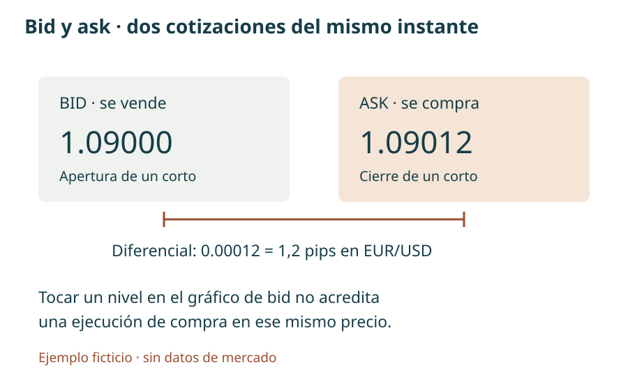
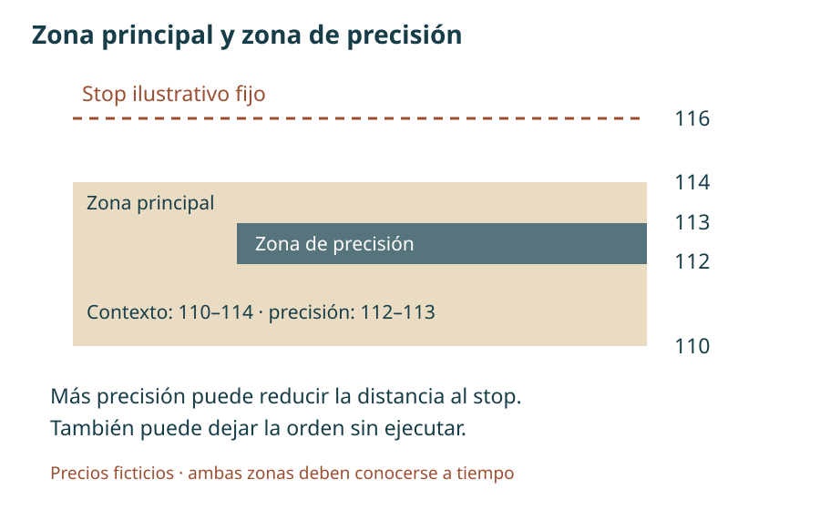
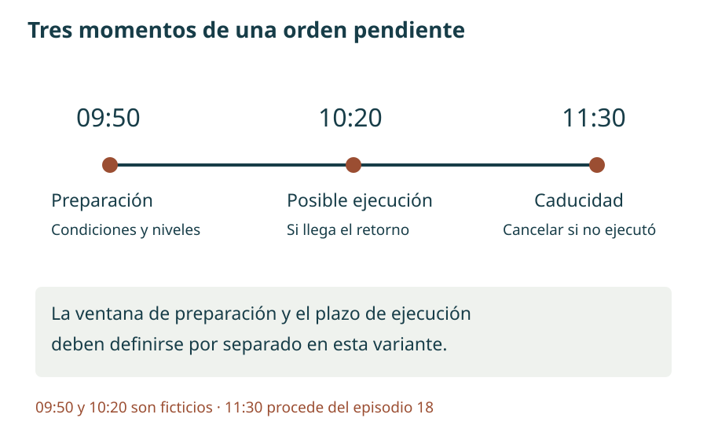
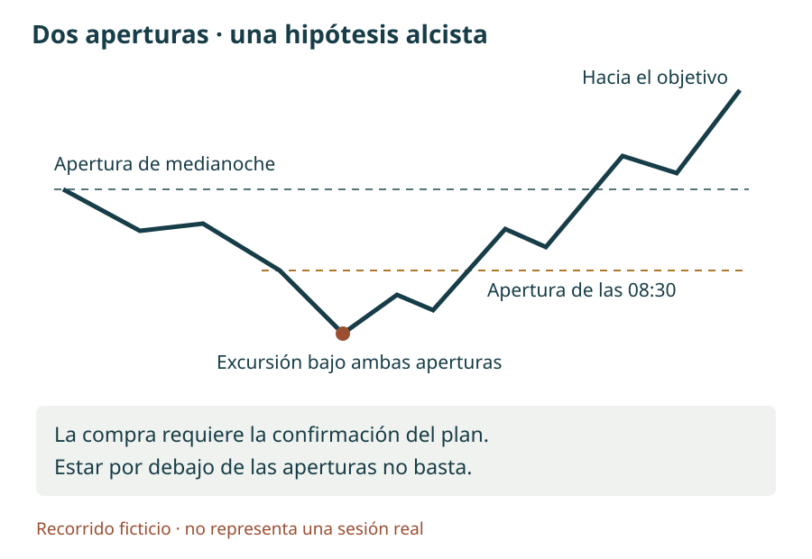
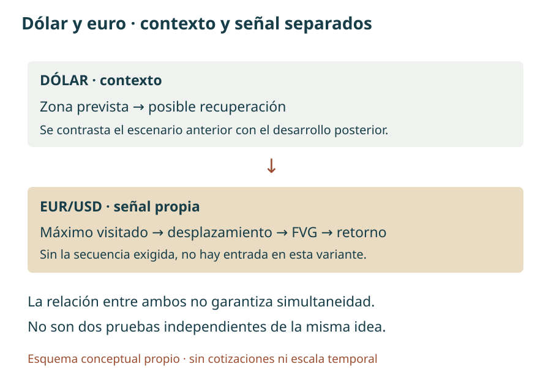

# Manual de estudio ICT · Bloque 4 · Episodios 16 a 20

## Del contexto diario a una orden con condiciones

**Bloque 4 de 8 · Edición de estudio · 1 de octubre de 2026**

En el bloque 3 aprendimos a ordenar los giros, interpretar el retorno a un desequilibrio y distinguir una intención de una ejecución. Este bloque desarrolla el paso siguiente: **cómo convertir una lectura del mercado en un plan que especifique dirección, zona, horario, confirmación, riesgo y salida**. Una figura aislada no resuelve esas decisiones.

Los episodios 16–20 conectan futuros sobre índices, EUR/USD y el índice del dólar. El cambio de instrumento no implica trasladar sin ajustes los horarios, las unidades ni las reglas de ejecución. El objetivo de estudio es reconocer qué parte del razonamiento permanece y qué parte pertenece a una sesión o a un ejemplo concreto.

Se han reducido las digresiones personales, la autopromoción y las polémicas. Se mantienen las reservas y las excepciones que afectan a la interpretación. El capítulo 19 es extenso porque reúne el contexto de varios mercados y aclara las aperturas de referencia; su duración no obliga a reproducir todas sus digresiones. El 20 es una **ampliación sobre Londres**, no una nueva condición obligatoria del modelo de Nueva York.

**Atribuciones.** «En la clase» remite a las transcripciones aportadas. «Ampliación» explica un concepto con apoyo externo cuando se indica. «Ejemplo propio», «criterio de estudio» y «propuesta de registro» son aportaciones del manual. Todas las figuras son esquemas propios, sin cotizaciones reales. Los enlaces temporales proceden de los subtítulos y del texto suministrado; orientan hacia el pasaje, pero no se han auditado fotograma a fotograma.

El lenguaje de «dinero inteligente», «manipulación» o «algoritmo» pertenece al marco interpretativo del instructor. Las velas permiten observar precios; por sí solas no prueban quién negoció, cuántos stops había ni la intención de sus participantes. Las configuraciones se presentan como hipótesis que pueden contrastarse, no como resultados estadísticos demostrados ni recomendaciones de operaciones actuales.

**Lectura y uso.** El índice y los controles A−/A+ facilitan la lectura. Los enunciados de los ejercicios permanecen visibles y solo se ocultan las respuestas. El texto y los esquemas funcionan sin conexión; los vídeos y tutoriales externos requieren Internet. El archivo Markdown conserva el contenido editable.

## Mapa del bloque y correspondencia de episodios

La numeración sigue los títulos de los cinco vídeos aportados, en el orden 16 → 17 → 18 → 19 → 20. Todos corresponden a la publicación en español de TRAVIS FOREX. No se renumeran por su posición en la lista de reproducción.

| Episodio | Núcleo de aprendizaje | Resultado de estudio |
|---|---|---|
| [16](https://www.youtube.com/watch?v=4oAM1U5abO4) | Objetivo diario, proyección del impulso y selección de oportunidades | Separar destino, entrada y gestión |
| [17](https://www.youtube.com/watch?v=BPlMxLUkIOA) | Adaptación a EUR/USD, horarios y cálculo en pips | Una ficha de operación con cifras coherentes |
| [18](https://www.youtube.com/watch?v=l-cjBh_xBfI) | Análisis entre temporalidades y vida de una orden pendiente | Distinguir preparación, ejecución y caducidad |
| [19](https://www.youtube.com/watch?v=xwHz-tXWM00) | Sesgo, aperturas y recorrido de la vela diaria | Formular una narrativa condicional y saber abstenerse |
| [20](https://www.youtube.com/watch?v=2ZxYDvzDVcI) | Relación dólar–euro y ejemplo de Londres | Comparar escenario previo y desarrollo posterior |

**Continuidad.** Los bloques 1 y 2 aportan las bases; el 3 profundiza en jerarquía y gestión. Aquí se recupera solo la definición necesaria para que cada regla sea comprensible. Los conceptos de ampliación no deben acumularse como filtros obligatorios: primero se elige una variante y después se comprueba si sus condiciones están presentes.

## Fundamentos para interpretar una estrategia

### 1. Contexto, sesgo, objetivo y señal cumplen funciones distintas

El **contexto** es el conjunto de referencias relevantes: rango diario, extremos anteriores, desequilibrios y fase de la sesión. El **sesgo direccional —bias—** es la hipótesis alcista, bajista o neutral que se deriva de ese contexto. El **objetivo de atracción del precio —draw on liquidity—** es el destino propuesto. La **señal de entrada —entry signal—** es el evento observable que permite plantear una orden dentro del plan.

Una lectura bajista puede señalar un mínimo anterior como destino y, al mismo tiempo, exigir una subida inicial antes de vender. No hay contradicción: dirección esperada y recorrido de entrada son cosas diferentes. Tampoco la presencia de un objetivo pendiente obliga a que la sesión lo alcance.

**Ejemplo propio.** El precio se encuentra en 108, dentro de un rango de 100 a 120. La hipótesis propone visitar 102 después de una recuperación hacia 111. Si el precio cae directamente a 102, la hipótesis de destino habrá coincidido con el recorrido, pero no se habrá producido la entrada prevista. Registrar «acierto de escenario sin operación» es más preciso que atribuirse un beneficio inexistente.

Una estrategia necesita además condiciones de descarte. «Espero una recuperación y un desplazamiento bajista antes de las 10:00; sin ambos, no preparo la orden» es comprobable. «Vendo cuando parezca que va a bajar» no permite evaluar de forma consistente las decisiones.

### 2. Liquidez: una ubicación inferida no es un inventario de órdenes

En este método, **liquidez compradora —buy-side liquidity, BSL—** designa posibles órdenes de compra sobre máximos: por ejemplo, stops de posiciones cortas y compras de ruptura. **Liquidez vendedora —sell-side liquidity, SSL—** se refiere a posibles ventas bajo mínimos, incluidos stops de posiciones largas. Los **máximos o mínimos relativamente iguales** son extremos próximos, no necesariamente idénticos al último decimal.

Un **barrido —sweep—** describe la incursión más allá de un extremo y la respuesta posterior. El primer cruce no basta para declarar un giro: el precio puede continuar. En los ejemplos se busca después un desplazamiento y una alteración de la estructura local. La combinación aporta una secuencia observable; no demuestra la existencia de una operación institucional concreta.

Un nivel visitado ya no debe describirse sin matices como «liquidez intacta». Puede seguir sirviendo como referencia, volver a recibir órdenes o participar en otro rango, pero no sabemos que conserve las mismas órdenes. Esta distinción será importante en el episodio 18.

### 3. Rango, equilibrio y referencias de prima/descuento

El **rango de referencia —dealing range—** une un mínimo y un máximo seleccionados por una razón explícita. Su punto medio es el **equilibrio —equilibrium—**. La mitad superior recibe el nombre de **prima —premium—** y la inferior, **descuento —discount—**. Son posiciones relativas dentro de ese intervalo, no una medida de valor fundamental.

Si el intervalo va de 100 a 120, el equilibrio es 110. Estar en 108 no significa «barato» en términos absolutos; significa estar por debajo de la mitad de ese rango. Otro intervalo, de 104 a 110, situaría el mismo 108 en prima. Por eso deben anotarse siempre los dos extremos y la temporalidad.

Las **referencias de prima/descuento —premium/discount arrays, PD arrays—** son la familia de zonas que el instructor utiliza para organizar el recorrido: desequilibrios, bloques y otros niveles de su vocabulario. La palabra *array* se entiende aquí como conjunto organizado de referencias. No es una fórmula que exija marcar todos los tipos posibles ni una señal adicional por sí misma.

**Uso estratégico.** Primero se elige el rango pertinente y se justifica; después se identifica una zona compatible con el sesgo. Mover los extremos hasta que la entrada quede en la mitad deseada modifica el análisis original. El diario debe conservar la primera versión y la razón del cambio.

### 4. Desplazamiento, cambio estructural y FVG

El **desplazamiento —displacement—** es un movimiento decidido que aleja el precio de una zona y puede romper un giro relevante. Las clases no proporcionan un umbral universal de tamaño o velocidad. Por tanto, el manual no inventa una cantidad fija de puntos que lo certifique. Para un estudio reproducible habrá que definir cómo se reconoce, conservando esa definición en toda la muestra.

El **cambio en la estructura del mercado —market structure shift, MSS—** se estudia aquí como la ruptura de un giro local contrario al movimiento previo, dentro de un contexto significativo. Un mínimo diminuto roto en una congestión no tiene automáticamente la misma función que el mínimo que sostenía la subida tras un barrido.

El **hueco de valor razonable —fair value gap, FVG—** tiene una geometría de tres velas. Es alcista cuando el mínimo de la tercera queda sobre el máximo de la primera; es bajista cuando el máximo de la tercera queda bajo el mínimo de la primera. Se consideran las mechas. La vela central puede haber negociado dentro del intervalo: no es un espacio necesariamente libre de operaciones.

Se estudian tres preguntas distintas: ¿existe la geometría?, ¿se formó con el desplazamiento que interesa?, ¿hay un retorno ejecutable dentro del plan? Responder sí a la primera no responde las otras dos. Además, la tercera vela debe estar disponible para confirmar la figura: no se puede usar retrospectivamente una formación completa como si ya fuera conocida antes.

### 5. Bloque de órdenes y cambio en la entrega del precio

Un **bloque de órdenes —order block, OB—** es una vela o una secuencia de velas que el instructor selecciona por su relación con un movimiento posterior. En estos episodios muestra bloques compuestos por varias velas consecutivas: alcistas antes de un desplazamiento bajista o bajistas antes de uno alcista. No debe reducirse siempre a «la última vela de color contrario» sin examinar el ejemplo.

La etiqueta no demuestra que todas las órdenes institucionales estén dentro de ese rectángulo. Su utilidad práctica consiste en proporcionar una referencia de retorno o invalidación. En el episodio 18 se exige que el bloque estudiado esté asociado al FVG del montaje; esa condición se mantiene para esa variante y no se proclama como definición universal de todos los bloques.

El **cambio en el estado de entrega del precio —change in state of delivery—** alude en ese episodio al paso a través de la apertura de una vela seleccionada, antes de la ruptura de un giro local. Esa apertura y el giro son dos niveles diferentes. Es posible observar primero un cambio en la forma de avanzar y después la confirmación estructural. No conviene usar ambos nombres como sinónimos ni convertir cualquier cruce de apertura en una señal.

### 6. Las aperturas de medianoche y de las 08:30

Una **apertura —open—** es un precio asociado a un inicio concreto. En este bloque se utilizan especialmente el comienzo de las 00:00 y el de las 08:30, ambos en hora de Nueva York. El instructor aclara en el episodio 19 que **no está tomando necesariamente la apertura de la vela diaria del proveedor**. La sesión usada para construir esa vela puede comenzar a otra hora.

El precio de las 08:30 solo puede anotarse cuando llega esa hora. Si se trabaja con una temporalidad cuyas velas no empiezan exactamente entonces, se obtiene la referencia en un gráfico que permita identificar ese inicio y se conserva al cambiar de marco. No se sustituye por la apertura de una vela vecina para mantener la apariencia de coincidencia.

**Criterio de registro.** Escribir instrumento, proveedor, fecha, zona horaria y origen de cada apertura. Mantener Nueva York como referencia evita trasladar de forma mecánica una diferencia fija a España: los cambios estacionales de hora pueden no coincidir. Los horarios de este manual son los de los ejemplos del curso, no un calendario actualizado de eventos.

### 7. Pips, puntos, diferencial y riesgo

En EUR/USD, un **pip** representa 0.0001; una quinta cifra decimal expresa una décima de pip, también llamada *pipette*. Un paso de 1.09653 a 1.09728 es 0.00075, es decir, 7,5 pips. Un punto de un índice y un pip de una divisa no son unidades intercambiables. Véase la [explicación de pip de OANDA](https://www.oanda.com/ca-en/skills-and-insights/education/introduction-trading/basics/what-is-a-pip/).

El **bid** es el precio al que se puede vender; el **ask**, aquel al que se puede comprar. El **diferencial —spread—** es su diferencia. Abrir un corto supone vender y cerrarlo supone comprar: una línea trazada sobre un gráfico de bid no equivale necesariamente al precio de recompra. La definición puede consultarse en la [documentación de OANDA](https://help.oanda.com/us/en/faqs/bid-ask-price.htm).

**Ejemplo propio.** Si el bid es 1.09000 y el ask 1.09012, el diferencial es 1,2 pips. La cotización de venta ha llegado a 1.09000, pero la de compra sigue por encima. Este ejemplo explica por qué tocar una línea en pantalla no prueba que una orden de salida se haya ejecutado. La activación concreta depende del tipo de orden y del intermediario.

La **relación beneficio/riesgo prevista** divide la distancia hasta el objetivo entre la distancia hasta el stop. No incorpora la probabilidad de llegar al objetivo ni representa el resultado obtenido. El riesgo monetario depende también de la cantidad negociada y de los costes. Si se calcula con precios ejecutados, no se descuenta otra vez un diferencial que ya esté incorporado en ellos.

**Una unidad de riesgo —1 R—** es el riesgo inicial de la operación usado como denominador. Si el riesgo de referencia es 20 unidades monetarias y el resultado es +30, se expresa como +1,5 R. Hay que indicar si ese riesgo incluye costes estimados y si el resultado es bruto o neto. Las salidas parciales se suman y se comparan con el riesgo inicial de toda la posición, sin redefinir R después de cada cierre.

<figure><figcaption>Esquema propio, con cifras ficticias. Dos cotizaciones de un mismo instante; no es una captura ni un recorrido de mercado.</figcaption></figure>

## Capítulo 16 · Elegir el destino antes de multiplicar las entradas

**Fuente:** [episodio 16](https://www.youtube.com/watch?v=4oAM1U5abO4). El ejemplo utiliza futuros sobre el S&P 500 y organiza oportunidades dentro de una narrativa diaria. Las referencias numéricas conservadas pertenecen a la clase histórica.

### 16.1. Un bloque alcista puede ser el destino de una operación bajista

En el [análisis inicial, hacia 01:18](https://www.youtube.com/watch?v=4oAM1U5abO4&t=78s), el instructor relaciona máximos relativamente iguales, un giro diario y una zona inferior. Un bloque alcista situado por debajo del precio puede servir de destino a un recorrido bajista. La palabra «alcista» describe la función atribuida al bloque, no la dirección de todas las operaciones que se aproximen a él.

Esta distinción evita una confusión frecuente: comprar porque se ha dibujado una zona alcista, aunque el precio aún esté lejos y el recorrido estudiado sea hacia ella. La estrategia de aproximación y una posible estrategia de reacción serían dos planes separados. El segundo necesita su propia confirmación y no se deduce del éxito del primero.

En la clase aparece el nivel diario 4504 y, antes de alcanzarlo, referencias de liquidez vendedora. La lectura no parte del pequeño FVG de entrada: parte de la pregunta «¿qué destino queda pendiente y por qué interesa?». Ese orden permite descartar configuraciones visualmente atractivas que dejan poco recorrido antes de la zona de salida.

### 16.2. Proyectar un impulso: qué se mide y qué no

Desde [08:00](https://www.youtube.com/watch?v=4oAM1U5abO4&t=480s) se utiliza un mínimo roto como **punto pivote de proyección —fulcrum point—**. El tramo se mide con los cuerpos de las velas relevantes: el extremo superior de apertura/cierre en el giro alto y el inferior de apertura/cierre en el giro bajo. Esta elección pertenece a la medición; no cambia la geometría del FVG, que sigue usando máximos y mínimos.

El propósito es extender una amplitud hacia posibles destinos y compararlos con referencias ya identificadas. Conviene conservar en el registro los dos precios de anclaje, la amplitud, el nivel proyectado y el modo de configurar la herramienta. Las etiquetas de una plantilla de Fibonacci pueden variar según orientación y ajustes; no deben copiarse sin comprender qué distancia representan.

**Ejemplo propio de aritmética, no reconstrucción de la clase.** Si el cuerpo alto seleccionado llega a 120 y el cuerpo bajo a 112, la amplitud es 8. Una extensión de una amplitud adicional por debajo de 112 da 104; dos amplitudes adicionales dan 96. Que una herramienta llame a esos niveles −1 y −2, u otras etiquetas según su configuración, no modifica la distancia. El manual no atribuye esos números ficticios al vídeo.

El instructor emplea terminología de «desviaciones» en sus proyecciones. Aquí no se está calculando la desviación típica de una distribución de rendimientos: no se han definido muestra, media ni dispersión. Una extensión geométrica no proporciona por sí sola un intervalo de confianza ni una probabilidad de alcance.

### 16.3. Confluencia y ambigüedad de las cifras

**Confluencia —confluence—** significa que varias referencias se sitúan cerca: proyección, zona diaria y mínimo anterior, por ejemplo. Ayuda a justificar un destino, pero no convierte tres descripciones del mismo movimiento en tres pruebas independientes.

En el [pasaje de proyecciones, desde 10:18](https://www.youtube.com/watch?v=4oAM1U5abO4&t=618s) aparecen 4514.50 y 4501.25. La transcripción también recoge 4504.25 junto a una expresión que lo sitúa por debajo de 4504. Esa relación es aritméticamente incompatible: 4504.25 está 0.25 por encima. **Se conserva la incidencia sin reemplazar de forma silenciosa una cifra por otra.** El 4501.25 reaparece como referencia final, pero esto no permite reconstruir todos los anclajes del gráfico.

La lección utilizable es el procedimiento de comparación. Para reproducir exactamente la proyección histórica habría que revisar los precios dibujados en el vídeo. El texto no aporta base suficiente para presentar una tabla completa de niveles como si estuviera verificada.

### 16.4. Varias oportunidades no equivalen a una obligación de operar

Desde [17:16](https://www.youtube.com/watch?v=4oAM1U5abO4&t=1036s) se comenta un límite ilustrativo de cuatro operaciones, dos por la mañana y dos por la tarde. Es un techo expuesto en la clase, no una cuota que haya que completar ni una regla universal para el lector.

Si la primera configuración no ofrece retorno o aparece durante una apertura que el plan excluye, puede observarse otra más tarde mientras el objetivo siga pendiente. La segunda entrada no es automáticamente peor por ser posterior; debe seguir teniendo contexto, invalidación y recorrido. A la inversa, repetir una figura cuando el destino ya se ha alcanzado puede cambiar por completo la calidad de la idea.

La sesión de mañana se sitúa entre 08:30 y 12:00, con almuerzo entre 12:00 y 13:00. Estos límites describen la organización del día en el relato. No significan que cada minuto de esa franja sea una ventana autorizada de entrada. En los episodios posteriores se precisan ventanas más estrechas para otras variantes.

### 16.5. Salidas parciales, almuerzo y revisión de la hipótesis

En torno a [22:38](https://www.youtube.com/watch?v=4oAM1U5abO4&t=1358s) se ilustra una venta desde FVG cuyo primer destino es un mínimo previo. Con dos contratos, se plantea cerrar uno y conservar el otro para un objetivo más lejano. **Salida parcial —partial exit—** significa reducir la exposición, no añadir otra operación sin relación con la primera.

La prohibición comentada de abrir durante el almuerzo no impide que una posición previa alcance allí su salida. Deben separarse horario de entrada y horario de gestión. Tampoco llevar el stop al precio de entrada —*break-even*, equilibrio bruto— garantiza resultado neto cero: intervienen comisiones y posibles diferencias de ejecución.

Cuando el objetivo diario ya se ha alcanzado, el instructor estudia un posible recorrido contrario. Esto no autoriza a invertir automáticamente una posición. Cerrar un corto es comprar para extinguirlo; iniciar un largo es asumir nueva exposición alcista. La diferencia importa aunque ambas acciones utilicen una orden de compra.

### 16.6. Múltiples FVG y riesgo de convertir una entrada en persecución

En la [parte final, hacia 37:07](https://www.youtube.com/watch?v=4oAM1U5abO4&t=2227s), se consideran zonas bajistas sucesivas. Entrar en la primera puede dejar espacio para que el precio visite una superior antes de continuar. Si esa posibilidad pertenece al plan, debe reflejarse en el stop y la cantidad **antes** de abrir la posición.

Desplazar el stop cuando el precio se acerca a él es otra decisión y altera el riesgo inicial. Tampoco la existencia de varios huecos obliga a abrir en todos: sería necesario justificar el riesgo agregado, como se estudió en el bloque 3. La mención a cantidades decrecientes —5, 3 y 2— ilustra una piramidación; no proporciona por sí sola un límite monetario del conjunto.

Se menciona asimismo un **bloque de mitigación —mitigation block—**. En este pasaje actúa como referencia contextual de retorno, pero no se desarrolla una taxonomía suficiente para convertirlo en un montaje independiente. No se añade al modelo básico una regla geométrica que esta transcripción no explica.

### 16.7. Ideas clave y ejercicio

El objetivo precede a la elección de entrada. Una proyección necesita anclajes y no constituye una predicción estadística. Los límites de frecuencia son máximos, no obligaciones. Alcanzar el destino original exige revisar cualquier nueva operación.

**Ejercicio 16 —datos propios.** Se ha previsto vender una recuperación hacia 118, con stop en 122 y objetivo 106. Antes de que aparezca la recuperación, el precio ya ha visitado 106 y vuelve a 118. ¿Sigue siendo suficiente la primera narrativa? Si se realiza una nueva venta con dos unidades y se cierra una en 112 y otra en 106, ¿cuál sería el resultado bruto en unidades de riesgo de esa operación, suponiendo ambas salidas ejecutadas?

Mostrar respuesta razonada

La narrativa debe revisarse: su destino ya fue visitado. La nueva entrada necesita una hipótesis vigente; el parecido geométrico no conserva automáticamente la oportunidad anterior. En el cálculo hipotético, cada unidad arriesga 4 puntos. Las salidas producen 6 + 12 = 18 puntos-unidad frente a 8 inicialmente arriesgados: 2,25 R brutos para el conjunto. No son 4,5 R, porque el denominador incluye el riesgo de ambas unidades. El ejercicio no implica que deba realizarse esa segunda venta.

## Capítulo 17 · Traducir el modelo a EUR/USD sin perder precisión

**Fuente:** [episodio 17](https://www.youtube.com/watch?v=BPlMxLUkIOA). El análisis es histórico. Hacia el final el instructor aclara que no realizó esa operación de divisas; por tanto, los cálculos siguientes describen posibilidades del ejemplo, no beneficios reales acreditados.

### 17.1. Del barrido superior a un destino inferior

Desde [00:54](https://www.youtube.com/watch?v=BPlMxLUkIOA&t=54s), el análisis conecta una incursión sobre máximos diarios con mínimos situados debajo. El proceso es el mismo que en índices: seleccionar el destino, esperar una ubicación de entrada y exigir la secuencia prevista. Lo que cambia son las unidades, la cotización y la sesión.

El instructor presta atención al entorno de 1.0900 y a terminaciones 00, 20, 50 y 80. La expresión **cifra redonda —big figure—** designa una referencia de precio fácil de identificar; no demuestra que todas las instituciones sitúen allí sus órdenes. Un nivel redondo puede ser útil para organizar un objetivo, pero necesita el contexto que lo hace pertinente.

Las cifras de algunas proyecciones aparecen fragmentadas en la transcripción. Por ello no se ofrece una reconstrucción decimal exhaustiva. La referencia alrededor de 1.0900 puede estudiarse, mientras que la precisión de los anclajes debe consultarse en la imagen original si se quiere replicar la herramienta.

### 17.2. Movimiento inicial contrario y ventana de Nueva York

Desde [07:34](https://www.youtube.com/watch?v=BPlMxLUkIOA&t=454s), se espera una subida inicial dentro de una idea bajista. El **movimiento de Judas —Judas swing—** es, en esta lectura, una excursión contraria al recorrido principal esperado, que puede llevar el precio hacia una zona favorable antes de la expansión. No todo movimiento contra el sesgo merece esa etiqueta: debe relacionarse con una apertura, un horario y la respuesta posterior.

En [09:59](https://www.youtube.com/watch?v=BPlMxLUkIOA&t=599s) se diferencia la **ventana operativa —kill zone—** de Nueva York para divisas, 07:00–10:00, de la franja 08:30–11:00 comentada para índices. Se mantienen separadas de la sesión de mañana 08:30–12:00 del capítulo anterior.

La ventana ayuda a definir cuándo buscar la configuración. No sustituye el contexto ni convierte cada FVG de esas horas en una operación. Además, la excepción vinculada a una noticia de las 10:00 se comenta más tarde: puede prolongar el estudio hacia las 11:00 o 11:30. Es una variante discrecional del relato que debe registrarse como tal, no una ampliación automática todos los días.

### 17.3. Aperturas y noticias: referencias distintas

Alrededor de [18:20](https://www.youtube.com/watch?v=BPlMxLUkIOA&t=1100s), se explica el uso de medianoche y 08:30. En el caso bajista, la referencia de las 08:30 puede permitir estudiar una recuperación por encima de ella aunque no vuelva a alcanzarse la apertura de medianoche. No se trata de borrar la referencia anterior, sino de situar el plan de la sesión dentro de un día ya iniciado.

El anuncio económico mencionado a las 10:00 sirve de referencia temporal. Que el instructor se concentre en la hora no significa que el contenido de una noticia sea irrelevante para los precios. Para el manual basta conservar su función en el ejemplo: un evento puede cambiar las condiciones de movimiento y ejecución, y cualquier excepción de horario debe quedar escrita antes de conocer el resultado.

En la transcripción aparecen siglas de un indicador de actividad de servicios. No se reconstruye aquí un dato publicado ni se traslada aquel horario histórico a un calendario actual. Tampoco las referencias a inventarios y divisas relacionadas con materias primas constituyen instrucciones permanentes para otras sesiones.

### 17.4. Anticipar la salida no es cambiar el objetivo retrospectivamente

Desde [20:50](https://www.youtube.com/watch?v=BPlMxLUkIOA&t=1250s), se propone no exigir el último pip del recorrido: para un corto hacia 1.0900, una salida en 1.0905 deja cinco pips de margen antes de ese nivel. El instructor menciona márgenes alternativos, incluidos mayores para principiantes. Son elecciones de gestión que reducen el recorrido potencial; no una fórmula universal para compensar cualquier diferencial.

**Anticipar una salida** significa decidir antes dónde se aceptará cerrar. **Modificarla después** porque el precio se quedó cerca es otra conducta. Para evaluar la estrategia deben distinguirse. El registro debe especificar el objetivo analítico, la orden de salida y los precios realmente ejecutados, si los hubo.

Un margen fijo puede resultar excesivo o insuficiente según las condiciones. La explicación de bid y ask de los fundamentos permite entender el problema, pero el detalle de ejecución debe contrastarse con el intermediario y el instrumento usados en el estudio.

### 17.5. Auditoría aritmética del ejemplo

En [22:31](https://www.youtube.com/watch?v=BPlMxLUkIOA&t=1351s) se citan entrada 1.09653 y stop 1.09728. La diferencia es **7,5 pips**. Hablar de diez pips como redondeo para estimar el riesgo no convierte ambas distancias en la misma. Si diez pips fueran la distancia efectiva desde esa entrada, el stop estaría en 1.09753.

| Supuesto para el corto | Recorrido favorable | Riesgo utilizado | Beneficio/riesgo bruto |
|---|---:|---:|---:|
| Entrada 1.09653; objetivo 1.09000; stop 1.09728 | 65,3 pips | 7,5 pips | 8,71 |
| Misma entrada y stop; salida anticipada 1.09050 | 60,3 pips | 7,5 pips | 8,04 |
| Salida 1.09050; estimación de riesgo redondeada a 10 pips | 60,3 pips | 10 pips | 6,03 |

Los tres resultados responden a supuestos diferentes. Mezclar el recorrido de una fila con el riesgo de otra produce una relación engañosa. Tampoco una relación prevista de 8,04 acredita que la operación se ejecutara, alcanzara el objetivo o tuviera esperanza positiva tras costes.

**Ampliación con ejemplo propio.** Para 10.000 unidades de EUR/USD, un pip equivale a 1 USD porque 10.000 × 0.0001 = 1. Con 7,5 pips de distancia, el riesgo de precio sería 7,50 USD antes de otros costes. La conversión a una cuenta en otra moneda, las comisiones y posibles diferencias de ejecución requieren datos adicionales. El ejemplo enseña unidades; no propone una cantidad para operar.

### 17.6. Qué queda demostrado por la clase

En [25:09](https://www.youtube.com/watch?v=BPlMxLUkIOA&t=1509s), el instructor declara que no operó ese ejemplo de Forex. La fuente permite estudiar su lectura retrospectiva y comprobar la aritmética de sus cifras. No permite afirmar un beneficio cobrado, una entrada real ni un historial rentable a partir de este caso.

**Ideas clave.** Separar instrumento y horario; diferenciar destino analítico de salida operativa; calcular con todos los decimales antes de redondear; identificar si existe ejecución o solo explicación.

**Ejercicio 17 —datos de la transcripción.** Con entrada 1.09653, stop 1.09728 y salida prevista 1.09050, calcula riesgo, recorrido y relación bruta. Explica por qué llamarla «operación ganadora de ocho a uno» añade algo que la fuente no acredita.

Mostrar respuesta razonada

Riesgo: (1.09728 − 1.09653) / 0.0001 = 7,5 pips. Recorrido: (1.09653 − 1.09050) / 0.0001 = 60,3 pips. Relación: 60,3 / 7,5 = 8,04. Es una relación prevista bajo esos supuestos, antes de costes. El instructor afirma que no realizó la operación: la palabra «ganadora» convertiría una posibilidad retrospectiva en una ejecución no documentada.

## Capítulo 18 · Organizar temporalidades y la vida de una orden

**Fuente:** [episodio 18](https://www.youtube.com/watch?v=l-cjBh_xBfI). El capítulo ordena el trabajo desde la estructura superior hasta la entrada y precisa cuándo preparar, mantener o cancelar una orden.

### 18.1. Cada temporalidad debe contestar una pregunta

En [01:18](https://www.youtube.com/watch?v=l-cjBh_xBfI&t=78s), se muestra una disposición con diario, una hora y quince minutos. Su utilidad no depende de tener tres pantallas ni de contratar una interfaz concreta. Lo importante es separar funciones:

| Escala | Pregunta principal | Error que conviene evitar |
|---|---|---|
| Diario | ¿Dentro de qué rango y hacia qué referencia se estudia el movimiento? | Exigir que el destino más remoto se alcance hoy |
| Una hora | ¿Cómo se desarrolla el recorrido dentro del contexto? | Convertir cada giro local en cambio del sesgo diario |
| Quince minutos | ¿Qué zona y qué estructura organizan la sesión? | Dibujar una zona sin comprobar cuándo estuvo confirmada |
| Cinco a un minuto, según el ejemplo | ¿Dónde aparece la secuencia de entrada y su invalidación? | Buscar una figura pequeña para justificar cualquier decisión |

El **análisis entre temporalidades —multi-timeframe analysis—** no consiste en exigir que todas las velas tengan el mismo color. Un retroceso de un minuto puede ser precisamente la entrada de una hipótesis alcista de quince minutos. La coherencia se establece por función y ubicación, no por unanimidad visual.

### 18.2. El destino diario puede ser distinto de la salida intradía

Desde [16:07](https://www.youtube.com/watch?v=l-cjBh_xBfI&t=967s), el instructor relaciona una secuencia diaria y un retorno a un desequilibrio. No exige siempre su llenado completo para construir el contexto. Después distingue el destino más amplio del mínimo previo utilizable durante la sesión.

Una estrategia puede aceptar una salida cercana aunque el sesgo mayor siga apuntando más lejos. Mantener la posición hasta la referencia diaria remota sería otra variante, con exposición temporal y retrocesos diferentes. El diario debe indicar cuál se estudia, porque no sería válido contar unas veces la salida corta y otras la larga según cuál hubiera resultado mejor.

También se observan máximos y mínimos del día anterior y de varios días recientes. Esa lista ayuda a localizar referencias; no significa que todos deban ser barridos ni que el tercer día tenga una propiedad obligatoria en cualquier mercado.

### 18.3. Zona de quince minutos y precisión de entrada

En [33:41](https://www.youtube.com/watch?v=l-cjBh_xBfI&t=2021s) se estudia una zona de quince minutos y se desciende por marcos menores para localizar un área de entrada. Llamaremos **zona principal** al intervalo que da contexto y **zona de precisión** al intervalo menor utilizado para concretar la orden. Son nombres didácticos del manual.

Si el plan exige la confirmación del FVG principal, no puede atribuirse una entrada a su autoridad antes de que cierre su tercera vela. Las velas pequeñas existen antes del cierre de la grande, pero esa existencia no adelanta la información futura. Para una prueba histórica hay que reconstruir qué se sabía en el instante de la orden.

**Ejemplo propio.** Se confirma una zona bajista entre 110 y 114; dentro de ella se identifica otra entre 112 y 113. Con stop fijo en 116, vender en 110 arriesga seis puntos y vender en 112 arriesga cuatro. La segunda alternativa puede mejorar la distancia de riesgo, pero quizá nunca se ejecute. Menor distancia no significa mayor probabilidad de ejecución ni mejor resultado total.

Tampoco procede reducir el stop solo para producir una relación beneficio/riesgo vistosa. La referencia que invalida la lectura debe elegirse por el montaje; la cantidad se adapta a esa distancia, no al revés.

<figure><figcaption>Esquema propio, sin datos reales. La zona menor afina la ubicación, pero no elimina el contexto ni adelanta la confirmación de la mayor.</figcaption></figure>

### 18.4. Bloques de varias velas y confirmaciones diferenciadas

Desde [37:55](https://www.youtube.com/watch?v=l-cjBh_xBfI&t=2275s), se consideran tres velas alcistas consecutivas como bloque bajista del montaje. El instructor asocia ese bloque al hueco. Seleccionar solo una de las tres sin justificarlo puede alterar tanto la entrada como el stop.

En [46:13](https://www.youtube.com/watch?v=l-cjBh_xBfI&t=2773s) se distingue un cambio en la entrega del precio al cruzar la apertura de la vela seleccionada y, después, la ruptura del mínimo local. La secuencia enseña a no confundir un aviso temprano con una confirmación estructural posterior.

La transcripción también advierte al principio que una forma puede parecer un **bloque de ruptura —breaker—** sin ser el ejemplo que está enseñando. No hace falta añadir esa clasificación para entender la entrada de este capítulo. Etiquetar todo rectángulo con un nombre distinto puede ocultar las preguntas útiles: qué movimiento lo origina, cuándo se confirma y qué lo invalida.

### 18.5. Preparar, ejecutar y cancelar son tres momentos

Alrededor de [31:30](https://www.youtube.com/watch?v=l-cjBh_xBfI&t=1890s), la preparación se vincula a la ventana de divisas 07:00–10:00. En [47:50](https://www.youtube.com/watch?v=l-cjBh_xBfI&t=2870s) se indica cancelar si la orden sigue sin ejecutarse a las 11:30. Más adelante se aclara que su ejecución puede ocurrir después de la ventana de preparación.

Esto no es una contradicción si se distinguen tres relojes. La **preparación** comprueba condiciones y fija los niveles; la **ejecución —fill—** es el cruce efectivo de la orden; la **caducidad** marca hasta cuándo se permite seguir esperando. Una orden cancelada no se reactiva porque el precio finalmente hubiera recorrido el camino deseado.

**Ejemplo propio.** El plan queda preparado a las 09:50, permite ejecución posterior y fija caducidad a las 11:30. Un retorno a las 10:20 puede ser compatible con esa variante. Un retorno a las 11:40 ya no lo es. La comparación evalúa el mismo plan, aunque ambos recorridos posteriores se vean iguales en el gráfico final.

<figure><figcaption>Esquema propio. Los instantes de 09:50 y 10:20 son ficticios; 11:30 reproduce el límite comentado para esta variante en el episodio 18.</figcaption></figure>

### 18.6. No confundir una referencia conocida con liquidez aún intacta

En [45:04](https://www.youtube.com/watch?v=l-cjBh_xBfI&t=2704s), el instructor comenta un mínimo anterior ya visitado durante Londres y la espera posterior de una zona diaria. El mínimo sigue siendo una coordenada conocida, pero no es correcto describir las mismas órdenes como pendientes de barrido sin más información.

Este detalle cambia la redacción de la narrativa. «El precio revisita el mínimo previo» describe algo observable. «Barre por primera vez sus stops originales» afirma una secuencia que contradice la visita anterior. Para no mezclar ambas cosas, el diario debe marcar los niveles como pendientes, visitados o de estado incierto.

El sesgo tampoco necesita mantenerse a cualquier precio. Si desaparece el recorrido razonable, cambia la estructura exigida o expira el horario, la salida del proceso puede ser «sin operación». El episodio anima a registrar observaciones; el manual añade que un resultado desfavorable no prueba, por sí solo, un error de disciplina.

### 18.7. Ideas clave y ejercicio

La escala superior aporta contexto y la inferior concreta la ejecución. La confirmación debe respetar el tiempo real. La orden tiene una vida definida y no puede sobrevivir indefinidamente a la sesión que la justificó.

**Ejercicio 18 —datos propios.** El plan exige un FVG de quince minutos confirmado a las 09:45. En un gráfico de un minuto aparece una entrada a las 09:41. Otra entrada, preparada a las 09:55, se ejecutaría a las 10:25; el plan permite ejecución posterior a las 10:00 y cancela pendientes a las 11:30. ¿Cuál puede pertenecer a esa variante? ¿Qué sucede si el primer retorno llega a las 11:35?

Mostrar respuesta razonada

La entrada de las 09:41 no puede justificarse con un FVG de quince minutos que solo se confirma a las 09:45. Podría estudiarse como otro modelo, pero no como este. La preparada a las 09:55 y ejecutada a las 10:25 sí respeta los horarios descritos, siempre que se cumplan las demás condiciones. A las 11:35 la orden ya tendría que haberse cancelado; el retorno tardío no cuenta como ejecución válida del plan.

## Capítulo 19 · Construir una narrativa y aceptar la neutralidad

**Fuente:** [episodio 19](https://www.youtube.com/watch?v=xwHz-tXWM00). La exposición combina divisas y futuros sobre índices. Este capítulo concentra sus definiciones y decisiones útiles, conservando las diferencias entre escenarios anunciados, revisiones posteriores y afirmaciones del instructor.

### 19.1. La dirección depende del horizonte

Desde [07:27](https://www.youtube.com/watch?v=xwHz-tXWM00&t=447s), el índice del dólar se estudia con referencias superiores, mientras que su recorrido inmediato puede incluir una caída. Un sesgo alcista amplio no impide un tramo bajista local. La dificultad aparece cuando se presenta el tramo local como si cancelara necesariamente el contexto mayor, o se utiliza el contexto mayor para ignorar toda invalidación local.

El registro debe decir «alcista hacia una referencia diaria, esperando primero un retroceso» o «neutral para la siguiente entrada, aunque el destino amplio siga pendiente». Esa redacción delimita una hipótesis comprobable. «Alcista» sin horizonte puede justificar después cualquier oscilación y deja de ser útil.

Hacia [20:10](https://www.youtube.com/watch?v=xwHz-tXWM00&t=1210s) se plantea una zona del dólar entre 99.95 y 99.92, por debajo de 100, antes de una posible recuperación. El episodio 20 vuelve sobre ese escenario. Tenemos una formulación en un episodio anterior y una revisión posterior; esto no sustituye una auditoría independiente de fecha de publicación, edición y cotizaciones.

### 19.2. Relación entre mercados: apoyo, no duplicación de pruebas

El **análisis entre mercados —intermarket analysis—** compara instrumentos relacionados para interpretar el contexto. Aquí interesan el dólar y EUR/USD. La orientación de la cotización importa: una subida de EUR/USD representa un euro más caro en dólares; no debe trasladarse sin cambio a un par que tenga el dólar como moneda base.

**Ampliación documental.** ICE describe el USDX como un índice geométrico de seis divisas, con un peso del euro del 57,6 %. Por tanto, una parte importante de la relación con EUR/USD está incorporada en su construcción. Observar ambos no equivale a obtener dos confirmaciones independientes. Fuente: [composición del índice en ICE](https://www.ice.com/forex/usdx).

El dólar puede aportar contexto, pero no reemplaza la señal exigida en EUR/USD. Si el primero llega a una zona y el segundo no ofrece el desplazamiento y retorno previstos, el plan no tiene entrada. Tampoco el parecido entre ambos gráficos garantiza simultaneidad al minuto ni permite inferir rentabilidad de la combinación.

### 19.3. Neutralidad y selección del instrumento

En torno a [50:38](https://www.youtube.com/watch?v=xwHz-tXWM00&t=3038s), el instructor describe un estado neutral a corto plazo en el euro. En el tramo dedicado a libra/dólar —*cable*— tampoco encuentra una configuración suficientemente clara. La enseñanza es concreta: **un gráfico observado no tiene que producir una operación**.

Cambiar de instrumento después de que el primero no ofrezca señal puede formar parte de un plan con una lista definida. Recorrer indiscriminadamente mercados hasta encontrar cualquier figura es otra conducta: aumenta la posibilidad de seleccionar solo la apariencia que confirma el deseo de operar.

**Criterio de estudio.** Definir por anticipado instrumentos, sesiones y condiciones de abstención. Si se compara más de un mercado, registrar también los días sin configuración. No se concluye que los futuros sean siempre superiores a las divisas porque en esta revisión histórica sus recorridos resulten más claros.

### 19.4. Barrido y reversión: del descuento a una referencia superior

Desde [1:16:24](https://www.youtube.com/watch?v=xwHz-tXWM00&t=4584s), el análisis de índices organiza un rango diario, su equilibrio y un mínimo barrido. La expresión **barrido y reversión —purge and revert—** describe la hipótesis de que, tras rebasar un extremo, el precio regrese hacia una referencia contraria. En el ejemplo, los máximos de días recientes y de quince minutos ayudan a definir el destino.

Esto no equivale a comprar todos los mínimos perforados. Se necesita explicar por qué el rango elegido importa, qué zona recibe el retroceso y qué señal posterior apoya el cambio. El instructor muestra además varios destinos posibles dentro de una vela: borde, apertura, cuerpo y punto medio. La existencia de varios no exige mantener la posición hasta el más lejano.

El **punto medio del bloque —mean threshold—** es una referencia intermedia del bloque seleccionado. Para reproducirlo hay que declarar qué límites se están usando; la transcripción lo describe como mitad del bloque sin aportar aquí todos los precios. No debe confundirse con el equilibrio del rango diario ni calcularse a partir de extremos diferentes solo porque ambos se llaman «mitad».

### 19.5. Aperturas y Power of Three: una secuencia, no una plantilla inevitable

En [1:33:21](https://www.youtube.com/watch?v=xwHz-tXWM00&t=5601s) se recupera la apertura de medianoche; desde [1:36:18](https://www.youtube.com/watch?v=xwHz-tXWM00&t=5778s) se precisa el papel de las 08:30. Para una hipótesis alcista, una caída bajo ambas referencias puede situar la búsqueda de compra en una ubicación favorable según el modelo. Estar debajo no es todavía una señal de compra.

Si medianoche queda muy por debajo y el precio no vuelve a ella, la apertura de las 08:30 puede servir para estudiar la excursión local de Nueva York. Esto evita imponer como requisito absoluto la revisita de una referencia que la propia clase permite sustituir funcionalmente. Se conserva, no obstante, el contexto original y se anota qué apertura gobierna cada variante.

El **patrón de tres fases —Power of Three—** se expresa como acumulación, manipulación y distribución. En la narrativa alcista del ejemplo, una fase inicial de negociación precede a una excursión bajista, seguida por expansión hacia arriba. «Manipulación» es el nombre que el modelo da a la fase; el gráfico no demuestra una intención concertada. «Distribución», en este vocabulario, se relaciona con el desarrollo del recorrido y la entrega hacia el destino; no debe confundirse automáticamente con todos los usos del término en otros métodos.

El movimiento bajo medianoche puede pertenecer a la construcción del día y el movimiento bajo 08:30 a la sesión de Nueva York. Esa anidación explica por qué pueden existir dos excursiones contrarias. No obliga a participar en la primera ni asegura que ambas terminen revirtiendo.

<figure><figcaption>Esquema propio de una de las variantes. La trayectoria es ficticia y no representa un patrón obligatorio de cada sesión.</figcaption></figure>

### 19.6. De la narrativa a la entrada de un minuto

En [1:42:26](https://www.youtube.com/watch?v=xwHz-tXWM00&t=6146s), el instructor baja a un minuto y busca cambio estructural alcista, FVG y bloque de varias velas. La precisión de entrada se subordina al objetivo ya señalado en quince minutos. Esa relación evita que la entrada se convierta en una búsqueda aislada de mínimos perfectos.

El mínimo absoluto del día no es un requisito del modelo. Una entrada posterior con confirmación puede dejar parte del recorrido sin capturar. Su evaluación debe usar lo disponible en ese instante, no la distancia retrospectiva al mínimo que solo conocemos al terminar la sesión.

En [1:44:03](https://www.youtube.com/watch?v=xwHz-tXWM00&t=6243s) se aclara que la apertura del gráfico diario no coincide necesariamente con la apertura de medianoche usada. Este matiz es esencial para reproducir la lectura en otro proveedor: copiar la vela diaria puede introducir una referencia distinta aunque el símbolo tenga el mismo nombre.

La clase menciona también un retroceso del 62 % como referencia para cerrar una compra contraria al sesgo más amplio. No se debe convertir esa salida en una entrada de **retroceso óptimo —optimal trade entry, OTE—** por el mero hecho de compartir un porcentaje. La función de un nivel depende de la operación que se está explicando.

### 19.7. Gestión del capital y ventaja estadística no son equivalentes

En torno a [34:00](https://www.youtube.com/watch?v=xwHz-tXWM00&t=2040s), el instructor recurre a un ejemplo de decisiones aleatorias y gestión del capital. Es necesario separar dos ideas: limitar las pérdidas puede contener la exposición; **no crea por sí solo una ventaja matemática**.

**Ampliación aritmética del manual.** Si una operación tiene probabilidad de ganar del 50 %, beneficio de 1 R y pérdida de 1 R, su esperanza antes de costes es 0,5 × 1 − 0,5 × 1 = 0 R. Con un coste medio de 0,05 R, resulta −0,05 R. Reducir la cantidad reduce las magnitudes monetarias, pero no convierte esa esperanza negativa en positiva.

En general, la esperanza estimada es la probabilidad de acierto multiplicada por la ganancia media, menos la probabilidad de fallo multiplicada por la pérdida media, menos costes no incorporados. Es una estimación dependiente de la muestra, no una promesa. No se conocen esas probabilidades por observar varios ejemplos seleccionados en una clase.

Una pérdida puede ocurrir cumpliendo correctamente un plan. Para evaluar el trabajo hay que separar error de ejecución, error de lectura según las reglas elegidas y resultado desfavorable compatible con ellas. Atribuir toda pérdida a falta de disciplina impediría comprobar si el modelo tiene limitaciones.

### 19.8. Un diario que conserve la cronología

Desde [1:54:24](https://www.youtube.com/watch?v=xwHz-tXWM00&t=6864s), el instructor propone registrar ejemplos retrospectivos como si se hubieran reconocido de antemano, con intención de reforzar el aprendizaje. El manual conserva el valor de practicar y evita convertir ese recurso en evidencia ficticia.

La propuesta de registro distingue cuatro situaciones: **estudio retrospectivo**, con el desenlace visible; **reproducción histórica sin futuro visible**, con pausas y decisiones registradas; **observación prospectiva**, anotada antes del resultado; y **operación ejecutada**, indicando simulación o cuenta real y sus comprobantes. Una buena explicación posterior no debe anotarse como predicción previa.

El lenguaje puede ser respetuoso y preciso a la vez: «No identifiqué el retorno; revisaré el criterio de selección» es más útil que un reproche personal y más fiel que «lo vi y lo ejecuté» cuando no ocurrió. Los días sin entrada y las configuraciones fallidas también forman parte de la muestra.

### 19.9. Ideas clave y ejercicio

El sesgo tiene horizonte; neutralidad es una conclusión válida; la apertura de medianoche no es necesariamente la diaria; la gestión del riesgo no sustituye a una ventaja comprobada; el registro debe conservar qué se sabía antes del resultado.

**Ejercicio 19 —datos propios.** Una muestra hipotética gana el 40 % de las veces. La ganancia media es 2 R, la pérdida media 1 R y los costes medios adicionales 0,1 R por operación. Calcula su esperanza estimada. Explica por qué no basta ese número si los ejemplos se eligieron después de ver cuáles funcionaban.

Mostrar respuesta razonada

La esperanza estimada es 0,40 × 2 − 0,60 × 1 − 0,1 = 0,1 R por operación. Es positiva bajo los supuestos de esa muestra, pero la selección posterior de casos favorables sesga tanto la tasa de acierto como los resultados medios. Hace falta un criterio de inclusión definido de antemano, costes coherentes y una evaluación que no reutilice el resultado para decidir qué ejemplos cuentan. El cálculo no garantiza beneficios futuros.

## Capítulo 20 · Londres como ampliación y contraste del escenario previo

**Fuente:** [episodio 20](https://www.youtube.com/watch?v=2ZxYDvzDVcI). La clase relaciona el escenario del dólar presentado en el episodio 19 con una configuración posterior en EUR/USD. El instructor afirma que no ejecutó las operaciones comentadas.

### 20.1. Qué añade y qué no modifica esta clase

En [03:05](https://www.youtube.com/watch?v=2ZxYDvzDVcI&t=185s), se aclara que el ejemplo de Londres responde a una pregunta y no se añade como requisito al modelo básico que venía enseñando. Esta precisión evita que el alumno amplíe su horario y su número de condiciones por cada nuevo ejemplo.

La franja estudiada es 02:00–05:00 de Nueva York. Quien esté evaluando la variante de Nueva York debe mantener sus estadísticas separadas. Una ampliación puede compartir conceptos —contexto, barrido, desplazamiento, FVG— y, sin embargo, constituir una muestra distinta por sesión y condiciones.

### 20.2. Escenario previo, zona y desarrollo posterior

Desde [01:38](https://www.youtube.com/watch?v=2ZxYDvzDVcI&t=98s), se retoma la zona 99.95–99.92 del dólar. El contraste útil consiste en conservar lo que se dijo antes y compararlo con lo que luego se muestra. No hay que enriquecer retrospectivamente la primera explicación con todos los detalles visibles en la segunda.

En [04:46](https://www.youtube.com/watch?v=2ZxYDvzDVcI&t=286s), el instructor señala que ciertas precisiones proceden de técnicas que no desarrolla en esta lección. Por tanto, el manual no inventa una regla para pronosticar el mínimo exacto a partir de los datos disponibles.

La anchura 99.95 − 99.92 = 0.03 se expresa aquí en **puntos del índice**. No se convierte en tres pips de EUR/USD ni en una cantidad monetaria sin especificar producto, multiplicador y tamaño. La palabra coloquial usada en el relato no autoriza a mezclar unidades.

### 20.3. Dólar y euro: secuencia compatible, entrada propia

Alrededor de [07:35](https://www.youtube.com/watch?v=2ZxYDvzDVcI&t=455s), se relaciona la incursión del dólar hacia su zona con el avance de EUR/USD hacia un máximo semanal previo. Después se estudia una posible recuperación del dólar y una caída del euro.

La lectura entre mercados aporta una hipótesis de acompañamiento. La señal de EUR/USD sigue siendo propia: ubicación respecto al máximo anterior, respuesta posterior, ruptura local y FVG. Si falta esa secuencia, no se vende simplemente porque el dólar haya tocado una banda.

Tampoco conviene contar el movimiento opuesto como una divergencia sofisticada que este episodio no desarrolla. Su enseñanza principal puede entenderse con la relación de cotizaciones y el contexto ya expuesto. Los términos adicionales solo ayudan cuando distinguen un hecho observable nuevo.

<figure><figcaption>Esquema propio de relaciones, sin escala de precios ni sincronización real. El contexto del dólar no ejecuta por sí solo una orden en EUR/USD.</figcaption></figure>

### 20.4. Un FVG requiere algo más que existir

En [12:03](https://www.youtube.com/watch?v=2ZxYDvzDVcI&t=723s), se trabaja en dos minutos tras la visita al máximo semanal. El instructor reclama un alejamiento decidido y la ruptura de una referencia local. En [13:31](https://www.youtube.com/watch?v=2ZxYDvzDVcI&t=811s) insiste en no colocar la orden inmediatamente por ver un pequeño hueco.

La secuencia didáctica queda así: zona de interés; respuesta que se aleja; cambio estructural compatible; identificación del hueco; retorno si llega a tiempo. Si el mercado no retorna, la ausencia de ejecución forma parte del modelo. Perseguir el precio transforma la entrada y cambia la distancia al stop y al objetivo.

El cambio posterior a un gráfico de cinco minutos facilita mostrar el recorrido. No convierte retrospectivamente la entrada de dos minutos en una señal de cinco ni autoriza a elegir la temporalidad después según cuál explique mejor el resultado.

### 20.5. Precios fragmentados: cálculo condicionado y datos sin confirmar

En el [tramo desde 14:00](https://www.youtube.com/watch?v=2ZxYDvzDVcI&t=840s), la transcripción separa cifras y fracciones. Una lectura posible de las expresiones da entrada 1.09244 y stop 1.09365. **Son una interpretación pendiente de comprobación visual, no niveles verificados del vídeo.**

Si esos fueran los precios correctos, la distancia sería (1.09365 − 1.09244) / 0.0001 = **12,1 pips**. Si además el máximo de excursión citado fuera 1.09301, la excursión adversa desde esa entrada sería **5,7 pips**. La diferencia respecto a una aproximación verbal de cinco pips no se corrige cambiando en silencio los números.

La **excursión adversa máxima —maximum adverse excursion, MAE—** mide cuánto se movió una operación en contra desde su entrada durante el periodo considerado. No es necesariamente igual a la distancia del stop. Conocerla después no autoriza a colocar retrospectivamente un stop justo por encima: la decisión original debía tomarse sin ese dato futuro.

El episodio menciona preferencias personales de riesgo porcentual. No se transforman en una recomendación de tamaño para el lector. La cantidad exige distancia al stop, valor por unidad y costes; un porcentaje aislado no define una operación.

### 20.6. Salida, ausencia de ejecución y alcance de la evidencia

Hacia [17:14](https://www.youtube.com/watch?v=2ZxYDvzDVcI&t=1034s), se considera el 50 % de un movimiento y otra zona de desequilibrio como referencias de salida. Sin los dos anclajes confirmados no debe calcularse un precio exacto a partir del texto. La lección es elegir una referencia de salida coherente y distinguirla del recorrido máximo posterior.

En [10:35](https://www.youtube.com/watch?v=2ZxYDvzDVcI&t=635s), el instructor afirma que no tomó ni la compra ni la venta comentadas. El caso permite estudiar su explicación; no acredita beneficios ejecutados. La coincidencia de una zona anticipada tampoco mide por sí sola la frecuencia de acierto de una estrategia completa.

**Ideas clave.** Londres es una ampliación separada; una zona prevista no proporciona la entrada; el FVG necesita contexto y secuencia; los decimales dudosos se señalan; anticipación, explicación y ejecución no son equivalentes.

**Ejercicio 20.** El dólar alcanza la zona prevista, pero EUR/USD no rompe el mínimo local ni retorna a un FVG confirmado durante la ventana elegida. Después cae con fuerza. ¿Debe contarse como operación perdida por el alumno? ¿Puede atribuirse el recorrido completo como resultado del modelo?

Mostrar respuesta razonada

No apareció la entrada definida, por lo que corresponde registrar ausencia de configuración ejecutable o ausencia de retorno, según el caso. No debe tratarse como un fallo personal por no anticipar lo que el plan no autorizaba. El recorrido posterior puede estudiarse, pero no atribuirse como beneficio del modelo sin una regla de entrada válida y disponible a tiempo. Si se desea estudiar otra variante, debe definirse y evaluarse por separado.

## Taller de cierre · Redactar y someter a prueba una estrategia

### A. Ficha de hipótesis antes de observar el resultado

La siguiente ficha es una propuesta del manual. Su función es transformar vocabulario en decisiones. No impone un nuevo montaje ni completa con datos ficticios los casos de los vídeos.

| Campo | Qué debe quedar escrito |
|---|---|
| Identidad | Fecha, instrumento, proveedor, zona horaria y variante |
| Tipo de estudio | Retrospectivo, reproducción sin futuro, observación previa o ejecución; simulada o real |
| Contexto | Rango elegido, extremos, temporalidad y referencias relevantes |
| Hipótesis | Dirección y horizonte; alternativa o motivo de neutralidad |
| Destino | Nivel o zona, razón de selección y estado: pendiente o ya visitado |
| Aperturas | Precio de medianoche y/o 08:30; cuál se utiliza y cuándo se conoce |
| Secuencia | Barrido si la variante lo exige, giro relevante, desplazamiento y FVG |
| Orden | Tipo, entrada, invalidación, cantidad y riesgo previsto |
| Tiempo | Preparación, límite de ejecución y caducidad de pendientes |
| Gestión | Parciales, condiciones de ajuste y salida final definidas previamente |
| Resultado | Ejecución efectiva, costes, cancelación o abstención; sin completar huecos |
| Revisión | Cumplimiento de reglas separado de beneficio/pérdida |

Si una casilla no puede completarse con la fuente, se escribe «no consta». Esto es especialmente útil al estudiar grabaciones: una línea de entrada dibujada no acredita una orden ejecutada, y una ganancia flotante no equivale a un resultado cerrado.

### B. Caso integrado con datos ficticios

Se estudia una variante bajista de divisas. El contexto y el objetivo se fijan antes de observar el desenlace. El objetivo analítico es 1.20000 y se decide una salida anticipada en 1.20050. La entrada prevista es 1.20450 y el stop 1.20600. La zona principal queda confirmada a las 09:40 y la preparación termina a las 09:50. El plan permite ejecución posterior a las 10:00, pero cancela a las 11:30 si sigue pendiente. No hay parciales en esta variante ficticia.

**Preguntas.** Calcula riesgo, recorrido hasta la salida y relación bruta. Clasifica tres situaciones: retorno a las 10:20; primer retorno a las 11:40; caída directa al objetivo sin tocar la entrada. Indica qué cambiaría si alguien quisiera usar una señal de las 09:35 apoyándose en la zona confirmada a las 09:40.

Mostrar solución del taller

El riesgo de precio es 15 pips; el recorrido previsto hasta 1.20050 es 40 pips; la relación bruta es 40 / 15 = 2,67. Son cálculos previos a costes y no un resultado realizado.

Un retorno a las 10:20 puede ejecutar la orden si siguen cumpliéndose las demás condiciones. A las 11:40 ya debería estar cancelada. Si el precio cae directamente sin tocar la entrada, se registra escenario sin ejecución. La señal de las 09:35 no puede ampararse en información que solo se confirma a las 09:40; exigiría otra variante definida sin esa información futura.

### C. Diseñar una prueba que también pueda contradecir la idea

Elegir una sola variante evita mezclar resultados de Londres con Nueva York, de entradas tempranas con confirmadas o de salidas parciales con completas. Hay que fijar las reglas de selección antes de revisar los resultados y conservar los días sin señal. No se exige que todos los ejemplos sean idénticos, pero sí que la regla de inclusión sea consistente.

Una práctica útil es separar una primera serie para precisar definiciones y otra posterior para comprobarlas sin reajustarlas en cada caso. Esto es una propuesta metodológica del manual. No se fija un número mágico de operaciones que garantice validez: importan tamaño, diversidad de condiciones y estabilidad de las reglas.

La hoja de evaluación debería permitir contar configuraciones válidas, órdenes no ejecutadas, cancelaciones, pérdidas, ganancias y costes. Conviene registrar también el tiempo durante el que se mantuvo una orden y si su resultado dependió de una excepción discrecional. Si solo se guardan las capturas más limpias, no se está midiendo el comportamiento de la estrategia.

La pregunta final del taller es práctica: **¿otra persona, con las mismas reglas y sin ver el futuro, identificaría aproximadamente las mismas oportunidades?** Las discrepancias señalan qué definición necesita desarrollo: rango, giro relevante, desplazamiento, caducidad o selección de salida.

## Glosario bilingüe de consulta

| Término | Traducción y función en este bloque |
|---|---|
| Ask | Cotización a la que se compra; relevante para cerrar un corto |
| Backtesting | Prueba histórica; debe indicar si el futuro estaba visible y cómo se eligieron los casos |
| Bias | Sesgo direccional, siempre asociado a horizonte y condiciones |
| Bid | Cotización a la que se vende |
| Big figure | Cifra o nivel redondo que organiza una referencia de precio |
| Break-even | Precio de equilibrio bruto; no garantiza equilibrio neto tras costes |
| Breaker | Bloque de ruptura; mención contextual sin desarrollar aquí una variante independiente |
| Buy-side liquidity, BSL | Liquidez compradora inferida por encima de máximos |
| Cable | Nombre tradicional de GBP/USD, libra frente a dólar |
| Change in state of delivery | Cambio en el estado de entrega del precio; referencia temprana distinta del MSS en el ejemplo |
| Confluence | Coincidencia de referencias; no implica independencia estadística |
| Daily bias | Sesgo diario; no obliga a operar ni a acertar el cierre |
| Dealing range | Rango de referencia con extremos declarados |
| Displacement | Desplazamiento decidido, cuya definición de estudio debe mantenerse estable |
| DOM, depth of market | Profundidad de mercado; herramienta mencionada por el instructor, no necesaria para la variante del bloque |
| Draw on liquidity | Objetivo hacia el que se espera el recorrido en el lenguaje del método |
| Drawdown | Caída del capital desde un máximo previo; no confundir con la excursión de una sola operación |
| Entry / exit | Entrada / salida; previstas y ejecutadas deben registrarse por separado |
| Equilibrium | Equilibrio o mitad del rango elegido |
| Fair value gap, FVG | Hueco de valor razonable de tres velas; su geometría no basta como entrada |
| Fill | Ejecución de una orden; no es lo mismo que tocar una línea en un gráfico |
| Fulcrum point | Punto pivote de proyección, asociado al giro roto en el episodio 16 |
| Intermarket analysis | Análisis entre mercados relacionados |
| Judas swing | Excursión contraria al recorrido principal esperado, ligada a contexto y horario |
| Kill zone | Ventana operativa del modelo; no equivale a toda la sesión |
| Long / short | Posición larga / corta; exposición alcista / bajista |
| Market structure shift, MSS | Cambio de estructura mediante un giro relevante roto en contexto |
| Maximum adverse excursion, MAE | Excursión adversa máxima durante el periodo de una operación |
| Mean threshold | Punto medio del bloque seleccionado, con límites que deben especificarse |
| Mitigation block | Bloque de mitigación; referencia mencionada sin reglas completas en este bloque |
| Multi-timeframe analysis | Análisis entre temporalidades, con una función distinta para cada escala |
| Open | Apertura; requiere precisar qué vela, sesión y zona horaria |
| Optimal trade entry, OTE | Entrada en retroceso óptimo, según el vocabulario ICT; un porcentaje usado para salir no es automáticamente una OTE |
| Order block, OB | Bloque de órdenes: vela o secuencia seleccionada por su relación con el desplazamiento |
| Paper trading | Operativa simulada, que no acredita resultados reales |
| Partial exit | Salida parcial: reducción de una posición existente |
| PD arrays | Conjunto de referencias de prima/descuento del marco ICT |
| Pip / pipette | Unidad convencional de variación / décima de pip; en EUR/USD, 0.0001 / 0.00001 |
| Power of Three | Patrón de tres fases: acumulación, manipulación y distribución, según este modelo |
| Premium / discount | Prima / descuento respecto a la mitad de un rango declarado |
| Purge and revert | Barrido y reversión hacia otra referencia; requiere contexto y confirmación |
| Rebalance | Reequilibrio: retorno a una zona de desequilibrio en el vocabulario del instructor |
| Risk/reward | Relación riesgo/beneficio; en este manual se presenta explícitamente beneficio dividido entre riesgo |
| Sell-side liquidity, SSL | Liquidez vendedora inferida por debajo de mínimos |
| Setup | Configuración: conjunto de condiciones que define una oportunidad |
| Slippage | Diferencia entre precio esperado y ejecutado; puede alterar el riesgo o el resultado |
| Smart money | Dinero inteligente; categoría interpretativa del instructor, no identidad demostrada por las velas |
| Spread | Diferencial entre ask y bid |
| Stop-loss | Orden de protección; su precio de referencia no garantiza por sí solo la pérdida final exacta |
| Sweep | Barrido o incursión más allá de un extremo, interpretada con la respuesta posterior |
| Swing high / swing low | Máximo / mínimo de giro; su relevancia depende de la escala y función |
| Tape reading | Lectura de la evolución de los precios; aquí no obliga a utilizar un libro de órdenes |

## Fuentes, límites y continuidad editorial

### Fuentes principales y calidad del material

Los cinco capítulos se basan en las transcripciones facilitadas por el usuario. Los episodios 16, 17 y 18 llegaron en SRT; el 19 y el 20, como texto copiado con marcas temporales. Los enlaces corresponden a los vídeos indicados por el usuario y a la numeración de sus títulos.

| Episodio | Material y cobertura observada | Precaución editorial |
|---|---|---|
| [16 · TRAVIS FOREX](https://www.youtube.com/watch?v=4oAM1U5abO4) | 90 bloques SRT; desde 00:11 hasta 50:57 aproximadamente | Solapamiento de intervalos; inconsistencia entre 4504 y 4504.25 |
| [17 · TRAVIS FOREX](https://www.youtube.com/watch?v=BPlMxLUkIOA) | 44 bloques SRT; desde 00:17 hasta 27:06 aproximadamente | Algunas cifras fragmentadas; separar riesgo exacto de redondeo |
| [18 · TRAVIS FOREX](https://www.youtube.com/watch?v=l-cjBh_xBfI) | 103 bloques SRT; desde 00:06 hasta 1:01:08 aproximadamente | No confundir hora de preparación, ejecución y cancelación |
| [19 · TRAVIS FOREX](https://www.youtube.com/watch?v=xwHz-tXWM00) | Texto con introducción y marcas desde 00:13 hasta 2:04:28 | Numerosas deformaciones fonéticas de términos; amplio contenido no técnico |
| [20 · TRAVIS FOREX](https://www.youtube.com/watch?v=2ZxYDvzDVcI) | Texto con marcas desde 00:05 hasta 17:57 | Precios y fracciones requieren cotejo visual para afirmarlos con exactitud |

Los solapamientos del SRT no se interpretan como repeticiones de la lección. Se ha usado el inicio de los pasajes como orientación para los enlaces. La cobertura llega a cierres reconocibles; esto no demuestra que cada palabra o segundo del audio esté transcrito. No se han reconstruido capturas ni operaciones reales a partir de descripciones incompletas.

Se normalizan deformaciones claras de términos como *bias*, *FVG* o *PD arrays*. Cuando la duda afecta a un precio o a una regla, se explicita. Las cifras hipotéticas y las ampliaciones matemáticas están identificadas como aportaciones del manual.

### Ampliaciones y tutoriales visuales

Las siguientes fuentes complementan definiciones concretas. No se usan para atribuir al curso reglas ausentes ni para certificar la eficacia del método. Consultadas el 1 de octubre de 2026.

| Fuente | Uso en el manual |
|---|---|
| [ICE · U.S. Dollar Index](https://www.ice.com/forex/usdx) | Composición del índice y motivo para no tratar dólar/euro como pruebas independientes |
| [OANDA · Bid and ask price](https://help.oanda.com/us/en/faqs/bid-ask-price.htm) | Definiciones de las dos cotizaciones y del diferencial |
| [OANDA · What is a pip?](https://www.oanda.com/ca-en/skills-and-insights/education/introduction-trading/basics/what-is-a-pip/) | Unidad pip y lectura de decimales en divisas |
| [ATAS · Market Structure Shift](https://atas.net/blog/understanding-market-structure-and-market-structure-shift-mss/) | Tutorial visual externo para comparar la localización de giros y rupturas |
| [ATAS · Fair Value Gap](https://help.atas.net/en/support/solutions/articles/72000618795/) | Documentación visual de su indicador; sus parámetros no se convierten en reglas de ICT |

**ATAS se ofrece mediante enlaces**, con atribución a su autor/editor. No hay imágenes externas incrustadas ni capturas de su plataforma en este paquete. Para el tutorial de estructura, conviene localizar el giro que se rompe y compararlo con la definición del capítulo; para el indicador FVG, observar la geometría y distinguirla de los ajustes de detección de una herramienta. Ambos requieren conexión.

Los cinco SVG incluidos son esquemas propios: cotizaciones, temporalidades, cronología de orden, aperturas y relación entre mercados. Funcionan sin Internet, pueden ampliarse y no representan gráficos reales de los vídeos.

### Qué queda pendiente de comprobar y qué continúa después

La aritmética del episodio 17 está desarrollada con los precios transcritos. La precisión histórica de la proyección del 16 y de los decimales del 20 queda señalada como pendiente de cotejo visual. Ninguno de esos límites impide estudiar los conceptos; sí impide presentar una reconstrucción exacta de las operaciones.

El bloque 4 completa los episodios 16–20. El siguiente corresponde a 21–25 y se elaborará a partir de sus fuentes cuando se aporte el material y se autorice. Se conserva el plan de ocho bloques: 1–5, 6–10, 11–15, 16–20, 21–25, 26–30, 31–35 y 36–41. La posible reunión en un único manual sigue siendo una decisión posterior.
