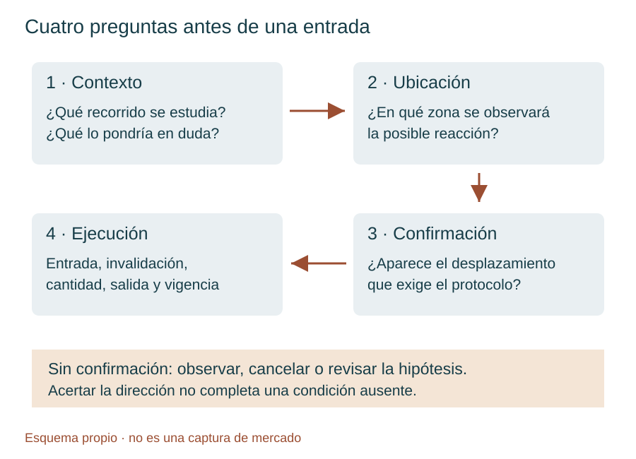
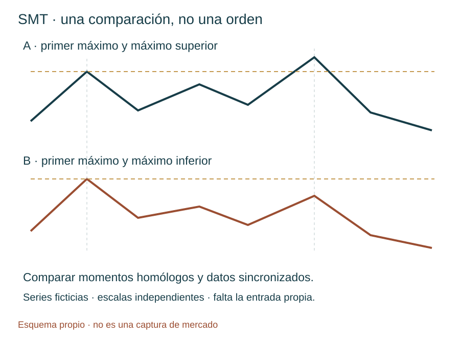
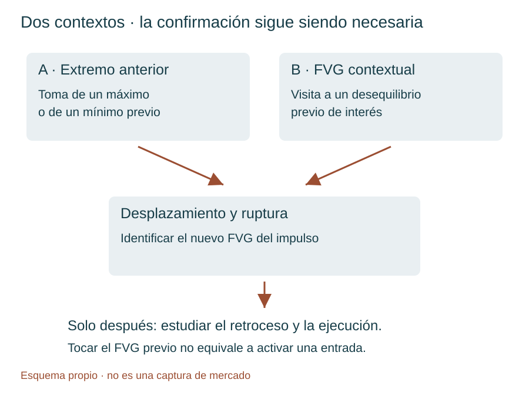
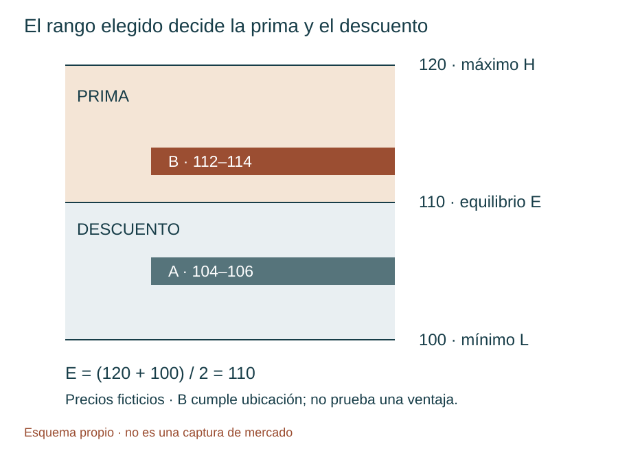
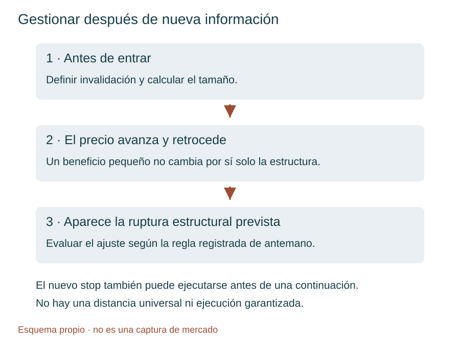

# Manual de estudio ICT · Bloque 5 · Episodios 21 a 25

## Del contexto a la confirmación: aprender también cuándo no operar

**ICT Mentorship 2022 En Español · TRAVIS FOREX · Edición de estudio: 3 de octubre de 2026**

En el bloque 4 aprendimos a separar contexto, destino y entrada; a organizar las temporalidades; y a conservar la cronología de una hipótesis. Este bloque pone esa organización a prueba. Hay una caída sin el retroceso esperado, una comparación entre índices, una sesión de noticias, un escenario que no se confirma y una reconstrucción completa del modelo desde el gráfico diario hasta los dos minutos. La pregunta deja de ser «¿dónde aparece un patrón?» y pasa a ser «¿qué condiciones lo hacen admisible y qué debe ocurrir antes de utilizarlo?».

El objetivo es construir una lógica de estudio que pueda describirse antes de conocer el resultado. Un contexto acertado puede no producir entrada; un patrón correcto puede perder; una ganancia puede proceder de una operación que incumplía las reglas. Distinguir esas situaciones es más útil que coleccionar capturas de movimientos perfectos.

**Cómo leer este manual.** Las etiquetas **Instructor**, **Ampliación del manual**, **Ejemplo propio** y **Límite de evidencia** separan las explicaciones originales, su desarrollo didáctico y aquello que no se puede acreditar con los textos. Se reducen las polémicas, la autopromoción y las afirmaciones de superioridad; se conserva la enseñanza práctica sobre confirmación, pérdidas, disciplina y ausencia de señal. No se convierten los comentarios sobre «el algoritmo» o «dinero inteligente» en hechos demostrados por una vela.

Los precios inventados se identifican expresamente. Las ilustraciones son esquemas propios, no capturas del mercado. Los enlaces temporales remiten al inicio aproximado del pasaje de la transcripción; no se han verificado fotograma a fotograma. El material enseña a estudiar y simular, no acredita rentabilidad ni recomienda una operación actual.

## Mapa del bloque y material recibido

| Episodio | Vídeo y duración de la lista | Núcleo de aprendizaje | Qué añade al bloque 4 |
|---|---|---|---|
| 21 | [Episodio 21](https://www.youtube.com/watch?v=R7V_NY8oe9w) · 38:36 | Dólar, apetito por riesgo, aperturas y tendencia sin retroceso ideal | Separar dirección acertada de entrada disponible |
| 22 | [Episodio 22](https://www.youtube.com/watch?v=z9mUR3yObk0) · 51:33 | Narrativa, SMT, varios FVG, piramidación y Fibonacci | Contrastar mercados y distinguir modelo básico de ejecución avanzada |
| 23 | [Episodio 23](https://www.youtube.com/watch?v=aDTaKnDk4eo) · 16:41 | Barrido frente a continuación, FOMC y proyecciones | Conservar qué se anticipa y qué se reconstruye después |
| 24 | [Episodio 24](https://www.youtube.com/watch?v=VqtIoEsecvA) · 41:51 | Dos ubicaciones de contexto y una confirmación obligatoria | Documentar un escenario sin entrada y evitar compras por simple contacto |
| 25 | [Episodio 25](https://www.youtube.com/watch?v=-zIZKVccnKI) · 58:12 | Tres días, reequilibrio, prima del impulso y gestión del stop | Integrar contexto, secuencia y riesgo sin cambiar de rango a conveniencia |

**Correspondencia comprobada.** Los cuatro primeros textos incluyen título y enlace coincidentes con los episodios 21–24. El quinto envío inicial repetía exactamente el 24 y se ha descartado como fuente del 25. El texto posterior comienza identificándose como «vigésimo quinto episodio», termina en 58:05 y se asocia al quinto enlace aportado por el usuario. Las duraciones proceden de la captura de la lista; los últimos pasajes de los textos llegan a 38:29, 50:56, 16:27, 41:31 y 58:05 respectivamente. Esto es compatible con las duraciones, aunque no certifica una transcripción palabra por palabra de todo el audio.

**Recorrido sugerido.** Lee primero los fundamentos, después 21 y 22 para el contexto; utiliza 23 como estudio de una sesión especial; detente en 24 para aprender la ausencia de confirmación; y trabaja 25 con el taller final. Mantén a mano las aperturas y la jerarquía de temporalidades del bloque 4. No hace falta volver a aprender todos los conceptos desde cero: aquí se precisa cómo se relacionan.

## Fundamentos · Un vocabulario que permita tomar decisiones

### 1. Contexto, ubicación, confirmación y ejecución

**Ampliación del manual.** El contexto es una hipótesis sobre el entorno: dirección de mayor temporalidad, referencias pendientes y momento de la sesión. La ubicación es el lugar en el que tendría sentido examinar una reacción: un máximo anterior, un mínimo o un desequilibrio. La confirmación es una secuencia observable que modifica la estructura de corto plazo. La ejecución es una decisión concreta de entrada, invalidación, tamaño y salida. Ninguna de las cuatro sustituye a las otras.

Un mínimo diario puede ser un destino de ventas y, después, una ubicación de estudio para compras. Que el precio llegue a él no demuestra que haya cambiado la dirección. Tampoco una opinión alcista del instructor convierte ese mínimo en una orden limitada de compra. El episodio 24 se entiende precisamente por esta separación: el lugar se alcanzó, pero la confirmación requerida no apareció.

<figure><figcaption>Esquema propio · relaciones de decisión, no precios ni resultados de mercado.</figcaption></figure>

### 2. Liquidez y desplazamiento: lo inferido y lo observado

**Liquidez del lado comprador —buy-side liquidity—** designa aquí las órdenes cuya activación implicaría compras, que ICT sitúa habitualmente por encima de máximos. Incluye, en su explicación, stops protectores de posiciones cortas y entradas compradoras por ruptura. **Liquidez del lado vendedor —sell-side liquidity—** es el concepto simétrico por debajo de mínimos. Una orden de compra también puede cerrar una venta: «comprar» no equivale necesariamente a iniciar una visión alcista.

**Límite de evidencia.** Los máximos y mínimos son visibles; el inventario exacto de órdenes y la identidad de sus titulares no lo son en un gráfico de velas. Una zona de liquidez inferida no equivale a haber visto todas esas órdenes en el libro. Decir que el precio «busca liquidez» resume el marco interpretativo del instructor. Para estudiarlo basta formular una predicción comprobable sobre el precio sin atribuir una intención universal a todos los participantes.

**Desplazamiento —displacement—** es un movimiento direccional con expansión apreciable y ruptura de una referencia relevante. El instructor utiliza expresiones como movimiento «energético». No proporciona en estas clases un umbral universal de tamaño o velocidad. Si se desea probar la idea, habrá que fijar una definición propia antes de revisar los resultados: referencia que debe romperse, tratamiento de mechas y cierres y relación con la variación reciente. Ese criterio adicional debe declararse como parte del protocolo del estudiante, no como cita de ICT.

### 3. FVG: geometría, contexto y límites

**Fair Value Gap (FVG)** se traduce aquí como **hueco de valor razonable**, manteniendo la sigla habitual. En la representación de tres velas, un FVG alcista aparece cuando el mínimo de la tercera queda por encima del máximo de la primera; uno bajista, cuando el máximo de la tercera queda por debajo del mínimo de la primera. La vela central conecta el impulso. La zona es una falta de solapamiento entre las velas exteriores, no una afirmación de que allí no se negociara absolutamente nada.

El nombre tampoco significa «valor razonable» en el sentido de una valoración empresarial. En este manual es una estructura de precio. Su utilidad propuesta depende del contexto, de su aparición dentro del desplazamiento elegido y de la secuencia posterior. Un rectángulo detectado automáticamente no decide por sí solo qué hacer.

Para reconocer un FVG completo hacen falta sus tres velas. Un dibujo que aún se está formando puede desaparecer antes del cierre. En la prueba histórica, no se puede utilizar el estado final de una vela como si ya se conociera al principio de ella. **Regla de estudio propia:** anotar cuándo quedó identificable la zona y desde qué instante se habría permitido una orden.

### 4. Prima, descuento y el rango que les da significado

**Premium —prima—** y **discount —descuento—** son ubicaciones relativas. Para un rango delimitado por mínimo L y máximo H, el equilibrio E es (H + L) / 2. La mitad superior se denomina prima y la inferior descuento. El equilibrio es una referencia geométrica: no calcula por sí solo el valor económico del activo.

El instructor utiliza además «prima de corto plazo» al hablar de un precio por encima de un máximo anterior o de una apertura de referencia. Conviene escribir la base de cada comparación: «por encima de la apertura de 08:30» no significa necesariamente «por encima del 50 % del impulso elegido». En el episodio 25, la selección de una venta exige atender a esta segunda comparación, más concreta.

Un precio puede estar en descuento del rango diario y en prima de un impulso de cinco minutos. No hay contradicción matemática: son rangos distintos. La confusión aparece cuando se cambia el rango después de ver la reacción para justificar una entrada que no cumplía el criterio inicial.

### 5. Cambio estructural, ruptura y regreso al desequilibrio

**Market Structure Shift (MSS) —cambio en la estructura del mercado—** describe aquí una alteración del comportamiento de corto plazo después de un evento de contexto. Para una venta, el instructor busca una toma de máximos o una visita a un área superior y después una ruptura bajista con desplazamiento de un mínimo de corto plazo. Para una compra, la lógica se invierte.

El punto de giro —swing high o swing low— debe poder identificarse en el momento de la decisión. Elegir después el mínimo que mejor encaja con la caída introduce información futura. El regreso al FVG del desplazamiento ofrece una ubicación candidata de entrada; no es obligatorio que el mercado regrese ni que el retroceso se detenga allí.

La confirmación filtra operaciones, pero también puede dejar movimientos sin aprovechar. Ese coste de selección no se elimina entrando antes de la confirmación: hacerlo construye otra estrategia, con otros resultados y otras pérdidas posibles.

### 6. Bloque de órdenes y flujo: dos niveles de interpretación

**Order block —bloque de órdenes—** es, en el uso de estas lecciones, una vela o agrupación que el instructor relaciona con el origen de un movimiento relevante. En los ejemplos bajistas destaca velas alcistas previas a una caída, dentro de un contexto ya definido. No se clasifica automáticamente como bloque útil cualquier vela de color contrario.

**Order flow —flujo de órdenes—** se usa en el relato de ICT para describir la dirección y secuencia de la entrega del precio. En herramientas de microestructura también designa información de órdenes y transacciones. Ambos usos no son intercambiables. Un **footprint —huella de volumen por precio—** muestra datos que una vela convencional no contiene. Por eso no se deduce que «la mayor parte del volumen» esté en los cuerpos simplemente porque varios cuerpos terminen dentro de una zona.

**Tape reading —lectura de la cinta—** se refiere en estas clases a seguir el precio y sus reacciones mientras se desarrollan. No implica que el vídeo esté analizando una cinta de transacciones con todas sus ejecuciones. Registrar una hipótesis antes de la reacción es el ejercicio transferible; asumir acceso a órdenes ocultas no lo es.

## Capítulo 21 · Un sesgo acertado no garantiza una entrada

### 21.1. El dólar como contexto, no como señal automática

**Instructor.** La lección empieza relacionando una subida del índice del dólar con un entorno de **risk-off —aversión al riesgo—**, y lo contrapone a **risk-on —mayor disposición a asumir riesgo—**. Su lectura conjunta del dólar y del E-mini S&P 500 refuerza un sesgo bajista para los índices. Añade un bloque de órdenes diario y una expectativa estacional de debilidad alrededor de mayo. [Vídeo: 01:51](https://www.youtube.com/watch?v=R7V_NY8oe9w&t=111s).

**Ampliación del manual.** Un régimen de aversión al riesgo describe una preferencia relativa por reducir exposición a determinados activos; no ordena que todos los activos distintos del dólar bajen a la vez. Las relaciones cambian con tipos de interés, expectativas y circunstancias específicas. Es posible que dólar e índices suban juntos en ciertos periodos. La correlación histórica no es una identidad ni basta para sincronizar una entrada.

El índice DXY mide el dólar frente a una cesta de seis divisas. El euro tiene un peso del 57,6 %, según la metodología de ICE. Por ello, mirar DXY y EUR/USD no aporta dos pruebas completamente independientes: hay una relación de construcción entre ambos. Esta observación ayuda a evitar una falsa acumulación de confirmaciones. [Fuente: metodología de ICE](https://www.theice.com/publicdocs/data/ICE_FX_Indexes_Methodology.pdf).

La expectativa estacional del instructor se conserva como hipótesis de contexto. Este bloque no incluye una serie histórica que cuantifique su frecuencia, magnitud o estabilidad. «Se espera debilidad en mayo» no basta para vender una sesión concreta ni demuestra una ventaja después de costes. Para contrastarla habría que definir años, índice, fechas y medida del resultado antes de elegir los ejemplos.

### 21.2. Ordenar los destinos sin prometer el recorrido

La lectura diaria señala mínimos relativamente iguales y, después, un mínimo inferior como posibles destinos. El instructor admite no conocer si, una vez alcanzados, habrá aceleración o retroceso. Eso distingue una referencia objetivo de un pronóstico completo del camino. [Vídeo: 07:44–09:20](https://www.youtube.com/watch?v=R7V_NY8oe9w&t=464s).

**Ampliación del manual.** En una ficha de estudio, escribe por separado destino inicial y condición para considerar otro. Si el primer objetivo ya se ha consumido, la operación siguiente necesita una nueva evaluación; no se sigue tratando esa liquidez como intacta. El máximo del bloque diario se presenta como un nivel que el instructor no espera alcanzar. Esa expectativa contextual no debe confundirse con un stop intradía automáticamente utilizable: la distancia y el horizonte serían diferentes.

En la transcripción aparece «9992» para el dólar y se citan 102 y 103. La escala sugiere que el primero podría corresponder a 99,92, pero no se normaliza como precio confirmado sin revisar el gráfico. Ningún cálculo de este bloque depende de esa reconstrucción.

### 21.3. Tres referencias temporales, tres funciones

El episodio vuelve a las aperturas de medianoche y 08:30 y explica el papel de las 09:30. Todas las horas del modelo son **hora local de Nueva York**, con su cambio estacional. No se fija una diferencia permanente con España. [Vídeo: 10:40–16:46](https://www.youtube.com/watch?v=R7V_NY8oe9w&t=640s).

| Referencia | Función en la clase | Error que hay que evitar |
|---|---|---|
| 00:00 | Apertura para enmarcar el rango diario y el estudio de Londres | Confundirla con el comienzo oficial de toda negociación de futuros |
| 02:00–05:00 | Ventana de Londres utilizada por el instructor | Convertirla sin comprobar la hora local de Nueva York |
| 08:30 | Referencia de precio para la mañana de Nueva York | Llamarla apertura del mercado de acciones |
| 09:30 | Apertura de la sesión principal de acciones y posible aumento de volatilidad | Suponer que garantiza un giro o una dirección |
| 08:30–11:00 | Ventana de trabajo matinal que describe en esta lección | Tratar el intervalo como una obligación de operar |

La apertura principal de NYSE es a las 09:30, hora del este de Estados Unidos. Ese dato institucional es distinto de las convenciones analíticas que ICT aplica a las 00:00 y 08:30. [Fuente: NYSE](https://www.nyse.com/trade/trading-information?force_isolation=true).

Una vela de cuatro minutos puede estar rotulada 08:28 y contener el instante 08:30. Eso no convierte su apertura en el precio exacto de las 08:30. Para marcar esa referencia utiliza una resolución que la identifique correctamente y conserva el nivel al cambiar de gráfico. El instructor advierte del problema de lectura de la etiqueta temporal en torno a 25:51.

### 21.4. La caída que no ofreció el retroceso esperado

**Instructor.** Esperaba una subida más pronunciada antes de la caída, incluso comenta una referencia próxima a 4.320. No ocurrió. El movimiento contrario fue mínimo y la caída continuó por debajo de las aperturas. Reconoce que el modelo ideal no estaba en el gráfico de cinco minutos de la forma buscada. [Vídeo: 09:50](https://www.youtube.com/watch?v=R7V_NY8oe9w&t=590s) y [22:01](https://www.youtube.com/watch?v=R7V_NY8oe9w&t=1321s).

**Power of Three —secuencia de acumulación, manipulación y distribución—** es su marco para ordenar el rango. Un **Judas swing —movimiento inicial engañoso o contrario al recorrido esperado—** sería, en un escenario bajista, una subida previa a la expansión descendente. La clase enseña que esa subida puede ser pequeña o no ofrecer la ubicación operable esperada.

Hay dos lecturas que no deben mezclarse. Como explicación del día, ICT interpreta la falta de rebote como debilidad extrema. Como regla de ejecución para un principiante que exige ese rebote, la consecuencia es ausencia de entrada. La primera no autoriza por sí sola a omitir la segunda.

### 21.5. Una variante de continuación debe conservar su nombre

El instructor baja a tres, dos y un minuto para mostrar pequeños FVG dentro de la caída, sin el rally ideal sobre la apertura de 08:30. Los presenta como formas de sincronizarse con una tendencia fuerte; también reconoce que no son la aplicación idéntica del modelo público ideal. [Vídeo: 27:33](https://www.youtube.com/watch?v=R7V_NY8oe9w&t=1653s) y [36:26](https://www.youtube.com/watch?v=R7V_NY8oe9w&t=2186s).

**Ampliación del manual.** Registra dos familias: «modelo con toma previa y confirmación» y «continuación sin el retroceso ideal». No mezcles sus resultados para concluir que una sola regla funciona. En una sesión rápida, el atractivo visual de los pequeños huecos puede llevar a perseguir el movimiento después de que una parte del recorrido ya haya ocurrido. Antes de considerar la variante faltaría precisar objetivo restante, invalidación, riesgo y condición de cancelación.

Cuando aparecen dos FVG bajistas, el ejemplo utiliza el inferior como zona de entrada y contempla que el precio aún pueda visitar el superior. La selección de entrada y la distancia de protección son decisiones distintas. No se puede elegir el FVG bajo para asegurar participación y, a la vez, un stop que ignora la excursión superior que el propio escenario admite. [Vídeo: 19:40–21:16](https://www.youtube.com/watch?v=R7V_NY8oe9w&t=1180s).

### 21.6. Ideas clave y ejercicio

Las aperturas ordenan el análisis; no garantizan que el precio vuelva a ellas. Una caída posterior no convierte en correcta cualquier venta anterior. Dejar pasar un movimiento por falta de condiciones puede ser una aplicación fiel del modelo. El relato sobre beneficios personales no acredita, por sí solo, ejecuciones o resultados auditados: las cifras del pasaje 17:34–18:06 son además poco claras y no se utilizan para reconstruir una cuenta.

**Ejercicio propio.** Tu protocolo exige subida sobre 08:30, toma de un máximo y desplazamiento bajista. El precio cae desde la apertura, genera pequeños FVG y llega a tu objetivo diario. ¿Debes anotar una entrada del modelo? ¿Qué habría que cambiar para estudiar esos FVG?

Ver respuesta razonada

No hubo entrada del protocolo descrito: acertar el destino no completa las condiciones ausentes. Se anota «dirección compatible, escenario no formado». Los pequeños FVG pueden formar una muestra separada de continuación, con criterios fijados antes de medir resultados. No se añaden retroactivamente a las operaciones del modelo básico.

## Capítulo 22 · Narrativa, comparación entre índices y precisión de la ejecución

### 22.1. La narrativa responde a «por qué ese destino»

**Instructor.** El punto de entrada es secundario frente a saber hacia dónde se espera que vaya el precio y por qué. Recupera los mínimos diarios como atracción de liquidez —**draw on liquidity**— y descompone el movimiento en una hora, quince minutos y un minuto. [Vídeo: 02:05](https://www.youtube.com/watch?v=z9mUR3yObk0&t=125s) y [06:21](https://www.youtube.com/watch?v=z9mUR3yObk0&t=381s).

Una narrativa utilizable necesita dirección, referencia, horizonte y condiciones que puedan contradecirla. «El mercado caerá porque es bajista» es circular. «Se estudia una venta tras una toma de máximos matinales, con destino inicial en los mínimos diarios pendientes» permite evaluar secuencia y distancia. El calendario y la volatilidad completan el contexto, pero no suplen la confirmación.

La imagen del imán es una analogía. No demuestra una fuerza física que obligue a alcanzar un nivel. En la práctica del manual conviene escribir «destino propuesto» y conservar los casos en que el precio gira antes de llegar. Así una metáfora útil no se transforma en una certeza.

### 22.2. Un patrón reconocible en varias escalas

La clase describe una toma superior, ruptura de un mínimo, desplazamiento y retroceso al desequilibrio. Después observa dentro de esa estructura una secuencia menor parecida. Llama **fractal** a esa repetición de forma entre escalas. Aquí significa semejanza operativa, no la demostración de una propiedad matemática exacta del mercado. [Vídeo: 15:31–18:43](https://www.youtube.com/watch?v=z9mUR3yObk0&t=931s) y [24:34–26:41](https://www.youtube.com/watch?v=z9mUR3yObk0&t=1474s).

La jerarquía largo, medio y corto plazo depende del conjunto observado. No convierte automáticamente un máximo de «largo plazo» de ese ejemplo en un máximo semanal. El instructor combina relaciones entre puntos de giro y desequilibrios, y llega a dar más de una clasificación contextual a un mismo máximo. Para un registro reproducible es preferible escribir «máximo del impulso principal de cinco minutos» o «máximo interno de un minuto», conservando la función antes que una etiqueta ambigua.

Un pequeño FVG alcista dentro de una estructura bajista no obliga a comprar. Es una estructura local que compite con el contexto. Tampoco queda garantizado su fracaso. La decisión de excluirlo debe constar en las reglas antes de conocer qué movimiento prevaleció.

### 22.3. Refinar un bloque no equivale a mejorar siempre una entrada

**Top-down analysis —análisis de mayor a menor temporalidad—** significa mantener la zona principal y examinar su interior con más detalle. ICT lleva un bloque bajista de cinco minutos al minuto y describe una entrada próxima a su punto medio. Esta es una aplicación de bloque de órdenes y lectura del precio, no únicamente el retroceso al FVG básico. [Vídeo: 27:20–29:13](https://www.youtube.com/watch?v=z9mUR3yObk0&t=1640s).

**Ampliación del manual.** El refinamiento puede reducir una distancia de entrada a invalidación, pero también dejar sin ejecución la orden o producir una señal más sensible al ruido. No se conoce una «entrada perfecta» porque al terminar el día pueda señalarse una vela extrema. Registra qué zona grande se había elegido, cuál era la pequeña y si estaba formada antes del regreso del precio.

El instructor comenta que los cuerpos respetan ciertas áreas aunque las mechas las excedan. Esto describe cierres y aperturas. Sus expresiones sobre volumen en los cuerpos no son verificables mediante esa geometría. Si se añade un gráfico de volumen por precio, será evidencia adicional y deberá anotarse como tal, sin alterar la fuente original.

### 22.4. Piramidar: añadir exposición tiene un coste medible

**Pyramiding —piramidación—** consiste aquí en añadir posiciones en una misma dirección a medida que se desarrolla una hipótesis. El instructor relata una secuencia decreciente de tres, dos y un contrato, con salida de seis en 13.285. No presenta la repetición indefinida de una unidad adicional. [Vídeo: 33:20–36:44](https://www.youtube.com/watch?v=z9mUR3yObk0&t=2000s).

En el último contrato identifica entrada en 13.335 y máximo posterior de 13.339,50. La excursión adversa descrita es 4,50 puntos. Desde esa entrada hasta 13.285 hay 50 puntos a favor. Son diferencias de precio de ese tramo, no el beneficio de las seis posiciones. Faltan precios inequívocos para las otras entradas, costes, registros completos y confirmación de la modalidad de cuenta. No se reconstruye un resultado total a partir de información insuficiente.

**Ampliación del manual.** Reducir el número de contratos en cada añadido no garantiza que disminuya el riesgo total. En una venta con entradas eᵢ, cantidades qᵢ, valor por punto V y stop común S por encima de todas las entradas, la pérdida planificada hasta ese stop es V × Σ[qᵢ × (S − eᵢ)], más costes y eventual deslizamiento. Si S queda entre las entradas, la cuenta debe distinguir ganancias y pérdidas por tramo y no ocultar que las ejecuciones reales pueden diferir.

**Ejemplo propio, precios ficticios.** Se venden tres unidades en 120 y dos en 118, con stop común en 123 y V = 2 unidades monetarias por punto. El riesgo previsto es (3 × 3 + 2 × 5) × 2 = 38, antes de costes. Añadir una unidad en 116 sin mover ese stop aporta 7 × 2 = 14: el total sube a 52. Las cantidades decrecen, pero la exposición crece. Esto explica por qué la piramidación debe presupuestarse, no imitarse por su apariencia.

### 22.5. SMT: desacuerdo entre mercados comparables

En torno a 42:24, ICT compara máximos del Nasdaq y del S&P 500: el primero supera una referencia mientras el segundo no confirma esa fortaleza. Lo interpreta, dentro del sesgo bajista, como **SMT —Smart Money Technique, técnica de dinero inteligente—**, una divergencia entre mercados habitualmente correlacionados. La expansión de la sigla es una convención terminológica del manual; el pasaje se centra en la comparación visual. [Vídeo: 42:24–45:12](https://www.youtube.com/watch?v=z9mUR3yObk0&t=2544s).

<figure><figcaption>Esquema propio · series sin escala de mercado, no reproducción del Nasdaq o del S&P 500.</figcaption></figure>

**Ampliación del manual.** Compara el mismo intervalo, puntos de referencia homólogos, instrumentos identificados y datos sincronizados. Dos máximos distintos seleccionados a conveniencia pueden fabricar una divergencia. En futuros, anota vencimiento y proveedor; no enfrentes sin explicación una serie continua ajustada con un contrato concreto.

SMT no mide cuánto debe durar el desacuerdo, no garantiza reversión y no demuestra quién ha distribuido posiciones. Es información contextual. Si tu entrada requiere desplazamiento y FVG, la divergencia no permite saltarlos. También puede desaparecer después, de modo que el diario debe conservar la captura y la hora de la observación original.

### 22.6. Fibonacci, OTE y una terminología que hay que depurar

**Optimal Trade Entry (OTE) —entrada óptima de operación—** es el nombre de una zona de retroceso, no una garantía de que allí esté la mejor entrada posible. El vídeo menciona 62 % y 79 % y explica una preferencia por anclar en aperturas o cierres de los puntos de giro. No es necesario inventar otros niveles que no se distingan en el texto. [Vídeo: 45:57–50:56](https://www.youtube.com/watch?v=z9mUR3yObk0&t=2757s).

**Ejemplo propio.** Un descenso de 120 a 100 tiene una amplitud de 20. Si se mide el retroceso alcista desde 100, el 50 % está en 110, el 62 % en 112,40 y el 79 % en 115,80. La zona OTE ilustrativa sería 112,40–115,80. Cambiar la dirección de los anclajes cambia las etiquetas de la herramienta, no esos precios cuando el recorrido descrito se mantiene.

La herramienta de TradingView permite editar niveles y su orientación mediante sus ajustes, incluida la opción de invertirlos. Comprueba los precios que muestra y no copies números de una configuración sin saber dónde están el cero y el uno. La interfaz puede diferir de la de 2022. [Documentación de TradingView](https://www.tradingview.com/support/solutions/43000518158-fibonacci-retracement-drawing-tool/).

**Precisión conceptual.** ICT llama «desviaciones estándar» a ciertas proyecciones de múltiplos del rango. En estos pasajes no calcula la desviación típica estadística de una muestra. En el manual las llamamos **proyecciones de amplitud**: extensiones geométricas del rango elegido. No implican una probabilidad del 68 %, 95 % ni ninguna distribución estadística. Además, una extensión de dos anclajes y otra herramienta de tres puntos no tienen por qué colocar el mismo nivel.

### 22.7. Ideas clave y ejercicios

La comparación entre mercados apoya o cuestiona una narrativa, pero no reemplaza la entrada propia. Los bloques refinados, la proximidad de ejecución y la piramidación son aplicaciones más complejas que el modelo inicial; deben estudiarse por separado. Las operaciones reales que el instructor afirma haber hecho se describen como afirmaciones suyas, sin que una transcripción permita auditarlas.

**Ejercicio propio.** A supera un máximo y B no; después A cae, pero no rompe el mínimo de corto plazo que tu protocolo había marcado. ¿Hay entrada? En otro registro ves una venta a 113 dentro del rango descendente 120–100: ¿está en prima? ¿Está dentro de la OTE 62–79 % de este ejemplo?

Ver respuesta razonada

No hay entrada si falta la ruptura exigida: la SMT es contexto. La venta a 113 está en prima porque supera 110. También se encuentra entre 112,40 y 115,80, pero cumplir esa ubicación no completa por sí mismo el contexto, el desplazamiento ni la gestión del riesgo. Las tres preguntas evalúan condiciones diferentes.

## Capítulo 23 · Una sesión de noticias y la diferencia entre barrer y continuar

### 23.1. Una sesión especial no es la plantilla de todos los días

El episodio sigue un movimiento asociado al **FOMC —Comité Federal de Mercado Abierto de Estados Unidos—**. La transcripción deforma su nombre como «iPhone en sí» o «de foamsey». Por el contexto monetario, las horas 14:00 y 14:30 y la referencia del episodio 24 al 5 de mayo, el estudio es compatible con la sesión del 4 de mayo de 2022; se mantiene como inferencia contextual, no como fecha certificada por el archivo del 23. El comunicado oficial de ese día se publicó a las 14:00. [Fuente: Reserva Federal](https://www.federalreserve.gov/newsevents/pressreleases/monetary20220504a.htm).

**Instructor.** Espera primero una caída a una zona inferior y después una subida que supere el máximo del martes. Menciona impulsos iniciales engañosos y advierte al terminar que la lección no es una invitación a operar el anuncio. [Vídeo: 00:08–02:09](https://www.youtube.com/watch?v=aDTaKnDk4eo&t=8s) y [15:55](https://www.youtube.com/watch?v=aDTaKnDk4eo&t=955s).

El valor didáctico está en seguir cómo condiciona su idea. No se extrae la regla «a las 14:30 siempre gira». Una noticia puede cambiar spreads, velocidad y calidad de ejecución; un gráfico histórico no recrea por sí solo la posibilidad real de obtener cada precio que muestra.

### 23.2. Barrido y toma con continuidad

**Liquidity sweep —barrido de liquidez—** significa en esta explicación una incursión más allá de un máximo o mínimo seguida de un regreso al rango. El instructor contrasta ese recorrido con una «toma» más significativa que continúa por encima del máximo del martes. [Vídeo: 04:37–05:54](https://www.youtube.com/watch?v=aDTaKnDk4eo&t=277s).

**Ampliación del manual.** En el instante del primer cruce todavía no se conoce si habrá regreso o continuidad. No basta con ver un tick por encima para etiquetar retrospectivamente todo el movimiento como barrido. El estudiante debe anotar la expectativa inicial y definir cuánto tiempo o qué comportamiento estructural observará para distinguir ambas posibilidades. El vídeo no ofrece una distancia fija universal para separarlas.

En otros usos de la terminología, «tomar liquidez» puede abarcar tanto una incursión breve como una ruptura persistente. Aquí se conserva la distinción local del instructor y se explica su sentido para no convertir una diferencia de palabras en una regla de mercado independiente.

### 23.3. Reconstruir la cronología de la explicación

| Momento aproximado | Lo que dice el instructor | Qué permite concluir el material |
|---|---|---|
| 00:08–02:09 | Propone caída inicial y posterior subida | Hay una hipótesis verbal anterior al resultado que narra después |
| 04:37–05:54 | Distingue la incursión débil del recorrido que espera | La expectativa de continuidad está formulada, no garantizada |
| 07:45–08:56 | Describe el giro y proyecta un objetivo | Parte del movimiento ya ha ocurrido; el objetivo se formula en esa fase |
| 11:34–13:53 | Vuelve sobre el gráfico y muestra mediciones | Se añade explicación retrospectiva de los anclajes |
| 14:32–15:55 | Enumera oportunidades y advierte sobre las noticias | Son ejemplos de selección, no ocho ejecuciones acreditadas |

La ausencia del botón de reproducción que el instructor menciona es una afirmación sobre la presentación. Desde la transcripción no se auditan el montaje, la continuidad íntegra ni las ejecuciones. Eso no impide estudiar su razonamiento, pero sí limita lo que puede afirmarse sobre una predicción verificada independientemente.

### 23.4. Proyectar el rango sin inventar sus extremos

En el pasaje 08:31–08:56 se menciona un objetivo transcrito como 13.437. Antes aparece una corrección verbal de un nivel a aproximadamente 13.150. La lección vuelve después a los anclajes y contrapone mechas y cuerpos. Sin los extremos completos y su escala visible no puede reproducirse una proyección exacta ni deducirse su coeficiente con seguridad. [Vídeo: 07:45](https://www.youtube.com/watch?v=aDTaKnDk4eo&t=465s) y [11:34–13:04](https://www.youtube.com/watch?v=aDTaKnDk4eo&t=694s).

El instructor explica que, ante la volatilidad del FOMC, considera los extremos de las mechas; en otras circunstancias comenta su uso de aperturas y cierres. Ambas mediciones pueden producir objetivos distintos. Para probar una regla, la elección debe establecerse antes del resultado; elegir luego la que coincida mejor no valida el método.

**Ejemplo propio de aritmética, no reconstrucción del vídeo.** Un rango 100–110 mide 10. Una proyección definida expresamente como «un rango adicional por encima de H» daría 120. Si se decide medir de 102 a 108, la amplitud es 6 y la misma convención da 114. La diferencia viene de los anclajes, no de un cambio en el futuro. Esta convención ilustrativa no pretende identificar los ajustes concretos que aparecen en pantalla.

### 23.5. Ocho posibilidades no significan ocho obligaciones

La enumeración final muestra distintos retrocesos, bloques y FVG dentro del recorrido. El instructor insiste en elegir el escenario que corresponda al modelo del estudiante. No se reconstruyen ocho fichas con precios y stops, porque el texto depende de gestos sobre un gráfico que no tenemos documentados con precisión.

**Ampliación del manual.** Operar todos los tramos haría depender cada decisión del resultado de la anterior y multiplicaría costes y exposición. Una lista retrospectiva de ocho oportunidades no es una tasa de acierto del 100 %. Para estudiar este episodio basta seleccionar una familia, definir su confirmación y registrar también si la entrada se habría producido antes de que el objetivo quedara consumido.

### 23.6. Ideas clave y ejercicio

La noticia aporta un contexto especial; la reacción no es una obligación horaria. El barrido y la continuidad se diferencian por lo que ocurre después del cruce. Las proyecciones dependen de sus anclajes y las posibles entradas no son resultados realizados.

**Ejercicio propio.** Un precio supera 110, vuelve a 108 y luego sube a 114. ¿Puedes afirmar al primer cruce que ya conocías todo ese recorrido? ¿Cuál es la forma correcta de documentar el análisis?

Ver respuesta razonada

No. En el primer cruce existían varias continuaciones posibles. Registra «espero incursión y regreso» o «espero expansión», con una condición de revisión. Después describe la secuencia realmente observada. El regreso inicial puede encajar con un barrido según la ventana elegida, pero no excluye una subida posterior. Cambiar la ventana retrospectivamente para que siempre acierte vacía de contenido la prueba.

## Capítulo 24 · La lección del escenario que no se formó

### 24.1. Convertir una advertencia larga en una distinción operativa

La clase dedica mucho tiempo a comentarios del canal y a la responsabilidad de quien ejecuta. El contenido útil para el sistema es concreto: observar una zona, esperar una reacción y abrir una posición son actos diferentes. Una publicación que invita a estudiar un gráfico no contiene necesariamente una entrada, un stop y una salida. [Vídeo: 04:51–06:54](https://www.youtube.com/watch?v=VqtIoEsecvA&t=291s).

El 24 señala además una fase de descubrimiento mediante estudio histórico, incluso anterior a operar en demo. Otros episodios describen operaciones hipotéticas en demo. No se impone una falsa uniformidad: son fases y usos distintos del aprendizaje. Primero se reconoce y define el patrón; después se prueba la decisión secuencial sin conocer las siguientes velas. Ninguna fase demuestra preparación para arriesgar capital por el mero hecho de completarla.

Se conserva la responsabilidad sobre las decisiones sin aceptar otra conclusión implícita frecuente: una pérdida no demuestra necesariamente falta de disciplina. Una operación fiel a un modelo puede perder y un modelo puede carecer de ventaja. El análisis debe distinguir error de ejecución, variación normal y fallo de la hipótesis, no atribuir toda pérdida al estudiante.

### 24.2. Dos escenarios encadenados, ambos condicionales

**Instructor.** El 5 de mayo de 2022 examina máximos relativamente iguales y una zona inferior. Le habría interesado una caída a esa zona, una confirmación alcista y una subida a los máximos; después podría estudiar una confirmación bajista superior. El objetivo mencionado alrededor de 06:14 se transcribe como 4.303. Se conserva como referencia textual, no como nivel reconstruido gráficamente. [Vídeo: 16:27–22:27](https://www.youtube.com/watch?v=VqtIoEsecvA&t=987s).

La secuencia prevista no ocurrió. El precio cruzó la referencia inferior sin desarrollar el desplazamiento alcista que la compra requería. En cinco minutos se ve, según su relato, caída, consolidación y más caída; no el impulso energético de recuperación. [Vídeo: 22:27–23:51](https://www.youtube.com/watch?v=VqtIoEsecvA&t=1347s).

**Ampliación del manual.** No se registra esa idea como una compra perdedora del modelo si nunca hubo entrada autorizada por sus condiciones. Se registra como «hipótesis direccional no confirmada». Tampoco se utiliza ese único caso para demostrar que el filtro siempre evita pérdidas. El valor del ejemplo es mostrar una función del filtro; su eficacia general necesita una muestra que también conserve los fallos.

### 24.3. Primera ubicación: máximos o mínimos anteriores

En el esquema bajista del instructor, el precio se aproxima a máximos relativamente iguales y los supera. Entonces se identifica el mínimo de corto plazo relevante del ascenso. La vuelta por debajo del máximo anterior no basta: hace falta desplazamiento bajista que rompa ese mínimo y deje una zona de interés dentro de su impulso. [Vídeo: 31:58–34:28](https://www.youtube.com/watch?v=VqtIoEsecvA&t=1918s).

La versión alcista invierte la secuencia: toma inferior, recuperación y ruptura relevante con desplazamiento, y búsqueda del FVG alcista del impulso. El estudiante debe dibujar las dos versiones antes de mirar ejemplos. Si solo recuerda «comprar después de barrer mínimos», está omitiendo precisamente el filtro que evita la entrada del día analizado.

### 24.4. Segunda ubicación: un FVG previo de mayor contexto

La otra posibilidad es que el precio llegue a un FVG previo. En el esquema bajista, un ascenso hacia esa zona superior ofrece el lugar para vigilar la reacción. El instructor no exige que se rellene por completo: insiste en esperar la secuencia estructural posterior. [Vídeo: 35:37–37:27](https://www.youtube.com/watch?v=VqtIoEsecvA&t=2137s).

Aquí hay **dos huecos con funciones diferentes**. El FVG previo es la ubicación contextual. El FVG nuevo, formado dentro del desplazamiento de confirmación, es la zona candidata de entrada. Comprar o vender directamente el primero por tocarlo confunde contexto con ejecución. El manual utiliza «previo» y «de confirmación» para impedir esa sustitución.

<figure><figcaption>Esquema propio · alternativas de contexto; no son dos señales que deban sumarse obligatoriamente.</figcaption></figure>

### 24.5. Ausencia, invalidación y pérdida son resultados distintos

| Estado | Qué ha sucedido | Registro adecuado |
|---|---|---|
| Sin escenario | No se alcanzó el contexto o no apareció confirmación | Observación sin operación |
| Escenario cancelado | La idea perdió vigencia antes de la entrada | Motivo y hora de cancelación |
| Orden sin ejecutar | Hubo configuración, pero no se obtuvo entrada | No asignar una ganancia teórica como realizada |
| Operación perdedora válida | Se cumplían las reglas y se alcanzó la invalidación | Pérdida del modelo, con costes |
| Operación fuera de reglas | Se entró sin un requisito exigido | Error de proceso, gane o pierda |

**Ampliación del manual.** La separación evita dos sesgos: excluir pérdidas llamándolas siempre errores personales e incluir ganancias que nunca se ejecutaron. Una estadística útil conserva ambos registros: resultados del protocolo y decisiones reales del estudiante. Compararlos muestra dónde el problema es de método, de aplicación o de evidencia insuficiente.

### 24.6. Ideas clave y ejercicio

El contacto con una zona no es confirmación. El FVG contextual y el FVG de entrada tienen tareas diferentes. Aceptar pérdidas no significa tolerar riesgo ilimitado; significa admitir que ninguna secuencia elimina la incertidumbre y que el stop forma parte del plan.

**Ejercicio propio.** El precio alcanza un FVG diario inferior, barre un mínimo y permanece debajo del máximo de corto plazo que habías marcado. Después cae otros 30 puntos. Un compañero afirma: «El sistema falló porque tenía que rebotar». ¿Qué parte de su afirmación corregirías?

Ver respuesta razonada

Se esperaba una reacción condicional, no un rebote obligatorio. Sin el desplazamiento y la ruptura alcista exigidos no hay compra del protocolo. La hipótesis de reacción no se confirmó. Esto no prueba que el sistema sea infalible: solo clasifica correctamente este caso como ausencia de entrada. Si alguien compró por contacto, su resultado pertenece a otra regla de ejecución.

## Capítulo 25 · Del rango diario al FVG elegible y al stop coherente

### 25.1. Revisar tres días sin forzar un patrón de tres velas

**Instructor.** El análisis se sitúa el 10 de mayo de 2022. Propone revisar apertura, máximo, mínimo y cierre de los últimos tres días. Son los datos **OHLC —Open, High, Low, Close—**. Observa una gran caída del lunes y utiliza el mínimo del viernes como referencia superior para el martes. [Vídeo: 19:39–22:20](https://www.youtube.com/watch?v=-zIZKVccnKI&t=1179s).

La revisión de tres días no implica que necesariamente exista un FVG diario de tres velas. De hecho, pregunta si lo hay y responde que no antes de desarrollar el reequilibrio. La enseñanza es examinar el recorrido y sus referencias, no dibujar por obligación un rectángulo con una etiqueta conocida.

**Ampliación del manual.** En una ficha diaria, registra cada OHLC, qué referencias quedaron superadas y cuáles siguen pendientes. Una gran caída no obliga a anticipar un suelo definitivo. Puede existir un retroceso relevante dentro de una tendencia bajista sin que la hipótesis de mayor plazo haya cambiado.

### 25.2. Reequilibrar un movimiento no es rellenar siempre un FVG

**Rebalancing —reequilibrio—** describe en esta lección un retorno sobre parte de un movimiento previo de entrega descendente. El martes asciende hacia el mínimo del viernes, referencia anterior a la caída del lunes. El instructor aclara que en quince minutos eso no aparece necesariamente como un desequilibrio de la misma forma que se aprecia la gran vela diaria. [Vídeo: 28:23](https://www.youtube.com/watch?v=-zIZKVccnKI&t=1703s) y [31:01–32:49](https://www.youtube.com/watch?v=-zIZKVccnKI&t=1861s).

El uso amplio de «reequilibrio» no se debe reducir a «relleno completo de un FVG». Tampoco impone volver exactamente al 50 % del día. Aquí hay un nivel contextual concreto —el mínimo del viernes— y una lectura del recorrido del lunes. El equilibrio del impulso que se calcula después es otra referencia.

Una vela diaria con cuerpo pequeño y mechas puede parecer indecisa y contener, sin embargo, movimientos intradía direccionales aprovechables para el estudio. La forma final de la vela diaria comprime el orden de los acontecimientos. Para recuperar esa información hay que bajar de escala, no asignarle una explicación única por su silueta.

### 25.3. La secuencia de las dos zonas de liquidez importa

En el relato, primero se toma la liquidez superior y se alcanza la referencia del viernes alrededor de las 09:30. La zona inferior aún está pendiente. Después se estudia la caída hacia mínimos. ICT dice que, si primero se hubiera consumido el mínimo del día previo y después se hubiera subido, su lectura no sería la misma. [Vídeo: 26:55–30:46](https://www.youtube.com/watch?v=-zIZKVccnKI&t=1615s).

**Ampliación del manual.** Dos gráficos pueden visitar los mismos niveles en órdenes distintos. Una estrategia de secuencia no debe tratarlos como equivalentes. Anota «qué se había tomado ya» en cada momento, además de «qué niveles existen». Un objetivo consumido antes de entrar no puede presentarse como una oportunidad intacta sin justificar una nueva hipótesis.

Las explicaciones del instructor sobre ventas institucionales a los stops compradores se mantienen como su interpretación. El dato comprobable en un gráfico sería la secuencia de precios. La identidad, tamaño y coordinación de las contrapartes exigen otra evidencia.

### 25.4. Mantener fijo el impulso al bajar de temporalidad

El análisis pasa de cinco a cuatro, tres y dos minutos, conservando sombreado el impulso bajista de desplazamiento. La finalidad no es buscar cualquier hueco en cualquier lugar, sino encontrar uno elegible **dentro del mismo movimiento**. [Vídeo: 35:39–37:28](https://www.youtube.com/watch?v=-zIZKVccnKI&t=2139s).

El texto sitúa el equilibrio de ese impulso en 4.044,50. Al no disponer de los extremos exactos, se conserva como nivel citado, sin inventar H y L para que la media encaje. Según la explicación, para la venta debe buscarse prima del impulso: ese equilibrio o más arriba, en la formulación del pasaje. Matemáticamente, el 50 % es la frontera; la prima estricta está por encima. Esa diferencia debe quedar definida en la prueba elegida. [Vídeo: 36:43](https://www.youtube.com/watch?v=-zIZKVccnKI&t=2203s) y [38:38–39:09](https://www.youtube.com/watch?v=-zIZKVccnKI&t=2318s).

En cuatro minutos y después en tres, el instructor no encuentra un FVG válido para la búsqueda que plantea. En dos minutos presenta una alternativa y discute el alcance del desplazamiento y el stop. La transcripción contiene frases deformadas, pero es claro que no da por válido cualquier hueco solo porque exista. No se suministra una captura inventada de esos rectángulos ni se fuerzan sus bordes.

### 25.5. Un FVG en descuento no cumple el filtro de prima

**Ejemplo propio.** Un desplazamiento bajista va de 120 a 100; su equilibrio es 110. Hay un FVG A entre 104 y 106 y un FVG B entre 112 y 114. Ambos podrían tener geometría bajista de tres velas, pero solo B está íntegramente en prima de ese impulso. A puede ser un desequilibrio real y aun así quedar excluido del protocolo de venta en prima.

<figure><figcaption>Esquema propio · niveles ficticios para distinguir existencia geométrica y elegibilidad.</figcaption></figure>

Si otro FVG cruzase el equilibrio, por ejemplo 109–112, habría que especificar dónde se permite la entrada: exigir toda la zona en prima y exigir solo el precio de entrada en prima no son la misma regla. El vídeo no fija una solución universal para todos los huecos que cruzan el 50 %. El protocolo debe declarar su opción y mantenerla constante.

**Límite metodológico.** El impulso puede seguir extendiéndose y alterar su equilibrio antes de la entrada. Hay que registrar qué extremos estaban disponibles cuando se tomó la decisión. No se usa el mínimo final del día para evaluar una entrada de media mañana. Bajar a un minuto no autoriza a reemplazar silenciosamente el rango principal por otro que vuelva favorable una ubicación inicialmente descartada.

### 25.6. Stop inicial: reconocer qué vela y qué riesgo se eligen

**Instructor.** Para la alternativa de dos minutos describe colocar el stop por encima de la vela que crea el FVG, con uno o dos ticks adicionales; también contempla una referencia más amplia. Después advierte contra recortar la protección apenas el precio avanza a favor. [Vídeo: 41:15–44:46](https://www.youtube.com/watch?v=-zIZKVccnKI&t=2475s).

La expresión «vela que crea el FVG» necesita localizarse en la imagen del ejemplo. En este manual no se convierte en una regla universal de «siempre la primera», «siempre la central» o «siempre la tercera» vela sin respaldo visual suficiente. La distinción segura es entre invalidación local y referencia estructural más amplia. El estudiante debe dibujar y nombrar su referencia antes de calcular el tamaño.

**Tick —incremento mínimo de cotización—**, **point —punto de índice—** y **handle —un punto completo, en este contexto—** no son sinónimos. En los contratos ES, MES, NQ y MNQ del cuadro siguiente, un punto son cuatro ticks. Los valores son propios de esos productos; no se trasladan automáticamente al FDAX ni a una cuenta de CFD.

| Futuro | Símbolo | Valor de un punto | Tick de 0,25 puntos |
|---|---|---:|---:|
| E-mini S&P 500 | ES | 50 USD | 12,50 USD |
| Micro E-mini S&P 500 | MES | 5 USD | 1,25 USD |
| E-mini Nasdaq-100 | NQ | 20 USD | 5 USD |
| Micro E-mini Nasdaq-100 | MNQ | 2 USD | 0,50 USD |

Los microcontratos representan una décima parte del multiplicador de sus equivalentes E-mini. Esto permite variar exposición con mayor granularidad, no elimina el riesgo. [Fuente: CME Group](https://www.cmegroup.com/articles/faqs/micro-e-mini-equity-index-futures-frequently-asked-questions.html).

### 25.7. Tamaño y margen no son la misma decisión

**Ampliación del manual.** El margen es una garantía exigida para mantener una posición; no representa la pérdida máxima de esa operación. El riesgo planificado depende de la distancia al stop, el valor por punto, la cantidad y los costes. Una ejecución con deslizamiento puede superar ese cálculo. El dinero disponible para cumplir margen tampoco convierte en razonable cualquier tamaño.

**Ejemplo propio con MES.** Entrada vendedora en 4.046,00 y stop en 4.049,00: distancia de 3 puntos. Con 5 USD por punto, la pérdida planificada por contrato es 15 USD antes de costes. Para un presupuesto didáctico de 40 USD y una provisión hipotética de 3 USD por contrato para costes y deslizamiento, caben ⌊40 / 18⌋ = 2 contratos. Su riesgo previsto sería 36 USD. La provisión es un supuesto de ejercicio, no una tarifa vigente ni una garantía de ejecución.

Si la invalidación razonable quedara más lejos, se recalcula la cantidad; no se acerca el stop para que quepan más contratos. Si la cantidad calculada fuera cero, el ejemplo no cabe en ese presupuesto. El tamaño se subordina a la estructura y al presupuesto, no al beneficio deseado.

### 25.8. Ajustar el stop después de información nueva

El instructor propone esperar una ruptura estructural posterior antes de bajar la protección de una venta. Si, tras esa ruptura, el precio recupera determinadas referencias, considera que la idea puede haberse deteriorado o que el mercado podría consolidar. No ofrece inmunidad frente a una salida y posterior continuación. [Vídeo: 44:46–45:30](https://www.youtube.com/watch?v=-zIZKVccnKI&t=2686s).

**Ampliación del manual.** Mover el stop porque aparece un pequeño beneficio y moverlo porque se ha formado una nueva referencia estructural son decisiones distintas. La primera puede reducir pérdidas nominales y aumentar salidas prematuras; la segunda también puede fallar, pero responde a una condición observable. Ninguna se evalúa con un único gráfico.

<figure><figcaption>Esquema propio · no prescribe una distancia universal de protección.</figcaption></figure>

La clase menciona que el objetivo se alcanzó aproximadamente 27 minutos más tarde de lo ideal, hacia 12:30. Eso ilustra otra variable: la regla de salida por tiempo. Si el protocolo del estudiante obliga a cerrar a mediodía, no puede contabilizar después el objetivo tardío como si hubiera mantenido la posición. Si no existe límite horario, debe declarar qué seguimiento y exposición permite. [Vídeo: 48:23–49:33](https://www.youtube.com/watch?v=-zIZKVccnKI&t=2903s).

### 25.9. Ideas clave y ejercicios

La lectura de tres días aporta referencias; el reequilibrio no requiere siempre un FVG diario; la secuencia de liquidez modifica la interpretación; y el FVG elegido debe cumplir el filtro del rango declarado. Las declaraciones de que todo responde a un algoritmo único, que el método no dejará de funcionar o que basta un plazo de estudio son opiniones del instructor, no conclusiones demostradas por estas clases.

**Ejercicio propio.** Sobre el rango 120–100, un estudiante vende el FVG 104–106 y explica que está por encima de una apertura de 103. ¿Cumple la venta en prima del impulso? Otro vende con un stop de 3 puntos y lo reduce a 0,5 al ver beneficio, sin nueva estructura. ¿Qué cambió?

Ver respuesta razonada

El primer estudiante está por encima de la apertura, pero debajo del equilibrio 110 del impulso: no cumple ese filtro de prima. Ha cambiado la referencia del argumento. El segundo ha cambiado la gestión inicialmente prevista sin la condición estructural descrita. Su ajuste puede ganar o perder, pero se debe registrar como regla distinta y no validarlo solo por el desenlace.

## Taller de cierre · Convertir el bloque en un protocolo comprobable

### A. Una ficha antes de revelar la siguiente vela

**Propuesta del manual.** Este taller desarrolla lo aprendido; no reproduce una ficha entregada por ICT. Utiliza simulación o reproducción histórica con las siguientes velas ocultas. La unidad de registro es el escenario observado, incluidas las ocasiones en que no existe operación.

| Campo | Pregunta que debe quedar contestada antes de la entrada |
|---|---|
| Instrumento y datos | ¿Qué contrato, vencimiento, proveedor y tipo de gráfico se utilizan? |
| Tiempo | ¿Qué fecha y hora de Nueva York? ¿Hay evento previsto? |
| Contexto | ¿Cuál es la hipótesis y qué hechos la harían reconsiderar? |
| Referencias | ¿Qué máximos o mínimos están pendientes y cuáles ya se consumieron? |
| Familia | ¿Modelo básico, continuación o estudio de noticia? |
| Ubicación | ¿Extremo previo o FVG contextual? ¿Qué límites exactos tiene? |
| Confirmación | ¿Qué punto debe romperse y qué se contará como desplazamiento? |
| Rango | ¿Cuáles son H, L y E en este momento? |
| Entrada | ¿Qué FVG nuevo, a qué precio, con qué orden y hasta cuándo? |
| Invalidación | ¿Qué referencia invalida y qué margen adicional se ha previsto? |
| Cantidad | ¿Qué valor por punto, costes supuestos y presupuesto admite? |
| Salida y seguimiento | ¿Qué objetivo sigue pendiente? ¿Qué activa un ajuste o salida temporal? |

La casilla de desplazamiento requiere una definición estable, aunque sea imperfecta. Anotar «era evidente» después del desenlace no basta para repetir la prueba. Si cambias una condición, guarda una versión nueva del protocolo y no mezcles automáticamente sus resultados con los anteriores.

### B. Caso integrado con cifras ficticias

Se estudia MES en una mañana sin anuncio dentro de la ventana escogida. El sesgo hipotético es bajista. A las 09:30 el precio toma un máximo de 4.048,00 y alcanza 4.050,00. Después rompe con desplazamiento el mínimo de corto plazo marcado previamente y llega a 4.040,00. El rango elegido es, por tanto, 4.040–4.050. Se han identificado dos FVG bajistas: A, 4.042–4.043; B, 4.046–4.047. El destino inferior de 4.035 sigue pendiente.

La regla propia permite entrar en 4.046,50, exige prima del impulso y conserva el stop en 4.050,50. El presupuesto máximo del ejercicio es 50 USD; se presupuestan 3 USD por contrato para costes y deslizamiento. No se permite piramidar. Antes de revelar más velas, responde: ¿cuál es E?, ¿qué hueco es elegible?, ¿qué riesgo por contrato existe?, ¿cuántos contratos admite el presupuesto?, ¿qué beneficio bruto tendría el objetivo?, ¿qué ocurre si no hay retroceso a la entrada?

Ver solución completa del caso

E = 4.045,00. B está en prima; A está en descuento. La entrada en 4.046,50 y el stop 4.050,50 distan 4 puntos: 20 USD por MES. Con la provisión de 3 USD, el cálculo es 23 USD por contrato; caben dos contratos y el riesgo presupuestado es 46 USD. El objetivo está 11,50 puntos por debajo de la entrada: 57,50 USD brutos por contrato, 115 USD por dos. La relación bruta entre recorrido al objetivo y distancia al stop es 11,50 / 4 = 2,875; no es probabilidad de acierto y no incorpora costes. Si no se obtiene entrada, no hay beneficio realizado: se registra orden sin ejecución o ausencia de orden, según lo ocurrido. El deslizamiento real puede diferir del supuesto.

### C. Tres modificaciones que cambian el resultado del estudio

**Primera: no aparece el desplazamiento.** El precio llega a la zona y cae sin cumplir el gatillo declarado. Se registra ausencia de confirmación, como en el episodio 24. No se rescata una venta imaginaria porque el objetivo fuera alcanzado más tarde.

**Segunda: el objetivo se consume antes de la entrada.** El precio llega a 4.035 y luego vuelve a 4.046,50. Ya no es la misma secuencia. La regla de este taller cancela la orden pendiente al consumirse el destino inicial. Es una decisión didáctica explícita para evitar tratar un objetivo pasado como futuro; no se presenta como una regla universal citada del instructor.

**Tercera: hay entrada y stop antes de la caída final.** Si las condiciones eran válidas, es una pérdida del protocolo. No se borra porque luego el precio alcance el objetivo, ni se mueve retrospectivamente el stop para que sobreviva. Conservar esas operaciones es esencial para evaluar un sistema.

### D. Qué medir y cómo evitar una selección favorable

Selecciona un intervalo continuo de sesiones antes de revisarlo. Conserva días tranquilos, tendenciales, laterales y días sin patrón; etiqueta las noticias por separado. Guarda captura previa, decisión, resultado y explicación. Un primer conjunto pequeño sirve para comprobar si sabes aplicar las reglas, no para demostrar rentabilidad.

Registra frecuencia de escenarios, proporción ejecutada, pérdidas, ganancias, costes, excursión adversa y favorable, tiempo expuesto y errores de aplicación. **MAE —Maximum Adverse Excursion—** es el máximo recorrido en contra durante una operación; **MFE —Maximum Favorable Excursion—**, el máximo a favor. Son medidas descriptivas que no autorizan a reconstruir entradas o salidas perfectas.

La esperanza media en unidades de riesgo puede expresarse como p × ganancia media − (1 − p) × pérdida media − costes medios, utilizando magnitudes coherentes. Una tasa de acierto alta no basta si las pérdidas son mucho mayores. La estimación de p exige una muestra; estos cinco vídeos no la suministran. Reserva un periodo posterior para **forward testing —prueba prospectiva—** con las reglas ya fijadas, sin seguir afinándolas al ver cada resultado.

### E. ATAS como complemento visual separado

ATAS dispone de herramientas para observar volumen por precio, delta y reproducción del mercado. Su tutorial sobre FVG presenta formas de examinar la formación y el regreso a esas zonas con datos de flujo. Aquí se facilita el [enlace atribuido al tutorial de ATAS sobre FVG](https://atas.net/blog/fvg-trading-what-is-fair-value-gap-meaning-strategy/); requiere conexión y no hay capturas externas incrustadas.

**Propuesta propia de comparación.** Repite el registro una vez usando solo el protocolo de precio y otra con un filtro adicional definido previamente, por ejemplo una condición concreta de delta. Mantén la misma muestra y mide qué entradas excluye, incluidas las ganadoras. No adoptes el filtro porque dos capturas parezcan convincentes. Un delta agregado no identifica la intención de todos los participantes ni confirma por sí mismo una narrativa institucional.

El [tutorial de lectura de flujo de órdenes de ATAS](https://atas.net/blog/how-to-read-the-order-flow/) permite ampliar la diferencia entre observar velas y estudiar transacciones. Es material complementario del proveedor, no una validación independiente de rentabilidad del modelo ICT. Estos recursos no se convierten en requisitos del modelo básico ni obligan a adquirir una plataforma para leer el manual.

## Glosario bilingüe de consulta

| Término | Traducción y uso en este bloque |
|---|---|
| Bias | Sesgo: hipótesis direccional condicionada, no certeza |
| Risk-on / risk-off | Mayor apetito por riesgo / aversión al riesgo; descripción del entorno |
| DXY / Dollar Index | Índice del dólar frente a una cesta de divisas |
| Equities / stocks | Acciones; distinguirlas de futuros sobre índices |
| Seasonal tendency | Tendencia estacional; hipótesis histórica que exige contrastación |
| Draw on liquidity | Atracción o destino propuesto de liquidez |
| Buy-side liquidity | Liquidez compradora inferida, habitualmente sobre máximos en el marco ICT |
| Sell-side liquidity | Liquidez vendedora inferida, habitualmente bajo mínimos |
| Buy stop / sell stop | Orden condicionada de compra / venta; puede abrir o cerrar exposición |
| Liquidity sweep | Barrido: incursión más allá de una referencia y retorno, según esta explicación |
| Breakout | Ruptura de una referencia; su continuidad no está garantizada |
| Displacement | Desplazamiento: expansión direccional que rompe una referencia relevante |
| MSS / Market Structure Shift | Cambio estructural local; requiere identificar qué punto se rompe |
| Swing high / swing low | Máximo o mínimo de giro en la escala elegida |
| Equal highs / equal lows | Máximos o mínimos iguales o relativamente iguales |
| FVG / Fair Value Gap | Hueco de valor razonable entre velas exteriores de una estructura de tres |
| Imbalance | Desequilibrio; término más amplio que no siempre equivale a un FVG estricto |
| Order block | Bloque de órdenes: zona de vela o velas interpretada dentro del contexto ICT |
| Mean threshold | Umbral medio: referencia del 50 % del bloque, con límites que deben declararse |
| Premium / discount | Prima / descuento respecto de un rango o referencia identificados |
| Equilibrium | Equilibrio: punto medio del rango seleccionado |
| Rebalancing | Reequilibrio: revisita del movimiento previo; no exige siempre un FVG diario |
| Power of Three | Acumulación, manipulación y distribución en el marco interpretativo ICT |
| Judas swing | Movimiento inicial contrario o engañoso en el escenario descrito |
| Setup | Configuración o escenario con condiciones; no cualquier patrón visual |
| Trigger | Gatillo: condición observable que habilita pasar al siguiente paso |
| SMT | Técnica de dinero inteligente; aquí, divergencia entre mercados comparables |
| Top-down analysis | Análisis de mayor a menor temporalidad, conservando el contexto |
| Fractal | Semejanza de una secuencia entre escalas, en el uso didáctico del instructor |
| Tape reading | Lectura secuencial del precio en estas clases; históricamente, lectura de la cinta |
| Order flow | Flujo de órdenes; diferenciar interpretación de velas y datos de transacciones |
| Footprint | Huella de volumen por precio; información adicional a la vela convencional |
| Delta | Diferencia entre volúmenes clasificados como compras y ventas agresoras |
| OTE / Optimal Trade Entry | Entrada óptima: nombre de la zona 62–79 % citada; no garantía de optimalidad |
| Fibonacci retracement | Retroceso de Fibonacci: herramienta geométrica de niveles |
| Range projection | Proyección de amplitud; no confundir con desviación típica estadística |
| Pyramiding | Piramidación: añadir exposición dentro de una hipótesis |
| Close proximity | Proximidad: ejecución cerca de la zona, cuya tolerancia no queda cuantificada aquí |
| Drawdown | Caída desde un máximo de capital; en el relato a veces se usa para recorrido adverso |
| Stop loss | Orden o nivel de salida por pérdida; no garantiza el precio exacto de ejecución |
| Break-even | Punto de equilibrio económico; el precio de entrada no cubre necesariamente costes |
| Tick / point / handle | Incremento mínimo / punto / punto completo en el uso de futuros de índices |
| Spread | Diferencial entre mejor compra y mejor venta |
| Slippage | Deslizamiento: diferencia entre precio esperado y ejecutado |
| Margin | Margen o garantía; no es pérdida máxima ni presupuesto de riesgo |
| Paper trading / demo | Operativa simulada sin acreditar resultados de una cuenta real |
| Backtesting | Prueba histórica con reglas y tratamiento explícito de la información disponible |
| Forward testing | Prueba prospectiva sobre datos que aún no se conocían al fijar las reglas |
| OHLC | Apertura, máximo, mínimo y cierre |
| FOMC | Comité Federal de Mercado Abierto de Estados Unidos |
| NFP / Nonfarm Payrolls | Nóminas o empleo no agrícola de Estados Unidos; publicación macroeconómica |
| MAE / MFE | Excursión máxima adversa / favorable durante una operación |
| R | Unidad de riesgo inicial definida para normalizar resultados |

## Fuentes, ambigüedades y continuidad editorial

### Fuentes principales y criterio de atribución

Las fuentes de contenido son las cinco transcripciones aportadas por el usuario y sus enlaces de TRAVIS FOREX: [21](https://www.youtube.com/watch?v=R7V_NY8oe9w), [22](https://www.youtube.com/watch?v=z9mUR3yObk0), [23](https://www.youtube.com/watch?v=aDTaKnDk4eo), [24](https://www.youtube.com/watch?v=VqtIoEsecvA) y [25](https://www.youtube.com/watch?v=-zIZKVccnKI). Los pasajes temporales aparecen junto a las explicaciones. La atribución de ideas al instructor no implica que el manual certifique todas sus explicaciones causales.

Se normalizan deformaciones evidentes como «Ice City» a ICT, «Ferrari», «revelica» o «Favela» a FVG cuando el contexto lo permite, y «iPhone en sí» a FOMC en el episodio 23. Las correcciones no se utilizan para inventar precios, velas ni reglas. Cuando una identificación no puede cerrarse con seguridad, se conserva la limitación.

| Punto a vigilar | Tratamiento editorial |
|---|---|
| Episodio 24 duplicado en el envío inicial | Se excluye el duplicado; el nuevo texto corresponde al 25 por identificación interna y duración |
| «9992» en el 21 | Posible 99,92 por contexto; no se utiliza como precio confirmado |
| Beneficios narrados y comentarios sobre cuentas | No se presentan como rendimiento auditado ni se reconstruye una cuenta |
| 13.335, 13.339,50 y 13.285 en el 22 | Se calculan solo diferencias del último tramo, no beneficio total de seis contratos |
| «Desviaciones estándar» del Fibonacci | Se explican como proyecciones de rango, sin significado probabilístico supuesto |
| Niveles y anclajes del 23 | No se inventan extremos para reproducir el objetivo citado |
| «Volumen en los cuerpos» | Se distingue geometría OHLC de datos de volumen por precio |
| 4.044,50 en el 25 | Se conserva como equilibrio citado; no se deducen extremos desconocidos |
| Vela que «crea» el FVG para el stop | No se asigna universalmente a una de las tres sin comprobación visual |
| Reglas de venta en prima y variantes de continuación | Se registran por separado y no se unifican mediante excepciones retrospectivas |

### Ampliaciones externas consultadas

Consulta documental: **3 de octubre de 2026**. Son fuentes para definiciones, especificaciones y contexto; no prueban la rentabilidad del modelo.

1. **ICE — metodología de índices de divisas.** Composición y ponderación del DXY. [Documento oficial](https://www.theice.com/publicdocs/data/ICE_FX_Indexes_Methodology.pdf).
2. **NYSE — información de negociación.** Diferencia entre apertura bursátil y referencias analíticas del instructor. [Página oficial](https://www.nyse.com/trade/trading-information?force_isolation=true).
3. **CME Group — preguntas frecuentes sobre Micro E-mini.** Multiplicadores, relación con E-mini y tamaños mínimos de variación. [Página oficial](https://www.cmegroup.com/articles/faqs/micro-e-mini-equity-index-futures-frequently-asked-questions.html).
4. **Reserva Federal — comunicado del 4 de mayo de 2022.** Contexto histórico de la sesión monetaria compatible con el episodio 23. [Comunicado oficial](https://www.federalreserve.gov/newsevents/pressreleases/monetary20220504a.htm).
5. **TradingView — herramienta de retroceso de Fibonacci.** Ajustes de niveles y orientación; no reproducción literal de la interfaz de 2022. [Documentación oficial](https://www.tradingview.com/support/solutions/43000518158-fibonacci-retracement-drawing-tool/).
6. **ATAS — Fair Value Gap.** Complemento visual de precio, volumen y reproducción. Solo enlace; requiere conexión. [Tutorial del proveedor](https://atas.net/blog/fvg-trading-what-is-fair-value-gap-meaning-strategy/).
7. **ATAS — lectura del flujo de órdenes.** Complemento para distinguir vela y transacciones. Solo enlace; requiere conexión. [Tutorial del proveedor](https://atas.net/blog/how-to-read-the-order-flow/).

### Cinco conclusiones que deben quedar en el diario

**Primera: contexto no es entrada.** La dirección puede ser compatible y el escenario no formarse. **Segunda: la secuencia importa.** Visitar los mismos niveles en otro orden modifica la lectura. **Tercera: todo rango debe tener nombre y momento de fijación.** Prima, descuento y proyecciones dependen de él. **Cuarta: riesgo y gestión se definen antes de necesitar justificarlos.** Más precisión o un microcontrato no eliminan pérdidas. **Quinta: la prueba debe poder contradecir la idea.** Conserva pérdidas válidas, ausencia de señal y órdenes no ejecutadas.

El bloque 5 queda centrado en episodios 21–25. El siguiente bloque previsto es 26–30. La continuidad conserva el modelo básico como referencia y añade variantes identificadas; no adelanta contenidos de vídeos que todavía no se han incorporado.
