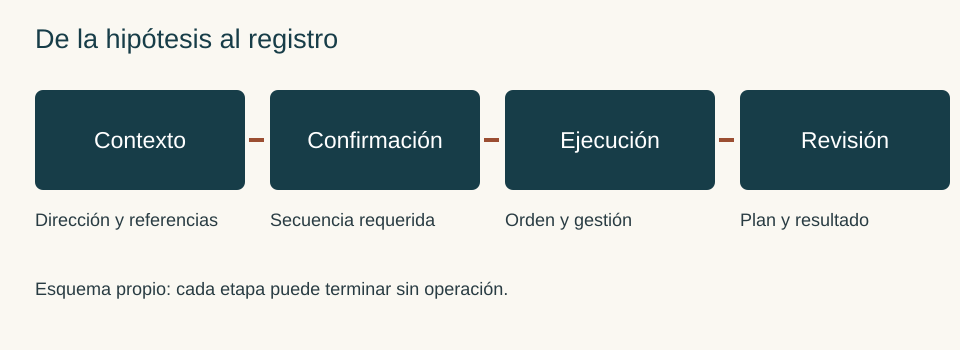
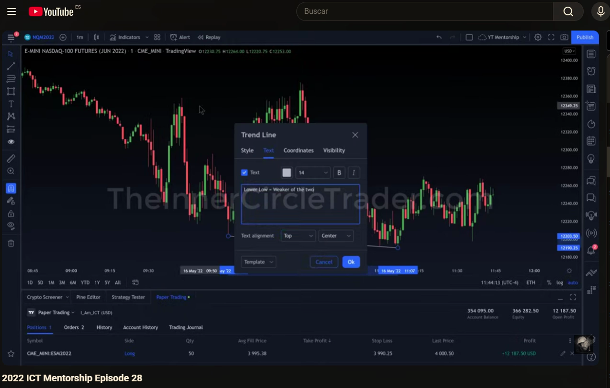
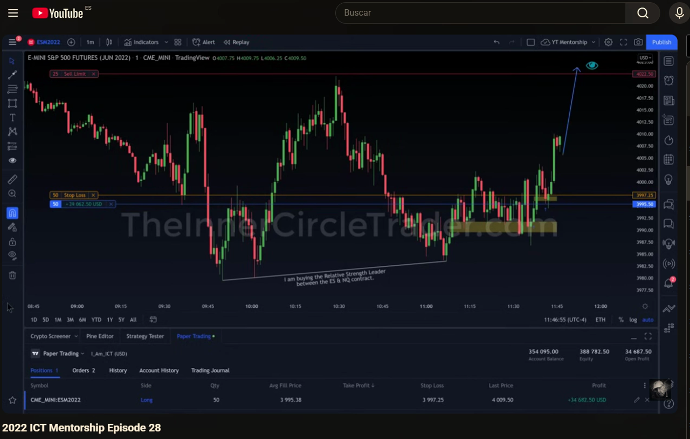

# Manual de estudio ICT · Bloque 6 · Episodios 26 a 30

## Del objetivo de liquidez a la ejecución y a un registro honesto

Edición de estudio · 3 de octubre de 2026 · Clasificación: **Referencia**.

Este bloque estudia cómo una idea direccional se transforma en una entrada, cómo se administra cuando el recorrido no cumple el escenario más ambicioso y cómo se revisa sin convertir el resultado conocido en una predicción imaginaria. Los episodios 26 y 27 muestran compras frente a una tendencia mayor bajista; el 28 permite observar una comparación entre índices y una posición simulada; el 29 explica esa comparación y una entrada próxima a la zona ideal; el 30 vuelve sobre la continuación de tarde alrededor de un evento.

El bloque 5 ya distinguió dirección, confirmación y ubicación del FVG. Aquí añadimos una cuarta pregunta: ¿qué se ejecutó realmente y qué fue solo una posibilidad? Una operación añadida, un objetivo desplazado o una salida errónea pueden cambiar el riesgo y el resultado aunque la lectura de contexto permanezca intacta.

**Cómo leer las atribuciones.** Instructor identifica el contenido de las fuentes; Observación visual describe la grabación 28; Ampliación del manual desarrolla criterios didácticos propios; Ejemplo propio usa escenarios ficticios. La terminología del algoritmo y de la liquidez institucional se conserva como marco del instructor. Las velas no revelan por sí solas todas las órdenes ni las intenciones de sus titulares.

No se ha contrastado visualmente cada pasaje de 26, 27, 29 y 30. Sus enlaces temporales proceden de los textos. El 28 se ha revisado mediante fotogramas de la grabación aportada: esta comienza con una posición abierta, dura 2:32,37 y no acredita íntegros los 2:36 de la lista. Las cantidades y beneficios de las fuentes se estudian como ejemplos simulados; no son pautas de tamaño ni resultados replicables.

## Mapa del bloque y fuentes disponibles

| Episodio | Fuente | Pregunta central |
|---|---|---|
| 26 | TRAVIS FOREX · [Vídeo](https://www.youtube.com/watch?v=g9GT6TW-xoo) · TXT | ¿Cómo separar objetivo próximo, objetivo final e invalidación? |
| 27 | TRAVIS FOREX · [Vídeo](https://www.youtube.com/watch?v=tuoAQJP0NSY) · TXT | ¿Cómo estudiar una continuación de tarde sin falsear la anticipación? |
| 28 | The Inner Circle Trader · [Vídeo](https://www.youtube.com/watch?v=j0Z2EbuJXGU) · grabación del usuario | ¿Qué demuestra la comparación ES/NQ y qué sigue sin estar documentado? |
| 29 | TRAVIS FOREX · [Vídeo](https://www.youtube.com/watch?v=00kRjL9SeRg) · TXT | ¿Qué cambia cuando la entrada se realiza cerca del FVG? |
| 30 | TRAVIS FOREX · [Vídeo](https://www.youtube.com/watch?v=5WeNxdaE2Vw) · TXT | ¿Cómo distinguir un barrido de una confirmación alrededor de noticias? |

La identidad del 30 se conserva según entrega explícita del usuario y captura de la lista; no anuncia su número en la apertura. El enlace inicialmente repetido del 29 quedó corregido. El 28 es una fuente visual, no una transcripción ausente que deba inventarse.

## Fundamentos que conectan los cinco capítulos

**Sesgo o bias.** Es una dirección hipotética vinculada a un marco temporal y a un objetivo. Una semana bajista puede contener una recuperación intradía. Llamar alcista a la sesión no vuelve alcista el gráfico diario: hay que nombrar ambas escalas. La hipótesis pierde utilidad si su referencia se invalida, se consume el objetivo o se agota el tiempo fijado para estudiarla.

**Atracción hacia liquidez o draw on liquidity.** En el marco ICT, ciertos máximos y mínimos sirven de destinos potenciales. Esa referencia organiza el escenario; no obliga al precio a llegar. Un máximo cercano puede ser un objetivo parcial mientras otro más lejano conserva su papel de escenario ampliado. No se cambia uno por otro después del resultado para decir que siempre se acertó.

**FVG, fair value gap o desequilibrio entre tres velas.** Una separación entre los extremos de las velas exteriores delimita la zona. Su presencia geométrica no determina la dirección: importan contexto, desplazamiento, ubicación y secuencia. Un order block o bloque de órdenes es otra referencia del marco del instructor; no es cualquier vela del color contrario. El precio de entrada, el borde de la zona y el nivel de invalidación cumplen funciones distintas.

**SMT y comparación entre mercados.** Aquí se estudia una divergencia entre índices relacionados: uno extiende un mínimo y otro lo conserva. La comparación puede reforzar una narrativa previa, pero no aporta automáticamente precio de entrada, stop ni plazo. Deben compararse horarios, contratos y swings equivalentes; una divergencia entre dos puntos escogidos retrospectivamente carece del mismo valor de decisión.

**Información, decisión, ejecución y resultado.** Esas cuatro capas se anotan por separado. Haber previsto un destino no prueba haber conseguido una entrada; haber abierto una posición no prueba ejecución con dinero real; un cierre favorable no demuestra ventaja estadística. El diario tiene que poder conservar un error de ejecución y una pérdida válida.

<figure><figcaption>Esquema propio de decisiones. No representa datos de mercado ni una captura real.</figcaption></figure>

## Capítulo 26 · Contra tendencia, objetivos intermedios e invalidación

Fuente: [contexto · 00:05](https://www.youtube.com/watch?v=g9GT6TW-xoo&t=5s), [gestión · 03:57](https://www.youtube.com/watch?v=g9GT6TW-xoo&t=237s), [objetivos · 06:15](https://www.youtube.com/watch?v=g9GT6TW-xoo&t=375s).

### 26.1. Comprar una recuperación no cambia la tendencia mayor

**Instructor.** La compra se plantea contra el sesgo diario, después de tomar liquidez por debajo de mínimos relativamente iguales y visitar una zona de desequilibrio. La idea es una expansión alcista dentro de ese contexto bajista. No se afirma que la caída previa desaparezca; se busca un recorrido de recuperación.

**Ampliación del manual.** Para identificar esta variante, describe la secuencia antes de identificar el patrón: referencia mayor, mínimos barridos, respuesta desde la zona, estructura menor y destino próximo. Si solo se dispone de un rebote y de un FVG, falta explicar por qué el rebote podría continuar y hasta dónde se estudia. La contra tendencia tampoco significa que todos los mínimos barridos deban comprarse.

Hay dos invalidaciones diferentes. La direccional cuestiona la recuperación; la operativa determina dónde una entrada concreta deja de tener sentido. Una sesión puede seguir recuperándose tras ejecutar un stop demasiado estrecho. El diario debe permitir reconocer esa diferencia sin trasladar el stop indefinidamente.

### 26.2. El destino ambicioso y la salida realizable

**Instructor.** Se mantiene la posibilidad de alcanzar el máximo del día alrededor de 4.051,25, pero no se necesita ese recorrido para el objetivo principal de la posición. El instructor describe cerrar cuatro contratos en una referencia de liquidez compradora y dejar dos para una posible extensión. Son cantidades del ejemplo, no proporciones universales.

La decisión útil es separar escenario ampliado y objetivo administrado. El primero orienta la lectura; el segundo debe ser compatible con riesgo, tiempo y condiciones de ejecución. Si el objetivo próximo se obtiene y el lejano no, el registro conserva ambos. Si el precio no llega a ninguno, no se convierte una oscilación anterior en un objetivo retrospectivo.

**Ejemplo propio, datos ficticios.** Supón una compra en 100, invalidación en 98, primera referencia en 103 y escenario ampliado en 106. Dos unidades generan cuatro unidades monetarias de riesgo si cada punto vale una unidad monetaria. Cerrar una en 103 y la otra en 101 produce cuatro unidades monetarias brutas en total; no seis ni doce. Se han omitido costes solo para aislar la lógica. El beneficio depende de las salidas ejecutadas, no de que el gráfico llegue después a 106.

### 26.3. Añadir exige revisar la exposición conjunta

En 03:57 se describen dos contratos añadidos a cuatro existentes y un stop ajustado bajo una referencia estructural. En 10:11 aparece la posibilidad de añadir otro; no debe contarse como ejecución confirmada. El cierre descrito vuelve a cuatro contratos retirados y dos restantes.

Una adición favorable al movimiento es piramidación. Para evaluarla se necesita la nueva entrada, la cantidad acumulada y el stop de cada tramo. Un stop más alto puede reducir exposición previa, pero no garantiza que la exposición conjunta disminuya al añadir. Un hueco o un deslizamiento tampoco respeta necesariamente la pérdida calculada al precio de la orden.

**Conceptos clave:** recuperación intradía frente al sesgo diario; objetivo próximo frente al ampliado; adición descrita frente a hipotética; invalidación estructural.

Ejercicio 26 · ¿Qué debes registrar al alcanzar el primer objetivo?

Una compra simulada tiene dos objetivos; el primero se alcanza, se reduce la posición y el resto termina en stop. Explica qué información impide describir todo el recorrido como una salida en el objetivo lejano.

<strong>Respuesta.</strong> Cantidades y precios de cada cierre, hora, stop antes y después de reducir y costes supuestos. El escenario ampliado puede haber sido razonable sin ejecutarse. No se asigna a las unidades cerradas antes un precio que el mercado alcanzó después.

## Capítulo 27 · Continuación de tarde y calidad del estudio

Fuente: [contexto · 00:25](https://www.youtube.com/watch?v=tuoAQJP0NSY&t=25s), [descuento · 05:10](https://www.youtube.com/watch?v=tuoAQJP0NSY&t=310s), [error de cierre · 11:38](https://www.youtube.com/watch?v=tuoAQJP0NSY&t=698s), [estudio retrospectivo · 14:34](https://www.youtube.com/watch?v=tuoAQJP0NSY&t=874s).

### 27.1. Del gráfico diario a una ubicación de tarde

**Instructor.** La semana viene cayendo y el viernes presenta recuperación. En el diario y en una hora se identifica liquidez por encima de máximos relativamente iguales. Después se baja a quince y cinco minutos para estudiar el mínimo de la sesión, el avance y el retroceso del almuerzo. El objetivo superior puede permanecer sin alcanzarse durante la sesión.

En cinco minutos el descuento depende del rango entre el mínimo y el máximo expresamente utilizados. El equilibrio es su punto medio. Una entrada en descuento de ese impulso no tiene por qué estar en descuento de toda la semana. Nombrar el rango evita mezclar escalas para justificar una compra.

La fuente sitúa una toma de mínimos de Londres en la apertura de 09:30 y una continuación buscada tras el retroceso de mediodía. Es una reconstrucción del caso: no establece que cualquier viernes o cualquier mínimo del almuerzo produzcan esa secuencia. Las horas se conservan en Nueva York, tal como se exponen.

### 27.2. Descender de temporalidad tiene un propósito

La transcripción compara gráficos de cuatro, tres y dos minutos para localizar el desequilibrio y la zona de entrada con mayor detalle. La temporalidad menor sirve para precisar una lectura superior. Si el único motivo para bajar de marco es encontrar alguna vela que confirme lo deseado, el procedimiento se vuelve una búsqueda retrospectiva sin criterio estable.

**Ampliación del manual.** Fija antes de probar qué marcos admites, qué swing exige el cambio de estructura y qué bordes delimitan el FVG. Si el marco autorizado no da entrada, registra ausencia de escenario. No añadas una nueva temporalidad únicamente después de conocer dónde rebotó.

El instructor identifica la participación como paper trading. Las cantidades grandes y el crecimiento de cuenta descrito no establecen un tamaño adecuado para el lector. Falta una muestra con costes, deslizamiento, reglas y periodos desfavorables para evaluar una ventaja.

### 27.3. La salida prevista puede ejecutarse de otra forma

La fuente relata una intención de cerrar veinte contratos con una orden límite, sustituida por un cierre por mercado al manejar la plataforma desde el teléfono. No se obtiene la salida por encima del nivel deseado. La lectura y el resultado de ejecución son dos cuestiones: el error debe conservarse aunque la operación termine con beneficio.

**Ejemplo propio.** En una práctica ficticia, escribe primero: salida límite en la referencia R. Si después cierras por mercado antes de R, añade la hora y el motivo. No borres R ni sustituyas el plan original. Esa trazabilidad permite distinguir decisión deliberada, dificultad de interfaz y orden que nunca estuvo activa.

### 27.4. Pseudo experiencias y diario de predicciones

**Instructor.** Propone anotar movimientos pasados como si se hubieran anticipado, para crear familiaridad y pseudo recuerdos. El texto relaciona ese ejercicio con auto diálogo y aprendizaje. Este manual no certifica esas explicaciones psicológicas ni las adopta como procedimiento de evaluación de trading.

**Ampliación del manual.** Una reconstrucción narrativa puede ayudar a memorizar una secuencia si se etiqueta como retrospectiva. Se vuelve engañosa al contarla como anticipación real. Conserva dos categorías: estudio con resultado conocido y escenario anotado antes del movimiento. En el primero, explica qué habrías necesitado saber; en el segundo, conserva la nota original, incluso cuando fracase.

**Conceptos clave:** descuento con extremos nombrados; jerarquía de marcos; error de ejecución; retrospectiva frente a anticipación.

Ejercicio 27 · Clasifica dos anotaciones

A: después del cierre, dibujo el rebote y escribo «esperaba que subiera». B: a las 13:20 guardo referencia, condiciones e invalidación; a las 16:10 añado el resultado sin borrar la nota.

<strong>Respuesta.</strong> A es reconstrucción retrospectiva, aunque su redacción use el pasado de una predicción. B puede documentar una hipótesis prospectiva si existe la nota previa. Ninguna observación aislada determina una tasa de acierto. A debe identificarse expresamente como estudio con resultado conocido.

## Capítulo 28 · Fuerza relativa y gestión visibles en una grabación

Fuente: grabación del usuario de [2022 ICT Mentorship Episode 28](https://www.youtube.com/watch?v=j0Z2EbuJXGU). Los tiempos siguientes son aproximados y pertenecen al archivo local. No hay sincronización exacta acreditada con el vídeo remoto.

### 28.1. Qué puede identificarse

**Observación visual.** El título del reproductor identifica el episodio 28. La pantalla muestra E-mini S&P 500, contrato junio de 2022, símbolo ESM2022, en un minuto y TradingView/CME_MINI. Se alterna con NQM2022, también junio y un minuto. La fecha visible en el gráfico es 16 de mayo de 2022 y el reloj usa UTC−4. El panel inferior identifica Paper Trading.

El tiempo del archivo no es el tiempo del mercado. En unos dos minutos y medio de grabación el reloj del gráfico avanza desde aproximadamente 11:39 hasta 12:03. Esto limita cualquier afirmación de continuidad: se observa una secuencia editada o acelerada, no una sesión de mercado reproducida minuto por minuto.

Al comenzar ya existe una posición de 25 unidades con precio medio visible 3.994,50, stop en 3.990,25 y una orden de venta límite en 4.022,50. No se ve la apertura inicial completa. En torno a 00:20 se muestra un formulario para comprar otras 25 unidades; en capturas posteriores el panel presenta posición de 50 y precio medio 3.995,38. Describimos el cambio de estado; no lo convertimos en confirmación de una operación real.

### 28.2. La comparación ES/NQ precede al desarrollo posterior

En la zona inicial, ES muestra un segundo mínimo por encima del anterior, mientras la anotación de NQ identifica un mínimo más bajo y menor fuerza relativa. El instructor marca que está comprando el índice más fuerte entre ambos. Es una lectura compatible con la divergencia explicada después en el episodio 29.

El gráfico de NQ no debe confundirse con el instrumento de la posición: el panel sigue mostrando ESM2022. Comparar un mercado y ejecutar otro requiere mantener esa separación en el diario. No se calcula riesgo de ES utilizando el valor por punto de NQ.

**Ampliación del manual.** La divergencia ayuda a formular una hipótesis: si se desarrolla un rebote conjunto, el índice que conserva el mínimo puede ser el elegido en esta variante. Para invalidarla no basta con decir que el otro índice sigue débil. Hay que precisar qué estructura del instrumento comprado debe sostenerse. La comparación no elimina la posibilidad de que ambos continúen bajando.

<figure><figcaption>Fotograma de la grabación aportada, aproximadamente 00:37,5 del archivo. Fuente: The Inner Circle Trader, episodio 28; grabación del usuario. La anotación identifica NQ como el más débil. El panel de posición sigue refiriéndose a ES.</figcaption></figure>

### 28.3. Objetivo, adición y desplazamiento del stop

Las imágenes posteriores muestran el stop en 3.997,25, por encima del precio medio mostrado de la compra, y la posición de 50 unidades. El objetivo límite mantiene 4.022,50; su cantidad visible pasa de 25 a 50. Las anotaciones relacionan la liquidez compradora con un objetivo del almuerzo de Nueva York.

La pantalla permite reconocer que la gestión cambia durante el movimiento. No explica verbalmente por qué se escogió cada ajuste, ni garantiza que todo el riesgo estuviera cubierto antes de la adición. Tampoco demuestra que un stop por encima del precio medio produzca un beneficio garantizado: la ejecución al nivel exacto depende de condiciones no acreditadas por la captura.

Aparecen zonas amarillas y marcas horizontales en el gráfico. Su geometría por sí sola no permite atribuir a cada una una regla de FVG o un anclaje de order block. Se estudian como anotaciones visibles del caso, sin inventar explicaciones que el vídeo no proporciona.

<figure><figcaption>Fotograma aproximado 00:52,5 del archivo: ES, posición larga de 50 unidades y stop visible en 3.997,25. El beneficio mostrado fluctúa; no es todavía una salida realizada.</figcaption></figure>

### 28.4. El cierre visible y su alcance

Al final, el panel muestra cero posiciones y cero órdenes; el gráfico alcanza la región del objetivo. Esos estados documentan que la posición simulada ya no figura abierta. No reconstruimos un historial íntegro de fills desde esa sola pantalla, ni presentamos el saldo final como rentabilidad verificable de una cuenta real.

**Ejemplo propio.** Si una grabación comienza con una compra abierta, puedes estudiar su gestión posterior. No puedes afirmar que has verificado el setup inicial completo. Anota: inicio no observado; posición existente; cambios de cantidad; stop; destino; estado final. Esa ficha aprovecha la fuente sin convertir los huecos en hechos.

**Conceptos clave:** fuerza relativa; instrumento comparado frente al ejecutado; posición previa a la grabación; stop ajustado; estado final frente a historial de ejecución.

Ejercicio 28 · Observación, interpretación o dato desconocido

Clasifica: panel Paper Trading; ES elegido por ser más fuerte; apertura inicial conforme al modelo; ausencia de posición al final.

<strong>Respuesta.</strong> Panel y estado final son observaciones visuales. La elección por fuerza relativa es una interpretación anotada por el instructor. La conformidad de la apertura inicial es desconocida porque el archivo comienza con la posición abierta. Ninguno de esos elementos acredita dinero real ni ventaja estadística.

## Capítulo 29 · SMT y entrada próxima al FVG

Fuente: [SMT · 03:49](https://www.youtube.com/watch?v=00kRjL9SeRg&t=229s), [filtro de venta · 04:54](https://www.youtube.com/watch?v=00kRjL9SeRg&t=294s), [entrada próxima · 07:05](https://www.youtube.com/watch?v=00kRjL9SeRg&t=425s).

### 29.1. La comparación se integra en una narrativa previa

**Instructor.** El episodio identifica el lunes 16 de mayo de 2022. Se conserva una expectativa alcista y una referencia superior en Nasdaq. En las caídas, Nasdaq hace mínimos más bajos que S&P; S&P evita prolongar esos mínimos. La divergencia SMT se utiliza junto a un sesgo que ya existía, no como indicador autónomo que cambie siempre la dirección.

Las ejecuciones descritas pertenecen a S&P, mientras Nasdaq aporta contexto. El episodio 28 visualiza esa elección; el 29 explica sus razones. Esta relación no permite atribuir al 28 toda la narración del 29 como si hubiese sido pronunciada allí. Las fuentes siguen separadas.

### 29.2. Un descenso con FVG puede no satisfacer el modelo de venta

El instructor señala un quiebre y un desequilibrio bajista, pero rechaza la venta por no cumplir la ubicación requerida respecto al 50 % del impulso entre máximo y mínimo. Es continuidad del filtro desarrollado en el bloque 5: un FVG no basta por existir.

Para reproducir esa regla hay que dibujar los extremos del impulso concreto y determinar cuándo eran conocidos. No se sustituye ese rango por el de la sesión para que el hueco termine en prima. También se mantiene la distinción entre un filtro del modelo y una afirmación de que nunca habrá caída sin él. El mercado puede caer aunque el modelo no admita vender.

### 29.3. Close proximity es una variante sin distancia cuantificada

**Instructor.** Describe una entrada cercana al FVG porque la preparación del software de grabación impidió entrar donde pretendía. Denomina a esa proximidad close proximity. Después describe un cambio estructural adicional y otra participación.

**Ampliación del manual.** La tolerancia no está cuantificada en la fuente. Por eso no la convertimos en una regla como entrar a dos puntos o a cierto porcentaje del hueco. Una prueba propia deberá fijar distancia, vigencia, nuevo riesgo y precio máximo aceptado antes de ver el resultado. Hasta entonces es una variante mostrada por el instructor.

**Ejemplo propio, datos ficticios.** Una zona está entre 100 y 101, la invalidación es 98 y la referencia superior 105. Comprar a 100,5 supone 2,5 puntos hasta el stop y 4,5 hasta la referencia. Comprar a 102 supone cuatro puntos de riesgo y tres de recorrido. La dirección es la misma, pero el perfil de la entrada cambia. Una buena narrativa no restaura las condiciones de la entrada perdida.

### 29.4. La salida real del ejemplo no fue el máximo absoluto

La transcripción explica una salida antes del máximo y revisa entradas y cantidades. El análisis útil compara orden prevista y ejecutada, no exige capturar siempre el extremo. Una salida inferior al máximo puede cumplir un plan; solo es error si contradice una regla o una decisión previa documentada.

**Conceptos clave:** SMT contextual; rango del impulso; FVG no elegible; entrada próxima como variante; salida planificada frente a máximo posterior.

Ejercicio 29 · ¿Puedes añadir «entrar cerca» a tu modelo?

Quieres probar la variante porque una entrada tardía del vídeo resultó favorable. ¿Qué falta fijar?

<strong>Respuesta.</strong> Distancia admitida a la zona, criterio de medición, vigencia, confirmación, invalidación, riesgo máximo, exclusión y costes. También hace falta separar sus resultados de las entradas dentro del FVG. Un ejemplo favorable no define esas reglas ni demuestra que la variante mejore el modelo básico.

## Capítulo 30 · Evento, barrido del almuerzo y continuación de tarde

Fuente: [evento y patrón no válido · 00:00](https://www.youtube.com/watch?v=5WeNxdaE2Vw&t=0s), [mínimos del almuerzo · 01:12](https://www.youtube.com/watch?v=5WeNxdaE2Vw&t=72s), [entrada · 03:40](https://www.youtube.com/watch?v=5WeNxdaE2Vw&t=220s), [marcos mayores · 07:03](https://www.youtube.com/watch?v=5WeNxdaE2Vw&t=423s).

### 30.1. Una noticia modifica el contexto de ejecución

**Instructor.** Se refiere a un discurso del jefe de la Fed a las 14:00 y comienza por un minuto, para después revisar marcos superiores. El recorrido previo aparenta una subida hacia liquidez superior y después cae. La fuente afirma que la venta no satisface su modelo, aunque el precio baje.

Este caso ayuda a distinguir destino y camino. Una hipótesis alcista puede admitir un descenso previo, pero no cualquier descenso sin límite. Tiene que existir una referencia que permita diferenciar retroceso previsto e invalidación. Sin ella, todo movimiento adverso podría justificarse después como manipulación.

No se presenta este evento histórico como calendario vigente. La decisión de operar alrededor de noticias exigiría reglas propias sobre exclusión, órdenes y costes; la fuente no ofrece una estimación transferible de deslizamiento.

### 30.2. Tomar los mínimos no es la confirmación completa

La transcripción identifica mínimos relativamente iguales formados durante el almuerzo y una visita a una zona de desequilibrio inferior. Después describe respuesta desde un order block y recorrido alcista. Para el instructor, la toma de esos mínimos encaja en una continuación de tarde.

**Ampliación del manual.** Identifica antes el rango del almuerzo, su mínimo y el escenario superior. Luego separa: barrido, reacción, desplazamiento y ubicación de entrada. Si solo se toma el mínimo y continúa cayendo, no se ha obtenido por eso una compra válida. Si aparece reacción pero no entrada dentro de los criterios, conserva ausencia de ejecución.

### 30.3. La entrada tardía permanece registrada

El instructor reconoce haber perdido la ubicación inicial y entrar después. También explica que una anotación de su captura no mostraba la zona que estaba observando. Esas limitaciones impiden reconstruir todos los precios y anclajes desde el texto.

El reconocimiento automático presenta una cifra dudosa en 05:38 y un nivel abreviado en 08:45. No completamos dígitos ni calculamos una rentabilidad con esos datos. La enseñanza puede desarrollarse con relaciones —zona inicial perdida, entrada posterior, invalidación y destino— sin fabricar el precio exacto.

**Ejemplo propio.** En una sesión ficticia, el mínimo del almuerzo se barre; el precio reingresa al rango y desplaza al alza. Si ya supera tu precio máximo admisible, registra escenario confirmado sin entrada. Perder una ocasión no obliga a transformar la siguiente vela en una oportunidad equivalente.

### 30.4. Alcanzar liquidez no impone un giro inmediato

Al alcanzar la referencia superior, el instructor contempla un objetivo siguiente si se mantiene la fuerza. No afirma que la toma del máximo deba generar automáticamente una venta. Esta distinción evita usar la misma etiqueta de liquidez como promesa contradictoria de continuación y giro sin condiciones.

La revisión asciende de uno a cinco, quince y sesenta minutos y después al diario. Ese orden reconstruye el contexto del ejemplo; no sustituye un plan de preparación previo. En una prueba, identifica qué información superior estaba disponible antes de ejecutar.

**Conceptos clave:** calendario histórico; barrido frente a confirmación; entrada perdida; siguiente objetivo condicional; reconstrucción ascendente de marcos.

Ejercicio 30 · Una dirección correcta sin entrada

El precio barre el mínimo del almuerzo, sube y alcanza la referencia alcista. Tu orden límite no se ejecuta. ¿Cómo registras el caso?

<strong>Respuesta.</strong> Hipótesis direccional compatible con el resultado y orden no ejecutada. Beneficio realizado: ninguno. Conserva precio, vigencia y motivo de no ejecución. No uses el recorrido posterior para simular una entrada a un precio que no negociaste o que tu orden no obtuvo.

## Taller de cierre · Reconstruir sin reescribir

**Ejercicio propio; escenario ficticio.** A las 13:10, un índice viene de una semana bajista pero ha recuperado parte del rango intradía. El mínimo conocido es 90 y el máximo 110. La primera referencia alcista es 108 y el escenario ampliado 114. Durante el almuerzo consolida entre 99 y 103. A las 13:35 toma 99, alcanza 98 y reingresa; otro índice relacionado conserva su mínimo comparable. A las 13:42 desplaza al alza y deja una zona 100–101. Para esta práctica, la regla hipotética fija entrada límite en 100,5, invalidación en 98 y vigencia hasta 14:00. No hay evento previsto en el ejemplo. No son reglas atribuidas al instructor.

1. Nombra el rango del descuento y calcula su equilibrio.
2. Separa observación, hipótesis y confirmación; explica qué aporta SMT.
3. Compara entrada en 100,5 y entrada próxima en 102 respecto al objetivo 108.
4. Describe cuatro finales: orden no ejecutada, stop, primer objetivo y cierre erróneo por mercado.
5. Indica qué escribirías si conocieras todo el recorrido al hacer el ejercicio.

Solución del taller

El rango intradía conocido es 90–110 y el equilibrio 100. La zona 100–101 cruza el equilibrio; no está íntegramente en descuento por el hecho de que el barrido alcanzara 98. Si se aplica otra regla de ubicación, tiene que declararse previamente.

Observaciones: mínimos, reingreso, divergencia y desplazamiento. Hipótesis: recuperación hacia 108 y quizá 114. Confirmación del ejercicio: secuencia y zona definidas; SMT refuerza la elección, sin fijar el stop. La orden de 100,5 aún debe ejecutarse.

A 100,5 hay 2,5 puntos hasta 98 y 7,5 hasta 108: relación bruta de recorrido/riesgo 3. A 102 hay cuatro hasta 98 y seis hasta 108: relación bruta 1,5. No incluyen costes, deslizamiento ni probabilidades. La entrada próxima incumple la orden establecida y debe evaluarse por separado si se desea probarla.

Orden no ejecutada: cero participación. Stop tras entrada: pérdida válida si se respetaron las reglas. Objetivo: beneficio solo para cantidad efectivamente cerrada. Cierre por mercado distinto del previsto: registrar su causa y efecto sin borrar el plan. Una pérdida válida no es automáticamente falta de disciplina; una ganancia no absuelve una ejecución fuera de reglas.

Con el recorrido conocido, el encabezado debe decir reconstrucción retrospectiva. No se registra como predicción de las 13:10 ni se incorpora a una tasa prospectiva de acierto.

### Ficha mínima para estudiar un caso

| Capa | Qué conservar |
|---|---|
| Identidad | Instrumento, contrato, proveedor, marco, fecha, zona horaria |
| Información previa | Referencias y extremos conocidos con su hora |
| Hipótesis | Dirección, objetivo próximo, ampliado y vencimiento |
| Confirmación | Secuencia requerida y ausencia de señal |
| Orden | Tipo, precio, cantidad, vigencia, cancelación |
| Gestión | Stop, adiciones, exposición total y cierres parciales |
| Resultado | Fills disponibles, costes supuestos y clasificación |
| Evidencia | Nota previa, reconstrucción, simulación o ejecución no acreditada |

## Glosario bilingüe de consulta

| Término | Traducción y función en el bloque |
|---|---|
| Bias | Sesgo direccional; debe indicar escala y referencia |
| Draw on liquidity | Atracción hacia liquidez; destino hipotético, no garantía |
| Buy-side / sell-side liquidity | Liquidez del lado comprador/vendedor, en el marco ICT |
| Fair value gap · FVG | Desequilibrio entre tres velas; requiere contexto y ubicación |
| Order block | Bloque de órdenes; zona interpretada por el instructor |
| Market structure shift | Cambio de estructura; precisar swing y momento de confirmación |
| Premium / discount | Prima/descuento respecto a los extremos de un rango nombrado |
| Equilibrium | Equilibrio; punto medio del rango utilizado |
| SMT | Comparación de divergencias entre mercados relacionados |
| Relative strength | Fuerza relativa; comportamiento comparado, no medida absoluta de probabilidad |
| Close proximity | Entrada próxima a la zona; variante sin distancia universal en la fuente |
| Pyramiding | Piramidación; añadir a una posición y revisar exposición conjunta |
| Stop loss | Orden de protección; su precio no garantiza ejecución exacta |
| Limit / market order | Orden límite/por mercado; condiciones distintas de precio y ejecución |
| Paper trading | Simulación; no demuestra resultados con dinero real |
| Backtesting / replay | Estudio histórico/reproducción; separar información disponible y futura |
| Lunch hour / PM session | Almuerzo/sesión de tarde; referencias horarias en Nueva York |
| Drawdown | Retroceso de resultado o movimiento adverso; especificar qué magnitud se mide |

## Fuentes, límites y continuidad

Fuentes principales: cuatro transcripciones del usuario y grabación visual del episodio 28. Títulos, autores y duración de lista proceden de la captura recibida; enlaces 26, 27, 28, 29 y 30 figuran en el mapa. Los archivos originales y sus huellas se conservan en el registro de fuentes. La grabación 28 se identifica como grabación de pantalla del usuario, con su procedencia y revisión visual separadas.

**Límites de verificación.** No se contrastó el audio de los cuatro TXT. La grabación 28 contiene pista AAC, pero este análisis se apoya en imagen y anotaciones; no se certifica ausencia de audio o de voz. El archivo local dura 2:32,37 frente a 2:36 de lista; no se declara copia audiovisual completa del vídeo remoto. No se reconstruye la ejecución inicial, ya abierta al empezar. Los fotogramas ilustran estados de una simulación, no una auditoría de cuenta real.

**Incidencias conservadas.** El 27 incluye etiquetas de interfaz junto a los tiempos. El 29 contiene autocorrecciones y referencias horarias ambiguas, por lo que no se convierten en horarios universales ni medidas de riesgo exactas. El 30 contiene precios dudosos y una zona que no estaba anotada en la captura mencionada. El 26 distingue adiciones efectivas e hipotéticas. Las afirmaciones de crecimiento rápido o de algoritmo se atribuyen a la fuente y no se toman como prueba estadística.

**Continuidad editorial.** El bloque 6 amplía objetivos intermedios, ejecución y revisión, relacionándolos con los filtros de contexto del bloque 5. No adopta una estrategia como Protocolo de trabajo. El siguiente bloque previsto es el 7, episodios 31–35; requiere sus fuentes y encargo. No se ha iniciado.
