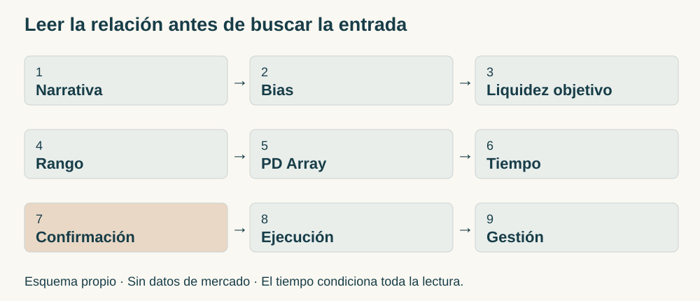
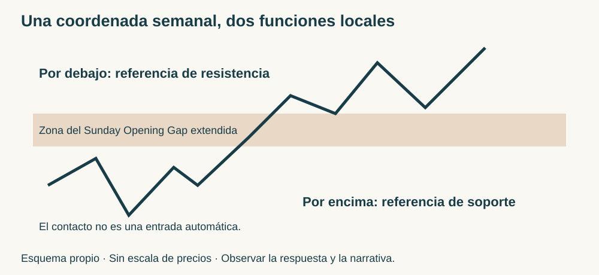
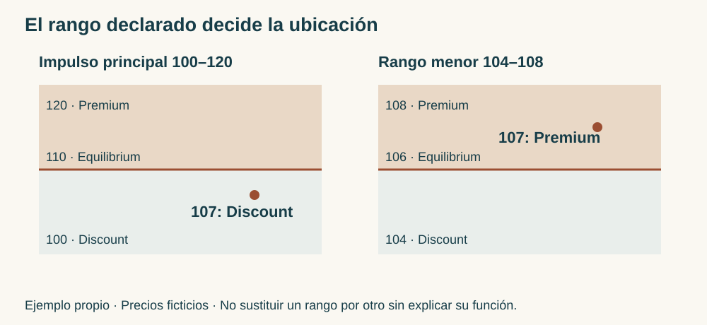
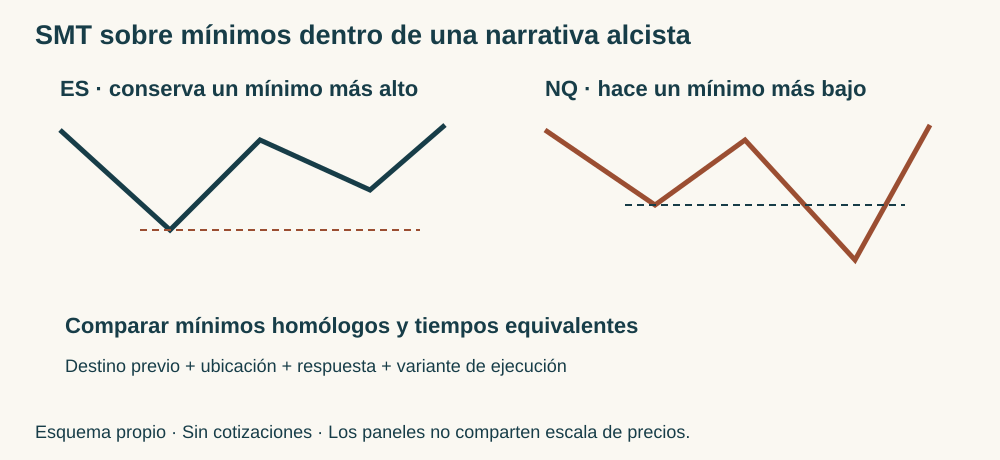

# Manual de estudio ICT · Bloque 7 · Episodios 31 a 35

## Narrativa, liquidez, rango y tiempo: construir una lectura integrada

**ICT Mentorship 2022 En Español · Bloque 7 de 8 · Edición de estudio v1.0 · 4 de octubre de 2026 · Referencia.**

El bloque 6 distinguió el destino previsto, la entrada obtenida y la gestión posterior. El bloque 7 profundiza en lo que permite seleccionar esa entrada: comprender qué recorrido interesa, qué referencia debe romperse, qué rango mide la ubicación y en qué momento se espera la respuesta. La progresión va de una venta orientada por un mínimo diario a una lectura que combina consolidación, horarios, huecos de apertura, impulsos sucesivos y comparación entre índices.

La idea que atraviesa los cinco capítulos es esta: **un Fair Value Gap, un Order Block, un nivel de liquidez o una SMT Divergence no constituyen por sí solos una operación. Su función depende de la narrativa, del contexto, del tiempo y de la confluencia.** El objetivo del lector es poder explicar esa relación antes de buscar una entrada pequeña.

Las enseñanzas se reconstruyen a partir de las cinco transcripciones suministradas. **Instructor** atribuye el razonamiento a ICT; **Desarrollo didáctico** organiza y explica las relaciones de la fuente; **Ejemplo propio** identifica escenarios ficticios. Los esquemas y ejercicios son elaboración del manual. Las referencias temporales proceden de las transcripciones; los precios que dependen de gestos sobre el gráfico se mantienen como referencias textuales, sin inventar sus anclajes. No se ha realizado cotejo audiovisual completo de estos cinco vídeos.

## Mapa del bloque y continuidad

| Episodio | Pregunta central | Aportación a la lectura integrada |
|---|---|---|
| [31](https://www.youtube.com/watch?v=Juv4nt1E7Ds) | ¿Cómo utilizar un destino diario aunque se haya perdido la apertura? | Mínimo del 16 de mayo, bloque de quince minutos, FVG y swing de entrada |
| [32](https://www.youtube.com/watch?v=34TI-vA_WI8) | ¿Qué cambia cuando el precio consolida después de un Outside Day? | Rango presente, toma de Buy-Side y regreso a la mitad entre 15:00 y 16:00 NY |
| [33](https://www.youtube.com/watch?v=SxkNMs3Nhcw) | ¿Qué quiebre merece atención dentro de una acumulación? | Nivel 3.915,25, desplazamiento, FVG y confluencia entre escalas |
| [34](https://www.youtube.com/watch?v=x5qwWJbG-eo) | ¿Cómo se conectan el Sunday Opening Gap y la elección del impulso? | Referencia semanal dinámica, preferencia de sesión y Discount del impulso alcista |
| [35](https://www.youtube.com/watch?v=qi6UKQ8N6a4) | ¿Cómo se relacionan un destino diario alcista y la SMT ES/NQ? | Mean Threshold, impulso reciente, mínimos comparables y variante temprana |

La base geométrica de swings, FVG, Premium, Discount y Equilibrium está en los [bloques 1](../bloque_1/index.html) y [2](../bloque_2/index.html). La jerarquía estructural y el Mean Threshold se trabajaron en el [bloque 3](../bloque_3/index.html). La separación entre contexto, señal y vida de una orden procede del [bloque 4](../bloque_4/index.html). El filtro del rango del impulso y la SMT se desarrollaron en el [bloque 5](../bloque_5/index.html); la fuerza relativa ES/NQ y la entrada próxima, en el [bloque 6](../bloque_6/index.html). Aquí se dedica el espacio nuevo a su utilización conjunta.

<figure><figcaption>Figura B7.1 · Esquema conceptual propio, sin cotizaciones. Ordena las preguntas de análisis; el tiempo condiciona también las fases anteriores.</figcaption></figure>

### Cómo recorrer la cadena de razonamiento

**Narrativa → Bias → Liquidez objetivo → Rango → PD Array → Tiempo → Confirmación → Ejecución → Gestión.** Narrativa es la explicación del recorrido; Bias, su orientación. La liquidez objetivo responde hacia dónde se dirige la hipótesis. El rango permite evaluar ubicación; los PD Arrays son las referencias que se utilizan dentro del marco ICT. Tiempo sitúa la oportunidad en una sesión. Confirmación describe lo que debe ocurrir para habilitar la variante elegida. Ejecución especifica la participación concreta; gestión distingue lo que se conserva, se reduce o se cierra.

Esta cadena no exige esperar siempre un nuevo MSS después de cada contacto: las fuentes muestran tanto el modelo con confirmación como entradas anticipadas o próximas. Lo que exige es **nombrar la variante y conservar sus condiciones**. Tampoco coloca el reloj al final de la preparación: una oportunidad de cierre debe planificarse con su ventana antes de que aparezca el FVG.

El Draw on Liquidity organiza el destino. Buy-Side Liquidity se refiere aquí a las compras que ICT sitúa sobre máximos; Sell-Side Liquidity, a las ventas bajo mínimos. Swing Highs y Swing Lows proporcionan referencias locales. Relative Equal Highs o Lows agrupan extremos próximos; no se añade una tolerancia numérica que estos episodios no fijan. El hecho de que todos sean niveles visibles no los vuelve equivalentes: unos orientan el contexto, otros confirman, otros sirven de salida.

## Capítulo 31 · Del mínimo diario al swing de entrada

Fuente: [episodio 31](https://www.youtube.com/watch?v=Juv4nt1E7Ds). Pasajes principales: [destino diario · 03:08](https://www.youtube.com/watch?v=Juv4nt1E7Ds&t=188s), [bloque y descenso de escala · 05:47](https://www.youtube.com/watch?v=Juv4nt1E7Ds&t=347s), [entrada y gestión · 07:04](https://www.youtube.com/watch?v=Juv4nt1E7Ds&t=424s).

### 31.1. El contexto comienza por una referencia anterior

**Instructor.** El análisis utiliza el S&P 500, contrato de junio de 2022, y comienza en el gráfico diario. La referencia es el mínimo del 16 de mayo. El precio se encuentra por encima y ICT dirige la atención hacia ese mínimo como destino de liquidez. La enseñanza se concentra en reconocer hacia dónde mirar, incluso cuando el movimiento de apertura ya ocurrió.

El mínimo citado es una fecha de la referencia, no una afirmación de que la sesión revisada sea el 16 de mayo. La transcripción no proporciona una fecha inequívoca de la jornada actual. Se conserva esa diferencia para no desplazar el ejemplo en el calendario.

**Desarrollo didáctico.** La narrativa es bajista porque conecta una posición superior con una toma por debajo de un mínimo anterior. El Draw on Liquidity es esa zona inferior; el Bias sirve para seleccionar ventas coherentes con ella. El mínimo no es el punto donde vender. Confundir destino con entrada invierte la lógica: al aproximarse al objetivo puede quedar menos recorrido, aunque la narrativa inicial siga siendo comprensible.

La clase dedica tiempo a distinguir orientación y señal: señalar un destino no proporciona al lector una entrada, un stop y una salida comunes. La tarea transferible es construir esas decisiones con los conceptos ya aprendidos. Haber perdido la apertura no obliga a perseguir la caída; permite estudiar si queda una configuración posterior mientras el destino conserva su función.

### 31.2. El bloque mayor delimita dónde estudiar la venta

**Instructor.** En quince minutos señala una vela alcista previa a la caída y la interpreta como Order Block bajista. Extiende esa zona en el tiempo y pasa a cinco minutos. La visita llega a exceder la referencia que señala, dentro de un ambiente que describe como muy volátil. Después refina la observación en una escala menor.

La función del bloque es ubicar el retorno dentro de la narrativa bajista. Su color no explica la operación por sí solo: interesan la caída asociada, la revisita y la liquidez inferior pendiente. El bloque de quince minutos y el patrón de entrada cumplen tareas distintas, como las zonas anidadas del bloque 3.

El instructor menciona el máximo de una vela para la protección al mostrar cinco minutos. Los deícticos «esta vela» y «aquí» no permiten identificar todos sus extremos desde el texto. El manual conserva la referencia funcional y no fabrica un precio exacto de stop. Tampoco convierte la incursión narrada en permiso general para ignorar una invalidación.

### 31.3. FVG, swing confirmado y ejecución

**Instructor.** En el refinamiento reconoce un FVG ya visitado y una formación de tres velas como Swing High. Espera que cierre la vela que completa el swing y describe vender en la siguiente, apoyado en el FVG, el giro y el sesgo bajista. Su objetivo continúa siendo la toma bajo el mínimo del 16 de mayo.

La secuencia expresada en este pasaje es **destino inferior → retorno a zona bajista → FVG y formación de swing → cierre que permite reconocer el swing → venta**. La transcripción no detalla aquí un nuevo MSS bajista previo a esa entrada. No se añade uno como si estuviera narrado: es una aplicación con confirmación del swing y contexto previo, que debe distinguirse de exigir una ruptura estructural nueva en cada operación del modelo básico.

La mención inicial de entrada en 4.007,75 y cuatro contratos pertenece al ejemplo del instructor. No sirve para reconstruir la distancia al stop, pues falta su precio inequívoco. El número de contratos tampoco es una regla pedagógica. Lo que interesa es que las condiciones existen antes de vender en la vela siguiente; no se selecciona después el máximo perfecto del día.

**Contexto, configuración y ejecución.** Contexto: destino diario inferior y sesgo bajista. Configuración: retorno a la zona, FVG y swing reconocido. Ejecución: venta relatada en la vela siguiente, con referencia local de protección. Separar las tres capas permite explicar por qué otra visita al mismo precio, sin el swing requerido o con el destino ya consumido, no representa automáticamente el mismo caso.

### 31.4. Espera, parciales y ajuste en alta volatilidad

**Instructor.** Tras una caída agresiva a su favor, explica mover el stop por la volatilidad. Relata una primera salida parcial y después consolidaciones y nuevas caídas. Al final aclara que no participó en la sesión posterior al almuerzo. El recorrido restante del gráfico no debe atribuirse a una posición conservada hasta el mínimo absoluto.

Hay referencias temporales que requieren cuidado: al hablar de la entrada menciona poco tiempo para la tarde, pero luego ubica la consolidación cerca del almuerzo y excluye su participación posterior. El texto no permite fijar la hora exacta de entrada. La espera verificable en su explicación es el cierre del swing; no se inventa una hora NY para esa ejecución.

El ajuste local matiza el bloque 5, donde advertía contra recortar el stop apenas aparece beneficio y proponía esperar estructura adicional. Aquí lo explica por caída agresiva y alta volatilidad. Se mantienen ambas decisiones vinculadas a sus ejemplos. La fuente no fija un umbral cuantitativo que permita unificarlas en una regla mecánica.

**Enseñanza generalizable.** Un destino previo permite seleccionar una configuración posterior sin depender de la apertura. El FVG aporta una zona, el swing aporta el momento descrito y la gestión responde al recorrido observado. La caída completa y los beneficios relatados no sustituyen esa explicación.

**Ejercicio 31 · Del destino a la decisión.** Un alumno escribe: «ICT señaló el mínimo del 16 de mayo; por tanto, debo vender inmediatamente». Explica qué capas faltan y qué tendría que esperar para reconstruir la entrada de este capítulo.

Mostrar respuesta del ejercicio 31

El mínimo identifica el destino, no la orden. Faltan la ubicación del retorno, el FVG pertinente, la formación y confirmación del Swing High, la variante de entrada y la referencia de protección. En el pasaje estudiado ICT espera el cierre que completa el swing y vende en la vela siguiente. No se añade un nuevo MSS no descrito ni se presupone una hora de ejecución. Ejercicio propio.

## Capítulo 32 · Outside Day, consolidación y regreso al equilibrio

Fuente: [episodio 32](https://www.youtube.com/watch?v=34TI-vA_WI8). Pasajes: [Outside Day · 00:41](https://www.youtube.com/watch?v=34TI-vA_WI8&t=41s), [rango y ausencia de venta · 03:46](https://www.youtube.com/watch?v=34TI-vA_WI8&t=226s), [ventana de cierre · 06:04](https://www.youtube.com/watch?v=34TI-vA_WI8&t=364s), [quiebre y parciales · 08:18](https://www.youtube.com/watch?v=34TI-vA_WI8&t=498s).

### 32.1. El Outside Day no predice por sí solo la siguiente vela

**Instructor.** El día anterior superó el máximo y perforó el mínimo de la jornada precedente, y cerró a la baja. Un **Outside Day**, o día exterior, contiene un rango que se extiende por ambos lados del rango anterior. El cierre bajista es una característica adicional del caso, no parte necesaria de la definición geométrica.

ICT observa que la siguiente jornada busca un mínimo anterior y se queda corta. En su lectura, esa falta de toma puede favorecer una jornada acumulativa o de consolidación: movimientos en ambas direcciones sin una expansión limpia. Lo presenta como contexto para interpretar la sesión, no como una venta automática después de todo día exterior bajista.

El texto menciona el mínimo diario 3.855 y una llegada a 3.856, un punto por encima. También cita 3.872,25 como referencia inferior de otro tramo y 3.933,25 como máximo señalado en una hora. Son referencias de distintas funciones; no deben combinarse arbitrariamente para calcular el rango diario. Los dos extremos exactos usados para toda la mitad diaria no quedan expresados de forma inequívoca.

### 32.2. Dos horizontes: el destino inferior y el rango presente

**Instructor.** Mantiene interés más amplio en 3.855, pero insiste en tomar cada idea con el Dealing Range presente. En una hora selecciona 3.933,25 y, en cinco minutos, describe una acción lenta y entrecortada. Hay movimientos que parecen oportunidades, pero no completan la venta de su modelo.

Esta distinción amplía la separación de escalas del bloque 6. El sesgo mayor puede conservar un destino inferior y la sesión requerir primero una visita superior o una operación limitada a su mitad. No se justifica vender todas las caídas pequeñas por el solo hecho de que el objetivo diario inferior siga pendiente.

ICT utiliza «50/50» para expresar poca claridad cerca del centro. El texto no aporta una muestra ni un cálculo de probabilidad. Aquí se conserva como descripción de indecisión: el centro no ofrece por sí solo ventaja direccional clara en la exposición. Una estadística exacta no se deduce de esa frase.

El rechazo de las ventas de mañana enseña a esperar. Un quiebre de un mínimo pequeño y un desequilibrio no bastan si el desplazamiento y la narrativa del rango no ofrecen el desarrollo buscado. La posterior subida hacia los máximos relativamente iguales muestra por qué interpretar cada fluctuación como una señal puede desordenar la lectura.

### 32.3. La hora convierte una idea amplia en una búsqueda específica

**Instructor.** Tras señalar 3.933,25 y la limpieza de máximos relativamente iguales, sitúa la búsqueda entre **15:00 y 16:00, hora local de Nueva York**. Pide estudiar la mitad del rango diario. La narrativa es una incursión sobre Buy-Side seguida de un regreso al interior, con destino inicial en esa mitad.

La ventana no sustituye al patrón; limita cuándo observarlo. La toma superior puede activar stops protectores de vendedores y compras de ruptura. Bajo los mínimos pueden situarse ventas protectoras de quienes compraron. ICT utiliza esas relaciones para explicar cómo una subida puede preceder al regreso al centro en una jornada de consolidación.

La explicación sobre el cierre de bonos y la priorización de órdenes pertenece al marco causal del instructor. No se incorpora como horario oficial universal de todos los instrumentos. El dato operativo de esta lección es la ventana concreta de observación 15:00–16:00 NY y su asociación al tipo de sesión narrado.

### 32.4. Confirmación en un minuto y objetivo próximo

**Instructor.** Baja a un minuto, señala la toma de liquidez compradora, el quiebre bajista de un Swing Low, el retroceso y el regreso a la mitad. Relata vender en 3.940,75 y sacar cuatro contratos en 3.908,75, que identifica como mitad del rango. Mantiene parte para la posibilidad de 3.855 y, más tarde, describe reducir otro tramo.

La diferencia entre los dos precios citados es 32 puntos. Su interés pedagógico es la separación entre **objetivo inicial ejecutado según el relato** y **destino ampliado todavía condicional**. El número de contratos cerrados no obliga a repetir esas cantidades. Tampoco una orden pendiente en 3.855 demuestra que ese objetivo se alcanzara durante el vídeo.

El pasaje de un minuto permite identificar quiebre y retroceso; no da bordes inequívocos de un FVG de entrada. No se dibuja un hueco ficticio sobre esa operación. La secuencia didáctica reconstruible es toma superior, respuesta bajista, giro roto, retorno y gestión hacia el centro. Para delimitar exactamente las velas del FVG haría falta el contraste visual.

La espera termina cuando coincide el contexto de consolidación, la ubicación superior, la ventana temporal y la respuesta local. Entrar en mitad del rango durante la mañana y vender tras la toma superior en el cierre son decisiones diferentes, aunque ambas tengan como referencia la misma jornada.

### 32.5. La mitad es un destino contextual, no un imán permanente

**Desarrollo didáctico.** El Equilibrium se calcula con los extremos del rango elegido. En esta lección funciona como objetivo de retorno desde un extremo de consolidación. En los capítulos 34 y 35 funcionará como frontera de ubicación para un retroceso. Su fórmula no cambia; cambia su papel en el razonamiento.

La fuente emplea expresiones fuertes sobre gravitar siempre al centro. El manual conserva la idea como expectativa del instructor para el ambiente descrito. No transforma cada sesión, ni cada 15:00, en una obligación de regreso. Si no hay toma superior y respuesta bajista, la hora por sí sola no reproduce su entrada.

**Enseñanza generalizable.** Separar destino amplio y objetivo del rango presente permite ajustar la lectura al tipo de día. La consolidación exige más selección; no exige operar todas sus oscilaciones. El tiempo precisa la oportunidad que el contexto prepara.

**Ejercicio 32 · Tres condiciones diferentes.** Son las 15:10 NY y el precio está en mitad de un rango consolidado. No ha superado los máximos ni ha roto el Swing Low señalado. ¿Se ha formado la venta del capítulo? ¿Qué papel tiene el centro?

Mostrar respuesta del ejercicio 32

No. Coincide la hora, pero faltan ubicación superior, toma de Buy-Side y respuesta local. El centro es el destino inicial del escenario explicado, no el gatillo de venta. El interés mayor en 3.855 tampoco suple esos requisitos. No se exige que toda consolidación reproduzca el caso. Ejercicio propio.

## Capítulo 33 · Escoger el quiebre y reunir confluencias

Fuente: [episodio 33](https://www.youtube.com/watch?v=SxkNMs3Nhcw). Pasajes: [referencia de giro · 01:02](https://www.youtube.com/watch?v=SxkNMs3Nhcw&t=62s), [selección estructural · 10:26](https://www.youtube.com/watch?v=SxkNMs3Nhcw&t=626s), [confluencia · 12:00](https://www.youtube.com/watch?v=SxkNMs3Nhcw&t=720s), [rango menor · 14:24](https://www.youtube.com/watch?v=SxkNMs3Nhcw&t=864s).

### 33.1. Esperar un nivel que cambie la lectura

**Instructor.** El cierre semanal finalmente toma el mínimo del 12 de mayo. Antes de esa caída, la sesión consolida, sube, ejecuta el stop de una última operación simulada que mantenía y crea el máximo del día. La referencia que quiere ver rota es **3.915,25**. Afirma que no habría actuado antes de ese giro.

Hay un vínculo con el episodio 32: el destino amplio 3.855 seguía pendiente. La clase 33 lo vuelve a utilizar y explica qué condición le permite pasar de una acumulación poco clara a una búsqueda bajista. La narrativa incluye alcanzar liquidez inferior antes del cierre semanal; el sesgo no habilita por sí solo todos los quiebres interiores.

En quince minutos selecciona ese mínimo por su papel en la estructura. Otros mínimos cortos dentro de la consolidación podían romperse y preceder a una toma de máximos relativamente iguales. No los trata como confirmaciones equivalentes. La selección protege la coherencia de la hipótesis: el giro relevante debe reducir la ambigüedad que todavía conserva el movimiento interior.

### 33.2. La escala superior aporta el quiebre; la inferior, el FVG

**Instructor.** El quiebre de 3.915,25 da la referencia en quince minutos; el FVG no se aprecia igual en ese gráfico y sí aparece en cinco minutos. La entrada que comenta utiliza la vuelta al desequilibrio después de la toma inferior. Después señala nuevas oportunidades y la continuación hacia 3.872,25 y 3.855.

El desplazamiento es la respuesta que se espera que se aleje del retorno y avance hacia la siguiente piscina de liquidez. La estructura mayor contesta qué quiebre importa; la menor permite ver el desequilibrio asociado. No hace falta que la geometría del FVG sea idéntica en ambos marcos para conservar la misma narrativa.

ICT rechaza explicar la entrada únicamente como soporte roto convertido en resistencia. En este pasaje exige que el retorno se relacione con un FVG. El nivel destaca la liquidez; el desequilibrio proporciona la zona sobre la que centra la ejecución. Sin ese elemento, dice no confiar en el simple retesteo para esta lectura.

La distinción no significa que la palabra «resistencia» esté prohibida en todo el manual: el episodio 34 la usa al explicar el hueco del domingo. Cada capítulo precisa la referencia que está describiendo. Aquí la enseñanza es que retestear una línea no reemplaza la confluencia de quiebre, destino y desequilibrio.

### 33.3. Premium en qué rango: una precisión decisiva

**Instructor.** Reconoce que el ejemplo puede parecer fuera de Premium si se mide el impulso mayor, y recuerda que no se limita al modelo básico. Al final desciende a un minuto y muestra un Dealing Range de corto plazo donde el retroceso se sitúa en el equilibrio o por encima. Lo relaciona con 3.915,25 y el desequilibrio.

Se deben conservar **dos afirmaciones**: la operación comentada puede no encajar en el filtro del impulso mayor que conoce el alumno; y el refinamiento presentado utiliza un rango menor cuya mitad sí aporta confluencia local. El segundo no borra el primero. El instructor muestra una lectura entre escalas; no demuestra que sea válido cambiar cualquier rango hasta conseguir la etiqueta deseada.

**Desarrollo didáctico.** Para reconstruirla, registra el impulso mayor, el rango de un minuto, sus funciones y el momento en que estaban disponibles. El primero sitúa el movimiento; el segundo precisa la ubicación de una variante local. Si la regla elegida por el lector sigue siendo vender solo en Premium del impulso mayor, debe mantener ese filtro y clasificar aparte el ejemplo avanzado.

La transcripción depende de extremos señalados en pantalla; no ofrece todos sus precios. Por eso no se calcula un Equilibrium histórico inventado. Se explica la diferencia de escalas con el esquema propio y se deja el anclaje exacto para cotejo visual.

### 33.4. Las compras de tarde pertenecen a otro tramo de la narrativa

**Instructor.** Tras la caída, sitúa un mínimo a las 13:30 NY y describe una recuperación hacia la mitad y la zona Premium de otro movimiento, con un PD Array superior obtenido en una hora. Después de las 15:00 menciona un retroceso a FVG y una expansión hacia esa zona de desequilibrio, donde el precio consolida hacia el cierre.

El objetivo superior de una compra puede estar en Premium del rango elegido: eso no significa que se haya comprado automáticamente por estar en Premium. Ubicación de entrada y ubicación de destino no son la misma condición. Tampoco la recuperación obliga a declarar alcista toda la semana. Se trata de un recorrido intradía distinto después de la fase bajista.

La clase relata dos ventas y compras de su hijo. No aporta una ficha completa de entrada, stop y gestión para cada una. El capítulo reconstruye la lógica de los tramos y evita convertir la lista retrospectiva en operaciones que el lector deba tomar todas. El instructor explica hipotéticamente cómo habría actuado y distingue su operación simulada anterior; no se le atribuyen todas las ejecuciones relatadas de otra persona.

### 33.5. La confluencia une funciones, no solo rectángulos

La confluencia de esta clase comprende **destino inferior, giro seleccionado, tiempo esperado, desplazamiento, FVG y ubicación del rango pertinente**. No consiste en superponer nombres al mismo precio. El nivel 3.915,25 por sí solo identifica una referencia; el FVG por sí solo identifica geometría. Su relación dentro de la narrativa explica cuándo ICT pasa de «no tengo escenario» a estudiar participación.

Los quiebres interiores iniciales se descartan porque preservan la ambigüedad de la acumulación. La entrada tras el quiebre relevante se estudia porque la secuencia ha cambiado. La recuperación de tarde se analiza con otra dirección local y otro destino. Saber esperar y saber revisar son partes del mismo razonamiento.

**Ejercicio 33 · Un rango no sustituye a otro.** Tu regla escrita exige Premium del impulso mayor 120–100. Aparece un FVG bajista 104–106. Un rango menor 102–106 lo coloca parcialmente por encima de su equilibrio 104. ¿Cumple por eso tu regla original? ¿Qué enseña la comparación con el episodio?

Mostrar respuesta del ejercicio 33

No: el equilibrio mayor es 110 y 104–106 queda en Discount de ese impulso. El rango menor puede ser pertinente para una variante de refinamiento, cuyo equilibrio es 104, pero no reemplaza el filtro mayor. El episodio muestra la necesidad de identificar ambas escalas y la variante del instructor. Si se aplica otra regla, debe conservarse como tal, sin declarar cumplida retrospectivamente la primera. Precios ficticios; ejercicio propio.

## Capítulo 34 · Sunday Opening Gap y elección del impulso

Fuente: [episodio 34](https://www.youtube.com/watch?v=x5qwWJbG-eo). Pasajes: [apertura y secuencia · 00:24](https://www.youtube.com/watch?v=x5qwWJbG-eo&t=24s), [selección de sesión · 07:29](https://www.youtube.com/watch?v=x5qwWJbG-eo&t=449s), [referencia dinámica · 09:20](https://www.youtube.com/watch?v=x5qwWJbG-eo&t=560s), [medición del impulso · 15:32](https://www.youtube.com/watch?v=x5qwWJbG-eo&t=932s).

### 34.1. Un hueco de apertura cumple otra función que un FVG

**Instructor.** Comienza con un hueco bajista en una reapertura que menciona a las 18:00 NY de la noche anterior. Después dibuja y utiliza el **Sunday Opening Gap**, hueco de apertura del domingo, como referencia extendida. La transcripción nombra esas referencias sin proporcionar todos los precios ni permitir establecer por texto si cada área señalada es exactamente el mismo intervalo.

Un hueco de apertura se relaciona con la discontinuidad entre un cierre anterior y una apertura posterior; no se delimita mediante las velas primera y tercera de un FVG. La diferencia ya estaba preparada en el capítulo 14. La novedad aquí es extender la zona de apertura del domingo a lo largo de la semana y observar cómo participa en sucesivas fluctuaciones.

**Desarrollo didáctico.** Para identificar un hueco real en el gráfico se necesitan las dos referencias de cierre y apertura, la sesión y el proveedor. En esta fuente no constan los dos precios completos. El esquema propio ilustra su función sin atribuir cifras históricas. No se reconstruyen los límites mediante el nivel 3.926,75 del FVG ni mediante el objetivo superior: son referencias diferentes.

La referencia semanal puede actuar como destino de un descenso y después como zona de regreso. Su utilidad se estudia junto a la dirección local y la reacción. No se presupone que todo hueco de domingo vaya a rellenarse ni que el precio regrese siempre: ICT menciona expresamente semanas en las que se aleja sin volver.

### 34.2. Del descenso matinal al cambio de función de la zona

**Instructor.** Describe máximos relativamente iguales, quiebre bajista y un FVG mostrado durante una sesión en vivo. La caída toma Sell-Side, cruza el gap del domingo y llega a otro FVG. En cinco minutos cita 3.926,75 en dos extremos de velas para explicar la precisión del regreso a una referencia del desequilibrio.

El dato de precisión ilustra el ejemplo, pero no constituye una regla que obligue a cada retorno a detenerse al tick. El capítulo no completa los tres extremos de esas velas ni calcula una anchura que el texto no ofrece. La enseñanza principal sigue siendo la secuencia: toma de liquidez, desequilibrio y destino contextual.

Más adelante el precio vuelve hacia la zona de apertura y su parte inferior funciona como resistencia en el relato. Tras otra caída y reacción desde un Order Block, supera el gap, retorna a él y asciende. Esa posición relativa cambia su papel: por debajo, referencia de resistencia; por encima, referencia de soporte en el vocabulario utilizado por ICT.

La función dinámica no habilita dos órdenes contrarias al mismo tiempo. Primero se identifica qué lado ocupa el precio, qué dirección local interesa y qué respuesta acompaña al retorno. La toma de un máximo corto después del bloque aporta información de cambio local; no se concluye que el gap por sí solo haya causado toda la reversión.

<figure><figcaption>Figura B7.2 · Esquema propio, sin precios históricos. Ilustra el cambio de función descrito; no representa una trayectoria obligatoria ni las velas exactas del vídeo.</figcaption></figure>

### 34.3. Ver oportunidades no obliga a elegir esa sesión

**Instructor.** Considera la mañana poco clara para lo que desea ejecutar, aunque señale movimientos potencialmente aprovechables. Prefiere el impulso hacia una referencia alrededor de 3.953. Cita 3.952,75, redondea a 3.953 y después menciona un máximo de 3.954,50. Son niveles de referencia y resultado distintos, no una promesa de tocar exactamente la cifra redonda.

La distinción entre reconocer y participar amplía la selección del capítulo 33. Un ejemplo puede tener una entrega precisa en un punto y seguir ofreciendo una estructura de sesión que no coincide con la preferencia del instructor. La precisión aislada de 3.926,75 no elimina esa decisión de descarte.

En la tarde describe mejor estructura: recupera el gap, queda inicialmente corto de máximos relativamente iguales, retorna a Discount y a un bloque de quince minutos, y luego se dirige a la referencia superior. La liquidez compradora pendiente aporta el recorrido que espera; el gap aporta una coordenada; el retroceso aporta la ubicación. Ninguna pieza sustituye a las demás.

La divergencia SMT se anuncia al inicio, pero este TXT no desarrolla una comparación identificable de ambos instrumentos. No se inventa para el 34 una secuencia ES/NQ que sí está explicada en el 35. Su mención se conserva con ese alcance.

### 34.4. Medir el impulso en la dirección que se desea operar

**Instructor.** En el tramo final corrige la selección del rango: para estudiar una compra busca un swing expansivo de mínimo a máximo y observa su retroceso al 50 % o por debajo. Para una venta, la lectura se invierte utilizando el impulso de caída. No considera ideal utilizar un tramo descendente ajeno al escenario de compra para justificar su Discount.

La enseñanza no es que invertir visualmente la herramienta de Fibonacci cambie la mitad de los mismos dos precios: (H + L) / 2 es la misma media en ambos sentidos. **Lo que importa es elegir el impulso pertinente**, no intercambiar solo el cero y el cien de la herramienta. El tramo alcista debe corresponder al avance cuya continuidad se estudia; el bajista, a la caída cuyo retorno interesa para vender.

En una narrativa alcista con máximos pendientes, el impulso de mínimo a máximo define el Dealing Range. Su Equilibrium separa Premium y Discount. Si el retroceso llega a Discount y coincide con un FVG o bloque relevante, hay una ubicación de interés. Aún deben explicarse la respuesta, la variante de ejecución y el destino superior.

<figure><figcaption>Figura B7.3 · Esquema propio con cifras ficticias. El rango 100–120 tiene equilibrio 110; el rango 104–108 tiene equilibrio 106. El precio 107 cambia de clasificación según el rango declarado.</figcaption></figure>

### 34.5. El destino superior continúa condicionado

En quince minutos ICT espera otra visita a una zona de gap; si se profundiza por encima, considera posible un recorrido diario mayor. Menciona un Order Block cuyo mínimo está en 4.000 como referencia para el resto de la semana. Es una hipótesis futura del cierre del 34, no un resultado ya obtenido en ese episodio.

El capítulo 35 retoma 4.000, lo que permite ver la continuidad narrativa sin enriquecer la predicción anterior con detalles que todavía no habían sido explicados. El vínculo entre capítulos está en la referencia y la dirección; la configuración local del 35 se estudia con sus propias condiciones.

**Enseñanza generalizable.** Una referencia semanal ayuda a leer fluctuaciones de varios días, pero la entrada se organiza con el impulso y la sesión pertinentes. La selección del rango tiene una razón direccional previa. ICT puede esperar la tarde porque ofrece lo que busca, aunque la mañana contenga figuras reconocibles.

**Ejercicio 34 · Qué cambia al invertir Fibonacci.** Con los mismos extremos 100 y 120, un alumno invierte la herramienta y afirma que 107 deja de estar en Discount. Otro sustituye esos extremos por 104 y 108. ¿Qué ha cambiado en cada caso? ¿Basta tocar el gap dominical para comprar?

Mostrar respuesta del ejercicio 34

Invertir la herramienta cambia etiquetas, no la media 110 ni la posición de 107 por debajo de ella. Elegir 104–108 cambia el rango y su equilibrio a 106: 107 queda en Premium de ese intervalo. Es necesario justificar qué impulso corresponde a la idea y cuándo se fijó. Tocar el gap dominical solo aporta una ubicación; faltan narrativa, dirección, respuesta y ejecución. Ejercicio propio con cifras ficticias.

## Capítulo 35 · Destino diario, impulso reciente y SMT ES/NQ

Fuente: [episodio 35](https://www.youtube.com/watch?v=qi6UKQ8N6a4). Pasajes: [bloque diario · 00:14](https://www.youtube.com/watch?v=qi6UKQ8N6a4&t=14s), [impulso reciente · 03:07](https://www.youtube.com/watch?v=qi6UKQ8N6a4&t=187s), [SMT y mínimos · 06:23](https://www.youtube.com/watch?v=qi6UKQ8N6a4&t=383s), [estructura y continuidad · 09:51](https://www.youtube.com/watch?v=qi6UKQ8N6a4&t=591s), [variante temprana · 13:31](https://www.youtube.com/watch?v=qi6UKQ8N6a4&t=811s).

### 35.1. Un Order Block bajista puede ser el destino de compras

**Instructor.** La lectura diaria es alcista hacia una vela alcista interpretada como Order Block bajista. El precio entra en ella y alcanza lo que llama Mean Threshold. Señala mínimo, apertura y punto medio como referencias sensibles; mantiene además atención en un máximo corto todavía no tomado.

El episodio 16 ya explicó que una zona alcista puede ser destino de una venta. Aquí aparece la relación inversa: un bloque bajista superior puede ser el destino de un avance alcista. La etiqueta del bloque no decide automáticamente la dirección de la operación que se aproxima a él. Se necesita distinguir aproximación, reacción y posible configuración posterior.

El **Mean Threshold** es una referencia del 50 % del bloque seleccionado. El bloque 3 desarrolló la mitad del cuerpo. El texto de este episodio alterna «mitad del rango», «punto medio de esa vela» y «mitad del bloque», sin expresar sus extremos de anclaje. Por eso se mantiene la referencia del 50 % indicada por ICT y queda pendiente comprobar si en esta medición usa apertura/cierre o máximo/mínimo. No se reemplaza silenciosamente una definición por otra ni se calcula un precio supuesto.

**Desarrollo didáctico.** El Equilibrium del impulso de entrada y el Mean Threshold del bloque diario son dos mitades de dos objetos distintos. La primera ayuda a situar el retroceso; la segunda es una referencia superior del destino. Que ambas se obtengan con el 50 % no las hace intercambiables.

### 35.2. Judas Swing y desarrollo del contexto alcista

En quince minutos describe la sesión anterior, máximos relativamente iguales, FVG y una mención a OTE. Luego una consolidación se prolonga hacia la transición de medianoche de Nueva York. Un pequeño Judas Swing baja, crea el mínimo del día y precede a la recuperación. La referencia alcista sigue siendo 4.000 y después la profundización en el bloque diario.

El Judas Swing cumple la función ya estudiada en los bloques 2 y 4: movimiento inicial contrario a la narrativa. No se necesita repetir toda su definición ni convertir cada caída nocturna en una compra. En esta clase se entiende junto al objetivo superior, el impulso posterior y los mínimos que se compararán.

ICT describe el mínimo del bloque como referencia y estima su apertura alrededor de 4.002, pero pide revisarla en el gráfico. El manual conserva 4.002 como estimación verbal, sin certificar ese anclaje. La llegada a 4.000 y la posterior profundización tampoco demuestran que una compra deba mantenerse hasta el máximo absoluto.

### 35.3. El impulso más reciente responde a una etapa concreta

**Instructor.** En cinco minutos compara una expansión con una sola pasada y otra formada por avance, retroceso y segunda expansión. Para la entrada que explica prefiere el impulso más reciente. Lo mide de mínimo a máximo, sitúa Equilibrium y busca un retroceso a Discount que coincide con un FVG visible en temporalidad menor.

La elección desarrolla el capítulo 34: además de utilizar un impulso de la dirección buscada, hay que explicar **qué etapa de la entrega se mide**. Tomar todo el movimiento compuesto y tomar su último tramo pueden cambiar ubicación y referencia local. No se elige el tramo más reciente únicamente porque favorezca una entrada ya conocida; en la explicación responde a la segunda fase cuya continuación desea estudiar.

El precio vuelve al FVG alrededor de 08:30 y después expande a las 09:30, en hora NY. La fuente contiene «88:30» y «99:30»; el contexto de las aperturas permite normalizarlos en el texto didáctico. No se alteran esas formas en el original. Tampoco se traslada automáticamente a este capítulo la ventana 15:00–16:00 del 32.

### 35.4. Comparar mínimos, no una línea de cierres

**Instructor.** Compara el S&P con NQM2022, Nasdaq de junio de 2022. Indica que una línea de comparación suele mostrar cierres y la cambia a mínimos porque está comparando mínimos. Nasdaq hace un mínimo más bajo mientras S&P conserva uno más alto. Esa falta de confirmación es la **SMT Divergence** que integra en el Bias alcista.

Lo nuevo no es la geometría de SMT, ya trabajada en 22 y 29, sino su relación con el tipo de dato. Una línea de cierres puede omitir la incursión intravela que interesa. Para reproducir este ejemplo deben compararse mínimos de intervalos homólogos, contratos identificados y tiempos equivalentes. La fuente describe una selección de datos en la interfaz histórica; no se añade una guía de la interfaz actual.

La referencia a correlación significa que ICT espera movimientos relacionados y observa una discrepancia puntual. No aporta un coeficiente estadístico ni significa que los dos índices tengan idénticos mínimos. ES conserva fortaleza relativa y NQ aporta el contraste; el instrumento elegido para la entrada sigue siendo ES.

ICT añade un filtro explícito: sin saber hacia dónde busca el precio, una divergencia aparente puede desaparecer y ambos índices volver a moverse a la par. **La SMT refuerza una narrativa que ya existe; no la crea automáticamente.** Tampoco proporciona por sí sola la distancia al stop ni el precio de salida.

<figure><figcaption>Figura B7.4 · Esquema propio sin cotizaciones ni escala compartida. Ilustra mínimos homólogos; no reconstruye los gráficos reales ni representa una correlación medida.</figcaption></figure>

### 35.5. La entrada temprana y la entrada ideal no son lo mismo

**Instructor.** Reconoce que perdió la entrada ideal y utilizó una Close Proximity Entry vinculada a un Order Block. Su objetivo del clip era 4.000. Después explica que su participación temprana está fuera del horario del modelo básico que venía enseñando y que su repertorio no se limita a ese modelo.

La clase combina la demostración de una entrada temprana, un retorno a FVG, la comparación SMT y la expansión posterior de las 09:30. El texto no proporciona todos los fills ni bordes exactos para afirmar que él ejecutó en cada uno de esos momentos. La lectura de oportunidades y la operación relatada se conservan por separado.

El concepto de entrada próxima continúa el bloque 6. La fuente no cuantifica una tolerancia universal a la zona. Perder la entrada ideal no convierte cualquier compra posterior en equivalente: cambian el recorrido restante y la distancia de protección. La justificación de ICT es narrativa y experiencia en una variante; no modifica automáticamente el horario del protocolo básico del lector.

Tras un movimiento temprano, antes de las 07:00 o cerca de esa hora, el instructor espera que pueda producirse un retroceso profundo y una SMT alrededor de 09:30 para otro impulso. Es una expectativa condicional, no una obligación diaria. Permite organizar la espera: movimiento temprano, retroceso potencial, comparación al abrir y confirmación del recorrido siguiente.

### 35.6. Por qué descarta defender una venta contra el contexto

En una hora reconstruye un mínimo dramático, recuperación, MSS alcista y retorno al desequilibrio. Después se suceden retrocesos a Discount, FVG y bloques, con velas bajistas que en su lectura sostienen el avance. El objetivo continúa siendo profundizar en el rango diario y alcanzar Buy-Side superior.

ICT llama **High Resistance Liquidity Run**, recorrido hacia liquidez con alta resistencia, a la caída que tendría que atravesar esas referencias de sostén. No afirma que sea imposible. Explica por qué no es el recorrido que favorece: una venta exigiría superar varias condiciones contrarias a su narrativa y al Order Flow alcista que observa.

Esto conecta contexto y descarte. Ver un máximo o un bloque bajista superior no basta para anticipar una venta si la estructura menor sigue avanzando hacia él. Una operación contraria necesitaría una narrativa y una confirmación distintas. La confluencia alcista no consiste solamente en contar FVG: incluye destino diario, impulsos pertinentes, Discount y fortaleza relativa.

La espera aparece en la compresión antes de la expansión; la actuación relatada, en una variante temprana próxima a una zona. La gestión se orienta al objetivo 4.000. Los niveles posteriores alrededor de 4.074, 4.095 y 4.100 son referencias de extensión comentadas; no se atribuyen como salidas ejecutadas de su operación.

### 35.7. Calendario del ejemplo y continuidad

El cierre sitúa la lección en un jueves anterior a Memorial Day. ICT anuncia que no operará el viernes ni el lunes y espera menor participación en la tarde previa al fin de semana largo. Se conserva como decisión del ejemplo histórico; no se añade una regla de abstención para todas las vísperas festivas ni un calendario vigente.

**Enseñanza generalizable.** El destino diario explica el sesgo; el impulso reciente explica el rango; Discount y el PD Array explican la ubicación; la SMT compara una respuesta entre índices; la variante determina cuándo y cómo participa. El objetivo local puede ejecutarse antes de que termine el escenario diario.

**Ejercicio 35 · Una divergencia sin narrativa.** Nasdaq hace un mínimo inferior y S&P uno superior. El lector no tiene destino definido, ha comparado líneas de cierres y quiere comprar «porque hay SMT». Identifica tres problemas. ¿Puede justificar su entrada temprana con el horario del modelo básico?

Mostrar respuesta del ejercicio 35

Falta la narrativa y el destino que dan dirección a la comparación; una línea de cierres no verifica los mínimos intravela del ejemplo; y la discrepancia por sí sola no especifica configuración ni ejecución. Hace falta comprobar puntos homólogos y datos sincronizados. La entrada temprana del instructor se identifica como variante fuera del horario básico; no es una ampliación automática de ese horario. Ejercicio propio.

## Síntesis transversal · Una misma lógica, decisiones diferentes

### De un destino a una oportunidad seleccionada

El 31 muestra que una referencia diaria puede conservar utilidad después de la apertura perdida. El 32 muestra que un destino amplio pendiente no elimina la necesidad de adaptarse al rango consolidado. El 33 precisa qué quiebre cambia la lectura. El 34 conecta una coordenada semanal con impulsos de sesión. El 35 reúne destino diario, rango reciente y comparación ES/NQ.

No hay una colección de cinco patrones independientes. Hay preguntas recurrentes: **qué queda pendiente, qué se ha consumido, qué movimiento organiza el rango, qué tiempo interesa y qué respuesta falta**. Un FVG cambia de función según sea destino contextual, zona de retorno o elemento del desplazamiento que confirma. La palabra por sí sola no dice qué hacer.

### Relaciones entre conceptos

| Relación | Qué aporta cada pieza | Aplicación del bloque |
|---|---|---|
| Narrativa y Bias | Explicación del recorrido y orientación condicionada | Mínimo anterior en 31; bloque diario superior en 35 |
| Liquidez y swing | El destino depende de la jerarquía y estado de sus extremos | Giro 3.915,25 frente a mínimos interiores en 33 |
| Rango y Equilibrium | Los extremos declaran qué mitad se está utilizando | Centro como salida en 32; frontera de Discount en 34–35 |
| PD Array y desplazamiento | Una zona interesa por el movimiento que la conecta al escenario | Bloque y FVG en 31; quiebre y FVG en 33 |
| Tiempo y precio | La ventana precisa dónde buscar una respuesta | 15:00–16:00 en 32; impulso temprano y 09:30 en 35 |
| Gap y dirección local | La posición respecto al hueco cambia su función observada | Referencia dominical por debajo y por encima en 34 |
| SMT y narrativa | La discrepancia compara respuestas; el destino define su utilidad | ES conserva mínimos frente a NQ en 35 |
| Ejecución y gestión | Entrada, parcial y extensión son decisiones distintas | Centro y remanente a 3.855 en 32; objetivo 4.000 en 35 |

### Cuándo espera y cuándo actúa

| Episodio | Qué hace esperar | Qué habilita la participación descrita o estudiada |
|---|---|---|
| 31 | Swing todavía en formación; apertura ya perdida | FVG visitado, swing confirmado y destino bajista previo |
| 32 | Centro ambiguo y secuencias matinales poco claras | Toma de Buy-Side y respuesta bajista en la ventana de cierre |
| 33 | Quiebres pequeños que no resuelven la consolidación | Quiebre de 3.915,25, desplazamiento y FVG pertinente |
| 34 | Mañana que no ofrece la estructura preferida | Recuperación de referencias, retroceso del impulso y destino superior |
| 35 | Retroceso y compresión dentro de una narrativa alcista | Confluencia local; la entrada temprana relatada es una variante propia |

En 34, «habilita» describe la lógica del escenario preferido, no certifica una ejecución personal completa. En todos los capítulos, reconstruir lo que ICT ve debe conservar la diferencia entre explicación, intención y operación relatada.

## Errores habituales y malas interpretaciones

1. **Vender porque se señaló un mínimo.** En 31 el mínimo es destino; la entrada exige su propia zona y momento.
2. **Tomar el Outside Day como señal suficiente.** En 32 interesa junto al cierre bajista y al desarrollo consolidado posterior.
3. **Buscar entrada en el centro porque el centro es objetivo.** El retorno explicado parte de una toma superior y una respuesta, dentro de un horario.
4. **Dar el mismo peso a todos los quiebres.** En 33 los mínimos internos no sustituyen al giro que el instructor selecciona.
5. **Confiar en el retesteo de una línea sin el desequilibrio pertinente.** El 33 exige confluencias, no una etiqueta aislada de soporte roto.
6. **Cambiar de rango hasta obtener Premium o Discount.** El 33 distingue refinamiento entre escalas; 34 y 35 justifican el impulso por su función.
7. **Confundir Sunday Opening Gap y FVG.** Sus construcciones son distintas y pueden coexistir con tareas diferentes.
8. **Creer que invertir Fibonacci cambia el equilibrio de los mismos extremos.** Cambian etiquetas; la ubicación solo cambia si cambia el intervalo elegido.
9. **Comprar cualquier SMT.** El 35 exige saber qué se busca y comparar los mínimos adecuados.
10. **Vender automáticamente al alcanzar un bloque bajista superior.** En 35 es destino de compras; la reacción posterior sería otro escenario.
11. **Adoptar todos los horarios y variantes del instructor como una sola regla.** La ventana del 32 y la entrada temprana del 35 tienen contextos diferentes.
12. **Atribuir al plan el máximo recorrido posterior.** Los parciales y el objetivo ejecutado deben distinguirse de la extensión analítica.

Estas correcciones recogen problemas señalados o tratados en las fuentes. El manual los organiza para revisión; no añade filtros cuantitativos ajenos a los capítulos.

## Checklist práctico · Leer antes de buscar la entrada

**Organización didáctica derivada de estos episodios y de los bloques anteriores.** Se utiliza para reconstruir el razonamiento, conservando la variante elegida.

- [ ] Identifico instrumento, contrato, escala y hora de Nueva York; separo la fecha del ejemplo de la fecha del nivel anterior.
- [ ] Escribo la narrativa y el Bias con horizonte: aproximación a mínimo, regreso al centro o avance hacia una zona diaria.
- [ ] Marco la liquidez objetivo y distingo niveles pendientes de los ya visitados.
- [ ] Clasifico el contexto que muestra la fuente: expansión, consolidación, Outside Day precedente o hueco de apertura.
- [ ] Declaro los extremos y la función del Dealing Range; si hay otro rango menor, lo registro por separado.
- [ ] Distingo Equilibrium del rango, Mean Threshold del bloque y límites del gap; no uso una mitad para sustituir otra.
- [ ] Identifico qué PD Array pertenece al escenario: bloque mayor, FVG de confirmación o referencia semanal.
- [ ] Sitúo la ventana pertinente; 15:00–16:00 se aplica al caso de cierre estudiado, no a toda oportunidad del bloque.
- [ ] Especifico qué confirmación exige la variante: swing confirmado, quiebre relevante, desplazamiento y/o respuesta desde la zona.
- [ ] Si utilizo SMT, comparo los mismos tiempos y mínimos o máximos homólogos; mantengo la narrativa previa.
- [ ] Explico qué descarto: objetivo consumido, estructura ambigua, rango inadecuado, señal incompleta o entrada ideal perdida.
- [ ] Separo entrada en zona y Close Proximity; no doy por definida una distancia que la fuente no cuantifica.
- [ ] Distingo protección inicial, ajuste, parcial y destino ampliado; no atribuyo recorridos posteriores a unidades ya cerradas.
- [ ] Registro espera, ausencia de entrada y límites de reconstrucción cuando el texto no identifica la vela o el precio.

## Taller de cierre · Unir las piezas sin cambiar su función

**Ejercicio propio. Todos los precios siguientes son ficticios; no reconstruyen una operación del instructor.**

### Caso A · Consolidación y ventana de cierre

El día anterior fue exterior y cerró a la baja. A las 14:50 NY, la sesión actual conserva un rango conocido 100–120 y no ha visitado un destino diario inferior en 96. Los máximos relativamente iguales cercanos a 120 siguen pendientes. La idea del ejercicio es estudiar un regreso al centro después de una toma superior en la ventana 15:00–16:00.

A las 15:08 el precio supera 120 y llega a 121. Después rompe con desplazamiento un mínimo corto previamente marcado; deja un FVG bajista confirmado 117–118 y vuelve a esa zona a las 15:18. Para esta práctica se fija una venta hipotética en 117,5, invalidación en 121,5 y salida inicial en el centro del rango conocido. Estos precios y la regla exacta son supuestos del ejercicio.

Calcula el centro y las distancias de la entrada a invalidación y salida. Explica por qué 96 no es necesariamente el primer objetivo. Clasifica estos finales: no hay retroceso al FVG; hay entrada y stop; se alcanza el centro y queda un remanente para 96. ¿Qué cambiaría si no se rompiera el mínimo marcado?

Mostrar solución del caso A

El centro del rango fijado es 110. Desde 117,5 a 121,5 hay 4 puntos de distancia; hasta 110 hay 7,5. La relación bruta de recorrido/distancia es 1,875. No se calculan importes sin contrato y cantidad. El objetivo diario 96 pertenece al escenario ampliado: la narrativa local estudia primero retorno al centro.

Sin retroceso hay escenario sin entrada. Con entrada y stop hay pérdida de la práctica bajo sus reglas, aunque luego baje. Al llegar a 110 se registra lo cerrado allí y se separa el remanente; no se adjudica 96 a toda la posición. Si falta la ruptura exigida, la práctica no tiene confirmación. El FVG y la hora no reemplazan esa condición. El centro se mantuvo como referencia previa del ejercicio; no se recalcula con extremos futuros.

### Caso B · Impulso alcista y comparación de mínimos

Una narrativa alcista tiene como referencia superior un bloque diario y un máximo pendiente. ES avanza de 100 a 120, retrocede y realiza una segunda expansión de 112 a 126. Se elige previamente este último impulso para estudiar su continuación. Un FVG contextual del ejemplo está en 116–118. En un retroceso, NQ perfora su mínimo comparable y ES conserva el suyo. Los dos gráficos están sincronizados y comparan mínimos.

Calcula el Equilibrium del impulso reciente. Explica la función del FVG, de la SMT y del bloque diario. Un lector propone cambiar al rango 100–126 solo para que otra entrada cumpla su criterio; otro compra fuera del horario de su modelo porque ICT lo hizo en el 35. Identifica qué debe documentarse en ambos casos.

Mostrar solución del caso B

El equilibrio de 112–126 es 119; la zona 116–118 está en Discount de ese impulso. El FVG sitúa una región de observación; SMT compara una respuesta coherente con el sesgo; el bloque diario participa en el destino, no se convierte automáticamente en la entrada. Faltan todavía la confirmación y las reglas de ejecución de la variante elegida.

El rango 100–126 tiene centro 113 y cumple otra función. Cambiarlo exige una razón vinculada al impulso y una revisión registrada; no basta querer justificar el precio. La entrada temprana del 35 pertenece a una variante fuera del modelo básico. Adoptarla requiere identificar esa variante y sus condiciones; no declarar que se respetó el horario original.

### Caso C · Tres referencias del 50 %

En un esquema ficticio, el rango diario va de 90 a 130; el impulso de entrada, de 100 a 120; un bloque tiene apertura 124 y cierre 128, y extremos 122 y 132. Calcula las tres mitades identificables y explica qué duda conservarías al reconstruir el Mean Threshold del episodio 35.

Mostrar solución del caso C

Equilibrium diario: 110. Equilibrium del impulso: también 110 en este ejemplo, por coincidencia de números; siguen siendo rangos distintos. Mitad del cuerpo del bloque: 126. Mitad de su rango máximo/mínimo: 127. En el episodio 35 el texto no determina inequívocamente los límites empleados para la mitad del bloque. Se registra esa duda y se verifica la figura antes de asignar un Mean Threshold histórico exacto. La coincidencia aritmética de las dos primeras mitades no convierte sus funciones en iguales.

## Glosario incremental · Nuevas funciones, sin repetir el vocabulario base

| Término | Aportación o precisión del Bloque 7 |
|---|---|
| Outside Day · día exterior | Máximo superior y mínimo inferior a los del día previo; el cierre bajista es adicional en el ejemplo 32 |
| Consolidation Day · día de consolidación | Rango poco direccional en el que 32 estudia toma superior y regreso al centro dentro de una ventana concreta |
| Sunday Opening Gap | Hueco de apertura del domingo extendido durante la semana como referencia dinámica en 34; distinto del FVG |
| Mean Threshold | Referencia media del bloque diario en 35; conservar la duda de anclaje entre cuerpo y rango de vela en el texto recibido |
| High Resistance Liquidity Run | Recorrido hacia liquidez que tendría que atravesar varias referencias contrarias; 35 lo usa al descartar la caída como escenario preferido |
| SMT sobre mínimos | Comparación de extremos inferiores homólogos; una línea de cierres no identifica necesariamente la incursión que se estudia |
| Dealing Range reciente | Tramo expansivo elegido por su función dentro de un movimiento compuesto; 35 prefiere la última etapa para su entrada |
| Equilibrium como destino | En 32 la mitad sirve de salida local; en 34–35 separa la ubicación del retroceso. La fórmula es la misma |

## Fuentes y decisiones editoriales

### Cinco fuentes originales y correspondencia

| Episodio | Archivo original en 01_Fuentes/ICT | Vídeo | Marcas del texto |
|---|---|---|---|
| 31 | ICT_2022_Episodio_31_original.txt | [Juv4nt1E7Ds](https://www.youtube.com/watch?v=Juv4nt1E7Ds) | 00:07–09:39 |
| 32 | ICT_2022_Episodio_32_original.txt | [34TI-vA_WI8](https://www.youtube.com/watch?v=34TI-vA_WI8) | 00:07–19:04 |
| 33 | ICT_2022_Episodio_33_original.txt | [SxkNMs3Nhcw](https://www.youtube.com/watch?v=SxkNMs3Nhcw) | 00:06–15:58 |
| 34 | ICT_2022_Episodio_34_original.txt | [x5qwWJbG-eo](https://www.youtube.com/watch?v=x5qwWJbG-eo) | 00:07–18:34 |
| 35 | ICT_2022_Episodio_35_original.txt | [qi6UKQ8N6a4](https://www.youtube.com/watch?v=qi6UKQ8N6a4) | 00:06–16:19 |

Las marcas finales no certifican la duración ni la integridad audiovisual. El 32 incluye título y URL. Los archivos 31, 33, 34 y 35 conservan la asignación documental por contexto de entrega y contenido registrada en el proyecto; no contienen todos esos identificadores en su encabezado. Los enlaces se mantienen según la correspondencia expresa del usuario. El 34 aparece una sola vez y el 35 utiliza su enlace propio.

La reconstrucción utiliza exclusivamente las transcripciones para las enseñanzas nuevas; las remisiones a bloques anteriores sirven de continuidad conceptual. No se sustituyó contenido por explicaciones de Internet. Las huellas de los originales, la tabla completa 1–35 y los límites de identificación se conservan en el registro del proyecto y en [la auditoría documental](../../../00_Organización/AUDITORIA_ICT_01_35_2026-10-04.md).

### Normalizaciones efectuadas solo en el texto derivado

Se normalizan deformaciones inequívocas por contexto: «Favela», «Ferrari», «farayuca» y variantes a Fair Value Gap; «vayas», «vallas» o «bayas» a Bias; «celsite» a Sell-Side; «by Side» a Buy-Side; «swinghai» y «swing glow» a Swing High y Swing Low; «dilling» o «deing Range» a Dealing Range; «me threshold» o «min threshold» a Mean Threshold; «Juda swing» a Judas Swing; variantes de «order block» al término técnico. «88:30» y «99:30» se leen como 08:30 y 09:30 en 35 porque el pasaje identifica esas referencias de apertura. Los originales permanecen intactos.

No se reparan cifras ambiguas de saldos, el «39 10» final del 31 ni los anclajes visuales ausentes. «FOMC» no se inserta en 34 como identificación segura del evento deformado en el texto. Las cifras monetarias y polémicas se reducen para mantener el foco en el razonamiento. La mención de 50/50 del 32 se conserva como incertidumbre expresada, sin convertirla en probabilidad medida.

### Pasajes que requieren cotejo humano para reconstrucción exacta

| Pasaje | Qué debe comprobarse en pantalla | Alcance de la duda |
|---|---|---|
| [31 · 06:22–07:34](https://www.youtube.com/watch?v=Juv4nt1E7Ds&t=382s) | Temporalidad final, velas del swing y referencia exacta de stop | No se completa una ficha de ejecución con precios supuestos |
| [32 · 06:53–09:11](https://www.youtube.com/watch?v=34TI-vA_WI8&t=413s) | Extremos del rango diario y FVG de la ejecución | 3.908,75 se conserva como mitad citada, sin deducir sus anclajes |
| [33 · 13:33–15:04](https://www.youtube.com/watch?v=SxkNMs3Nhcw&t=813s) | Impulso mayor y rango menor de un minuto | Preservar la diferencia entre modelo básico y refinamiento |
| [34 · 00:30–01:49](https://www.youtube.com/watch?v=x5qwWJbG-eo&t=30s) | Límites y relación de los huecos de apertura señalados | No se identifica por conjetura toda zona como el mismo gap |
| [35 · 00:39–01:13](https://www.youtube.com/watch?v=qi6UKQ8N6a4&t=39s) | Límites utilizados para Mean Threshold | Resolver cuerpo frente a máximo/mínimo de la vela |

El cotejo pendiente afecta a precios, anclajes y atribución audiovisual exactos, no a la presencia de los cinco capítulos ni a la reconstrucción conceptual desde las fuentes disponibles.

## Estado del manual y siguiente bloque

**Bloques 1–7 completados e incorporados. Episodios cubiertos: 1–35**, conservando la introducción como capítulo 1 editorial y la fuente visual documentada del 28. La numeración sigue los episodios, no las posiciones de la lista. Las incidencias históricas se conservan en la auditoría; no se renumera ningún capítulo.

Este Bloque 7 reúne mapa, cinco capítulos, síntesis, relaciones, errores, checklist, cinco ejercicios y taller de tres casos con respuestas desplegables, glosario incremental y fuentes. HTML, Markdown y cuatro esquemas locales forman una unidad documental. **Próximo bloque: Bloque 8, episodios 36–41**, pendiente de sus fuentes y elaboración.
