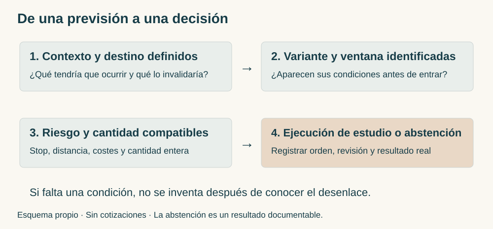
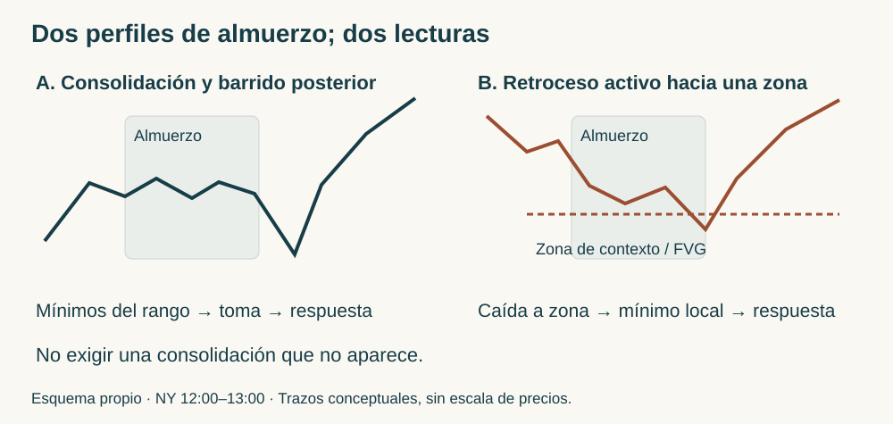
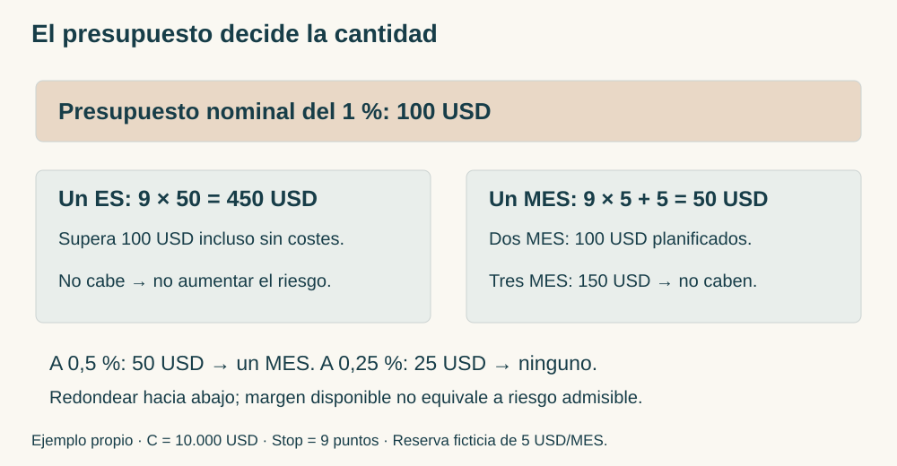
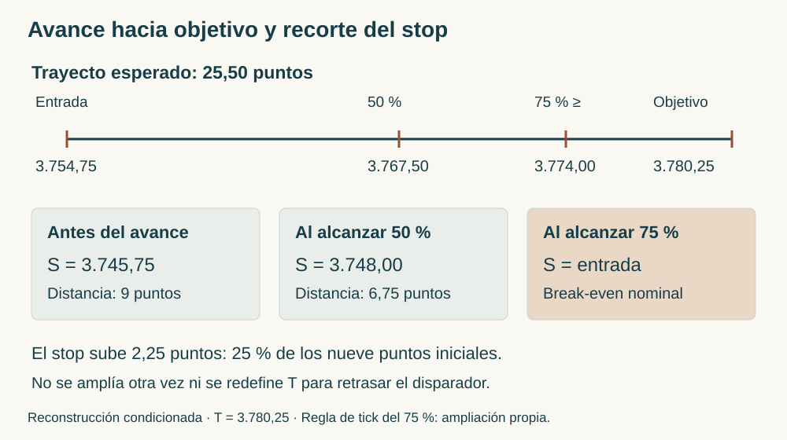

# Manual de estudio ICT · Bloque 8 · Episodios 36 a 41

## De la narrativa revisable al riesgo medido

**ICT Mentorship 2022 en Español · Bloque 8 de 8 · Edición de estudio v1.0 · 5 de octubre de 2026 · Referencia.**

El último bloque completa la colección con seis capítulos. La cuestión ya no es reconocer más rectángulos en el gráfico, sino decidir qué hacer cuando el destino previsto no llega, cuando el mercado cambia de dirección o cuando una operación válida pierde. La disciplina se concreta en seleccionar la sesión, distinguir variantes, calcular exposición y conservar un registro que pueda contradecir la idea inicial.

La secuencia del bloque es progresiva: 36 muestra lectura alcista y abstención posterior; 37 enlaza contexto diario, noticias y diario de aprendizaje; 38 explica la revisión del sesgo y una variante de rango diario; 39 desarrolla continuación bajista y especialización en oportunidades temporales; 40 relaciona calendario, expansión semanal, Forex e índices; 41 cierra con dimensionamiento, drawdown y desplazamiento del stop.

**Instructor** identifica lo afirmado en las transcripciones. **Desarrollo didáctico** explica las relaciones sin añadir reglas atribuidas. **Ampliación del manual** propone criterios para estudiar o evaluar. **Ejemplo propio** señala cifras ficticias. Los seis textos se han leído completos; las fuentes permanecen intactas. No se ha realizado cotejo audiovisual completo. Los errores numéricos y los gestos que el texto no permite localizar se documentan al final.

La colección enseña el marco de ICT; no acredita una ventaja estadística ni certifica resultados de cuentas. «Algoritmo», «Smart Money» y «acumulación real» expresan su interpretación de la entrega del precio. La forma de una vela o una divergencia entre índices no identifica por sí sola quién negoció, cuántas órdenes había ni la causa del movimiento.

## Mapa del bloque y conexión con el manual

| Capítulo | Pregunta que resuelve | Aportación principal |
|---|---|---|
| 36 | ¿Puede una lectura acertada convivir con un stop y con dejar de operar? | Rango declarado, barridos sucesivos, revisión del MSS y ausencia de destino claro |
| 37 | ¿Qué se estudia cuando no conviene ejecutar? | Power of Three, NFP y diario que separa retrospectiva de anticipación |
| 38 | ¿Cómo abandonar un objetivo sin improvisar una entrada contraria? | Evidencia de cambio de sesgo, FVG de quince minutos, almuerzo y variante discrecional |
| 39 | ¿Una toma de liquidez obliga a girar? | Continuación bajista, Breaker, ventanas temporales y especialización |
| 40 | ¿Hay que conocer el sesgo de cada día? | Expansión semanal, calendario, USD/CAD, jerarquía de escalas y relaciones intermercado |
| 41 | ¿Cómo convertir una entrada en una exposición calculada? | Stop inicial, ES/MES, riesgo reducido después de perder y avance del stop |

Los [bloques 1](../bloque_1/index.html) y [2](../bloque_2/index.html) introducen swings, liquidez, FVG, rangos y Power of Three. El [bloque 3](../bloque_3/index.html) distingue invalidación de entrada y de contexto; el [4](../bloque_4/index.html), destino, confirmación y vida de una orden. El [5](../bloque_5/index.html) desarrolla selección del FVG, SMT y protección. El [6](../bloque_6/index.html) separa objetivo, ejecución y registro honesto. El [7](../bloque_7/index.html) organiza narrativa, rango, tiempo y confluencia. Este bloque incorpora la gestión final y vuelve a examinar todas esas funciones cuando el mercado no hace lo esperado.

<figure><figcaption>Figura B8.1 · Esquema propio sin cotizaciones. Una previsión no se convierte en operación hasta resolver configuración, exposición y ejecución.</figcaption></figure>

### Vocabulario mínimo para seguir la lectura

**Bias** es el sesgo direccional de una hipótesis; **Draw on Liquidity**, el destino de liquidez que la orienta. **Buy-Side Liquidity** es la liquidez del lado comprador que ICT infiere sobre máximos; **Sell-Side Liquidity**, la del lado vendedor bajo mínimos. **Market Structure Shift, MSS**, designa un cambio local de estructura asociado a un desplazamiento; una ruptura apenas visible no proporciona por sí sola la calidad que buscan estas clases.

**Fair Value Gap, FVG**, es la zona entre extremos de la primera y tercera de una secuencia de tres velas: en el caso alcista, máximo de la primera por debajo del mínimo de la tercera; en el bajista, mínimo de la primera por encima del máximo de la tercera. La vela central recorre el intervalo: no se describe un espacio en el que nunca se negoció. **Order Block, OB**, es la vela o grupo de velas que el instructor utiliza como referencia de entrega del precio dentro de su contexto; no todo cambio de color constituye un bloque útil.

**Dealing Range** es el rango elegido para una decisión. **Equilibrium** es su mitad; **Premium**, la zona superior; **Discount**, la inferior. **PD Array** reúne referencias de prima o descuento en el vocabulario ICT. Debe declararse el máximo y el mínimo: un mismo precio puede estar en prima en un rango y en descuento en otro. **Optimal Trade Entry, OTE**, designa aquí el retroceso de 62–79 % del impulso indicado. Ese porcentaje mide el retroceso, no la probabilidad de éxito.

## Capítulo 36 · Una lectura alcista no elimina el stop ni la abstención

Fuente: [episodio 36](https://www.youtube.com/watch?v=J7O6WHWJF_E). Pasajes: [rango · 01:03](https://www.youtube.com/watch?v=J7O6WHWJF_E&t=63s), [apertura y barridos · 02:29](https://www.youtube.com/watch?v=J7O6WHWJF_E&t=149s), [shift y rango · 05:01](https://www.youtube.com/watch?v=J7O6WHWJF_E&t=301s), [abstención · 08:24](https://www.youtube.com/watch?v=J7O6WHWJF_E&t=504s).

### 36.1. Contrato, rango y posición relativa

**Instructor.** Utiliza el E-mini S&P 500 de junio de 2022. El mes del contrato no debe confundirse con el mes del calendario de la sesión. En una hora delimita un swing low y un swing high; la caída llega a un FVG por debajo de su equilibrio. Llama descuento a esa ubicación y explica que la herramienta Fibonacci solo muestra el 50 %.

La explicación de «sobrevendido» pertenece a su lectura del rango: no utiliza aquí un oscilador ni proporciona una definición estadística de exceso. Lo verificable es que el precio está en la mitad inferior del rango señalado y visita una referencia. Eso no obliga a comprar: necesita una narrativa y una respuesta local. Si se eligiese otro máximo o mínimo, cambiaría la clasificación; no se puede sustituirlos después de ver el giro sin dejar constancia.

En cinco minutos aparece primero una subida a prima y después una caída que toma mínimos relativamente iguales. El contexto mayor puede admitir recuperación, aunque la primera respuesta de apertura sea bajista. La ubicación de una hora describe dónde estudiar; las velas pequeñas muestran qué sucede allí. Son funciones complementarias.

### 36.2. Los barridos sucesivos no son señales acumulables

**Instructor.** En la apertura menciona una primera toma de mínimos, un rebote y una nueva incursión inferior que saca compradores. Después se produce un shift, una subida y un retroceso a un FVG de cinco minutos. Su referencia superior es el máximo de la mañana.

La transcripción escribe «99:30»; el contexto de apertura permite normalizarlo a 09:30 NY en el texto derivado. Esa hora de sesión no es una marca del vídeo. Se mantiene el original sin corregir. La secuencia pedagógica es: zona mayor → toma de liquidez → respuesta y ruptura local → retorno a desequilibrio → destino superior. Comprar únicamente porque se tomó el primer mínimo elimina varias condiciones.

Los barridos revelan también el coste de entrar temprano: una narrativa alcista puede sobrevivir mientras una entrada concreta es invalidada. El episodio relata una compra con retroceso adverso y un stop bajo un swing low que se activa; luego el mercado acaba subiendo. Ese desenlace no convierte el stop en error automático. El stop limita la operación definida, no garantiza conservar toda recuperación posterior.

### 36.3. ¿Qué máximo confirma el shift?

**Instructor.** Reconoce que dos rupturas próximas pueden confundir al estudiante. Responde remitiéndose al rango que estaba trabajando: el shift pertenece al máximo relevante de esa secuencia, tras el que compró el retorno al FVG. Más tarde aparece otra limpieza de mínimos y otra oportunidad.

**Desarrollo didáctico.** El MSS debe tener un referente nombrado y conocido antes de la ruptura. Un máximo menor puede confirmar una entrada local sin cambiar todavía una estructura mayor. No se elige cualquier máximo roto para hacer encajar el ejemplo. En una ficha de estudio se registra el máximo cuya ruptura interesa, el impulso que lo rompe, el FVG producido y el mínimo de invalidación de esa variante.

No se exige que todos los casos tengan una sola ruptura idéntica: esta fuente muestra etapas. Tampoco se permite explicar retrospectivamente cada stop con «escogí mal el swing» sin comprobar qué se había previsto. Si no se puede localizar el swing por los deícticos de la transcripción, la explicación conserva la función y el cotejo visual queda pendiente.

### 36.4. Parciales y decisión de terminar la semana

**Instructor.** Relata una entrada en 4.120 con cinco contratos y salidas parciales próximas a referencias superiores. Menciona tanto 4.143,50 como destino como 4.143,75 para la salida final. Se conservan como referencias distintas del relato; no se reconstruye un estado de cuenta ni se calcula rendimiento neto a partir de ellas. La ejecución es declarada, no auditada aquí.

Lo transferible es la organización: una salida parcial reconoce una zona intermedia y el remanente mantiene otro objetivo. «Tomar liquidez» no implica vender todo en el extremo perfecto. El movimiento puede continuar después de salir sin invalidar el plan original.

En la semana de nóminas no agrícolas el instructor se declara satisfecho y decide no continuar. Añade que el gráfico diario no le ofrece un objetivo claro: puede ir en ambas direcciones. Son dos motivos diferentes, satisfacción con la actividad ya realizada y falta de claridad del próximo escenario. La pausa no se convierte en regla universal de terminar todas las semanas el miércoles ni en prohibición de estudiar.

**Ejemplo propio.** El precio está en descuento de un rango 100–120, barre 101, rompe con energía un máximo local de 104 y retorna a un FVG 102–103. El estudiante había definido protección bajo el mínimo del barrido. Si esta entrada pierde y después el precio llega a 112, hay una pérdida de la entrada y un destino posterior alcanzado. No existe beneficio ejecutado de la primera compra. Se revisa la selección y el desarrollo, sin borrar la pérdida ni ensanchar el stop hacia 100 después de entrar.

**Conceptos clave:** ubicación mayor; liquidez local; swing relevante; stop de la entrada; abstención por falta de destino.

Ejercicio 36 · Un stop seguido por la subida prevista

En simulación compras siguiendo tu variante registrada. Se activa el stop y una hora después el precio alcanza tu destino. ¿Qué resultados debes anotar? ¿Es obligatorio reentrar?

<strong>Respuesta.</strong> Anota una operación perdedora y un desarrollo posterior compatible con el destino. No atribuyas el movimiento posterior a la operación cerrada. Reentrar exige una configuración nueva, riesgo compatible y vigencia del plan; la subida posterior no autoriza una revancha. Comprueba si hubo error de ejecución o una pérdida válida antes de cambiar reglas.

## Capítulo 37 · Power of Three, noticias y un diario fiel

Fuente: [episodio 37](https://www.youtube.com/watch?v=qrwDNnbC-NM). Pasajes: [NFP · 01:41](https://www.youtube.com/watch?v=qrwDNnbC-NM&t=101s), [Power of Three · 08:31](https://www.youtube.com/watch?v=qrwDNnbC-NM&t=511s), [observación sin ejecución · 16:11](https://www.youtube.com/watch?v=qrwDNnbC-NM&t=971s), [diario · 20:09](https://www.youtube.com/watch?v=qrwDNnbC-NM&t=1209s).

### 37.1. El nivel diario se conserva al bajar de escala

**Instructor.** Parte del S&P de junio en diario, con un FVG y una referencia que también llama Breaker. La descripción verbal de sus extremos está fragmentada; no se extrae de ella una nueva definición completa del Breaker. Plantea un destino comprador condicionado y lleva los límites diarios al gráfico de una hora. No los redibuja como soportes de una hora: conserva sus precios y procedencia.

Ese detalle evita un error frecuente. Una zona superior puede parecer distinta cuando se ven más velas dentro de ella. La pregunta no es si el FVG diario reaparece con idéntica geometría en cinco minutos, sino cómo responde la entrega pequeña al visitar la zona diaria. «Transponer» significa mantener coordenadas; «refinar» significa reconocer una estructura menor sin borrar la mayor.

El sesgo sugerido sigue siendo condicional: existe un máximo pendiente, pero el tiempo disponible y la noticia pueden cambiar el recorrido. El instructor declara que puede equivocarse y pide estudiar. El máximo señalado no es una orden de compra ni una promesa de que se alcanzará exactamente al publicar el dato.

### 37.2. Prever volatilidad no equivale a autorizar ejecución

**Instructor.** Desaconseja a alumnos operar la publicación de NFP —Nonfarm Payrolls, nóminas no agrícolas— y menciona también FOMC —Federal Open Market Committee— como sesiones difíciles. Propone observar cómo la volatilidad se relaciona con la liquidez, utilizando uno y cinco minutos, sin asumir que se disponen de habilidades para ejecutar con dinero real.

Hay una diferencia entre no conocer la dirección y conocer una hipótesis sin tener un entorno de ejecución adecuado. Un estudiante puede marcar un máximo, entender un barrido e incluso ver que la hipótesis se cumple, y seguir sin una entrada que tolere spread, velocidad y deslizamiento. El estudio de una noticia no certifica la capacidad de operar esa noticia.

La advertencia conecta con el capítulo 36: evitar algunos días de esa semana es una pauta contextual del instructor. Más adelante el capítulo 40 seleccionará eventos para ciertos modelos. No son instrucciones intercambiables: describen experiencia, instrumentos y propósitos diferentes. No se resuelve la diferencia mediante «operar todas las noticias excepto cuando fallen». La variante y su filtro de eventos se fijan antes de evaluar.

### 37.3. La apertura de medianoche organiza el Power of Three

**Instructor.** Reconstruye un día que abre, acumula, desciende hasta una referencia del FVG diario y después sube. Lo llama **Power of Three, PO3**: acumulación, manipulación y distribución. La apertura de medianoche NY permite situar la excursión inferior y la expansión posterior.

**Desarrollo didáctico.** La vela diaria resume lo que las escalas pequeñas muestran por etapas. Un día alcista puede empezar con una caída; el color final de la vela no estaba disponible al tomar decisiones por la mañana. En retrospectiva, el mínimo del día parece una referencia inequívoca. En vivo solo se conocía un mínimo provisional y una respuesta observada. La plantilla PO3 describe un perfil; no demuestra de antemano cuál será el extremo definitivo.

El instructor relata dificultad para sostener su primera expectativa y una venta que muestra con intención pedagógica. Su actuación no anula el filtro de abstención del estudiante. No se copia una excepción por la mera autoridad de quien la muestra. Cuando el contexto de la mañana es confuso, el desenlace alcista no obliga a considerar errónea la pausa.

### 37.4. Un objetivo acertado sin operación sigue siendo una observación

**Instructor.** Señala un FVG de cinco minutos por encima del precio y explica su llegada posterior. Aclara que las flechas dibujadas en dos minutos no representan una entrada ni una salida suyas y que no ejecutó esa oportunidad, tampoco en demo. Usa el gráfico para enseñar cómo anotar un recorrido.

Para estudiar el desarrollo propone contar velas desde la visita a una referencia hasta la respuesta y desde esa respuesta hasta el destino. Esa medición puede aportar familiaridad con el tiempo; no equivale a una regla universal de seis o veinte minutos. Un solo ejemplo no fija cuánto debe tardar cualquier FVG.

La distinción tiene consecuencias contables: objetivo anunciado, configuración reconocida, orden enviada, orden ejecutada y posición cerrada son hechos distintos. Un mensaje previo puede documentar una expectativa si se conserva; este manual no ha auditado los mensajes históricos de Twitter ni sus horas. Las afirmaciones sobre anticipación se atribuyen al instructor.

### 37.5. Pseudoexperiencia y cronología del diario

**Instructor.** Recomienda escribir ejemplos como si se hubieran visto antes y relaciona ese autodiálogo con pseudoexperiencia y motivación. La propuesta se conserva como enseñanza de la fuente, sin certificar su explicación psicológica ni usarla para medir capacidad predictiva.

**Ampliación del manual.** La narración retrospectiva es un ejercicio de comprensión si se etiqueta como tal. El diario de evaluación conserva cuatro categorías: estudio con desenlace conocido; reproducción histórica con futuro oculto; observación anotada antes del movimiento; operación ejecutada, indicando demo o real. Las categorías de los capítulos 10, 19 y 27 siguen vigentes.

Escribe «no reconocí el retorno; revisaré la selección del FVG» en lugar de una descalificación personal. Ser preciso no requiere ser hostil. Tampoco requiere eliminar datos incómodos. La ausencia de entrada, un stop correcto y un patrón ambiguo deben permanecer junto a las oportunidades favorables. La técnica de estudio no puede convertir una flecha añadida después del cierre en experiencia de ejecución previa.

**Ejemplo propio.** A las 18:00 revisas un rebote de 13:40. Colocas dos columnas: «a las 13:40 se conocían estas referencias» y «tras el cierre sé que llegó a este máximo». Si quieres probar la hipótesis, buscas otra sesión, ocultas el futuro, guardas tu nota antes de avanzar y conservas los casos que no confirman la secuencia. La etiqueta temporal transforma un dibujo bonito en material de estudio evaluable.

**Conceptos clave:** transposición; PO3; noticia como objeto de estudio; flechas hipotéticas; diario prospectivo.

Ejercicio 37 · Clasifica tres registros

A: «Compré aquí», escrito tras el cierre sin orden. B: «Reconstrucción retrospectiva: el mínimo provisional y el FVG ofrecían esta hipótesis». C: nota guardada antes de avanzar la reproducción histórica, seguida del desenlace. ¿Cuál acredita una ejecución? ¿Cuál permite evaluar anticipación?

<strong>Respuesta.</strong> Ninguno acredita ejecución por sí solo. A induce a error y debe corregir su categoría. B es un estudio retrospectivo explícito. C permite estudiar una decisión sin futuro visible si la nota y la secuencia están conservadas; sigue siendo reproducción histórica, no operativa real ni una prueba estadística completa.

## Capítulo 38 · Revisar el sesgo sin confundir una variante con el modelo básico

Fuente: [episodio 38](https://www.youtube.com/watch?v=zrT2OeKRlTQ). El texto recibido no incluye marcas de reproducción. Las secciones siguen el orden de la explicación; las horas citadas pertenecen a la sesión de Nueva York.

### 38.1. Un destino no alcanzado y una entrada que no apareció

**Instructor.** Comienza esperando una posible toma de 4.070 desde el diario del S&P de junio. El precio no alcanza ese nivel y no le ofrece una venta que corresponda al modelo enseñado. Identifica la diferencia entre lectura fallida y pérdida monetaria: sin operación no se ha perdido dinero, aunque la hipótesis de destino no se cumpla.

El cambio alcista no se explica solo por «no bajó». En quince minutos observa ruptura al alza, FVG y retorno que sostiene una nueva subida. El FVG diario que no se atravesó sigue delimitando contexto. La confirmación añade información positiva; no es mera frustración con el objetivo anterior.

**Desarrollo didáctico.** Revisar una hipótesis es distinto de invertirla para recuperar un resultado. El registro mantiene objetivo inicial, ausencia de entrada y momento en que surge evidencia distinta. Si aparecen únicamente velas pequeñas contrarias, puede seguir correspondiendo neutralidad. La revisión alcista requiere explicar nuevo destino, estructura, rango y variante; no basta borrar 4.070 y escribir el máximo que acabó alcanzándose.

### 38.2. El FVG de quince minutos conserva su función en cinco

**Instructor.** Pide dibujar el desequilibrio en quince minutos y bajar después a cinco. Allí la zona no necesariamente presenta la geometría de un FVG nuevo. Se estudia la respuesta al FVG mayor, no se exige que cada temporalidad repita el mismo hueco.

El límite diario, el FVG de quince minutos y la entrada local responden a preguntas diferentes. Un rango reciente mide la ubicación de la oportunidad de tarde; no se toma automáticamente todo el rango de apertura. El instructor explica que intenta participar en una porción del rango diario y por eso selecciona el swing pertinente de esa etapa.

La clase diferencia además FVG y obligación de rellenar un desequilibrio completo. Una visita parcial puede ser suficiente en su marco; en otros casos se recorre la zona. Ninguno se impone como destino inevitable. Antes de estudiar debe definirse qué variante exige tocar borde, mitad o completar la zona. El texto no proporciona un único porcentaje universal de penetración.

### 38.3. Almuerzo: consolidación y retroceso son perfiles distintos

**Instructor.** Contrasta el perfil que consolida al mediodía y barre mínimos después del almuerzo con un mercado que está retrocediendo hacia una zona mientras entra en el almuerzo. En el segundo no necesita fabricarse una consolidación que no existe. Reconoce un mínimo de corto plazo dentro de la caída y estudia su toma dentro del FVG y descuento.

La referencia habitual de almuerzo es 12:00–13:00 NY. El tiempo sitúa el perfil, pero no obliga al precio a esperar al minuto elegido. «Se trabaja durante el almuerzo» es una interpretación de ese ejemplo; no se convierte en regla general para comprar cualquier caída a las 12:00.

La distinción evita deformar el modelo de tarde. Si la variante requiere mínimo formado durante consolidación del almuerzo, un mínimo anterior no se renombra para cumplirla. La variante discrecional puede tener lógica propia; debe conservar otra etiqueta para que la prueba del modelo básico no se mezcle con ella.

<figure><figcaption>Figura B8.2 · Esquema propio sin escala de cotizaciones. Los trazos explican diferencias de perfil; no reproducen gráficos de la sesión real.</figcaption></figure>

### 38.4. SMT y tres alternativas de entrada

**Instructor.** Añade la comparación entre S&P y Nasdaq, seleccionando mínimos en lugar de cierres. Describe desacuerdo entre mínimos y lo incorpora a la lectura alcista. Explica alternativas: compra al barrer un mínimo dentro de OTE; compra en el borde de un FVG en descuento; o entrada por fuerza al superar un swing high después de visitar la zona. No expresa preferencia por la última.

**SMT Divergence** es una divergencia entre movimientos comparables de mercados relacionados. Este pasaje cambia de referencias y de perspectiva al señalar los índices; sin imágenes no puede asignarse con certeza cada par de mínimos a todos los momentos de la sesión. La idea segura es comparar intervalos homólogos, datos de mínimos y contratos identificados; no reconstruir de memoria una línea invertida.

Las tres entradas no comparten necesariamente stop, precio ni probabilidad de ejecución. Esperar ruptura puede implicar entrar más alto y disponer de menos recorrido. Anticipar el barrido puede implicar exposición antes de confirmación. El modelo básico con desplazamiento y FVG, la lectura de rango diario y la entrada anticipada no deben acumularse como si constituyeran una misma regla.

### 38.5. Parciales aunque el objetivo final no llegue

**Instructor.** Reduce posición en una referencia donde podría producirse solo un stop run y fallar la continuación. Menciona 4.168,25 como máximo previo buscado y niveles intermedios, pero indica que el objetivo diario no termina alcanzándose durante la sesión mostrada. Relata también ajustes de stop y salida del remanente cuando no quiere otro retorno al FVG.

La gestión reconoce una diferencia entre destino de contexto y beneficio ejecutable. Tomar un parcial no prueba que el objetivo mayor sea correcto ni que se haya completado el día previsto. Reduce cantidad abierta y distribuye salidas. La transcripción contiene correcciones confusas alrededor de 4.110/4.111; no se deduce un precio exacto de barrido ni riesgo inicial a partir de esa secuencia.

También explica su cambio de contrato según interés abierto. El criterio del instructor y su referencia histórica a septiembre no constituyen instrucciones actuales de selección contractual. Un estudio reproducible identifica el contrato real, el proveedor y si utiliza serie continua ajustada; mezclar contratos puede alterar precios y divergencias.

**Ejemplo propio.** Esperas ventas hacia 100. No aparece entrada; el precio conserva una zona mayor, rompe 106, deja FVG y vuelve a sostenerlo. Para estudiar compras defines rango 101–111 y un retorno en descuento, con destino en 114. Mantienes la nota inicial fallida. Si solo llega a 110 después de activar una compra, registras lo realmente ejecutado; no cuentas 114 como ganancia porque fuera «el destino lógico».

**Conceptos clave:** revisión explícita; neutralidad; FVG transpuesto; perfil de almuerzo; variante de entrada; parcial y remanente.

Ejercicio 38 · Cambiar de opinión o perseguir

Tu destino bajista no llega. Ves una vela alcista y deseas comprar para no perder el día. Después observas ruptura energética de un máximo relevante, retorno sostenido a un FVG de quince minutos y destino superior definido. ¿Qué cambia entre ambos momentos?

<strong>Respuesta.</strong> Primero hay frustración y una vela aislada, sin configuración registrada. Después existe nueva información con la que puede redactarse otra hipótesis, todavía condicionada a variante, ventana y riesgo. Conserva el fracaso del destino inicial y no atribuyas al modelo básico una entrada discrecional que no cumple sus reglas.

## Capítulo 39 · Continuación bajista y especialización temporal

Fuente: [episodio 39](https://www.youtube.com/watch?v=zTqyCbxW6a8). Transcripción sin marcas de reproducción. Los precios 4.070 y 4.040 son referencias narradas; su identificación exacta en las imágenes queda pendiente.

### 39.1. La liquidez tomada puede ser una etapa del recorrido

**Instructor.** En diario y una hora presenta mínimos relativamente iguales y una hipótesis bajista. Propone que, si el precio cae por debajo de ellos, continúe hasta un FVG diario. No plantea comprar automáticamente después de tomar mínimos. Las referencias narradas son 4.070 y, más abajo, 4.040.

Esa explicación completa los capítulos 23 y 30: barrido y continuidad no se deciden por la presencia de una mecha aislada. Una toma de liquidez puede agotar un tramo o habilitar continuación hacia una referencia mayor. Para distinguirlos se estudia el contexto, el desplazamiento y la respuesta posterior; el texto no ofrece una regla que garantice saberlo siempre.

El recorrido de una hora se transpone desde el diario. La apertura de medianoche es una referencia para el PO3 bajista: excursión superior, creación de prima local y distribución inferior. Prima relativa al rango y posición por encima de medianoche son criterios diferentes, aunque coincidan. Uno usa dos extremos; el otro usa una apertura concreta.

### 39.2. El Breaker de tarde requiere narrativa

**Instructor.** Durante el almuerzo identifica máximos y Buy-Side. Después se toman, se rompe un mínimo y el precio retorna a la referencia que llama **Breaker bajista**. Explica que el patrón debe leerse dentro de la expectativa de expansión inferior. La continuación puede ser rápida y no ofrecer el retorno clásico a todos los niveles anteriores.

La función del Breaker es servir de referencia después de que un recorrido ha alterado estructura y liquidez. No basta dibujar una vela bajista y llamarla Breaker. La transcripción señala la vela y su relación con el movimiento que toma máximos; su extremo exacto debe localizarse visualmente antes de programar una prueba estricta.

La sesión de tarde para índices se introduce desde 13:30 NY. El instructor distingue una participación agresiva durante el almuerzo de esperar después del almuerzo según la pauta del alumno. Una alternativa más temprana no modifica retroactivamente el horario de la más conservadora.

### 39.3. Una venta puede perder calidad antes de llegar al stop

**Instructor.** Relata una venta en demo, primeros parciales y reducción adicional cuando el precio deja de caer como esperaba. Observa tomas repetidas de Sell-Side sin avance suficiente y posterior superación de una referencia de Order Block que esperaba que frenase la subida. No interpreta cada mínimo tomado como prueba de continuación.

**Desarrollo didáctico.** La gestión combina precio y respuesta. Si se espera que una zona rechace y el mercado la atraviesa con respuesta distinta, la hipótesis local puede deteriorarse. Reducir exposición por nueva información es distinto de recortar el stop por miedo a cualquier retroceso. El relato no fija umbral universal de número de barridos, cantidad de velas ni distancia mínima.

La reducción discrecional aquí mostrada se mantiene separada de las reglas porcentuales de movimiento del stop del capítulo 41. Se pueden estudiar ambas, pero no atribuir a la primera una regla del 50 % que esta clase no expone. También se conserva que fue demo: sus parciales no acreditan resultados de cuenta real.

### 39.4. El modelo de cinco puntos es una especialización

**Instructor.** Explica una enseñanza personalizada a su hijo: atención a ventanas de 08:30, 09:30 y tarde, objetivo inicial de cinco puntos y observación de la continuación aunque no se participe en ella. La finalidad que expresa es limitar complejidad y exposición al deseo de tomar todo el rango.

Cinco puntos son un objetivo pedagógico de esa especialización, no una cantidad garantizada al día ni una regla para todos los instrumentos. Los puntos de ES no son pips de Forex ni ticks. El relato sobre resultados del hijo no se verifica aquí; el apoyo presencial intensivo impide tratarlo como experiencia equivalente a la de cualquier lector.

La clase contiene instrucciones variables sobre repetir después de pérdidas y participar por la tarde. En un pasaje contempla otra oportunidad; en otro, tras rentabilizar la mañana propone solo demo o estudio. Se conserva esa variación sin fabricar una política única de intentos. Para una evaluación propia deben fijarse número de intentos, pausas y límite de pérdida antes de iniciar la muestra.

El texto también fragmenta el cálculo monetario de cinco puntos. Con un ES, 5 × 50 USD son 250 USD brutos por contrato; con un MES, 5 × 5 son 25 USD. No se convierten en ingreso cotidiano. El multiplicador procede de [CME Group](https://www.cmegroup.com/articles/faqs/micro-e-mini-equity-index-futures-frequently-asked-questions.html), consultado el 05/10/2026; las comisiones y la ejecución reducen el resultado neto.

### 39.5. El tiempo filtra; no produce una operación por sí solo

**Instructor.** Da prioridad al tiempo y al precio combinados. Esperar a las 08:30 no basta si falta PD Array o destino; tocar un nivel no basta si el contexto temporal es distinto. Menciona también la última hora 15:00–16:00 como otra zona de estudio.

Las ventanas son referencias de su modelo, no el horario completo de negociación del futuro ni anuncios universales diarios. No todas las sesiones tienen una publicación a las 08:30. El calendario debe comprobarse para el día y mercado estudiados. Se conserva America/New_York; para convertir a Madrid hacen falta fecha y zona horaria, no una diferencia fija durante todo el año.

**Ejemplo propio.** En una sesión histórica, la hipótesis bajista apunta a un desequilibrio inferior aún pendiente. A las 13:40 se toma el máximo de almuerzo, se rompe un mínimo con desplazamiento y aparece retorno a un FVG. La ficha permite una venta en demo con salida de cinco puntos. Aunque después cae quince, la ejecución se mide por el objetivo registrado. En otra sesión falta retorno: el resultado del estudio es configuración no ejecutada, no quince puntos imaginarios.

**Conceptos clave:** toma con continuidad; Breaker contextual; pérdida de calidad; especialización; objetivo pequeño y ejecución propia.

Ejercicio 39 · Cinco puntos, tres ventanas

Has conseguido el objetivo de cinco puntos de tu variante de estudio en la mañana. Ves otra oportunidad de tarde. ¿El episodio autoriza tomar obligatoriamente una segunda operación? ¿Cuánto representa el primer movimiento para un MES antes de costes?

<strong>Respuesta.</strong> No. Las ventanas son oportunidades posibles y el relato contiene pautas distintas según etapa y resultado; no hay obligación de ejecutar todas. Si el plan de evaluación termina después de la primera, la tarde se observa. Cinco puntos con un MES son 25 USD brutos, no 250 ni una rentabilidad mensual asegurada.

## Capítulo 40 · Seleccionar la expansión y relacionar mercados sin automatismos

Fuente: [episodio 40](https://www.youtube.com/watch?v=36GN7gphe6Y). Sin marcas de reproducción. El relato identifica el 21 de junio de 2022 y utiliza USD/CAD y el S&P de septiembre de 2022.

### 40.1. El sesgo empieza por una expansión posible

**Instructor.** Explica que no busca conocer el Daily Bias —sesgo diario— de todos los días. Comienza estudiando la expansión semanal posible: máximos o mínimos pendientes, desequilibrios superiores o inferiores, o un ambiente sin motivo claro para esperar actividad. Después relaciona esa idea con eventos de medio o alto impacto.

La hipótesis semanal no exige prever el color de cierre semanal ni capturar todo su máximo y mínimo. Puede bastar una caída a un FVG dentro de una tendencia mayor alcista. Se define dirección del tramo buscado y referencia de destino. El calendario ayuda a seleccionar cuándo estudiar la materialización; no prueba que el precio irá a ese destino durante el evento.

**Desarrollo didáctico.** El orden es expansión probable → evento compatible → ventana → desplazamiento y zona de entrada. No «hay noticia, por tanto hay operación». El precio puede completar el destino antes del evento, no ofrecer retroceso, o mostrar un escenario incompatible. También cabe neutralidad. El filtro temporal reduce candidatos, no garantiza rentabilidad.

### 40.2. USD/CAD: swing diario e impedimento inferior

**Instructor.** En el dólar estadounidense frente al canadiense identifica un máximo diario que toma un máximo previo y queda flanqueado por máximos menores. Es un swing high de tres velas; solo se reconoce completo cuando existe la tercera. La referencia diaria inferior es una vela bajista que trata como Order Block alcista y posible freno al descenso.

Ese freno no obliga a comprar USD/CAD. Una operación bajista puede tener un bloque alcista como destino o impedimento. La distinción prolonga los capítulos 16 y 35. Se puede orientar una venta hacia él sin convertirlo en señal contraria instantánea. El cuerpo y su mitad se mencionan como parte de la referencia; los anclajes exactos requieren la imagen.

En una hora, quince y cinco minutos se reconstruye una subida anterior a las noticias, toma de Buy-Side y caída con ruptura más energética durante la publicación. El instructor prefiere esperar el impacto antes de una entrada del alumno, frente a anticipar la dirección en una zona previa. La pauta pertenece a este ejemplo, no elimina las variantes anticipadas ya separadas en la serie.

### 40.3. Refinar de cinco a un minuto no significa escoger el mejor resultado

**Instructor.** Baja a cuatro minutos para mostrar un FVG más legible y explica que puede descender de cinco a cuatro, tres, dos y uno según claridad. El rango declarado permite reconocer equilibrio y zona de venta en prima. La referencia de stop debe tolerar la revisita que forma parte del patrón, no recortarse solo para que el tamaño deseado quepa.

Si el estudiante alterna escalas hasta descubrir dónde la operación habría ganado, introduce selección retrospectiva. **Ampliación del manual:** fija antes del estudio el orden de refinamiento y el criterio de legibilidad; conserva también los días en que ninguna escala satisface la variante. La nitidez visual no elimina el diferencial comprador/vendedor ni la posibilidad de no ejecutar una orden.

El texto cita precios fragmentados alrededor de 1,2944–1,2947 y una distancia aproximada en pips. No aporta extremos suficientemente inequívocos para certificar el riesgo exacto del gráfico real. Se explica que el tamaño en Forex depende de instrumento, valor de pip, moneda de cuenta y unidades permitidas; no se traduce directamente el cálculo de un futuro de índices a ese par.

### 40.4. Parciales y ventanas distintas para Forex e índices

**Instructor.** En Forex utiliza New York Kill Zone —ventana de Nueva York— de 07:00–10:00 NY. Sitúa la salida de buena parte de la operación en London Close, 10:00–11:00 NY, y menciona una extensión contextual al mediodía para ciertos días relacionados con petróleo. En índices describe sesión de mañana 08:30–11:00 y tarde 13:30–16:00 NY.

No se mezclan las ventanas por compartir nombre de sesión. El 80 % de salida mencionado para el ejemplo de Forex no se traslada automáticamente a cada compra de ES ni al capítulo 41. Es una pauta atribuida al instructor dentro de esa discusión. Tampoco se usa la extensión de petróleo como excusa para ignorar la hora de salida cuando un trade pierde.

| Referencia en estas clases | Mercado o función | Hora local NY |
|---|---|---|
| Apertura de medianoche | Referencia de PO3; no apertura de bolsa | 00:00 |
| Kill Zone de Forex descrita | Ventana de estudio/entrada | 07:00–10:00 |
| Publicación económica citada | Revisar calendario del día | 08:30 en los ejemplos |
| Apertura bursátil citada | Referencia intradía de índices | 09:30 |
| Mañana de índices | Ventana del modelo presentado | 08:30–11:00 |
| London Close de Forex descrito | Ventana de gestión | 10:00–11:00 |
| Almuerzo de Nueva York | Perfil que se estudia | 12:00–13:00 |
| Tarde de índices | Ventana presentada | 13:30–16:00 |
| Última hora | Estudio de finalización | 15:00–16:00 |

### 40.5. USD/CAD y S&P: apoyo intermercado con señal propia

**Instructor.** Asocia caída de USD/CAD con un entorno risk-on, favorable a índices, y examina una compra del S&P. En una hora elige un rango que deja fuera una excursión bidireccional de noticias; localiza un FVG superior en prima como destino de la recuperación. En quince y cinco minutos describe bloques alcistas, rebalanceo y una entrada temprana anterior a 09:30.

**Risk-on / risk-off** son etiquetas de preferencia por riesgo y protección que aquí organiza el instructor como dólar débil e índices fuertes, o situación opuesta. El propio relato distingue simetría contextual de una correlación permanente. Una caída de USD/CAD también puede expresar fortaleza canadiense específica; no demuestra por sí sola debilidad general del dólar ni subida futura de ES. La relación es hipótesis de apoyo: ES necesita su propia estructura, zona y gestión.

Excluir extremos de una noticia al definir un rango es una decisión contextual del instructor. No borra los precios que negociaron ni permite excluir todas las mechas molestas de una prueba. Debe registrarse qué impulso sustituye a cuál y por qué era pertinente en ese momento. La clasificación Premium/Discount depende de esa selección.

El ejemplo de ES usa también diez segundos y menciona piramidación. Esa precisión no pasa a ser requisito para principiantes. Añadir exposición exige recalcular riesgo conjunto y no computar todo el recorrido desde la primera entrada como si cada adición se hubiera realizado allí. La prudencia conceptual de los capítulos 13 y 22 sigue vigente.

### 40.6. SMT sirve para elegir, no para garantizar

**Instructor.** Propone comparar pares relacionados cuando uno no confirma un mínimo: EUR/USD y GBP/USD, o AUD/USD y NZD/USD. Explica que la divisa con mínimo más alto puede mostrar fortaleza relativa en contexto alcista. Aclara que no revisó todas esas combinaciones en la sesión comentada; son posibilidades de análisis.

No se presentan como ejecuciones realizadas ni como divergencias observadas ese día. Se comparan intervalos y datos equivalentes, conservando orientación de cada par. Una relación entre dos pares no habilita la misma inferencia que índices con escalas distintas sin considerar las monedas base y cotizada. La divergencia puede desaparecer; el mercado relativamente fuerte puede también perder. Se registra contexto y confirmación propios.

**Ejemplo propio.** Tu hipótesis semanal admite recuperación de ES hacia un FVG superior. Una noticia canadiense coincide con caída de USD/CAD. Si ES permanece sin desplazamiento ni entrada, solo tienes compatibilidad intermercado. Si ES confirma su estructura y retorna a zona elegible, puedes estudiar esa configuración con su stop propio. La noticia de USD/CAD no sustituye ese stop ni fija el multiplicador de ES.

**Conceptos clave:** expansión semanal; selección de días; swing confirmado; jerarquía de escalas; ventanas por mercado; risk-on como apoyo.

Ejercicio 40 · Una relación compatible, una señal ausente

USD/CAD cae tras una publicación, pero ES no rompe tu máximo de confirmación. Tu rango de ES y el destino siguen claros. ¿La caída de USD/CAD permite comprar inmediatamente? ¿Qué debes conservar si el movimiento de ES llega después sin retorno?

<strong>Respuesta.</strong> No sustituye la señal propia de la variante. Registra el apoyo contextual y la condición de ES aún ausente. Si luego sube sin permitir entrada, anota destino alcanzado y orden no ejecutada o configuración sin retorno, según lo ocurrido. No transformes retrospectivamente la relación intermercado en una entrada que tu modelo no ofreció.

## Capítulo 41 · Dimensionar, reducir riesgo y gestionar el stop

Fuente: [episodio 41 Final](https://www.youtube.com/watch?v=A_byYVJ9dck). Sin marcas de reproducción. La apertura declara 23 de junio de 2022 y S&P de septiembre. Las reglas se atribuyen al relato; los ejemplos numéricos coherentes se explicitan como reconstrucciones o ampliaciones, no como transcripción literal.

### 41.1. La expectativa que falla y la oportunidad que aparece después

**Instructor.** Esperaba una toma de 3.805 asociada a la intervención de Powell y un posible giro posterior. No obtiene el movimiento que esperaba en la mañana. Relata una compra cuyo stop ajustado sale con dos puntos favorables y reconoce que no se dio el escenario buscado. Se acerca el mediodía y prefiere esperar otra etapa en lugar de vender cualquier FVG pequeño.

La llegada de un destino por la tarde no vuelve correcta la cronología que se esperaba por la mañana. Dirección, orden de las fases y momento de ejecución deben quedar separados. Un resultado bruto positivo tampoco equivale a previsión acertada: el instructor admite que apenas cubría gastos. No se certifica aquí el neto de esa ejecución.

Después del almuerzo describe mínimo, visita a FVG de quince minutos, shift local y retorno a OB/FVG cerca de 13:30. Se interesa por una compra hacia referencias superiores. La confluencia con OTE refuerza esa variante, pero no se añade a todos los FVG de la colección como requisito retroactivo.

### 41.2. El stop pertenece a la estructura de la operación

**Instructor.** Utiliza una entrada hipotética en 3.754,75 y protección en 3.745,75: nueve puntos. Ese stop es el de ese ejemplo. Aclara que otras operaciones pueden necesitar cinco, diez, doce o más puntos. Lo «estático» de la discusión es la pauta de gestión y su definición previa, no una distancia universal de nueve puntos.

El orden lógico es identificar referencia de invalidación → definir entrada → medir distancia → convertirla a dinero → determinar cantidad. Hacerlo al revés fuerza un stop artificialmente corto para conservar un tamaño que no cabe. El margen que permite abrir un contrato no demuestra que su riesgo al stop sea compatible con el presupuesto.

Un stop es una orden con condiciones, no una garantía de pérdida máxima exacta. Su ejecución puede diferir del nivel previsto y un stop-limit puede no ejecutarse en un movimiento rápido. [CME Group, tipos de órdenes](https://www.cmegroup.com/education/courses/futures-trading-mechanics-and-regulation/futures-order-types), consultado el 05/10/2026. El cálculo siguiente es riesgo planificado con una reserva explícita, no una certificación del peor caso.

### 41.3. Auditoría aritmética de la transcripción

El texto alterna 1.000 y 10.000 USD de capital y llama 100 USD al 1 % de 1.000. Reproduce además 3.154,75 donde el contexto usa 3.754,75; alterna objetivos en 3.780,25 y 3.788,75; y mezcla 25,5 puntos con porcentajes de retorno incompatibles. No se resuelven esos errores ocultándolos.

**Reconstrucción didáctica condicionada.** Para mostrar el cálculo coherente utilizamos capital hipotético de 10.000 USD, presupuesto del 1 % = 100 USD, entrada 3.754,75, stop 3.745,75 y objetivo 3.780,25. Este último sí proporciona 25,50 puntos. Si el objetivo fuera 3.788,75, serían 34 puntos y todos los umbrales de avance cambiarían. El cotejo visual deberá resolver qué lámina se utiliza en cada pasaje; el manual no certifica una única lectura audiovisual.

| Magnitud | Cálculo coherente del ejemplo condicionado |
|---|---:|
| Presupuesto nominal | 10.000 × 0,01 = 100 USD |
| Distancia al stop | 3.754,75 − 3.745,75 = 9 puntos |
| Recorrido al objetivo elegido | 3.780,25 − 3.754,75 = 25,50 puntos |
| Riesgo de un ES, sin costes | 9 × 50 = 450 USD |
| Riesgo de un MES, sin costes | 9 × 5 = 45 USD |
| Dos MES, sin costes | 90 USD de riesgo y 255 USD de beneficio potencial |
| Retorno bruto potencial sobre 10.000 | 255 / 10.000 = 2,55 % |
| Relación beneficio/riesgo inicial bruta | 25,50 / 9 ≈ 2,83 |

El resultado 2,55 % no es 2,25 %. No se utiliza esa diferencia para recomponer afirmaciones de retornos mayores. Con 1.000 USD y 1 % de presupuesto serían 10 USD: ni un MES de nueve puntos cabría antes de costes. Tener margen disponible no cambia esa incompatibilidad.

**Hecho documentado.** ES tiene multiplicador de 50 USD por punto y MES de 5 USD; MES negocia incrementos de 0,25 puntos, equivalentes a 1,25 USD. Son especificaciones de [CME Group](https://www.cmegroup.com/articles/faqs/micro-e-mini-equity-index-futures-frequently-asked-questions.html), consultadas el 05/10/2026. No se aplican a CFD, Forex o FDAX.

### 41.4. Dimensionamiento con costes y discretización

**Instructor.** Ilustra pasar de ES a micros cuando el contrato grande supera el presupuesto. En su demostración simplifica dejando costes fuera, aunque reconoce que el alumno debe considerarlos. El manual muestra primero esa lógica y después incorpora una reserva hipotética; no atribuye la reserva a la fuente.

**Ampliación del manual.** Sean C el capital de referencia, r la fracción de riesgo elegida para la simulación, d la distancia al stop en puntos y v el valor de un punto por contrato. Sea k la reserva por contrato para comisiones y deslizamiento de la operación completa. El número máximo por presupuesto planificado es:

**N = parte entera inferior de [C × r / (d × v + k)].**

Se redondea hacia abajo, nunca al contrato más próximo. Si N = 0, ese instrumento y esa distancia no permiten participar con ese presupuesto. No se amplía r ni se acorta el stop sin fundamento para hacer aparecer un contrato. Además del presupuesto, deben comprobarse margen y condiciones reales de ejecución; esa comprobación no se sustituye por la fórmula.

**Ejemplo propio.** Con 10.000 USD, 1 %, nueve puntos, MES de 5 USD/punto y reserva ficticia k = 5 USD por contrato, el riesgo planificado por contrato es 50 USD y caben dos. Los 5 USD no son tarifa de un broker ni límite garantizado de deslizamiento: solo permiten practicar el cálculo. Si k sube a 6 USD, dos contratos requerirían 102 USD; entonces solo cabe uno. Tres MES no caben aunque la plataforma permita abrirlos.

El riesgo monetario después de un parcial también cambia. Si se cierra un contrato, quedan menos contratos expuestos; si además se sube el stop, se reduce distancia del remanente. Se calcula cada posición desde su propia entrada. Un beneficio realizado puede compensar una pérdida posterior en el resultado neto, pero no convierte el stop restante en dinero inexistente.

<figure><figcaption>Figura B8.3 · Ejemplo propio condicionado a capital de 10.000 USD y nueve puntos de stop. La reserva de 5 USD por contrato es ficticia; no es una cotización de costes.</figcaption></figure>

### 41.5. Después de perder: reducir, no doblar

**Instructor.** Propone bajar a la mitad el porcentaje de riesgo después de una pérdida: 1 % → 0,5 % → 0,25 % si se encadenan. Explica que intenta frenar la urgencia de recuperar. Plantea recuperar el 50 % de la pérdida como condición para volver al nivel anterior, pero no proporciona una máquina completa de estados para cualquier secuencia larga de pérdidas, parciales o variaciones de capital.

Se conserva esa pauta sin inventar una escalera automática de retorno. Para probarla deben fijarse capital base, pérdida de referencia, beneficio neto necesario, nivel al que se vuelve y condiciones de pausa. No se restaura tamaño porque aparece «el mejor FVG del día» ni porque una pérdida parezca injusta.

La suma 1 + 0,5 + 0,25 = 1,75 % presupone una misma base. Si cada porcentaje se aplica al capital restante, el descenso compuesto es 1 − 0,99 × 0,995 × 0,9975 = 1,7412625 %, antes de costes. Son dos convenciones distintas, no resultados contradictorios. Una serie real con ejecución adversa puede perder más que el presupuesto nominal.

**Ejemplo propio.** Tras una pérdida sobre 10.000 USD, la simulación conserva el capital base fijo para estudiar la pauta. Con nueve puntos de stop y k = 5, a 0,5 % hay 50 USD de presupuesto y cabe un MES. A 0,25 % hay 25 USD y no cabe ninguno. El resultado es pausa para esa configuración, no permiso para redondear a uno. Esta consecuencia aparece expresamente en la discusión final: el tamaño mínimo puede impedir seguir aun con margen disponible.

Reducir exposición limita impacto futuro, pero no vuelve rentable una hipótesis sin ventaja. Una pérdida correctamente limitada sigue siendo pérdida. «Recuperaré con intereses» es una metáfora del instructor, no una deuda del mercado a favor del trader.

### 41.6. Dos porcentajes para mover el stop; dos denominadores

**Instructor.** Al alcanzar aproximadamente el 50 % del recorrido esperado desde entrada hasta objetivo, plantea recortar un 25 % de la distancia inicial entre stop y entrada. Al alcanzar el 75 % del recorrido esperado, plantea mover a break-even —precio de entrada—. Advierte contra anticipar ese traslado por miedo a ser sacado.

El 50/75 % mide avance hacia objetivo. El 25 % mide reducción del riesgo en puntos. No se aplica el 25 % al tamaño de la posición ni al precio absoluto. Tampoco se amplía después el stop porque otra vela ofrezca un mejor bloque. Estas reglas se estudian como pauta de este episodio; las salidas discrecionales de 38 y 39 mantienen su categoría propia.

**Ejemplo propio con los precios de la reconstrucción condicionada.** E = 3.754,75; S = 3.745,75; T = 3.780,25. La distancia esperada es 25,50 y la inicial al stop, 9. El 50 % del trayecto está en 3.767,50. Al alcanzarlo, subir S en 2,25 puntos deja stop en 3.748,00 y riesgo restante de 6,75 puntos por contrato antes de costes. A dos MES equivale a 67,50 USD de riesgo nominal abierto, no a 25 % del riesgo original.

El 75 % del trayecto está en 3.773,875, precio que no coincide con un tick de 0,25. **Ampliación del manual:** para una simulación de compras que exija alcanzar al menos el umbral, se usa el primer tick igual o superior, 3.774,00. Esa convención de redondeo no fue fijada en la transcripción. Allí se movería el stop a 3.754,75. En ventas se calcularía la caída y se usaría el primer tick igual o inferior al umbral. Break-even nominal no cubre automáticamente comisiones ni deslizamiento.

La regla tiene dependencia de trayectoria. Si el precio alcanza 50 %, retrocede al stop recortado y después llega a T, la posición ya está cerrada. Si el objetivo se cambia a 3.788,75, el cálculo usa 34 puntos: 50 % en 3.771,75 y 75 % en 3.780,25. No se conserva el mismo disparador mientras se alarga silenciosamente el destino.

<figure><figcaption>Figura B8.4 · Reconstrucción didáctica condicionada. El avance hacia T y el recorte de distancia al stop usan denominadores distintos. El umbral del 75 % se redondea según una convención propia explícita.</figcaption></figure>

### 41.7. Parciales, adiciones y promesas de rentabilidad

**Instructor.** Permite salidas parciales adaptadas al modelo del alumno y contempla posiciones con destinos diferentes. También utiliza ejemplos de rendimientos diarios, interés compuesto y cuentas fondeadas. Se atribuyen al instructor: no demuestran que una serie de operaciones obtenga esos retornos ni que permita superar cualquier evaluación.

La identidad matemática (1,01)^20 − 1 ≈ 22,02 % describe veinte incrementos consecutivos del 1 %, reinvirtiendo y sin pérdidas ni costes. No es una expectativa mensual. Promediar aritméticamente cinco días y obtener un porcentaje no conserva automáticamente la misma trayectoria ni riesgo. Las reglas actuales de una empresa de fondeo no se describen aquí; sus límites tendrían que comprobarse si se estudiase un servicio concreto.

Piramidar no consiste en contar dos veces el mismo beneficio. Cada entrada tiene cantidad, precio, stop y costes; el riesgo de posiciones abiertas se agrega. Si se quieren destinos distintos, la ficha debe asignar cantidades a cada uno antes de la prueba o registrar la modificación cuando nace de nueva información. El ejemplo de 2 % o las menciones de 3–4,5 % no son recomendación personal ni un requisito del sistema.

**Conceptos clave:** stop estructural; presupuesto; multiplicador; cantidad entera; costes; reducción tras pérdidas; avance del stop; resultado neto.

Ejercicio 41 · Dimensionar y desplazar sin mezclar porcentajes

Ejemplo ficticio: C = 10.000 USD, r = 1 %, compra MES en 3.754,75, stop 3.745,75, T = 3.780,25 y k = 5 USD por contrato. Calcula cantidad, nuevo stop al 50 % y condición del 75 %. Después, con presupuesto de 0,25 %, ¿cabe un MES?

<strong>Respuesta.</strong> N = entero inferior de 100 / (9 × 5 + 5) = 2. El 50 % se alcanza en 3.767,50; el stop sube 25 % de nueve puntos, 2,25, hasta 3.748,00. El 75 % teórico es 3.773,875; según la convención de alcanzar al menos el umbral, el primer tick es 3.774,00 y el stop se mueve a la entrada. Con 25 USD no cabe un contrato cuyo presupuesto planificado exige 50: se abstiene. Todos los importes son de simulación, no límites garantizados de ejecución.

## Síntesis transversal · Un mismo destino puede admitir decisiones distintas

### Una hipótesis tiene que poder perder condiciones

36 permite ver un destino alcanzado después de un stop. 37 distingue el movimiento explicado de la ejecución inexistente. 38 revisa un sesgo porque aparecen condiciones nuevas. 39 muestra que tomar liquidez puede conducir a continuación. 40 selecciona momentos, sin exigir sesgo diario permanente. 41 admite previsión fallida y utiliza una configuración posterior con riesgo medido. La coherencia del manual depende de conservar esas diferencias.

Una **narrativa** explica por qué interesa un recorrido; no es evidencia de que todos los participantes obedecen esa explicación. Un **rango** sitúa prima y descuento; no fija una dirección. Un **FVG** localiza zona; no garantiza una visita ni una respuesta. El **MSS** aporta estructura local; no promete giro semanal. La **SMT** aporta contraste; no determina contrato ni stop. El **calendario** ofrece tiempos conocidos; no crea la entrada. La **gestión** define exposición y salidas; no convierte una hipótesis perdedora en ganadora por definición.

### Tres familias que se deben evaluar por separado

| Familia | Qué se espera antes de participar | Qué no debe añadirse retrospectivamente |
|---|---|---|
| Modelo con confirmación | Destino y tiempo coherentes, liquidez, desplazamiento/MSS y FVG elegible | Entrada en el mínimo antes del desplazamiento |
| Variante anticipada o próxima | Contexto mayor y condiciones propias de proximidad, barrido o confluencia | Exigir después el mismo precio de la confirmación |
| Lectura discrecional del rango diario | Secuencia mayor, revisión del sesgo y gestión atribuida al ejemplo | Contarla como señal del modelo básico ausente |

OTE, Order Block y FVG pueden coincidir, como en 41; esa confluencia no significa que cada operación de los ocho bloques exigiese todas las piezas. La investigación propia puede probar un filtro adicional, pero debe etiquetarlo como variante y comparar su efecto. No se convierte una ampliación en cita del instructor.

### Abstención, cancelación, pérdida y error son resultados diferentes

**Abstención:** no hay escenario claro o el presupuesto no permite contrato. **Cancelación:** una orden aún no ejecutada pierde condiciones o vigencia. **Orden no ejecutada:** el mercado no ofrece precio o condiciones de ejecución. **Pérdida válida:** una entrada conforme al plan llega a su protección. **Error de proceso:** se entra fuera de variante, se modifica el stop para perder más o se falsea la cronología. El diario debe distinguirlos para no medir disciplina con el color del resultado.

## Checklist de estudio y preparación

- Identificar instrumento, contrato, fecha, proveedor y escala; declarar si la serie es continua o ajustada.
- Usar hora local NY y distinguir posiciones del vídeo de horas de sesión; conservar la fecha para cualquier conversión.
- Escribir destino y evidencia que podría invalidar o revisar la hipótesis. Admitir neutralidad.
- Declarar extremos del rango, cuándo eran conocidos y qué función cumple ese rango.
- Dibujar niveles superiores antes de bajar de escala; no moverlos para acomodar una entrada.
- Nombrar familia de entrada y condiciones de liquidez, desplazamiento, zona, ventana y cancelación.
- Comprobar que el destino no se consumió antes de la entrada y que queda recorrido coherente.
- Definir stop estructural y calcular distancia, multiplicador, costes supuestos y cantidad entera.
- Comprobar el riesgo conjunto de adiciones y la política de intentos. Si no cabe el tamaño mínimo, abstenerse.
- Anotar gestión de parciales y disparadores del stop con sus denominadores. No ampliar riesgo después.
- Conservar la nota previa y registrar modificación, ejecución y desenlace en momentos distintos.
- Revisar también días sin entrada, pérdidas, ausencia de retorno y ambigüedades. No medir una ventaja con ejemplos seleccionados.

## Taller de cierre · Decidir con el futuro oculto

Los cuatro casos siguientes son propios y ficticios. Practican reglas de una simulación; no reconstruyen cuentas ni gráficos del instructor. En todos se define la configuración antes de conocer el desenlace.

### Caso A · Configuración favorable y riesgo compatible

Capital de referencia 10.000 USD; presupuesto 1 %; MES; k = 5 USD por contrato. El contexto alcista, el barrido y el desplazamiento han habilitado la variante con confirmación. Compra prevista en 5.000,00, stop 4.991,00 y T = 5.025,50. No hay adiciones ni parciales. En la simulación se ejecutan dos contratos y el precio llega a T tras los dos umbrales de gestión. Calcula presupuesto, stops intermedios y resultado bruto/neto del supuesto.

Solución del caso A

Distancia de nueve puntos; cada MES requiere 45 USD más reserva de 5, por lo que caben dos. Al avance de 12,75 puntos, precio 5.012,75, stop pasa a 4.993,25. El 75 % teórico está en 5.019,125; primer tick de alcance 5.019,25, stop a 5.000,00. Al T, beneficio bruto = 25,5 × 5 × 2 = 255 USD. Si se supone que el coste efectivo total coincide exactamente con los 10 USD reservados, el neto sería 245 USD. La reserva es una hipótesis, no prueba del coste real ni de la ejecución.

### Caso B · Pérdida válida y tamaño mínimo

En la misma simulación la primera operación se ejecuta y alcanza el stop sin pasar el 50 %. La pérdida efectiva se supone igual al presupuesto de 100 USD, incluidos costes. El estudio mantiene capital base fijo y baja a 0,5 %. La siguiente configuración también necesita nueve puntos y la misma reserva. Pierde igualmente. ¿Qué cantidad permite cada etapa y qué sucede al bajar a 0,25 %?

Solución del caso B

La primera entrada usa dos MES y pierde 100 USD bajo el supuesto fijado. A 0,5 %, el presupuesto es 50 USD: un MES. La segunda pérdida se supone de 50 USD. A 0,25 % hay 25 USD y no cabe un MES de riesgo planificado de 50. Se suspende la participación en esa configuración; no se acorta el stop a la fuerza. Dos pérdidas conforme al plan no prueban por sí solas indisciplina ni invalidan estadísticamente el modelo, pero quedan en la muestra. La restauración de tamaño requiere una política de recuperación definida, no una revancha.

### Caso C · Relación intermercado y abstención

El sesgo semanal de estudio es alcista para ES. USD/CAD cae en una noticia y ES visita un FVG de contexto. Son las 10:20 NY; no existe desplazamiento que cumpla tu variante de entrada y a las 10:55 el mercado toma tu destino superior sin retornar. ¿Qué resultado registras? ¿Pueden contarse los puntos de subida como una operación perdida por falta de valor?

Solución del caso C

Registra apoyo intermercado y escenario sin entrada conforme a la variante. El destino posterior no crea una operación ejecutada. No se cuentan puntos como pérdida monetaria ni como beneficio potencial ejecutado. Si otra variante habría permitido participar, se estudia separadamente y se conserva su riesgo; no se introduce después para mejorar el resultado de la primera.

### Caso D · Recortar riesgo no equivale a asegurar beneficio

Compra ficticia en 100,00, stop 96,00 y T = 108,00, con tick hipotético de 0,25. El precio llega a 104,00, retrocede a 97,00 y solo después sube a 108,00. Aplica la pauta 50/25/75 del capítulo 41 sin costes. ¿Dónde termina la primera operación?

Solución del caso D

El recorrido esperado es ocho puntos; al llegar a 104 se alcanza 50 %. El stop sube 25 % de los cuatro puntos iniciales, uno, hasta 97. El retroceso activa ese stop: pérdida de tres puntos por unidad. No alcanzó el disparador del 75 %, que era 106, ni pudo beneficiarse de la subida posterior a 108. El ejemplo muestra dependencia de trayectoria. Comparar solamente entrada y cierre del día escondería la salida intermedia y falsearía la evaluación.

## Cierre de los ocho bloques · Una lectura conectada

La colección avanza desde vocabulario y aprendizaje hacia decisiones explícitas. No forma ocho sistemas independientes ni una lista de filtros que se deban sumar siempre. La tabla propone una ruta de consulta para preguntas concretas, conservando la numeración de episodios y sus variantes.

| Bloque | Episodios | Función de estudio | Pregunta de revisión |
|---|---|---|---|
| [1](../bloque_1/index.html) | 1–5 | Aprender, identificar swings/FVG y leer una sesión | ¿Puedo nombrar lo visible sin atribuirle una ejecución? |
| [2](../bloque_2/index.html) | 6–10 | Contexto diario, PO3 y relación entre escalas | ¿Qué información existía antes del movimiento? |
| [3](../bloque_3/index.html) | 11–15 | Jerarquía e invalidación, ejecución y exposición añadida | ¿Qué límite pertenece a esta entrada y cuál al escenario mayor? |
| [4](../bloque_4/index.html) | 16–20 | Destino, configuración y vigencia de órdenes | ¿Mi orden sigue teniendo sentido o ya perdió condiciones? |
| [5](../bloque_5/index.html) | 21–25 | Selección del FVG, rango, SMT y descarte | ¿Cumple esta variante o estoy cambiándola para entrar? |
| [6](../bloque_6/index.html) | 26–30 | Objetivo, ejecución, gestión y registro | ¿Qué se ejecutó realmente y qué solo se observó? |
| [7](../bloque_7/index.html) | 31–35 | Narrativa, tiempo, rangos y confluencia | ¿Qué función cumple cada referencia? |
| 8 | 36–41 | Revisión del sesgo, selección de sesiones y riesgo | ¿Qué exposición cabe y qué hago si pierdo o no hay entrada? |

### Ruta de práctica y comprobación

**Primera etapa: reconocimiento.** Revisa los fundamentos con gráficos históricos y etiqueta geometría, rango y procedencia. Usa los capítulos pertinentes de la tabla, sin copiar los extremos elegidos después del resultado. Separa errores inequívocos de transcripción de ambigüedades que requieren vídeo.

**Segunda etapa: una variante escrita.** Elige una familia y un instrumento para el estudio. Define ventana, noticias admitidas/excluidas, zona, confirmación, ejecución, cancelación, stop, costes, cantidad y gestión. Elige qué decisión se toma al alcanzar el objetivo antes de la entrada. La selección es una hipótesis propia de evaluación, no una nueva regla atribuida a ICT.

**Tercera etapa: reproducción sin futuro visible.** Guarda la ficha antes de avanzar. Trabaja sesiones consecutivas dentro de un periodo declarado, incluyendo las difíciles. Registra cuándo aparece cada dato, si se envía orden, si se supone ejecución y por qué. Si solo hay velas agregadas y no puede saberse si se tocó primero stop u objetivo, marca el caso ambiguo y adopta una convención declarada o datos más finos.

**Cuarta etapa: observación prospectiva y simulación.** Conserva notas con hora antes del desenlace. Compara la tasa de configuraciones, ausencia de retorno, ejecuciones, pérdidas y costes con lo observado retrospectivamente. Demo y cuenta real son categorías distintas; familiaridad con el patrón no certifica capacidad de soportar la exposición real.

**Quinta etapa: evaluación.** Mide beneficio neto por operación, media en unidades de riesgo inicial R, dispersión, caída máxima de capital, secuencias de pérdidas y resultados por sesión. Una media favorable en una selección pequeña no basta. Separa una muestra de desarrollo de otra de comprobación y registra cambios de reglas con versión y fecha. No inventes una probabilidad ni un tamaño de muestra mínimo que las clases no aportan.

**Unidad R.** Una operación con beneficio neto de 245 USD y riesgo inicial planificado de 100 USD produce 2,45 R bajo esas definiciones. Si después se recorta el stop, no se reduce retrospectivamente el denominador para inflar la R lograda. La métrica neta conserva costes y riesgo inicial definidos antes de operar.

### Diario reutilizable

| Campo | Qué conservar |
|---|---|
| Procedencia | Vídeo, fuente, pasaje o tramo textual; versión del estudio |
| Mercado | Instrumento, contrato, proveedor, fecha y hora NY |
| Categoría | Retrospectiva, reproducción, prospectiva, demo o ejecución real documentada |
| Escenario previo | Destino, rango con extremos, ventana y condiciones de neutralidad |
| Variante | Requisitos de barrido, MSS, FVG/OB/OTE o entrada anticipada |
| Riesgo inicial | Entrada, stop, distancia, multiplicador, reserva y cantidad permitida |
| Gestión | Objetivos y parciales; umbrales del stop; política tras pérdida |
| Modificación | Hora, evidencia nueva y cambio; conservar hipótesis anterior |
| Ejecución | Orden, precio efectivo, cantidad y costes; no sustituir por flechas |
| Resultado | Neto, R, recorrido adverso/favorable, ausencia o cancelación |
| Revisión | Error de proceso, pérdida válida, dato ambiguo y siguiente comprobación |

## Glosario incremental de gestión y evaluación

| Término | Traducción y uso en este bloque |
|---|---|
| Daily Bias | Sesgo diario; puede ser indeterminado y revisarse con evidencia |
| Weekly Expansion | Expansión semanal; dirección de un tramo posible, no cierre garantizado |
| Power of Three / PO3 | Acumulación, manipulación y distribución en el lenguaje del instructor |
| Breaker | Referencia estructural posterior a una toma de liquidez y ruptura; necesita contexto |
| Stop Run / Stop Hunt | Incursión que el instructor interpreta como toma de stops; no implica reversión automática |
| Risk-on / Risk-off | Etiquetas de preferencia por riesgo/protección; relaciones contextuales, no señales universales |
| Open Interest | Interés abierto; dato que ICT usa en su selección histórica de vencimiento |
| Position Sizing | Dimensionamiento: cantidad compatible con distancia y presupuesto |
| Drawdown | Caída de capital respecto de una base o máximo declarado; precisar definición |
| Break-even | Precio de entrada en gestión nominal; no neto cero garantizado |
| Partial / Scale-out | Salida parcial: reduce cantidad abierta a un precio registrado |
| Pyramiding / Scale-in | Adición: exige calcular cada entrada y exposición conjunta |
| Slippage | Deslizamiento entre nivel previsto y ejecución efectiva |
| R-multiple | Resultado dividido por riesgo inicial definido; no redefinirlo después |
| Backtesting | Evaluación histórica bajo reglas y convenciones declaradas; no colección de ejemplos favoritos |
| Forward observation | Observación prospectiva conservada antes de conocer el resultado |

## Fuentes, correspondencia y decisiones editoriales

### Fuentes principales

Los seis originales se conservan en `01_Fuentes/ICT`, identificados como `ICT_2022_Episodio_36_recuperada_del_chat.txt` hasta `ICT_2022_Episodio_41_recuperada_del_chat.txt`. Recibidos e incorporados el 05/10/2026; coincidencia SHA-256 con adjuntos verificada. Los seis hashes son distintos; no coinciden con las fuentes anteriores. Identidad de copia no certifica completitud de audio ni ausencia de pequeñas repeticiones textuales.

| Episodio | Vídeo asignado | Evidencia de correspondencia | Duración de captura |
|---|---|---|---|
| 36 | [J7O6WHWJF_E](https://www.youtube.com/watch?v=J7O6WHWJF_E) | Título y URL en texto; enlace del usuario | 9:12 |
| 37 | [qrwDNnbC-NM](https://www.youtube.com/watch?v=qrwDNnbC-NM) | Número en apertura; enlace del usuario | 24:11 |
| 38 | [zrT2OeKRlTQ](https://www.youtube.com/watch?v=zrT2OeKRlTQ) | Secuencia expresa del usuario; contenido de revisión del sesgo | 48:05 |
| 39 | [zTqyCbxW6a8](https://www.youtube.com/watch?v=zTqyCbxW6a8) | Secuencia expresa del usuario; continuación y especialización | 1:23:06 |
| 40 | [36GN7gphe6Y](https://www.youtube.com/watch?v=36GN7gphe6Y) | Secuencia del usuario; título 40 recuperado en consulta remota | 48:05 |
| 41 | [A_byYVJ9dck](https://www.youtube.com/watch?v=A_byYVJ9dck) | Secuencia del usuario; apertura declara discusión final | 50:08 |

La captura identifica TRAVIS FOREX y el título «Episodio 41 Final». No muestra los identificadores. Las consultas remotas del 05/10/2026 solo recuperaron título del 40; los otros cinco accesos no devolvieron contenido utilizable y la búsqueda por identificadores no resolvió las correspondencias. No se ha visto ni escuchado íntegramente ninguno de los seis vídeos durante este trabajo. Las duraciones proceden de la captura del usuario.

36 y 37 se enlazan a sus marcas existentes, sin reconstruir tiempos intermedios. Para 38–41 se usan enlaces completos y encabezados temáticos en orden del texto. Los números de hora de Nueva York dentro de la narración no se convierten en parámetros `t=`.

### Fuentes complementarias verificadas

- [CME Group · Micro E-mini Equity Index Futures FAQ](https://www.cmegroup.com/articles/faqs/micro-e-mini-equity-index-futures-frequently-asked-questions.html): multiplicadores, tamaño relativo ES/MES e incremento MES. Consulta 05/10/2026. No valida resultados ni la teoría causal de ICT.
- [CME Group · Futures Order Types](https://www.cmegroup.com/education/courses/futures-trading-mechanics-and-regulation/futures-order-types): condiciones de límites, stops y protección. Consulta 05/10/2026. Sirve para distinguir presupuesto planificado de ejecución garantizada.

### Normalizaciones y límites de fidelidad

Se normalizan únicamente en el texto didáctico expresiones inequívocas como «fair value cap» a FVG, «vallas» a Bias, «celside» a Sell-Side y «99:30» a 09:30 cuando el contexto identifica apertura. «88:30» se interpreta como 08:30 cuando alude al evento declarado. No se alteran originales. Las horas son locales NY, no «EST» fijo para fechas estivales.

Se omiten promoción, controversias personales y repeticiones sin utilidad conceptual. Se preservan las condiciones de aprendizaje, excepciones, pérdidas y diferencias de variantes. No se adopta la explicación de volumen a partir del cuerpo de velas como dato medido. No se atribuyen patrones no examinados por el instructor a una sesión que él mismo dice no haber revisado.

### Cotejos pendientes con efecto material

| Fuente | Qué requiere imagen o audio | Cómo se trata aquí |
|---|---|---|
| 36 | Swing de cada shift, stop de la primera compra y parciales exactos | Funciones separadas; ejecución declarada, sin neto reconstruido |
| 37 | Geometría del Breaker y fecha del tweet transcrito como «2 de Julio» | No se fija calendario de la sesión desde esa referencia incoherente |
| 38 | Precio corregido alrededor de 4.110/4.111, mínimos SMT y anclajes del rango | No se certifica riesgo de la operación real; variantes separadas |
| 39 | Extremos del Breaker y política completa de intentos después de pérdidas | No se inventa tolerancia ni número universal de reentradas |
| 40 | Anclajes del OB diario y del stop USD/CAD; exclusión de mechas de noticia | Explicación funcional y rango declarado; cifras de Forex sin riesgo exacto certificado |
| 41 | Capital 1.000/10.000, objetivo 3.780,25/3.788,75 y lámina de stop | Reconstrucción condicionada explícita y comparación de alternativas |

Las dudas de los Bloques 1–7 permanecen documentadas en sus fuentes y auditoría, incluido el episodio 28 como grabación/revisión visual, sin nueva transcripción verbal ni certificación de integridad audiovisual. No se renumera la introducción ni se borran incidencias históricas 11/12, 24, 29 o 34/35.

## Estado de la colección y siguiente trabajo

**Los ocho bloques de estudio están elaborados; cubren editorialmente los episodios 1–41**, conservando la introducción como capítulo 1 y la fuente visual documentada del 28. Este cierre completa la colección por bloques, con límites de correspondencia y cotejo expresos. La incorporación física y los archivos vigentes se detallan en el informe de cierre que acompaña a la entrega.

No se han fusionado los ocho bloques en un único volumen ni se han reescrito los siete anteriores. Quedan como posibles trabajos posteriores la unificación editorial, los cotejos audiovisuales delimitados y la evaluación de una variante con reglas y datos explícitos. La publicación en GitHub no forma parte de esta entrega. El manual mantiene la clasificación **Referencia**.
